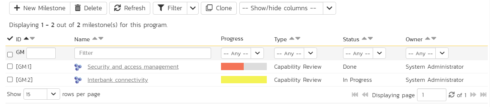
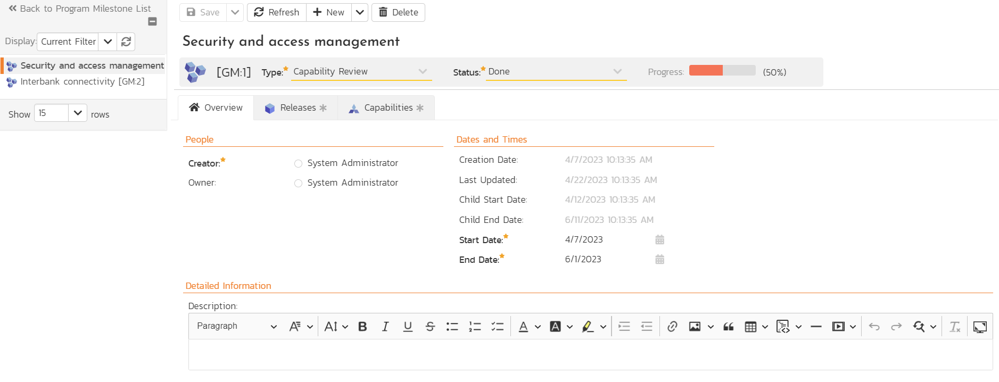
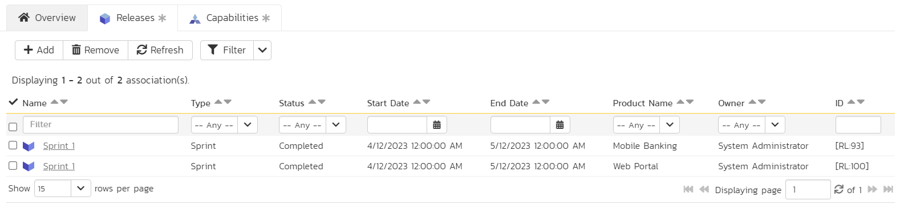
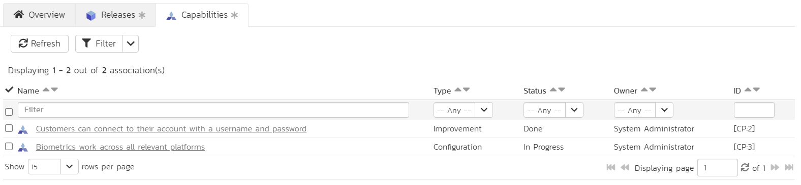

# Program Milestones
!!! abstract "Available in SpiraPlan only"

Program Milestones and [Capabilities](Program-Capabilities.md) give you powerful ways to manage delivery of features and releases across multiple products at once - in other words at a program level. Program milestones let you define cross-product, program-level date goals / milestones (like releases or sprints). You can customize program milestones with system-wide [types](../Spira-Administration-Guide/Program-Milestones.md/#types), [statuses](../Spira-Administration-Guide/Program-Milestones.md/#statuses), and fully [customizable fields](../Spira-Administration-Guide/System-Custom-Properties.md). You can link program milestones to product releases to track their scheduling at a higher level. Program milestones also let you track capabilities' delivery.

!!! question "Use cases for program milestones"
    You can think of program milestones as program-level releases. With deep customizations, you can use them in a variety of different ways. Here are a few to help guide you using them.

    - You have two **separate but similar products** - one for an iOS app, the other for an Android app. Create a program milestone to track delivery of the next releases across each product. This can help you see if one or both of the releases is off track and take action accordingly.
    - You have **multiple products that each create a module for a larger application**. You can create program milestones to oversee the different dependent sprints in each product. You could have a program milestone for each sprint to see the details from each product in one place. Alternatively you could make just a single program milestone with all the individual sprints linked to it, allowing you to look at the cross-product release at a higher level.
    - You are **building a new feature set for a large project** that will consist of multiple parts / products. Create program milestones as you plan out the sequencing and major deliverables of the large project. You can then create capabilities, linked to each relevant program milestone, to design out the large project at the next level of detail.
    - You want to **track cross-product activity** unrelated to specific product sprints. Maybe your products are all separate, but you want to oversee what is expected to be delivered in each quarter. You could create program milestones for each quarter and use their descriptions to track the business level goals. If useful, make capabilities for each quarterly program milestone to help flesh out required work for that quarter's delivery.

## Progress
A program milestone's Progress is a special field that shows a mini chart. This chart represents the percentage completion of all relevant capabilities associated directly to the program milestone.

The percentaged complete is calculated by dividing the number of "closed capabilities" (based on their current status) by the total number of capabilities associated to the program milestone. Hover over the mini chart to see more specific information.

The mini chart shows different colors to help you quickly see if progress is on or off track:

| Progress %age      | Start date    | End date      | Mini chart color          |
| ------------------ | ------------- | ------------- | ------------------------- |
| 0                  | In the future | Anything      | Gray                      |
| 0                  | In the past   | Anything      | Yellow                    |
| Above 0, Below 100 | Anything      | In the future | Green (remaining is gray) |
| Above 0, Below 100 | Anything      | In the past   | Red (remaining is gray)   |
| 100                | Anything      | Anything      | Green                     |

!!! example "Examples"
    - A program milestone has 3 capabilities linked to it, where 1 is in a closed status and the other 2 in open statuses (as defined on the [admin page](../Spira-Administration-Guide/Program-Capabilities.md/#statuses)). The progress will be 33%.
    - A program milestone has 6 capabilities linked to it, where all 6 are in different open statuses. The progress will be 0%.
    - A program milestone has 2 capabilities linked to it, and both are in a closed status. The progress will be 100%.

## Start and End Dates
Program milestones have start and end dates. This lets you manually set the range when work for the program milestone starts and ends. In addition, each program milestone has a "Child Start Date" and a "Child End Date". These dates are set automatically based on all of the releases associated to the program milestone:

- **Child Start Date**: is the earliest start date of any of the releases associated to the program milestone
- **Child End Date**: is the latest end date of any of the releases associated to the program milestone

!!! example "Examples"
    In this example, we have the following releases across a number of products

    | Release  | Start Date | End Date  |
    | -------- | ---------- | --------- |
    | Sprint 1 | May 3rd    | May 20th  |
    | Sprint 2 | May 15th   | June 2nd  |
    | Sprint 3 | May 22nd   | June 5th  |
    | Sprint 4 | May 1st    | June 10th |

    When we associate these to different program milestones the child start and end dates get automatically set as follows:

    | Program milestone | Associated releases | Child start date | Child end date |
    | ----------------- | ------------------- | ---------------- | -------------- |
    | First             | Sprint 1, Sprint 2  | May 3rd          | June 2nd       |
    | Second            | Sprint 1, Sprint 4  | May 1st          | June 10th      |
    | Third             | Sprint 2, Sprint 3  | May 15th         | June 5th       |

## Milestone List
To access program milestones, navigate to a program and then open the artifact dropdown. Select "Program Milestones". This will open the program milestone list page. The list is a flat, sortable collection of the program milestones.

### List page toolbar operations
You can carry out a number of useful operations with the toolbar:

- **New Milestone**: takes you to the new program milestone details page, where you can enter its information and hit save to actually create the item
- **Delete**: deletes all currently selected program milestones
- **Refresh**: this button will reload the program milestone list (not the entire page)
- **Filter**: read about [how to create and manage filters](Application-Wide.md#filtering) - note that program milestones do not support saving or sharing filters
- **Clone**: creates clones of all currently selected program milestones
- [download the list to a CSV file](Application-Wide.md/#download-as-csv)
- **Show / Hide Columns**: By default the following columns are shown: ID, name, progress, type, status, and owner. The columns dropdown lets you change the columns shown (for standard and custom properties). Toggle a column's visibility by clicking on it from the dropdown. The shown columns is saved for each user and for each program.

## Milestone Details
When you click on a program milestone it will open its program milestone details page:

This page is made up of *three* areas;

1.  the left pane displays the program milestone list navigation
2.  the right pane's header: this displays the toolbar, the editable name of the program milestone; and the info bar (with a shaded background)
3.  the right pane's tabbed interface with rich information related to the program milestone (its Overview, Releases, and Capabilities tabs are discussed below).

### Navigation pane
Please note that on smaller screen sizes the navigation pane is not displayed. While the navigation pane has a link to take you back to the list page, on mobile devices a 'back' button is shown on the left of the operations toolbar.

The navigation pane can be collapsed by clicking on the "-" button, or expanded by clicking anywhere on the gray title area. On desktops the user can also control the exact width of the navigation pane by dragging and dropping a red handle that appears on hovering at the rightmost edge of the navigation pane.

The navigation pane shows a list of program milestones. This list is useful as a navigation shortcut - you can quickly view the peer program milestones by clicking on the navigation links, without having to first return to the list page. The navigation list can be switched between two different modes:

-   The list of program milestones matching the current filter
-   The list of all program milestones, irrespective of the current filter

### Toolbar Operations
- **Save**: to save the current item

    - **Save > Save and Close** takes you back to the list page after the save is complete
    - **Save > Save and New** opens the new program milestone details page after the save is complete

- **Refresh**: refreshes the name, info bar information, and overview tab for the item
- **New**: opens the new program milestone details page, where you can enter its information and hit save to actually create the item

    - **New > Clone**: creates a clone of the current program milestone

- **Delete**: deletes the current program milestone

### Info bar
The info bar shows the following information for the program milestone: name, icon, ID, type, status, and [progress](#progress) mini chart

### Overview
The Overview tab is divided into a number of different sections. Each of these can be collapsed or expanded by clicking on the title of that section. Each section displays fields of a similar type. For instance, all fields regarding dates are grouped together in the "Dates and Times" area.

The bottom most section contains the long, formatted description, followed by any rich text custom fields. You can enter rich text or paste in from a word processing program or web page into these fields. Note that you are not able to paste screenshots into these description boxes

### Release Associations
You can associate releases from any product inside the current program to a program milestone from this tab. Any releases linked to the program milestone feed into the [child start and end dates](#start-and-end-dates) of the program milestone. The associated releases show the following information: name, type, status, start date, end date, product name, owner, and ID. 

Read more about [how to manage and add associations to this artifact](Application-Wide.md#associations)

### Capability Associations
When you create or edit capabilities, you can optionally set their program milestone. On this tab you can see all capabilities currently linked to the program milestone. Any capability linked to the program milestone feed into the [progress](#progress) of the program milestone. The associated capabilities show the following information: name, type, status, owner, and ID.

You can refresh the list of capabilities, or filter the list.