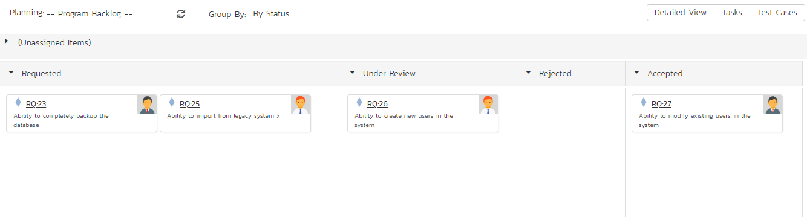
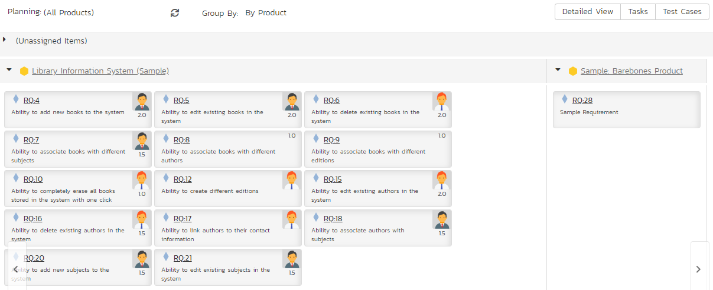
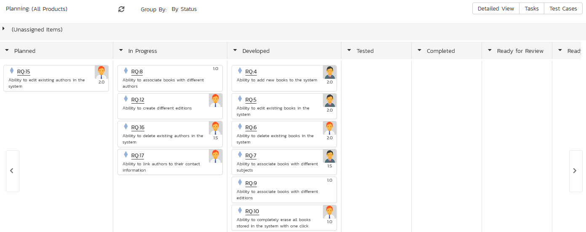
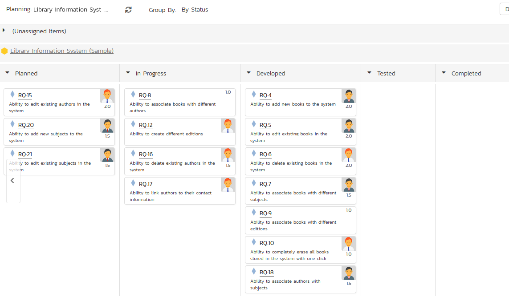
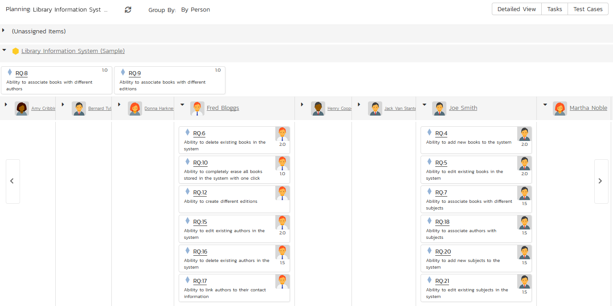

## Program Planning Board 
The program planning board is only available in SpiraPlan. If you are using SpiraPlan, to access the program planning board, you must be a member of the program (i.e. a program owner or executive).

The program planning board is designed to let you view the backlog items that need to be planned for all of the products in a specific program (aka program) as well as view all of the planned items in each of the individual products. It is designed to let you see a product-group wide view of all requirements and associated test cases and tasks. You can access this feature by clicking on the **Planning** menu entry in the program navigation.

The program planning board has the following views:

-   Program Backlog
-   By Priority
-   By Status
-   All Products
-   By Product
-   By Priority
-   By Status
-   By Person
-   Product
-   By Priority
-   By Status
-   By Person

Each of these views is described below.

## Program Backlog -- by Priority

This view is designed to let you see the program backlog organized by requirement importance. Each of the possible importance values is displayed on the left-hand side and the backlog items displayed in the same row on the right. The backlog items in this view will only be requirements (with associated tasks and test cases).

The top section will contain the list of items that are not assigned a priority, with the other sections containing the items that have been assigned to the specific priority.

## Program Backlog -- by Status

This view is designed to let you see the program backlog organized by requirement status. Each of the possible status values (for an unscheduled item) is displayed as a heading, with the backlog items displayed in the same column underneath. The backlog items in this view will only be requirements (with associated tasks and test cases). This view is commonly called a **Kanban** board:

Each of the vertical sections is one of the requirements' statuses, in order of the requirement lifecycle (Requested \> Accepted). Once a requirement is assigned to a release or sprint it will come automatically 'Planned' and not appear in this view. You can drag and drop the requirements between the different statuses.

## All Products -- by Priority

This program planning view is designed to let you see all of the backlog items that have been scheduled for all of the products in the current program, organized by requirement importance/priority.

Each of the possible importance values is displayed on the left-hand side and the backlog items displayed in the same row on the right. The backlog items in this view will only be requirements (with associated tasks and test cases).

The top section will contain the list of items that are not assigned a priority, with the other sections containing the items that have been assigned to the specific priority.

## All Products -- by Product

The program planning view is designed to let you view the open (not-completed) backlog items currently planned per product. The backlog items are themselves only requirements, however you can see the tasks and test cases associated with a specific requirement.

Clicking on the **product hyperlink** will switch the planning board into the [Product Backlog](#product-by-priority) view described below.

## All Products -- by Status

This view is designed to let you see the scheduled backlog items for the entire program organized by requirement status. Each of the possible status values (for a planned item) is displayed as a heading, with the backlog items displayed in the same column underneath. The backlog items in this view will only be requirements (with associated tasks and test cases). This view is commonly called a **Kanban** board:

Each of the vertical sections is one of the requirements' statuses, in order of the requirement lifecycle (Planned \> Completed). You can click on the expand/collapse icons to hide any statuses that are not used. You can drag and drop the requirements between the different statuses. If you have the planning options enabled to have requirements status'
automatically update based on changes to the associated tasks and test cases, then items will automatically move between the statuses based on tasks being completed and test cases being executed.

## All Products -- by Person

This view is designed to let you see the program backlog organized by resource / person. Each of the users that is a member of any of the products in the current program is displayed as a heading, with the backlog items displayed in the same column underneath.

You can click on the expand/collapse icons to hide any resources that are not relevant. Above the resource headings there is a section called
'Unassigned Items'; that contains backlog items that are scheduled but have not yet been assigned to a person.

## Product -- by Priority

This program planning view is designed to let you see all of the backlog items that have been scheduled for all of the products in the current program, organized by requirement importance/priority.

Each of the possible importance values is displayed on the left-hand side and the backlog items displayed in the same row on the right. The backlog items in this view will only be requirements (with associated tasks and test cases).

The top section will contain the list of items that are not assigned a priority, with the other sections containing the items that have been assigned to the specific priority.

## Product -- by Status

This view is designed to let you see the product backlog organized by requirement status. Each of the possible status values (for a planned item) is displayed as a heading, with the backlog items displayed in the same column underneath. The backlog items in this view will only be requirements (with associated tasks and test cases). This view is commonly called a **Kanban** board:

Each of the vertical sections is one of the requirements' statuses, in order of the requirement lifecycle (Planned \> Completed). You can click on the expand/collapse icons to hide any statuses that are not used. You can drag and drop the requirements between the different statuses. If you have the planning options enabled to have requirements status'
automatically update based on changes to the associated tasks and test cases, then items will automatically move between the statuses based on tasks being completed and test cases being executed.

## Product -- by Person

This view is designed to let you see the product backlog organized by resource / person. Each of the users that is a member of the current product is displayed as a heading, with the backlog items displayed in the same column underneath.

You can click on the expand/collapse icons to hide any resources that are not relevant. Above the resource headings there is a section with the product name; that contains backlog items that are scheduled for the current product but have not yet been assigned to a person.