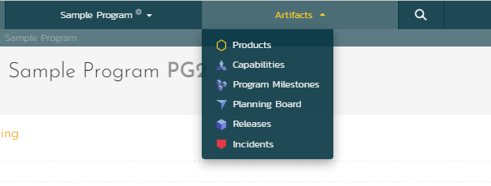

# Program Products
!!! abstract "Available in SpiraPlan only"

This page outlines how to access and use the program product pages.

From the program product pages you can view information about each product in the program.

## Product List
To access the program product list page, you must be a member of the program (i.e. a program owner or executive). From the program, open the "artifact" dropdown as shown below and click "Products"

.

The program product list shows all of the products in the current program, displayed in an integrated table view showing products':

- ID
- Name
- Template
- Website
- Active flag
- Baselining flag
- Creation date
- Any product custom properties (excluding rich text custom properties)

The toolbar above the grid lets you:

- refresh the list
- set or clear the filter
- show or hide columns: by default all relevant custom property columns are visible. The columns shown are saved for each user on a per program basis

You can sort the list by most columns (any with the ascending and descending arrows). 

You can filter by entering (or selecting) a value in each required column to filter on. Read about [how to create and manage filters](Application-Wide.md#filtering) (note that this page does not let you save and share named filters).

Clicking on a product name / link will open the program product details page.

## Product Details

This page is made up of three areas:

- the left pane is the navigation window
- the upper part of the right pane contains the toolbar, product name and ID
- the bottom part of the right pane displays all other relevant fields about the product

The navigation pane has a link to take you back to the product list, as well as a list of products in the program. This list is useful as a navigation shortcut - click on any product to quickly view its details. The navigation list can be switched between two different modes:

-   The list of products matching the current filter
-   The list of all products

The top part of the right pane has buttons to refresh the product information or save any changes made. The product logo beneath this (to the left of the product ID) can be clicked to open the product home page for that product.

If you have the required permissions for that product (see [below](#editing-the-product-details)) you can edit some of its fields. Many of the fields are always read only and can only be edited by system administrators from the [System Admin Product Edit](../Spira-Administration-Guide/System-Workspaces.md/#edit-a-product) page. The fields that are editable on this page are:

- Website
- Description
- All custom properties

Once you are satisfied with any changes you have made, click the "**Save**" button. To quickly discard any changes,  click "**Refresh**".

### Editing the product details
To edit the product information for a particular product from the product details page you must meet at least one of the following conditions:

- be a System Administrator
- be a Program Owner of the product's program (the current program)
- be an Executive of the product's program (the current program) and also have product admin permissions for the current product