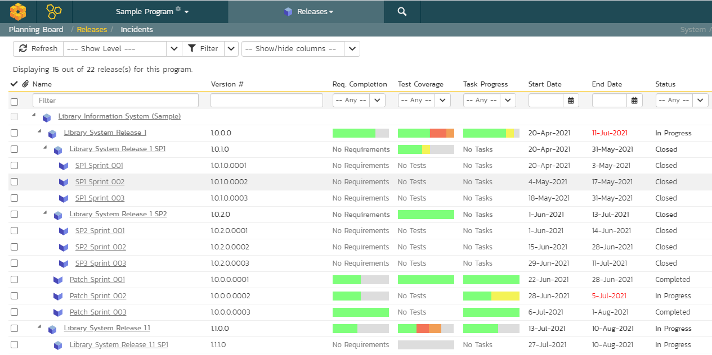

# Program Releases
!!! abstract "Available in SpiraPlan only"

To access the program release plan, you must be a member of the program (i.e. a program owner or executive).

The program release plan lets you see all of the products in the current program, together with their releases, sprints, and phases displayed in an integrated hierarchical view:

You can access this feature by clicking on the **Releases** menu entry in the program navigation.

This view lets you see all the releases, sprints, and phases with the following information (each column can be shown or hidden as needed):

- requirement completion 
- test coverage
- task progress 
- dates
- effort fields

You can expand and collapse the products and releases to display the appropriate level of detail as well as filter by the various fields in the grid.

The toolbar also lets you:

- [download the list to a CSV file](Application-Wide.md/#download-as-csv)

## Release Traceability and Coverage
From the release list page you can see a number of columns that show calculated data for each release, based off:

- rolling up of information from child to parent (as mentioned above)
- associations between the release and other artifacts (such as requirements, tasks, incidents, and test cases)

This allows you to see at a glance the state of play about a number of key metrics for the release.

### Requirements Completion
This column shows a mini chart that shows the percentage completion of all relevant requirements assigned to the release (or that are rolling up from the releases children).

The percentaged complete is worked out by dividing the number of "completed requirements" (described below) by the total number of requirements assigned to the release. A "completed requirement" is a requirement with a status of either "Tested", "Completed", or "Released".

### Requirement Count and Points
These columns (not shown by default) show you the sum of all requirements assigned to the release; and the sum of all the points scored to all those requirements respectively.

### Test coverage
This column shows a mini chart that shows the sum of each execution statuses against the release. It is calculated from the latest test run executed against that release for each test case that is assigned to that release. If you execute a test case against a release, and that test case is not by itself assigned to the release, the information for that test run will *not* be included.

If you hover the mouse over the mini chart it will display a tooltip that provides a more detailed description of the number of tests in each execution status.

Each release will display the aggregate status of any test cases directly assigned to itself, together with the test execution status of any child sprints that are contained within the release.

### Task Progress
This columns shows a mini chart of the count of all active tasks[^active-tasks] assigned to the release, by progress category for the release. The 'On Schedule', 'Late Finish', 'Late Start' and 'Not Started' bars indicate the total count of tasks that are in that category.

If you hover the mouse over the mini chart it will display a tooltip that provides a more detailed description of the number of tasks in each category.

How are the different categories calculated?

- Inactive tasks are completely excluded
- Each task assigned to the release has a count of 1. 
- Counts in each category are added together and percentages taken based off those final counts
- Counts for tasks that are either "Running Late" or "On Schedule" are split based off their percentage completion (the done portion adding to the specific category and the remainder adding to the "Not Started" category). So if a task is 40% done it will add 0.4 to, for example, "Running Late" and 0.6 to "Not Started".  
- **On Schedule** tasks:
    - have some work completed on them (percentage complete is more than 0 but is not 100%)
    - are not overdue (their end date is not in the future)
- **Running Late** tasks:
    - are overdue (i.e. with an end date in the past)
    - either have a status of "In Progress" or have been partially completed (have a completion of more than 0%)
    - have not been fully completed (their completion is not at 100%)
- **Starting Late** tasks:
    - have not had any work done on them (percentage complete is 0) 
    - have already started (their start date is in the past)
- **Not Started** tasks:
    - have not had any work done on them (percentage complete is 0) 
    - have not yet started: this is the case if either their start date is in the future or they have a status of "Deferred"

[^active-tasks]: any task with a status that is *not* one of the following: "Rejected", "Obsolete", "Duplicate".