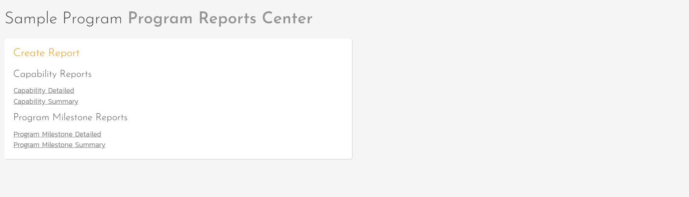
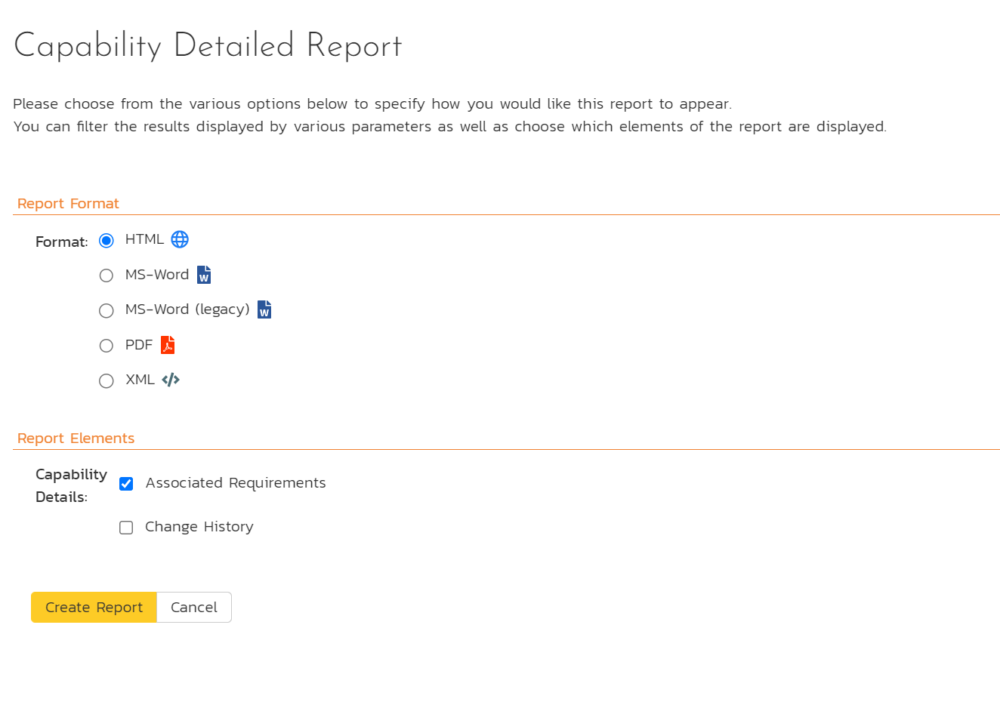
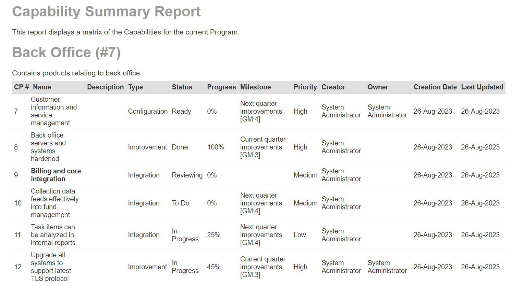
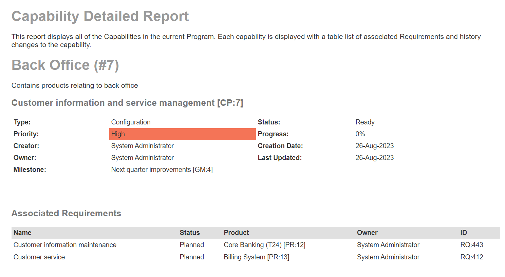
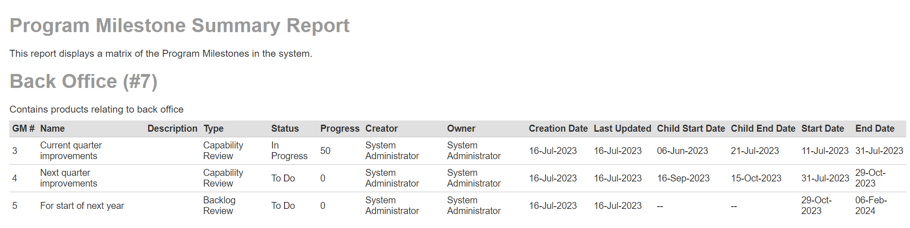
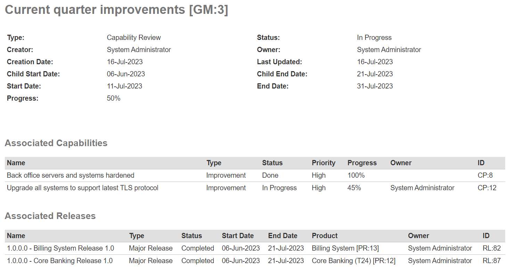

# Program Reports
With program level reporting, users of SpiraPlan (only) can see and generate reports relevant to their program, to help you monitor the progress of work and to analyze current performance.

## Reporting Home Page 

The program reporting page consists of two main areas:

1. The top bar shows the program name
2. The left-hand pane displays a list of the printable reports available in the system, categorized by the artifact they primarily relate to (for example, capabilities or program milestones). This includes both standard and custom reports. Clicking on a report name opens its [configuration page](#reports-configuration).

## Reports Configuration
The configuration page for each report differs slightly, but the general format is illustrated below, with each section having a title in orange text with a line beneath:

You can configure the reports in the following ways:

### Report Format
This allows you to specify the display format of the report. Depending on the specific report, they can be:

- displayed as a web-page (HTML)
- downloaded as a Microsoft Word document (there are two Word versions: one for newer versions of Word and one for legacy versions of Word)
- downloaded as a Microsoft Excel spreadsheet (there are two Excel versions: one is better for printing, while the other is more suited to data manipulation)
- downloaded as a PDF
- there is also a raw-XML format that allows you to export the underlying report data into any external reporting system that supports XML import.

### Report Elements
This allows you to determine which types of information to include in the report. This varies by report type, but may include associated artifacts, or the artifacts' history. Certain elements are pre-selected by default.

## Capability Reports
### Capability Summary Report
This report displays all capabilities in the current program in the same order as in the capability list. All standard and custom fields are shown.

### Capability Detailed Report
This report displays all capabilities in the current program in the same order as in the capability list. For each capability the reports shows:

- name and ID
- all standard and custom fields
- description
- a table of associated requirements (optional - selected by default)
- a table showing the change history (optional)

## Program Milestone Reports
### Program Milestone Summary Report
This report displays all program milestones in the current program, ordered by program milestone ID. All standard and custom fields are shown.

### Program Milestone Detailed Report
This report displays all program milestones in the current program, ordered by program milestone ID. For each program milestone the reports shows:

- name and ID
- all standard and custom fields
- description
- a table of associated capabilities (optional - selected by default)
- a table of associated releases (optional - selected by default)
- a table showing the change history (optional)

