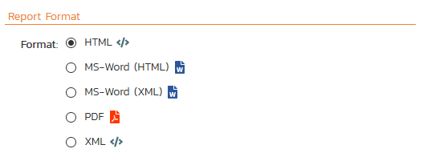

# Program Reports
## Reporting Home Page 
The program reporting page consists of two main areas

1. The top bar shows the product name, controls for changing the graph widgets, and a **dropdown release picker**. The selected release will affect all of the reporting / graphing widgets simultaneously. You can either choose a specific release (includes any child sprints) or "All Releases". Your selection here is synced with the selection you set on the product dashboard page.
2. The top left-hand pane displays a list of any reports that have either been saved by the currently logged in user, or those reports created by other members of the product, that have been marked (by that user) as 'shareable'.
3. The bottom left-hand main pane displays a list of the printable reports available in the system, categorized by the artifact they primarily relate to (requirements, test cases, incidents and releases). Clicking on any of the report hyperlinks will take you to the [configuration page](#reports-configuration) for the report in question below for details).
4. The right-hand pane is a dashboard that contains the set of graph widgets configured by the current user. By default the dashboard will display: the Incident Progress Rate, Test Run Progress Rate, Requirement Summary, Test Case Summary, Incident Aging and Task Burndown. When "All Releases" is selected from the dropdown release picker, some widgets show information for every single release and sprint, and others only for active releases/sprints[^active-release]:

    - Requirement Graphs widget: only active releases
    - Task Graphs widgets: only active releases
    - All Summary Graphs widgets: all releases
    - All Date-Range Graphs widgets: all releases
    - Custom Graphs that use the token ${ReleaseId}: no data
    - Custom Graphs that use the token ${ReleaseAndChildIds}: only active releases

In addition to the graphs displayed by default, you can click on the "***Add Items***" buttons to add additional graphs to the reporting dashboard:

Each of the graphs is described in more detail in [Summary Graphs](#summary-graphs) to [Date-Range Graphs](#date-range-graphs).

## Reports Configuration

The configuration page for each report differs slightly, but the general format is illustrated below (please note all sections are shown in orange text with a line beneath and are shown here in the collapsed state -- click the orange text to expand the section):

You can configure the reports in the following ways:

### Report Format
This allows you to specify the display format of the report. Depending on the specific report, they can be:

- displayed as a web-page (HTML)
- downloaded as a Microsoft Word document (there are two Word versions: one for newer versions of Word and one for legacy versions of Word)
- downloaded as a Microsoft Excel spreadsheet (there are two Excel versions: one is better for printing, while the other is more suited to data manipulation)
- downloaded as a Microsoft Product file
- there is also a raw-XML format that allows you to export the underlying report data into any external reporting system that supports XML import.

### Report Elements
This allows you to determine which types of information to include in the report. This varies by report type, but includes the dependent items related to the artifact being reported on (attachments, test steps, coverage, history, etc.)

### Filters
**Standard Field Filters** -- This allows you to constrain the range of data being reported on, based on the various fields associated with the artifact in question. These filters are typically selections from multi-valued-dropdown lists and date-ranges.

**Custom Property Filters** -- This allows you to constrain the range of data being reported on, based on the custom fields associated with the artifact by your product administrator. These filters can be either freetext or drop-down lists.

**Sort Options** - This option is only available for the non-hierarchical data reports (i.e. for test cases, test sets, test runs, incidents and tasks) and allows you to specify the sort order of the results returned in the report. For the hierarchical-data based reports the sort order is always the order of the hierarchy.

## Capability Reports

### Capability Summary Report

### Capability Detailed Report

## Program Milestone Reports

### Program Milestone Summary Report

### Program Milestone Detailed Report