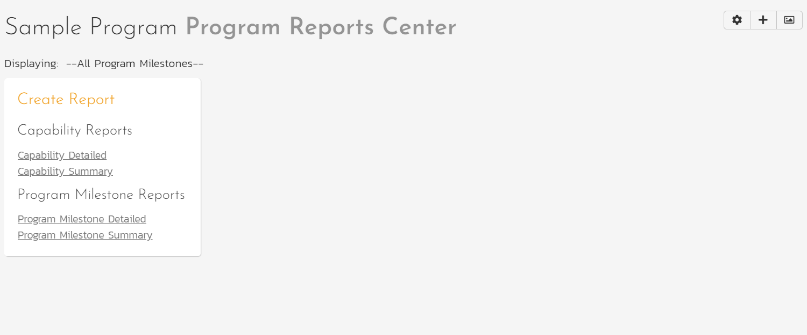
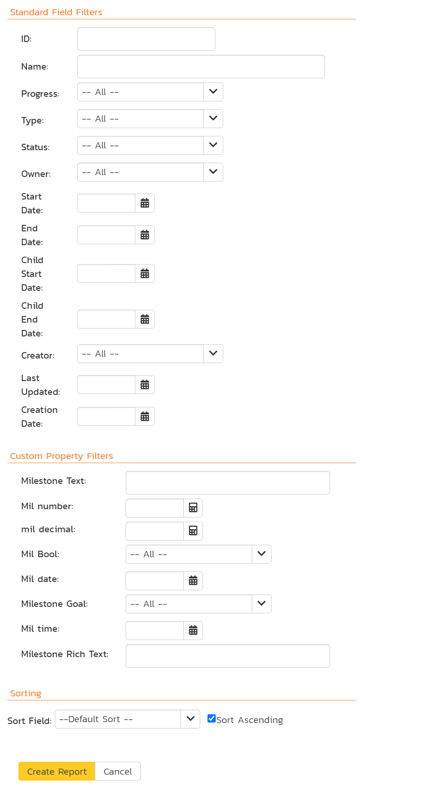

# Program Reports
SpiraPlan With program level reporting, users can see and generate reports relevant to their program, to help you monitor the progress of work and to analyze current performance.

## Reporting Home Page 

The program reporting page consists of three areas:

1. The top bar shows:

    - the program name
    - controls for changing the graph widgets
    - the program milestone picker. This shows all open program milestones and selecting an option will update relevant widgets to display information for that program milestone. The selection here is synced with that on the program home page.

2. The left-hand pane displays a list of the printable reports available in the system, categorized by the artifact they primarily relate to (for example, capabilities or program milestones). This includes both standard and custom reports. Clicking on a report name opens its [configuration page](#reports-configuration).
3. The right-hand pane displays any graph widgets configured by the current user. By default this is empty. To add widgets click the "Add Items" button to see all available widgets, limited to [program level custom graphs](../../Spira-Administration-Guide/System-Reporting/#edit-graphs) created in your system.

## Reports Configuration
The configuration page for each report differs slightly, but the general format is illustrated below, with each section having a title in orange text with a line beneath:

You can configure the reports in the following ways:

### Report Format
This allows you to specify the display format of the report. Depending on the specific report, they can be:

- displayed as a web-page (HTML)
- downloaded as a Microsoft Word document (there are two Word versions: one for newer versions of Word and one for legacy versions of Word)
- downloaded as a Microsoft Excel spreadsheet (there are two Excel versions: one is better for printing, while the other is more suited to data manipulation)
- downloaded as a PDF
- there is also a raw-XML format that allows you to export the underlying report data into any external reporting system that supports XML import.

### Report Elements
This allows you to determine which types of information to include in the report. This varies by report type, but may include associated artifacts, or the artifacts' history. Certain elements are pre-selected by default.

### Report Filtering
Filter the report by any standard or custom field available for that specific artifact. There are different types of filter for different types of field. For instance, for date fields you can filter by specific date ranges.

### Report Sorting
If the artifact can be sorted (for example program milestones can be but capabilities can not), then you can choose which field to sort the report by and whether to sort ascending or descending. By default, the sort order is typically by ascending ID.

## Capability Reports
### Capability Summary Report
This report displays all capabilities in the current program in the same order as in the capability list. All standard and custom fields are shown.

### Capability Detailed Report
This report displays all capabilities in the current program in the same order as in the capability list. For each capability the reports shows:

- name and ID
- all standard and custom fields
- description
- a table of associated requirements (optional - selected by default)
- a table showing the change history (optional)

## Program Milestone Reports
### Program Milestone Summary Report
This report displays all program milestones in the current program, ordered by program milestone ID. All standard and custom fields are shown.

### Program Milestone Detailed Report
This report displays all program milestones in the current program, ordered by program milestone ID. For each program milestone the reports shows:

- name and ID
- all standard and custom fields
- description
- a table of associated capabilities (optional - selected by default)
- a table of associated releases (optional - selected by default)
- a table showing the change history (optional)

