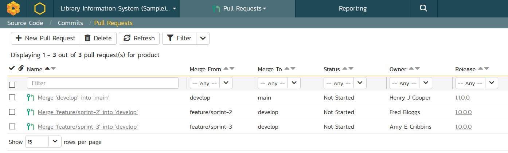
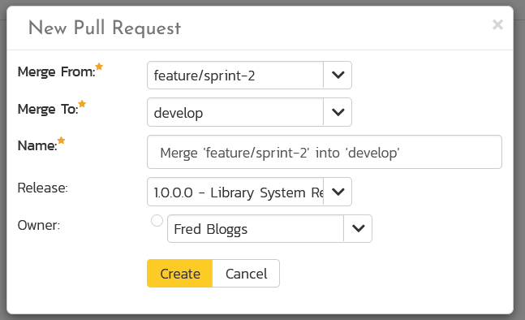
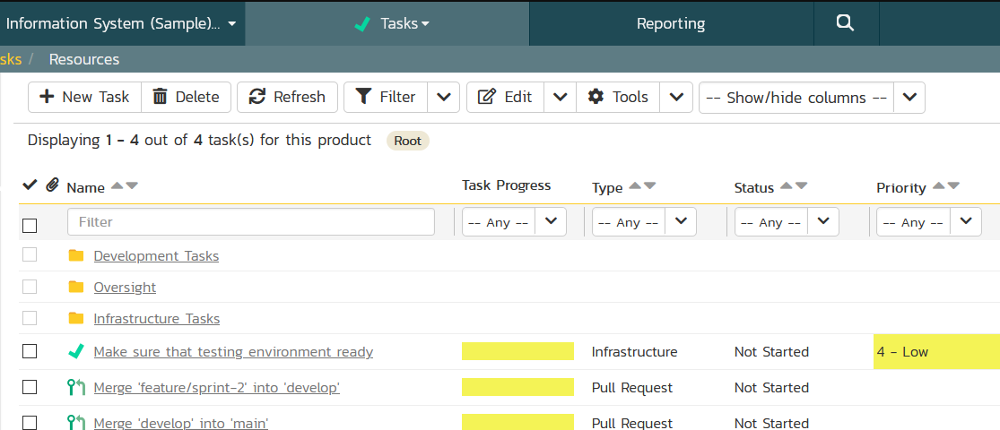
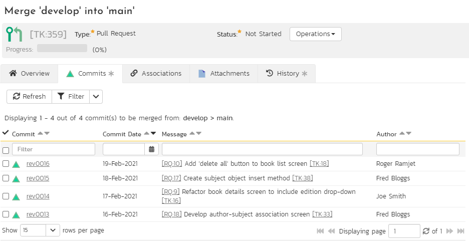

# Pull Requests
Often, developers work on features or hotfixes in specific branches. Once development is complete, the code is ready to merged into the central branch (typically main, or development) ahead of release. Pull requests are a way to flag that the feature branch is ready for merging. A pull request lets the developer(s) of the feature ask colleagues to review the code, assess if changes are needed, and if everything looks good  approve the pull request / merge into the main branch.

If your SpiraPlan product is connected to a [source code repository](Source-Code.md), you will be able to use SpiraPlan's pull request functionality. This lets you create a pull request, select the branch you want reviewed, the branch the code will be pulled / merged into, and assign a team member to review the request. The reviewer can explore the code that was changed in the branch add comments or notes to the pull request, and move it through a workflow as needed. The requester can track any changes made to the pull request, so they can, as needed, make additional changes to their code.

SpiraPlan's pull request feature leverages the [Task](Task-Tracking.md) artifact. Tasks have different types. You can set any of these tasks types to be treated as a pull request task. Task types are managed via [template administration](../Spira-Administration-Guide/Template-Tasks.md/#types). By default, templates have a task type called "Pull Request" which is flagged as being treated as a pull request. You can turn this off, or make other types also be treated as pull requests. If you have different workflows for different types of code (for instance a hotfix pull request may require a different workflow to a feature pull requests), it may make sense to have multiple task types being flagged as pull requests. You can then set each task type to use a different [task workflow](../Spira-Administration-Guide/Template-Tasks.md/#task-workflows).

## Pull Request List
To view the list of pull requests in a product, the following three conditions need to be met:

- the product is connected to a [source code repository](Source-Code.md) (if not there they can't be any source code branches to make pull requests from)
- the product's template has at least one task type set to be a Pull Request (if not, you can't create or view pull requests because no task will be treated as one)
- your role on the product lets you view tasks (because pull requests are a subset of tasks, if you can't see tasks, you can't see pull requests)

Note: to carry out operations on pull requests (like create, delete, modify) you need those specific permissions for tasks.

### View Pull Requests
When you click on Developing \> Pull Requests on the global navigation bar, you will be taken to the pull requests list screen. This shows you all pull requests in the product. You can sort and filter this list, or browse the different pages of pull requests (up to 500 pull requests can be displayed on the page at any one time).

Above the list of pull requests is the action toolbar. This lets you perform the following functions:

- Create a new pull request (see below)
- Delete any selected pull requests
- Refresh the list of to see any recent updates
- Filter buttons to apply or clear the current filter

The list of pull requests shows the following information about each pull request:

- Name
- Merge From
- Merge To
- Status
- Owner
- Release
- Last updated date
- ID

### Creating a Pull Request
When you click the "New Pull Request" button you will see a popup dialog as below.

This dialog has the following fields to fill in:

- **Merge From** (required): pick the name of the branch that has the feature / hot fix code in it. You can select any branch
- **Merge To** (required): pick the branch to merge the feature into. You can select any branch other than the "merge from" branch
- **Name** (required): enter the name for the pull request. When you first click on the text box the value is automatically generated based off the merge from and to branches. You can edit this however you want to
- **Release**: optionally select a release to link the pull request with. This is helpful so that the pull request can be tracked as one part of the other work for a sprint / release
- **Owner**: optionally choose who should be the owner of the pull request. Normally this will be the person responsible for carrying out the code review

Once the popup has been filled in click "Create" to add the pull request.

### Pull Requests on the Task List
Pull requests are a special type of task. Only tasks with a pull request type are shown on the pull request list page. On the main [task list](Task-Tracking.md/#task-list) page you can see all tasks, including pull requests. Pull requests have the special pull request icon next to the name. You can filter and order tasks and this will affect pull requests as if they are normal tasks. On the main task list page you cannot show special pull requests fields (like Merge From and Merge To). You can also view pull requests on the task board.

If you can create a new task from the task list you can create a pull request. However, you will not be able to set the Merge From or Merge To fields. That can only be done on the pull requests list page. 

## Pull Request Details
Clicking on a pull request from anywhere in the application will open its details page. Here you can see and edit all information about the pull request, transition it through the workflow, add comments and more. This functionality is described in more detail on the [task details](Task-Tracking.md/#task-list) page.

The pull request details page is different to the task details page in two specific ways:

1. You will see read-only Merge From and Merge To fields. Note that if these are blank for your pull request, you will have to go to main pull request page to fill them in.
2. There is a Commits tab (see below).

### Commits
From the pull request's commits tab, you can see a list of all commits that were made on the Merge From branch that are not in the Merge To branch. This lets you easily see all the changes that the pull request is asking to bring into the Merge To branch.

For each commit you can see the following information (you can sort or filter on all of these):

- Commit: the commit id. Click on this to view the details for this commit, and hover to see a tooltip with extra information
- Commit Date: hover over the date to see a tooltip showing the date and time
- Message: the commit message (any artifact tokens in the message are links: clicking them will open the relevant artifact details page)
- Author: this is the person who made the commit