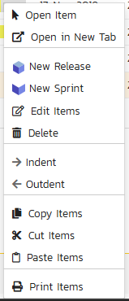
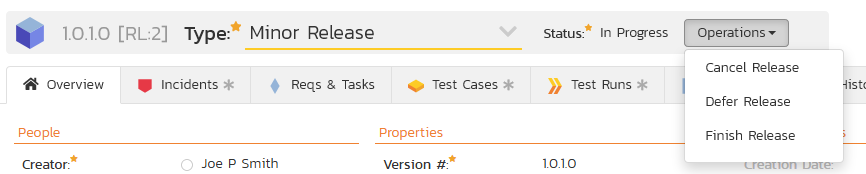
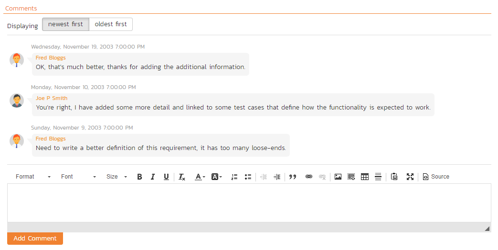
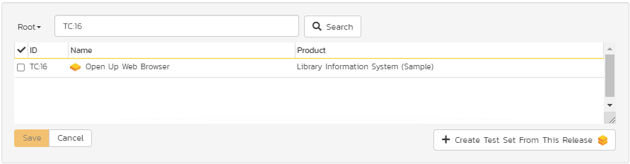
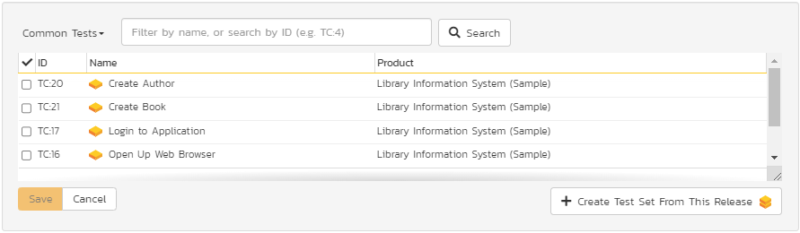

# Release Management

This section outlines how to use the Release Management features of
SpiraPlan® to manage different versions of the system being tested in a
particular product. This is an optional feature of the system, and you
can manage the testing for a product successfully without tracking
individual releases. Typically, when you develop a system, it is
important to ensure that features introduced in successive versions do
not impair existing functionality - this is known as *regression
testing*.

In such situations, you will want to be able to execute the same set of
test scripts against multiple versions of the system and be able to
track failures by version. A feature that works correctly in version 1.0
may fail in version 1.1, and the maintenance team may be testing the
existing lifecycle of v1.0 in parallel with the development team testing
v1.1. Therefore, by developing a master set of releases/versions in the
Release Management module, you can have the different testing teams
correctly assign their testing actions to the appropriate version.

There are two types of release artifact in SpiraPlan® - major product
releases that are displayed with the blue release icon and represent
major versions of the system, and release Sprints (aka builds) that are
displayed with a yellow icon and represent intermediate builds/sprints
of the system. *Note: Sprints can be contained within a Release, but not
the other way round.*

The main differences between releases and sprints are as follows:

Releases are independent versions of the system being tested and as
such, you can map a requirement directly to a release, indicating the
release of the system that the requirement will be fulfilled in.

When you report on a release (e.g. on the product home or in one of the
reports) any child sprints are automatically taken into account, and
test runs and incidents that are related to the child builds/sprints
will get included in the release reports. Child releases on the other
hand are not aggregated up into the parent release.

## Release List

When you click on the Planning \> Releases global navigation link, you
will initially be taken to the release list screen illustrated below:

The release list will contain all the releases and sprints associated
with current product. When you create a new product, this list will
initially be empty, and you will have to use the
"***Insert***" button to start adding releases and sprints
to the product. The hierarchical organization of releases in the list is
configurable, so you can organize the various releases in the way that
makes most sense for a particular product. Typically you have the major
releases as the top-level items, with sub-releases, builds and sprints
as the lower-level items.

All of the releases in the list have a release-name, together with the
assigned version number for that release, the start-date and end-date
for the release, the number of estimated product personnel working on
that release, the planned effort for the release, the total effort
currently scheduled (as tasks), the available effort for new tasking,
the release id, the type of each release, its status, and a set of
custom properties defined by the product owner.

For those releases that have test cases mapped against them, the
execution status of the various test cases associated with the release
is displayed in aggregate for each item as a graphical bar diagram. If
you position the mouse over the execution status indicator you will see
the detailed execution information displayed as a tooltip.

For those releases that have at least one requirement task associated
with them, they will display a block graph that illustrates the relative
numbers of task that are on-schedule (green), late-starting (yellow),
late-finishing (red) or just not-started (grey). These values are
weighted by the effort of the task, so that larger, more complex tasks
will be change the graph more than the smaller tasks. To determine the
exact task progress information, position the mouse pointer over the
bar-chart and the number of associated tasks, along with the details of
how many are in each status will be displayed as a "tooltip".

Clicking on a release's hyperlink will take you to the [release details](#release-details)
page for the item in question.

### Filtering

You can easily filter the list of releases as illustrated in the
screen-shot below:

To filter the list by any of the displayed columns, you either choose an
item from the appropriate drop-down list or enter a free-text phrase
(depending on the type of field) and click "***Filter***"
or press the <ENTER\> key. Note that the name field is searched using a
"LIKE" comparison, so that searching for "database" would include any
item with the word database in the name. The other freetext fields need
to be exact matches (e.g. dates, release numbers). Clicking on Filter \>
Clear Filters clears all the set filters and displays all the releases
for the product.

In addition, if you have a set of filters that you plan on using on a
regular basis, you can choose the option Filter \> Save Filter to add
the current filter to the list of saved filters that appear on your 'My
Page'. The list of saved filters can also be retrieved by clicking
Filter \> Retrieve Filter.

### Insert

The "***Insert***" button has an attached dropdown menu
that allows you to choose whether to insert a release or sprint (if you
just click "***Insert***" it defaults to inserting a
release). In either case, it will insert the new release / sprint
*above* the currently selected item -- i.e. the one whose check-box has
been selected, at the same level in the hierarchy. If you want to insert
a release/sprint below a summary item, you need to insert it first, then
indent it with the "***Indent***" button. If you insert a
release without first selecting an existing release from the list, the
new release will simply be inserted at the end of the list.

Once the new release has been inserted, the item is switched to "Edit"
mode so that you can change the default name, active flag, version
number and creator.

### Delete

Clicking on the "***Delete***" button deletes all the
releases whose check-boxes have been selected. If any of the releases
have child releases/sprint, then the child releases and sprints are also
deleted.

### Indent

Clicking on the "***Indent***" button indents all the
releases whose check-boxes have been selected. Note: you cannot indent a
release or sprint if it is *below* a sprint, as sprints are not allowed
to have child items.

### Outdent

Clicking on the "***Outdent***" button de-indents all the
releases whose check-boxes have been selected.

### Refresh

Clicking on the "***Refresh***" button simply reloads the
release list. This is useful as other people may be modifying the list
of releases at the same time as you, and after stepping away from the
computer for a short-time, you should click this button to make sure you
are viewing the most current release list for the product.

### Edit

Each release/sprint in the list has an "***Edit***" button
display in its right-most column. When you click this button or click on
any of the cells in the row, you change the item from "View" mode to
"Edit" mode. The various columns are made editable, and
"***Save***" buttons are
displayed in the last column:

If you click "***Edit***" on more than one row, the
"***Save***" buttons are
only displayed on the first row, and you can make changes to all the
editable rows and then update the changes by clicking the one
"***Save***" button. Also, if you want to make the same
change to multiple rows (e.g. to change five releases from "active" to
"inactive"), you can click on the "fill" icon to the right of the
editable item, which will propagate the new value to all editable items
in the same column.

If you want to edit lots of items, first select their checkboxes and
then click the "***Edit***" button on the same row as the
Filters and it will switch all the selected items into edit mode.

When you have made your updates, you can either click
"***Save***" to commit the changes, or
"***Cancel***" to revert back to the original information.
Alternatively, pressing the <ENTER\> key will commit the changes and
pressing the <ESCAPE\> key will cancel the changes.

### Show Level

Choosing an indent level from the 'Show Level' drop down box allows you
to quickly and easily view the entire release list at a specific indent
level. For example you may want to see all releases drilled-down to the
*third* level of detail. To do this you would simply choose 'Level 3'
from the list, and the releases will be expanded / collapsed
accordingly.

### Show / Hide Columns

This drop-down list allows you to change the fields that are displayed
in the release list as columns for the current product. To show a column
that is not already displayed, simply select that column from the list
of "Show..." column names and to hide an existing column, simply select
that column from the list of "Hide..." column names. This is stored on a
per-product basis, so you can have different display settings for each
product that you are a member of. The fields can be any of the built-in
fields or any of the custom properties set up by the product owner.

### Copying Releases/Sprints

To copy a release/sprint or set of releases/sprints, simply select the
check-boxes of the release/sprint you want to copy and then select the
Edit \> Copy Items menu option. This will copy the current
release/sprint selection to the clipboard. Then you should select the
place where you want the releases/sprints to be inserted and choose the
Edit \> Paste Items option.

The releases/sprints will now be copied into the destination location
you specified. The name of the copied releases/sprints will be prefixed
with "Copy of..." to distinguish them from the originals. Note that
copied releases/sprints will also include the test mapping information
from the originals.

### Moving Releases/Sprints

To move a release/sprint in the hierarchy, there are two options:

1.  Click on the release/sprint you want to move and drag the icon to
the location you want it moved. An empty space will appear to show
you where it will be inserted. Once you have the requirement
positioned at the correct place that you want it inserted, just
release the mouse button. To move multiple items simply select their
checkboxes and then drag-and-drop one of the selected items

2.  Alternatively you can simply select the check-boxes of the
release/sprint you want to move and then select the Edit \> Cut
Items menu option. This will cut the current release/sprint
selection to the clipboard. Then you should select the place where
you want the release/sprint to be inserted and choose the Edit \>
Paste Items option. The release/sprint will now be moved into the
destination location you specified.

### Exporting Releases/Sprints

To export releases/sprints from the current product to another product
in the system, select the check-boxes of the releases/sprints you want
to export and then click the Tools \> Export to Product item. This will
then bring up a list of possible destination products:

Once you have chosen the destination product and clicked the
"***Export***" button, the releases/sprints will be
exported from the current product to the destination product. Any file
attachments will also be copied to the destination product along with
the release/sprint.

### Creating Test Sets from Releases

As a shortcut you can click the Tools \> Create Test Set option to
create a new test set for each of selected releases. The created test
sets will include all of the test cases associated with a release. This
is useful in regression testing when you have created a new release and
want to be able to quickly assign a tester to ensure that all the
functionality in the release works as expected.

### Printing or Saving Items

To quickly print a single release/sprint or list of releases/sprints you
can select the items' checkboxes and then click Tools \> Print Items.
This will display a popup window containing a printable version of the
selected items. You can also save the report in a variety of common
formats from the same Tools menu.

### Right-Click Context Menu

SpiraPlan® provides a shortcut -- called the *context menu* - for
accessing some of the most commonly used functions, so that you don't
need to move your mouse up to the toolbar each time. To access the
context menu, right-click on any of the rows in the release list and the
following menu will be displayed:

You can now choose any of these options as an alternative to using the
icons in the toolbar

## Release Details

When you click on release item in the [release list](#release-list), you are taken to the release details page illustrated below:

This page is made up of *three* areas;

1.  the left pane displays the releases list navigation;

2.  the right pane's header, which displays: the operations toolbar; the
editable name of the selected release; and the info bar (with a
shaded background), which also contains the workflow status
transitions (see below); and

3.  the right pane's tabbed interface with rich information related to
the release.

Please note that on smaller screen sizes the navigation pane is not
displayed. While the navigation pane has a link to take you back to the
releases list, on mobile devices a 'back' button is shown on the left of
the operations toolbar.

The navigation pane can be collapsed by clicking on the "-" button, or
expanded by clicking anywhere on the gray title area. On desktops the
user can also control the exact width of the navigation pane by dragging
and dropping a red handle that appears on hovering at the rightmost edge
of the navigation pane.

The navigation pane consists of a link that will take you back to the
release list, as well as a list of the other releases in the current
product. This latter list is useful as a navigation shortcut; you can
quickly view the test run information of all the other releases by
clicking on the navigation links without having to first return to the
release list page. The navigation list can be switched between two
different modes:

-   The list of releases matching the current filter

-   The list of all releases, irrespective of the current filter

If you are editing an existing item, the fields that are available and
the fields that are required will depend on your stage in its workflow.
The types of change allowed and the email notifications that are sent
will depend on how your product administrator has setup the system for
you. Administrators should refer to the *SpiraPlan Administration Guide*
for details on configuring workflows to meet their needs.

Depending on the user's role and whether they are listed as the owner or
author of the requirement, displayed in the info bar beneath the
requirement name is the current workflow status and an "operations"
button which, when clicked, will show a set of allowed workflow
operations.

Releases can have the following statuses: planned, in progress,
completed, closed, deferred, and cancelled. Note that releases marked as
closed, deferred, or cancelled cannot be associated with other artifacts
-- for example an incident's resolved release cannot by a cancelled
release.

Workflow transitions allow the user to move the item from one status to
another. For example when the release is in the In Progress status, you
will be given the options to:

**Cancel Release** -- changes status to "Cancelled"

**Defer Release** -- changes the status to "Deferred"

**Finish Release** - changes the status to "Completed"

Please note that if digital signatures have been enabled for a
particular workflow operation (and therefore a digital signature is
required to confirm the status change. Workflow operations requiring a
digital signature are marked with a padlock icon as in the example
below:

On attempting to save changes made after clicking a workflow operation
that requires a digital signature you will be presented with a popup
similar to the one below (which is for a requirement):

The top part of the right pane allows you to view and/or edit the
details of the particular release. In addition you can delete the
current artifact by choosing "***Delete***", discard any
changes made by clicking "***Refresh***", or print or
export it by clicking one of the options from the Tools dropdown menu.
The lower part of the right pane can be in one of eight possible modes
that can be selected: "Overview", "Incidents", "Reqs & Tasks", "Test
Cases", "Test Runs", "Attachments", and "History". Each of the different
views is described separately below.

Using the "***Email***" button on the toolbar, you can
send an email containing details of the release to an email address or
another user on the system:

You can specify the subject line for the email, and either a list of
email addresses, separated by semicolons, or an existing product user
.The content of the email is specified in the System Administration --
Notification Templates.

To be notified of any changes made to the current artifact via email,
click the "***Subscribe***" button. If you already
subscribed, the button will instead let you
"***Unsubscribe***" to stop receiving emails about that
particular artifact. Depending on your role, you may also see a dropdown
arrow to the right of this button. This will let you subscribe others in
the product to this artifact.

The bottom part of the right pane can be switched between six views:
"Overview", "Incidents", "Requirements and Tasks", "Test Cases", "Test
Runs", "Attachments", and "History", each of which will be described in
more detail below.

### Overview -- Details

The Overview tab is divided into a number of different sections. Each of
these can be collapsed or expanded by clicking on the title of that
section. It displays the description, fields and comments associated
with the requirement.

The top part of this tab displays the various standard fields and custom
properties associated with the requirement. Fields (both standard and
custom) are grouped under the collapsible headings (marked by orange
text and underline) in the screenshot below. For instance, all fields
regarding dates are grouped together in the "Dates and Times" area.

When you make changes to the release/sprint's start-date, end-date,
number of product personnel resources, or number of non-working *person*
days, the system will automatically calculate how many hours of effort
(planned effort) are available in the release/sprint for assigning
tasks. As you begin assigning tasks -- either through the Tasks tab or
the Sprint Planning screen -- the total estimated effort of the tasks is
subtracted from this planned effort to give the "available effort".

### Followers

Using the "***Subscribe***" button on the toolbar, you can
quickly follow the item, and receive updates on certain changes to it.
Depending on your role, you may also see a dropdown to this button,
which let's you add another product member as a follower to this item.

You can also quickly see who is following an incident under the "People"
section in the Overview tab.

To view information about the follower, or to unfollow them from the
item, hover over their avatar to display a user profile card.

### Overview -- Detailed Information

The Detailed Information section contains the long, formatted
description of the requirement, as well as any rich text custom fields.
You can enter rich text or paste in from a word processing program or
web page into these fields. Clicking on the shaded areas of one of these
detailed fields will display the rich text toolbar.

### Overview - Comments

The Comments tab shows the current discussion thread for this release:

All existing comments are listed in order by entered date (either
newest-first or oldest-first). To create a new comment, enter the text
into the text box, and then click the "***Add Comment***"
button.

### Overview - Builds

This section displays the list of builds associated with the current
release/sprint. Each build is listed together with its name, creation
date, status (whether the build succeeded or failed), and last updated
date. Clicking on the hyperlink for the build name will open up the
[Build Details page](#build-details).

You can also filter the results by choosing items from the filter
options displayed in the sub-header row of each field and clicking the
"***Apply Filter***" button. In addition, you can quickly
sort the list by clicking on one of the directional arrow icons
displayed in the header row of the appropriate field.

### Incidents

This tab displays the incidents associated with the selected release.
The incident list can be one of three modes:

Detected in this Release -- this will display a list of
all the incidents that were detected during the testing of the selected
release. This is useful in determining if there are open incidents
associated with a release that need to be dealt with.

Resolved in this Release -- This will display a list of
all the incidents that have been reportedly resolved in this release.
This is useful for double-checking that all the resolved incidents for a
release have indeed been fixed.

Verified in this Release -- This will display a list of
the incidents that have been verified as being fixed in this release.
This is useful for generating release notes for a specific release
indicating what changes and enhancements have been made in the release.

Regardless of the mode, each incident is listed together with the type,
status, priority, name, owner, detector, detection date and a link to
the actual [incident details](../Incident-Tracking/#incident-details):

To change between the three modes outlined above, select the desired
mode from the drop-down list contained within the header of the incident
list table.

You can perform the following actions:

**Refresh** -- updates the list of incidents from the server, useful if
other people are adding incidents to this release at the same time.

You can **filter** the results by choosing items from the filter options
displayed in the sub-header row of each field and clicking the
"***Filter***" button. In addition, you can quickly sort
the list by clicking on one of the directional arrow icons displayed in
the header row of the appropriate field.

**Edit** -- Clicking the "***Edit***" button to the right
of the incident allows you to edit the incident inline directly on this
screen. This functionality is limited to product owners.

**Show/Hide Columns** -- Allows you to choose which incident columns are
visible

### Reqs & Tasks

This tab displays the list of requirements and their associated child
tasks that need to be completed for the release/sprint to be completed:

Each of the requirements and associated tasks is displayed together with
its:

- name
- description (by hovering the mouse over the name)
- priority
- progress indicator
- current owner
- estimated effort
- actual effort
- producted effort
- story points (requirements only)
- and numeric task identifier

Clicking on a requirement will bring up the [requirement details page](../Requirements-Management/#requirement-details). Clicking
the triangle by a requirement will expand/collapse its list of tasks.
Clicking on a task name will bring up the Task Details page which is
described in more detail in [Task Tracking > Task Details](../Task-Tracking/#task-details). This allows you to edit the
details of an existing task.

You can perform the following actions on a task from this screen:

**Insert Task** -- inserts a new task in the task list under the
specified requirement, with a default set of values. The task will be
associated with the specified requirement and current release/sprint. If
no requirement is selected, the task will only be associated with the
current release/sprint

**Delete** -- deletes the task from the product.

**Refresh** -- updates the list of requirements and tasks from the
server, useful if other people are adding requirements and/or tasks to
this release/sprint at the same time.

You can **filter** the results by choosing items from the filter options
displayed in the sub-header row of each field and clicking the
"***Filter***" button. In addition, you can quickly sort
the list by clicking on one of the directional arrow icons displayed in
the header row of the appropriate field.

**Edit** -- Clicking the "***Edit***" button to the right
of the requirement or task allows you to edit the item inline directly
on this screen. Only columns visible will be editable.

**Show Level** -- Allows you to quickly expand/collapse all the
requirements in the list.

### Test Cases

This tab shows the test coverage information for the release in
question:

The tab displays a grid containing the test cases already mapped to this
release. You can filter that list by the test case type, name, status,
execution status, execution date, priority, product name and ID. You can
remove an existing test case by selecting its check box and clicking the
'Delete' button. This doesn't delete the test case, just removes it from
the release.

Hovering the mouse over the names of the test cases will display a
"tooltip" consisting of the test case name, place in the folder
structure and a detailed description.

To add a new test case to the release, simply click on the 'Add' button:

You can search for a test case by its ID if you know it (make sure to
include the "TC" prefix):

Otherwise, you can search for the test cases by choosing a folder from
the dropdown and/or entering a partial name match:

One you have found the desired test case(s), simply select their check
boxes and click the 'Save' button to add them to the current release.

Finally, as a shortcut you can click the "***Create Test Set from This
Release***" link to create a new test set from this
release, that will include all of the test cases associated with this
release. This is useful in regression testing when you have created a
new release and want to be able to quickly assign a tester to ensure
that all the functionality in the release works as expected.

### Test Runs

This view displays the list of all the test runs executed against the
release. Each test run is listed together with the date of execution,
the name of the test case, the name of the tester, the release/version
of the system that the test was executed against, the name of the test
set (if applicable), the overall execution status for the test case in
that run and a link to the actual [test run details](../Test-Case-Management/#test-run-details). In
addition, you can choose to display any of the custom properties
associated with the test run.

The "Show/hide columns" drop-down list allows you to change the fields
that are displayed in the test run list as columns. To show a column
that is not already displayed, simply select that column from the list
of "Show..." column names and to hide an existing column, simply select
that column from the list of "Hide..." column names. The displayed
columns can be any standard field or custom property.

You can also filter the results by choosing items from the filter
options displayed in the sub-header row of each field and clicking the
"***Filter***" link. In addition, you can quickly sort the
list by clicking on one of the directional arrow icons displayed in the
header row of the appropriate field.

### Attachments

Read about [how the attachments tab works](Application-Wide.md#attachments)

### History

Read about [how the history tab works](Application-Wide.md#history)

## Build Details

When you click on a build entry in the build list, you are taken to the
build details page illustrated below:

This page is made up of three areas; the left pane is the navigation
window, the upper part of the right pane contains the build detailed
information itself, and the bottom part of the right pane displays
different information associated with the build.

The navigation pane consists of a link that will take you back to the
build list, as well as a list of the other builds that belong to the
same release/sprint as the current one. The top part of the right pane
allows you to view the details of the build including a detailed
description of why it succeeded or failed. Since builds are populated
from an external Continuous Integration server the build information
will always be read-only inside the SpiraPlan user interface.

The lower part of the right pane contains tabs that can display
different information associated with the build. Each of the tabs --
"Associations", "Incidents", "Revisions", and "Test Runs" - is described
separately below.

### Associations

This tab displays a list of SpiraPlan artifacts that have been
associated with any of the source code revisions that were included in the current build:

### Revisions

This tab displays a list of the source code revisions that were included
in the current build. The grid can be sorted and filtered by using the
appropriate controls:

### Incidents

This tab displays the list of incidents that have been fixed in the
current build. The grid can be sorted and filtered by using the
appropriate controls:

### Test Runs

This tab displays a list of all the tests that have been executed
against the current build. The grid can be sorted and filtered by using
the appropriate controls:

