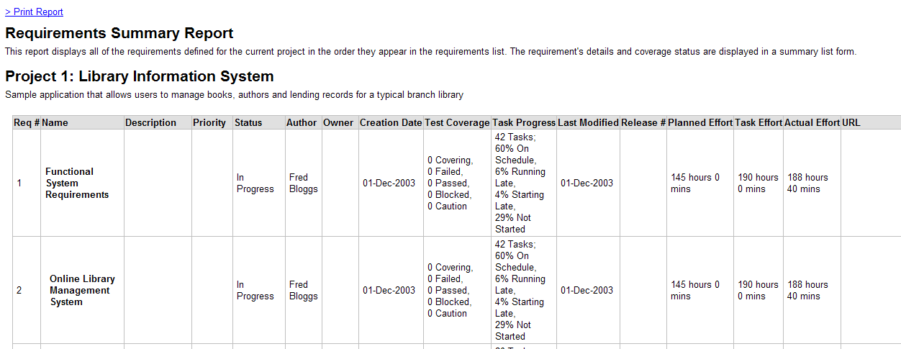
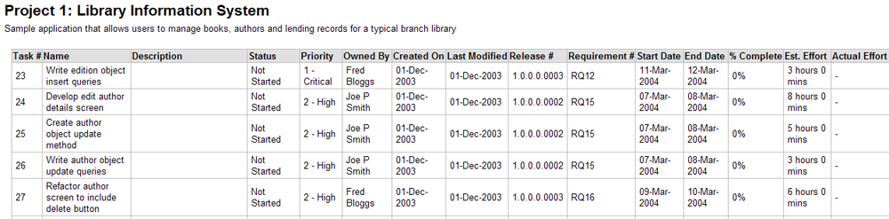
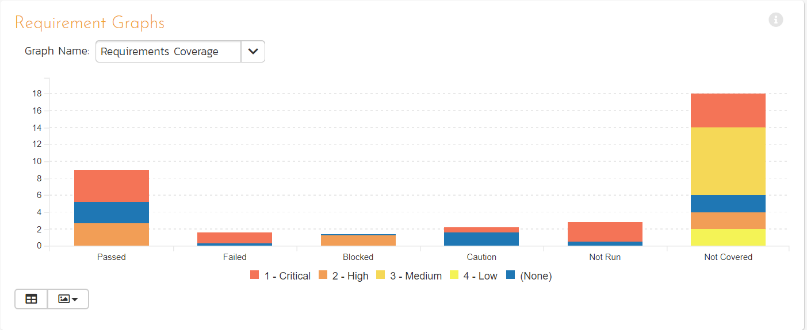
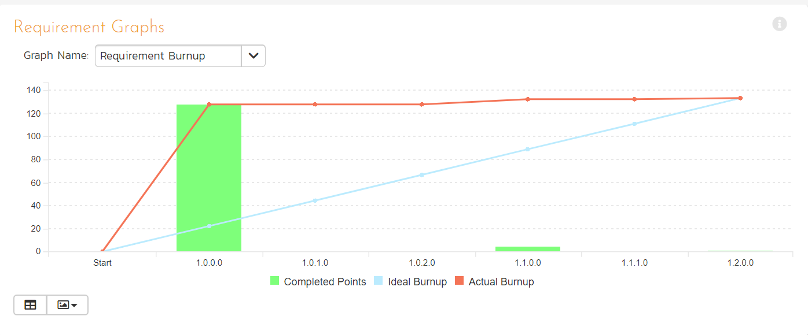
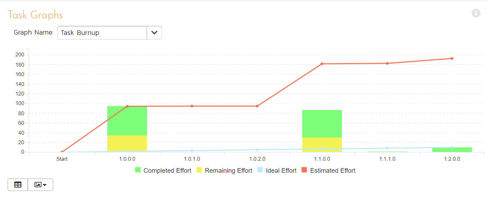

# Reports Center

This section describes the reporting features of SpiraPlan®, including an overview of each of the report types that are available. When you click on the "Reports" tab on the global navigation bar, you will initially be taken to the reports home page illustrated below:

## Overview
This page consists of four main areas:

1. The top bar shows the product name, controls for changing the graph widgets, and a **dropdown release picker**. The selected release will affect all of the reporting / graphing widgets simultaneously. You can either choose a specific release (includes any child sprints) or "All Releases". Your selection here is synced with the selection you set on the product dashboard page.
2. The top left-hand pane displays a list of any reports that have either been saved by the currently logged in user, or those reports created by other members of the product, that have been marked (by that user) as 'shareable'.
3. The bottom left-hand main pane displays a list of the printable reports available in the system, categorized by the artifact they primarily relate to (requirements, test cases, incidents and releases). Clicking on any of the report hyperlinks will take you to the [configuration page](#reports-configuration) for the report in question below for details).
4. The right-hand pane is a dashboard that contains the set of graph widgets configured by the current user. By default the dashboard will display: the Incident Progress Rate, Test Run Progress Rate, Requirement Summary, Test Case Summary, Incident Aging and Task Burndown. When "All Releases" is seleted from the dropdown release picker, some widgets show information for every single release and sprint, and others only for active releases/sprints[^active-release]:

    - Requirement Graphs widget: only active releases
    - Task Graphs widgets: only active releases
    - All Summary Graphs widgets: all releases
    - All Date-Range Graphs widgets: all releases
    - Custom Graphs that use the token ${ReleaseId}: no data
    - Custom Graphs that use the token ${ReleaseAndChildIds}: only active releases

In addition to the graphs displayed by default, you can click on the "***Add Items***" buttons to add additional graphs to the reporting dashboard:

Each of the graphs is described in more detail in [Summary Graphs](#summary-graphs) to [Date-Range Graphs](#date-range-graphs).

## Reports Configuration

The configuration page for each report differs slightly, but the general format is illustrated below (please note all sections are shown in orange text with a line beneath and are shown here in the collapsed state -- click the orange text to expand the section):

You can configure the reports in the following ways:

**Report Format** -- This allows you to specify the display format of the report. Depending on the specific report, they can be:

- displayed as a web-page (HTML)
- downloaded as a Microsoft Word document (there are two Word versions: one for newer versions of Word and one for legacy versions of Word)
- downloaded as a Microsoft Excel spreadsheet (there are two Excel versions: one is better for printing, while the other is more suited to data manipulation)
- downloaded as a Microsoft Product file
- there is also a raw-XML format that allows you to export the underlying report data into any external reporting system that supports XML import.

**Report Elements** -- This allows you to determine which types of information to include in the report. This varies by report type, but includes the dependent items related to the artifact being reported on (attachments, test steps, coverage, history, etc.)

**Standard Field Filters** -- This allows you to constrain the range of data being reported on, based on the various fields associated with the artifact in question. These filters are typically selections from multi-valued-dropdown lists and date-ranges.

**Custom Property Filters** -- This allows you to constrain the range of data being reported on, based on the custom fields associated with the artifact by your product administrator. These filters can be either freetext or drop-down lists.

**Sort Options** - This option is only available for the non-hierarchical data reports (i.e. for test cases, test sets, test runs, incidents and tasks) and allows you to specify the sort order of the results returned in the report. For the hierarchical-data based reports the sort order is always the order of the hierarchy.

**Report Name** -- If you would like to save the report configuration so that you can quickly re-run it at a later date, you just need to enter a name for the report and indicate (by selecting the checkbox or not) whether you want this report to be private or shared by all members of the product.

Once you have selected the format, elements and filters, clicking the "***Create Report***" button launches the report in a new window. Each of the reports is described in [Requirement Reports](#requirement-reports) to [Release Reports](#release-reports) below:

## Requirement Reports

### Requirements Summary Report

This report displays all of the requirements defined for the current product in the order they appear in the requirements list. The requirement's details and coverage status are displayed in a summary list form:

### Requirements Detailed Report

This printable report displays all of the requirements defined for the current product in the order they appear in the requirements list. For each individual requirement, the name, priority, author, status and coverage status are displayed, along with tables containing the list of covering test cases, linked incidents/requirements, associated tasks, attached documents, and the change history:

### Requirements Plan

This report displays a complete work breakdown structure of the product from a requirements perspective, including all requirements and tasks organized by schedule:

### Requirements Traceability Matrix

This report displays a matrix of the requirements in the system with their list of covering test cases and a**ssociated, mapped requirements:**

## Test Case Reports

### Test Case Summary Report

This report displays all of the test cases defined for the current product in the order they appear in the test case list. The test case's details and execution status are displayed in a summary grid form with the test steps optionally displayed:

### Test Case Detailed Report

This report displays all of the test cases defined for the current product in the order they appear in the test case list. The test case's details and execution status are displayed, along with sub-tables containing the list of test steps, test runs, attached documents, the change history, and a list of any associated open incidents:

### Test Set Summary Report

This report displays all of the test sets defined for the current product in the order they appear in the test set list. The test set's details and execution status are displayed in a summary list form:

### Test Set Detailed Report

This report displays all of the test sets defined for the current product in the order they appear in the test set list. The test set's details and execution status are displayed, along with sub-tables containing the list of test cases, test runs, attached documents, and the change history:

### Printable Test Scripts

This printable report is useful when you want to be able to conduct the testing activities offline on paper, or when testers need paper copies of the test script in addition to using the online test execution wizard.

In either case, this report simply displays all of the test cases defined for the current product in the order they appear in the test case list together with their detailed test steps and a list of any attached documents.

### Test Run Summary Report

This report displays all of the test runs defined for the current product. The test run's details and execution status are displayed in a summary grid form:

### Test Run Detailed Report

This report displays all of the test runs defined for the current product in date order (most recent first). The test run's details and execution status are displayed, along with sub-tables containing the list of test run steps, and a list of any associated open incidents:

### Test Case Traceability

This report displays a matrix of the test cases in the system with the list of mapped releases, incidents and test sets:

## Incident Reports

### Incident Summary Report

This report displays all of the incidents tracked for the current product. The incident's details are displayed in a summary list form:

### Incident Detailed Report

This printable report displays all of the incidents tracked for the current product sorted by incident number. For each individual incident, the name, type, priority, status, opener, owner and close date are displayed, along with tables containing the detailed description and resolutions as well as a tabular list of attached documents, linked requirements/incidents and the change history:

## Task Reports

### Task Summary Report

This report displays all of the tasks tracked for the current product. The task's details are displayed in a summary list form:

### Task Detailed Report

This report displays all of the tasks tracked for the current product. The task's details are displayed, along with a tabular list of attached documents and the change history:

## Release Reports

### Release Summary Report

This report displays all of the releases and sprints defined for the current product in the order they appear in the release/sprint hierarchy. The release's details are displayed in a summary list form:

### Release Detailed Report

This report displays all of the releases and sprints defined for the current product in the order they appear in the release/sprint hierarchy. The release's details are displayed, along with sub-tables containing the list of requirements added, mapped test cases, test runs executed, incidents resolved, attached documents, scheduled tasks and the change history:

### Release Plan Report

This report displays a complete work breakdown structure of the product from a release perspective, including all releases, sprints, requirements, tasks and incidents organized by schedule:

## Summary Graphs

### Requirements Summary Graph

The requirements summary graph shows how many requirements are currently in a product. The number of requirements is displayed according to the criteria that you specify. You can specify the type of data displayed along the x-axis, and the requirement information which is used to group the data. When you first open the graph you will be asked to pick the field that you would like to display on the x-axis and the field that you would like to group the data by. Once you have chosen the appropriate fields the graph will be displayed:

In this version of the report, the x-axis represents the requirements'
status, and the individual bars are grouped by requirement importance. Each data-value can be viewed by positioning the mouse pointer over the bar, and a "tooltip" will pop-up listing the actual data value. 

If a specific release is currently selected for the whole page, then Release is selected from one of the graph dropdowns, the graph shows only data for the specific release and its child sprints, if any.

Clicking on the "***Display Data Grid***" button will display the underlying data that is being used to generate the graph:

Clicking on the "***Download Data as CSV***" button will export the datagrid into Comma Separated Values (CSV) format that can be opened in MS-Excel. Some browsers also support the ability to save the graph as an image file (JPEG, PNG and GIF formats).

### Test Case Summary Graph

The test case summary graph shows how many test cases are currently in a product. The number of test cases is displayed according to the criteria that you specify. You can specify the type of data displayed along the x-axis, and the test case information which is used to group the data. When you first open the graph you will be asked to pick the field that you would like to display on the x-axis and the field that you would like to group the data by. Once you have chosen the appropriate fields the graph will be displayed:

In this version of the report, the x-axis represents the test case execution status, and the individual bars are grouped by test case priority. Each data-value can be viewed by positioning the mouse pointer over the bar, and a "tooltip" will pop-up listing the actual data value. Clicking on the "***Display Data Grid***" button will display the underlying data that is being used to generate the graph. In addition, clicking on the "***Download Data as CSV***" button will export the datagrid into Comma Separated Values (CSV) format that can be opened in MS-Excel. Some browsers also support the ability to save the graph as an image file (JPEG, PNG and GIF formats).

### Test Run Summary Graph

The test run summary graph shows how many test runs are currently in a product. The number of test runs is displayed according to the criteria that you specify. You can specify the type of data displayed along the x-axis, and the test run information which is used to group the data. When you first open the graph you will be asked to pick the field that you would like to display on the x-axis and the field that you would like to group the data by. Once you have chosen the appropriate fields the graph will be displayed:

In this version of the report, the x-axis represents the test run execution status, and the individual bars are grouped by test run type. If a specific release is currently selected for the whole page, then Release is selected from one of the graph dropdowns, the graph shows only data for the specific release and its child sprints, if any.

Each data-value can be viewed by positioning the mouse pointer over the bar, and a "tooltip" will pop-up listing the actual data value. Clicking on the "***Display Data Grid***" button will display the underlying data that is being used to generate the graph. In addition, clicking on the "***Download Data as CSV***" button will export the datagrid into Comma Separated Values (CSV) format that can be opened in MS-Excel. Some browsers also support the ability to save the graph as an image file (JPEG, PNG and GIF formats).

### Incident Summary Graph

The incident summary graph shows how many incidents are currently in a product. The number of incidents is displayed according to the criteria that you specify. You can specify the type of data displayed along the x-axis, and the incident information which is used to group the data. When you first open the graph you will be asked to pick the field that you would like to display on the x-axis and the field that you would like to group the data by. Once you have chosen the appropriate fields the graph will be displayed:

In this version of the report, the x-axis represents the incidents' status, and the individual bars are grouped by the type of incident. For incidents, the whole-page release selection applies to the incident Detected Release field.

Each data-value can be viewed by positioning the mouse pointer over the bar, and a "tooltip" will pop-up listing the actual data value. Clicking on the "***Display Data Grid***" button will display the underlying data that is being used to generate the graph. In addition, clicking on the "***Download Data as CSV***" button will export the datagrid into Comma Separated Values (CSV) format that can be opened in MS-Excel. Some browsers also support the ability to save the graph as an image file (JPEG, PNG and GIF formats).

### Task Summary Graph

The task summary graph shows how many tasks are currently in a product. The number of tasks is displayed according to the criteria that you specify. You can specify the type of data displayed along the x-axis, and the task information which is used to group the data. When you first open the graph you will be asked to pick the field that you would like to display on the x-axis and the field that you would like to group the data by. Once you have chosen the appropriate fields the graph will be displayed:

In this version of the report, the x-axis represents the tasks'
priority, and the individual bars are grouped by the status of task. If a specific release is currently selected for the whole page, then Release is selected from one of the graph dropdowns, the graph shows only data for the specific release and its child sprints, if any.

Each data-value can be viewed by positioning the mouse pointer over the bar, and a "tooltip" will pop-up listing the actual data value. Clicking on the "***Display Data Grid***" button will display the underlying data that is being used to generate the graph. In addition, clicking on the "***Download Data as CSV***" button will export the datagrid into Comma Separated Values (CSV) format that can be opened in MS-Excel. Some browsers also support the ability to save the graph as an image file (JPEG, PNG and GIF formats).

### Test Set Summary Graph

The test set summary graph shows how many test set are currently in a product. The number of test sets is displayed according to the criteria that you specify. You can specify the type of data displayed along the x-axis, and the test set information which is used to group the data. When you first open the graph you will be asked to pick the field that you would like to display on the x-axis and the field that you would like to group the data by. Once you have chosen the appropriate fields the graph will be displayed:

In this version of the report, the x-axis represents the test set status, and the individual bars are grouped by the name of the tester (owner). If a specific release is currently selected for the whole page, then Release is selected from one of the graph dropdowns, the graph shows only data for the specific release and its child sprints, if any.

Each data-value can be viewed by positioning the mouse pointer over the bar, and a "tooltip" will pop-up listing the actual data value. Clicking on the "***Display Data Grid***" button will display the underlying data that is being used to generate the graph. In addition, clicking on the "***Download Data as CSV***" button will export the datagrid into Comma Separated Values (CSV) format that can be opened in MS-Excel. Some browsers also support the ability to save the graph as an image file (JPEG, PNG and GIF formats).

## Snapshot Graphs

### Requirements Coverage Graph

The requirements coverage graph shows how many requirements are currently in a product, according to their test coverage status.

The x-axis of the report represents the various test execution statuses that a requirement can have as its coverage status (plus the Not-Covered status), and the individual bars are grouped by the requirements importance. Each data-value can be viewed by positioning the mouse pointer over the bar, and a "tooltip" will pop-up listing the actual data value.

Clicking on the "***Display Data Grid***" button will display the underlying data that is being used to generate the graph. You can also filter the graph to just display data for a specific release/sprint as well as for the product as a whole. In addition, clicking on the "***Download Data as CSV***" button will export the datagrid into Comma Separated Values (CSV) format that can be opened in MS-Excel. Some browsers also support the ability to save the graph as an image file (JPEG, PNG and GIF formats).

### Requirements Burndown Graph

The Requirements Burndown graph shows the remaining number of story points that needs to be completed for each release/sprint in the product with separate lines for the estimated and ideal burndown. In addition, the graph includes bars for the completed number of story points in each time period on the x-axis:

The y-axis of the graph displays the total remaining number of story points that needs to be done (the actual burndown), with a blue line indicating the ideal burndown. In addition, there are bars displayed at each interval of the x-axis that shows the completed number of story points for that interval.

The x-axis can be configured to display three different levels of granularity:

**All Releases** -- This shows the total remaining number of story points that needs to be done for each of the releases in the product

**Specific Release** -- This shows the total remaining number of story points that needs to be done for each of the sprints in the selected release

**Specific Sprint** -- This shows the total remaining number of story points that needs to be done for each working day in the date-range covered by the selected sprint.

Clicking on the "***Display Data Grid***" button will display the underlying data that is being used to generate the graph. In addition, clicking on the "***Download Data as CSV***" button will export the datagrid into Comma Separated Values (CSV) format that can be opened in MS-Excel. Some browsers also support the ability to save the graph as an image file (JPEG, PNG and GIF formats).

### Requirements Burnup Graph

The Requirements Burnup graph shows the cumulative number of story points outstanding for each release/sprint in the product with separate lines for the estimated and ideal burnup. In addition, the graph includes bars for the number of completed story points in each time period on the x-axis.

The y-axis of the graph displays the cumulative increase in number of story points for the product (the actual burnup), with a blue line indicating the ideal burnup. In addition, there are bars displayed at each interval of the x-axis that shows the number of completed story points for that interval.

The x-axis can be configured to display three different levels of granularity:

**All Releases** -- This shows the increase in number of story points for each of the releases in the product

**Specific Release** -- This shows the increase in number of story points for each of the sprints in the selected release

**Specific Sprint** -- This shows the increase in number of story points for each working day in the date-range covered by the selected sprint.

Clicking on the "***Display Data Grid***" button will display the underlying data that is being used to generate the graph. In addition, clicking on the "***Download Data as CSV***" button will export the datagrid into Comma Separated Values (CSV) format that can be opened in MS-Excel. Some browsers also support the ability to save the graph as an image file (JPEG, PNG and GIF formats).

### Requirements Velocity Graph

The Requirements Velocity graph shows the total number of story points that have been completed (or planned to be completed) in a particular release, sprint or time-period (called the velocity). The actual velocity is displayed along with the overall average velocity (in blue) and the rolling average velocity (in green):

The y-axis of the graph displays the total number of story points, and the x-axis can be configured to display three different levels of granularity:

**All Releases** -- This shows the total number of story points for each of the releases in the product

**Specific Release** -- This shows the total number of story points for each of the sprints in the selected release

**Specific Sprint** -- This shows the total number of story points for each working day in the date-range covered by the selected sprint.

Clicking on the "***Display Data Grid***" button will display the underlying data that is being used to generate the graph. In addition, clicking on the "***Download Data as CSV***" button will export the datagrid into Comma Separated Values (CSV) format that can be opened in MS-Excel. Some browsers also support the ability to save the graph as an image file (JPEG, PNG and GIF formats).

### Incident Aging Graph

The incident aging graph displays the number of days incidents have been left open in the system with the count of incidents on the y-axis and different age intervals on the x-axis. Each bar-chart color represents a different incident priority, giving a product manager a snapshot view of the age of open incidents by priority and detected release. For this chart, "open" is defined as any incident with an empty "Closed On" date. The incident status is not used for this chart.

This report can be filtered by the type of incident, so for example you can see the aging of just bugs, or just issues for the product in question. Clicking on the "***Display Data Grid***" button will display the underlying data that is being used to generate the graph. In addition, clicking on the "***Download Data as CSV***" button will export the datagrid into Comma Separated Values (CSV) format that can be opened in MS-Excel. Some browsers also support the ability to save the graph as an image file (JPEG, PNG and GIF formats).

### Incident Turnaround Time Graph

The incident turnaround time graph displays the number of days incidents have taken to be closed (from the time they were first raised) in the system with the count of incidents on the y-axis and different turnaround time intervals on the x-axis. Each bar-chart color represents a different incident priority, giving a product manager a snapshot view of the turnaround time of incidents by priority and detected release. For this chart, "closed" is defined as any incident with a "Closed On" date. The incident status is not used for this chart.

This report can be filtered by the type of incident, so for example you can see the turnaround time of just bugs, or just issues for the product in question. Clicking on "***Display Data Grid***" button will display the underlying data that is being used to generate the graph. In addition, clicking on the "***Download Data as CSV***" button will export the datagrid into Comma Separated Values (CSV) format that can be opened in MS-Excel. Some browsers also support the ability to save the graph as an image file (JPEG, PNG and GIF formats).

### Task Velocity Chart

The Task Velocity graph shows the total estimated and actual effort (in number of hours) delivered in each product release and/or sprint:

The y-axis of the graph displays the total estimated and actual effort delivered (in hours), and the x-axis can be configured to display three different levels of granularity:

**All Releases** -- This shows the total estimated and actual effort for each of the releases in the product

**Specific Release** -- This shows the total estimated and actual effort for each of the sprints in the selected release

**Specific Sprint** -- This shows the total estimated actual effort for each working day in the date-range covered by the selected sprint.

Clicking on the "***Display Data Grid***" button will display the underlying data that is being used to generate the graph. In addition, clicking on the "***Download Data as CSV***" button will export the datagrid into Comma Separated Values (CSV) format that can be opened in MS-Excel. Some browsers also support the ability to save the graph as an image file (JPEG, PNG and GIF formats).

### Task Burnup Chart

The Task Burnup graph shows the cumulative amount of work outstanding for each release/sprint in the product with separate lines for the estimated and ideal burnup. In addition, the graph includes bars for the remaining and completed effort in each time period on the x-axis.

The y-axis of the graph displays the cumulative increase in work (in hours) for the product (the actual burnup), with a blue line indicating the ideal burnup. In addition, there are bars displayed at each interval of the x-axis that shows the remaining effort and completed effort for that interval.

The x-axis can be configured to display three different levels of granularity:

**All Releases** -- This shows the increase in work for each of the releases in the product

**Specific Release** -- This shows the increase in work for each of the sprints in the selected release

**Specific Sprint** -- This shows the increase in work for each working day in the date-range covered by the selected sprint.

Clicking on the "***Display Data Grid***" button will display the underlying data that is being used to generate the graph. In addition, clicking on the "***Download Data as CSV***" button will export the datagrid into Comma Separated Values (CSV) format that can be opened in MS-Excel. Some browsers also support the ability to save the graph as an image file (JPEG, PNG and GIF formats).

### Task Burndown Chart
The Task Burndown graph shows the effort (in hours) on the y-axis. The x-axis shows releases/sprints - the releases/sprints shown changes as you change the release selector at the top of the page. To be useful tasks in the product have to have their effort fields populated (specifically Estimated Effort and Remaining Effort).

The blue line on the graphs indicates the ideal burndown. The other line shows the estimated actual burndown. The graph also shows bars for the remaining and completed effort for each relevant release/sprint.

**How changing the displayed release for the page changes the x-axis:**

- **All Releases**: all active releases in the product
- **Specific Release**: all sprints within the chosen release. If the release has no sprints, the chart will be empty -- child releases are not shown
- **Specific Sprint**: each day of the sprint, from its start to end date. In order for the chart to be meaningful, tasks must have start and end dates that are within the sprint's dates. 

Clicking on the "***Display Data Grid***" button shows the underlying data used to generate the graph. Clicking the `Download Data as CSV` exports the data into Comma Separated Values (CSV) file. Some browsers support saving the graph as an image (JPEG, PNG and GIF formats).

## Date-Range Graphs

### Test Run Progress Rate Graph

The Test Run Progress Rate Graph shows how many tests have been executed for the selected release/sprint for a specific date range, and what execution status was recorded. The graph can be displayed for all test case types or for a specific type.

In this version of the report, the y-axis represents the number of test runs executed in each 24 hour period, and the x-axis represents a specific week in the time-span. Each data-bar can be viewed by positioning the mouse pointer over the point, and a "tooltip" will pop-up listing the actual data value. You can filter the report by the release/sprint that the test run was executed against, and also change the date range. If you choose a smaller date-range, the x-axis will switch from weekly to daily and if you choose a larger date-range, the x-axis will switch to monthly.

Clicking on the "***Display Data Grid***" button will display the underlying data that is being used to generate the graph. In addition, clicking on the "***Download Data as CSV***" button will export the datagrid into Comma Separated Values (CSV) format that can be opened in MS-Excel. Some browsers also support the ability to save the graph as an image file (JPEG, PNG and GIF formats).

### Test Case Progress Rate Graph

The Test Case Progress Rate Graph displays the number of test case executions for the specified date range, against the specified release/sprint, ignoring the status from any previous days. Any test cases not executed that day will be considered "not run" and will appear in the "not run" category. 

For example, if you have 10 test cases created on day 1 you will see 10 test cases "not run" on day 1. On day 2, you execute 5 test cases and fail them all, you will now see 5 test cases failed and 5 not run. On day 3, you execute 3 of the previous 5 test cases and pass them. You will now see 3 test cases passed, 0 failed and 7 not run.

### Test Case Cumulative Progress Graph

The Test Case Cumulative Progress Graph displays the number of test case executions cumulatively over the specified date range, against the specified release/sprint. That means it will display for each day, the total number of test cases executed plus the status from any previous days that have not been changed. Any test cases not executed up to that point will be considered "not run" and will appear in the "not run" category.

For example, if you have 10 test cases created on day 1 you will see 10 test cases "not run" on day 1. On day 2, you execute 5 test cases and fail them all, you will now see 5 test cases failed and 5 not run. On day 3, you execute 3 of the previous 5 test cases and pass them. You will now see 3 test cases passed, 2 failed and 5 not run.

### Incident Progress Rate Graph

The incident progress rate chart displays the total number of incidents created and closed over a particular date-range, either for all incident types or for a specific incident type:

In this version of the report, the y-axis represents the number of incidents (either created or closed in a 24 hour period), and the x-axis represents a specific day in the time-span. Each data-point can be viewed by positioning the mouse pointer over the point, and a "tooltip" will pop-up listing the actual data value. You can filter the report by the type of incident, and also change the date range (e.g. displaying only the bugs for the date range). If you choose a smaller date-range, the x-axis will switch from weekly to daily and if you choose a larger date-range, the x-axis will switch to monthly.

Clicking on the "***Display Data Grid***" button will display the underlying data that is being used to generate the graph. In addition, clicking on the "***Download Data as CSV***" button will export the datagrid into Comma Separated Values (CSV) format that can be opened in MS-Excel. Some browsers also support the ability to save the graph as an image file (JPEG, PNG and GIF formats).

### Cumulative Incident Count Graph

The cumulative incident count chart displays the cumulative total number of incidents logged in the system for the current product over a particular date-range, either for all incident types or for a specific incident type. The report displays two data series, one illustrating the total count of all incidents, the other the total count of all *open incidents* (i.e. with status not set to fixed or closed):

In this version of the report, the y-axis represents the number of incidents, and the x-axis represents a specific week in the time-span. Each data-point can be viewed by positioning the mouse pointer over the point, and a "tooltip" will pop-up listing the actual data value. You can also filter the type of incident being reported, as well as change the date interval. If you choose a smaller date-range, the x-axis will switch from weekly to daily and if you choose a larger date-range, the x-axis will switch to monthly.

Clicking on the "***Display Data Grid***" button will display the underlying data that is being used to generate the graph. In addition, clicking on the "***Download Data as CSV***" button will export the datagrid into Comma Separated Values (CSV) format that can be opened in MS-Excel. Some browsers also support the ability to save the graph as an image file (JPEG, PNG and GIF formats).

### Open Incident Count Graph

The open incident count chart displays the net number of open incidents in the system for the current product over a particular date-range categorized by incident priority, either for all incident types or for a specific incident type. For this chart, "open" is defined as any incident with an empty "Closed On" date. The incident status is not used for this chart.

In this version of the report, the y-axis represents the number of incidents, and the x-axis represents a specific week in the time-span. The exact count of each bar in the stacked histogram can be viewed by positioning the mouse pointer over the bar, and a "tooltip" will pop-up listing the actual data value. You can also filter the type of incident being reported, as well as change the date interval. If you choose a smaller date-range, the x-axis will switch from weekly to daily and if you choose a larger date-range, the x-axis will switch to monthly.

Clicking on the "***Display Data Grid***" button will display the underlying data that is being used to generate the graph. In addition, clicking on the "***Download Data as CSV***" button will export the datagrid into Comma Separated Values (CSV) format that can be opened in MS-Excel. Some browsers also support the ability to save the graph as an image file (JPEG, PNG and GIF formats).

### Incident Count by Status Graph

The incident status count chart displays the number of open incidents in the system for the current product over a particular date-range categorized by incident status, either for all incident types or for a specific incident type. For this chart, "open" is defined as any incident with an empty "Closed On" date. The incident status is not used for this chart.

In this version of the report, the y-axis represents the number of incidents, and the x-axis represents a specific week in the time-span. The exact count of each bar in the stacked histogram can be viewed by positioning the mouse pointer over the bar, and a "tooltip" will pop-up listing the actual data value. You can also filter the type of incident being reported, as well as change the date interval. If you choose a smaller date-range, the x-axis will switch from weekly to daily and if you choose a larger date-range, the x-axis will switch to monthly.

Clicking on the "***Display Data Grid***" button will display the underlying data that is being used to generate the graph. In addition, clicking on the "***Download Data as CSV***" button will export the datagrid into Comma Separated Values (CSV) format that can be opened in MS-Excel. Some browsers also support the ability to save the graph as an image file (JPEG, PNG and GIF formats).

## Custom Graphs

These are the graphs that a SpiraPlan administrator has created in the Administration section of the system and published for use by end users. They rely on specific ESQL data queries, so the data represented will depend on the query created by the administrator.

To add a custom graph to your reports dashboard, click on the **Add Items** icon and choose Custom Graphs:

Once you add the Custom Graphs widget to your dashboard, you will see the following:

You can change which custom graph will be used in this widget by simply changing the values in the dropdown list:

You can also change the graph display between the three display types:
donut, bar, and line. The donut style of graph is only available for reports with a single data series:

Clicking on the "***Data Grid***" icon will display the underlying data that is being used to generate the graph.

In addition, clicking on the "***Download Data as CSV***" button will export the data grid into Comma Separated Values (CSV) format that can be opened in MS-Excel.

Some browsers also support the ability to save the graph as an image file (JPEG, PNG and GIF formats).

## Risk Reports

### Risk Summary Report

This report displays all of the risks tracked for the current project. The risks are displayed, along with a tabular list of mitigations, tasks, comments, attached documents, and change history:

### Risk Detailed Report

This report displays all of the risks tracked for the current project. The risks are displayed in a summary table form:

[^active-release]: An active release or sprint is one that has a status of either: "Planned", "In Progress", or "Completed"