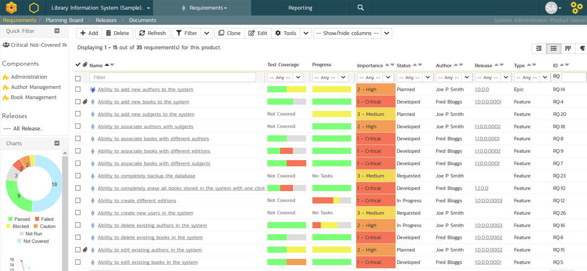
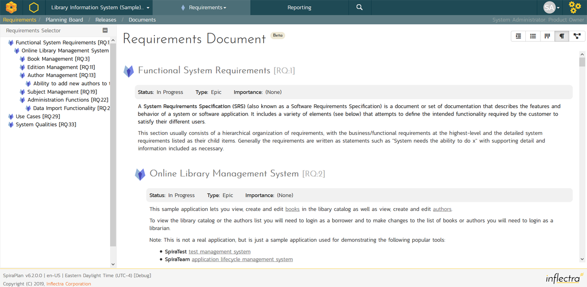
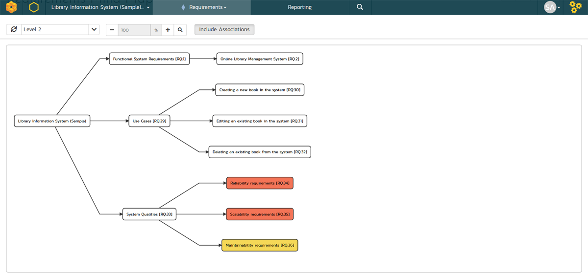
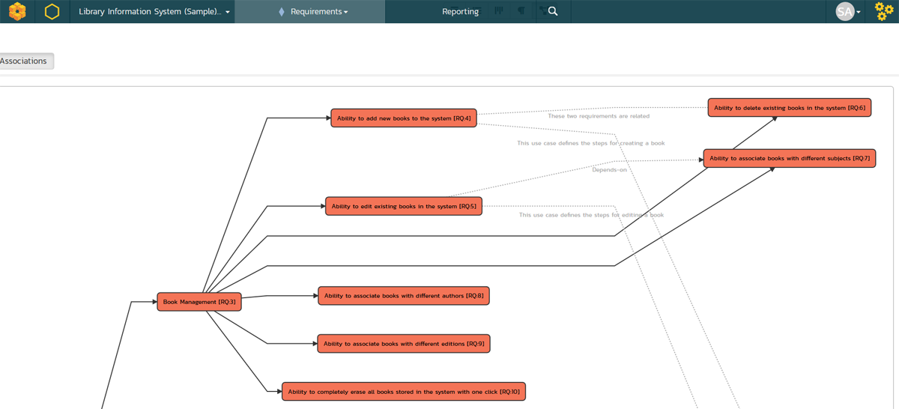
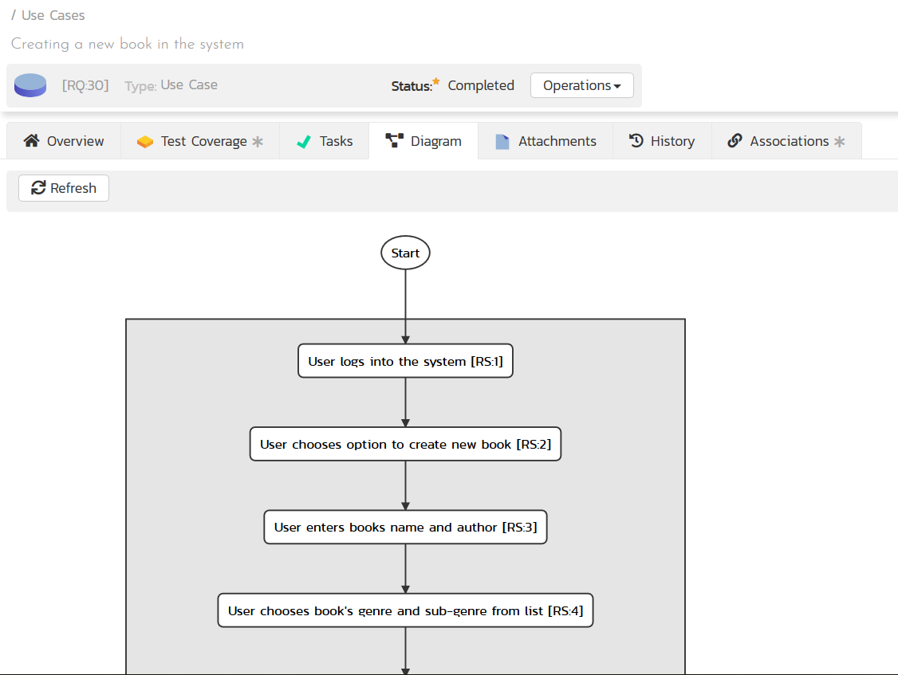

# Requirements Management

This section outlines how the requirements management features of SpiraPlan® can be used to develop a requirements / scope matrix for a product, and how you can map any existing test-cases to the requirements. Typically when starting a product, developing the requirements list is the first activity after the Administrator has set up the product in the system.

## Requirement Traceability and Coverage
From the requirement list page you can see a number of columns that show calculated data for each requirement, based off:

- rolling up of information from child to parent
- associations between the requirement and other artifacts (tasks and test cases)

This allows you to see at a glance the state of play about a number of key metrics for the requirement.

### Test coverage
This column shows a mini chart that shows the sum of each execution statuses against the requirement. It is calculated from the current execution status of each test case assigned to that requirement. If a requirement has 3 test cases assigned to it, then the mini chart will show the results for those 3 test cases.

If you hover the mouse over the mini chart it will display a tooltip that provides a more detailed description of the number of tests in each execution status.

When you have a hierarchy of requirements, the total number of test cases included in the mini chart is the sum of all of the test cases assigned to each of its children, added to the number of test cases directly assigned to the parent requirement.

??? note "Example: How Test Coverage Rolls up to Parent Requirements"
    - You have 3 requirements (A, B, and C) nested one inside the other
    - The most nested requirement (C) therefore has a parent (B) and a grandparent (A)
    - We assign one test case to C: C has 1 test case against it in the mini chart; B will also have 1; and A will have 1 too
    - We now add that same test case to B: C still has 1 test case; but now B has 2 test cases (1 it gets from its child C and 1 is from its own test coverage); and A has a total of 2 test cases as well (0 from itself, and 2 as the sum of its direct children's test cases - in this case B)

The left-hand sidebar on the requirements list page shows an donut chart of aggregate requirement test coverage in the product. It shows segments for each test execution status. It calculates the number for each execution status segment as follows:

- Each requirement in the product gets a score of 1
- This score of 1 is split based on the execution status proportions for that requirement (so a requirement that is 50% passed, 30% failed, and 20% not run gets scores for passed, failed, and not run of 0.5, 0.3 and 0.2 respectively). These values exactly match those you will see in the mini chart on the main list page (discussed above)
- The individual execution status scores from above are summed up across all the requirements in the product
- These totals for each execution status are then shown as proportions on the donut chart
- In this way the sum of the numbers on the donut chart will be the number of requirements in the product (and the sum of all the proportions will be 100%)

### Task Progress
This columns shows a mini chart of the count of all active tasks[^active-tasks] assigned to the requirement, by progress category for the requirement. The 'On Schedule', 'Late Finish', 'Late Start' and 'Not Started' bars indicate the total count of tasks that are in that category.

If you hover the mouse over the mini chart it will display a tooltip that provides a more detailed description of the number of tasks in each category.

How are the different categories calculated?

- Inactive tasks are completely excluded
- Each task assigned to the requirement has a count of 1. 
- Counts in each category are added together and percentages taken based off those final counts
- Counts for tasks that are either "Running Late" or "On Schedule" are split based off their percentage completion (the done portion adding to the specific category and the remainder adding to the "Not Started" category). So if a task is 40% done it will add 0.4 to, for example, "Running Late" and 0.6 to "Not Started".  
- **On Schedule** tasks:
    - have some work completed on them (percentage complete is more than 0 but is not 100%)
    - are not overdue (their end date is not in the future)
- **Running Late** tasks:
    - are overdue (i.e. with an end date in the past)
    - either have a status of "In Progress" or have been partially completed (have a completion of more than 0%)
    - have not been fully completed (their completion is not at 100%)
- **Starting Late** tasks:
    - have not had any work done on them (percentage complete is 0) 
    - have already started (their start date is in the past)
- **Not Started** tasks:
    - have not had any work done on them (percentage complete is 0) 
    - have not yet started: this is the case if either their start date is in the future or they have a status of "Deferred"

[^active-tasks]: any task with a status that is *not* one of the following: "Rejected", "Obsolete", "Duplicate".

### Task Effort
For each requirement each effort column is calculated from the sum of effort from all tasks assigned to that requirement. These values are aggregated to any parent requirements:

- Task Effort: the sum of all tasks' estimated efforts
- Actual Effort: the sum of all tasks' actual efforts
- Remaining Effort: the sum of all tasks' remaining efforts
- Projected Effort: the sum of all task projected efforts

Task effort calculations are described in more detail [here](../User-Product-Management/#release-task-progress). 

## Requirements List

When you click on the Planning \> Requirements link on the global navigation bar, you will initially be taken to the requirements list screen illustrated below:

The requirements list consists of a hierarchical arrangement of the various requirements and functionalities that need to be provided by the system in question. The structure is very similar to the Work Breakdown Structure (WBS) developed in Microsoft Product®, and users of that software package will find this very familiar to use. When you create a new product, this list will initially be empty, and you will have to start using the "***Insert***" button to start adding requirements.

Requirements come in two main flavors: summary items (Epics) shown in **bold-type**, and detail items shown in normal-type with a hyperlink. When you indent a requirement under an existing requirement, the parent is changed from a detail-item to an Epic / summary item, and when you outdent a child item, its parent will return to a detail-item (assuming it has no other children). This behavior is important to understand, as only detail items are assigned a status themselves; the Epics / summary items simply display an aggregate of the worst-case assessment of their children's status. Both summary and detail items can be mapped against test-cases for test-coverage, in addition the Epics / summary items display an aggregate coverage status.

Each requirement is displayed along with its importance/priority (ranked from "Critical" to "Low"), its completion status (from "Requested" to "Completed"), the version of the software that the requirement is planned for, and graphical indicators that represents its test coverage status and its task progress.

For those requirements that have no test-cases covering them (i.e. validating that the requirement works as expected) the indicator consists of a white solid bar, bearing the legend "Not Covered". For those requirements that have *at least one* test-case mapped against them, they will display a block graph that illustrates the last execution status of each of the mapped test-cases. Thus if the requirement is covered by two test cases, one of which passed, and one of which wasn't run, the graph will display a green bar (50% passed) and an equal length gray bar (50% not run). To determine the exact requirements coverage information, position the mouse pointer over the bar-chart, and the number of covering tests, along with the pass / fail / blocked / caution / not-run breakdown will be displayed as a "tooltip".

For those requirements that have at least one task associated with them, they will display a block graph that illustrates the relative numbers of task that are on-schedule (green), late-starting (yellow), late-finishing (red) or just not-started (grey). These values are weighted by the effort of the task, so that larger, more complex tasks will be change the graph more than the smaller tasks. To determine the exact task progress information, position the mouse pointer over the bar-chart and the number of associated tasks, along with the details of how many are in each status will be displayed as a "tooltip".

### Insert

Clicking on the <Insert\> icon inserts a requirement *above* the currently selected requirement -- i.e. the one whose check-box has been selected, at the same level in the hierarchy. If you want to insert a requirement below an existing item, you can use the Insert \> Child Requirement option instead. If you insert a requirement without first selecting an existing requirement from the list, the new requirement will simply be added at the end of the list. Note that if the full list of requirements are paginated, the new requirement will be at the bottom of the last page.

Once the new requirement has been inserted, the item is switched to "Edit" mode so that you can rename the default name and choose a priority, status and/or author.

### Delete

Clicking on the "***Delete***" button deletes all the requirements whose check-boxes have been selected. If any of the items are summary items, the child requirements are also deleted. If all the children are deleted from a summary item, it changes back into a non-summary item.

### Indent

Clicking on the "***Indent***" button indents all the requirements whose check-boxes have been selected. If any of the items are made children of a requirement that had no previous children, it will be changed from a detail item into a summary item.

### Outdent

Clicking on the "***Outdent***" button de-indents all the requirements whose check-boxes have been selected. If any of the items were the only children of a summary requirement item, then that item will be changed back from a summary item to a detail item.

### Refresh

Clicking on the "***Refresh***" button simply reloads the requirements list (not the entire page). This is useful as other people may be modifying the list of requirements at the same time as you, and after stepping away from the computer for a short-time, you should click this button to make sure you are viewing the most current requirements list for the product.

### Edit

Each requirement in the list has an "**Edit**" button display in its right-most column. When you click this button or just *double-click* on any of the cells in the row, you change the item from "View" mode to "Edit" mode. The various columns are made editable, and "***Update***" buttons are displayed in the last column:

If you click "***Edit***" on more than one row, the "***Update***" buttons are only displayed on the first row selected. You can make changes to all the editable rows and then update the changes by clicking the one "***Update***" button. Also, if you want to make the same change to multiple rows (e.g. to change five requirements from "In Progress" status to "Completed"), you can click on the "fill" icon to the right of the editable item, which will propagate the new value to all editable items in the same column.

If you want to edit lots of items, first select their checkboxes and then click the \[Edit\] button on the same row as the Filters and it will switch all the selected items into edit mode.

When you have made your updates, you can either click "***Save***" to commit the changes, or "***Cancel***" to revert back to the original information. Alternatively, pressing the <ENTER\> key will commit the changes and pressing the <ESCAPE\> key will cancel the changes.

### Show Level

Choosing an indent level from the 'Show Level' drop down box allows you to quickly and easily view the entire requirements list at a specific indent level. For example you may want to see all requirements drilled-down to the *third* level of detail. To do this you would simply choose 'Level 3' from the list, and the requirements will be expanded / collapsed accordingly.

### Filtering

Read about [how to create and manage filters](Application-Wide.md#filtering).

### Show / Hide Columns

This drop-down list allows you to change the fields that are displayed in the requirement list as columns for the current product. To show a column that is not already displayed, simply select that column from the list of "Show..." column names and to hide an existing column, simply select that column from the list of "Hide..." column names. This is stored on a per-product basis, so you can have different display settings for each product that you are a member of. The fields can be any of the built-in fields or any of the custom properties set up by the product owner.

### Copying Requirements

To copy a requirement or set of requirements, simply select the check-boxes of the requirements you want to copy and then select the Edit \> Copy Items menu option. This will copy the current requirements selection to the clipboard. Then you should select the place where you want the requirements to be inserted and choose the Edit \> Paste Items option.

The requirements will now be copied into the destination location you specified. The name of the copied requirements will be prefixed with "Copy of..." to distinguish them from the originals. Note that copied requirements will also include the test coverage information from the originals.

### Moving Requirements

To move a requirement in the requirements hierarchy, there are two options:

1.  Click on the requirement you want to move and then drag it to the location you want it moved. An empty space will appear to show you where it will be inserted:

Once you have the requirement positioned at the correct place that you want it inserted, just release the mouse button. To move multiple items simply select their checkboxes and then drag-and-drop one of the selected items.

2.  Alternatively, you can select the check-boxes of the requirements you want to move and then select the Edit \> Cut menu option. This will cut the current requirements selection to the clipboard. Then you should select the place where you want the requirements to be inserted and choose the Edit \> Paste option. The requirements will now be moved into the destination location you specified.

### Exporting Requirements

Read about [how to export artifacts from one product to another](Application-Wide.md#export-to-another-product).

### Creating Test Cases from Requirements

To quickly create test cases from a group of requirements, all you need to do is select the check-boxes of the appropriate requirements and then click Tools \> ***Create Test Cases***. This will then create new test cases based on the selected requirements.

### Creating a Test Set from Requirements

To quickly create a new test set from a group of requirements, all you need to do is select the check-boxes of the appropriate requirements and then click Tools \> ***Create Test Set***. This will then create new test set containing the test cases that are already mapped to the selected requirement(s).

### Printing Items

To quickly print a single requirement or list of requirements you can select the items' checkboxes and then click Tools \> ***Print Items***. This will open a new window containing a printable version of the selected items.

### Focus-On Branch

Sometimes you will a list of filtered requirements displayed and you would like to view all of the items that in the same branch of the requirements tree, even those that don't match the current filter. To view the branch, select the checkbox of the branch and then click Tools \> ***Focus on***, and the system will clear the current filters and then expand just the selected branch.

### Right-Click Context Menu

SpiraPlan® provides a shortcut -- called the *context menu* - for accessing some of the most commonly used functions, so that you don't need to move your mouse up to the toolbar each time. To access the context menu, right-click on any of the rows in the requirements list and the following menu will be displayed:

You can now choose any of these options as an alternative to using the icons in the toolbar.

### Viewing Requirements from Shared Products

If you are displaying the requirements list for a product has required shared from other products, you will see the option on the top-right to view the requirements from the shared product(s):

If you choose the option to show the requirement from 'All Products' and not just the current product, the shared products are displayed, grouped under the name of the product they are being shared from:

Note: Any requirements shared from other products will be read-only and won't display any of their custom properties. However you can expand/collapse these shared requirements and filter using the standard fields.

## Requirements Additional List Views
In SpiraTeam and SpiraPlan, there are four additional requirement list views. They are designed to better serve the needs of the Business Analyst community who often need different views of requirements than the project teams and project managers. These views are:

1. Sorted List
2. Agile Board
3. Documents View (beta)
4. Mindmap (beta)

You can pick between each of these views using the view selection button group at the top right of any requirement list page. 

Note: you can only view requirements from the current product in these four additional views, whether or not you are sharing requirements from other products with this product.

## Requirements Sorted List

This view lets you view the requirements in a flat, sortable list that does not show the requirements hierarchy. You can still see the hierarchy of an item by hovering the mouse over its name to display the tooltip.

This view lets you sort on any of the fields and also filter by the type of requirement, including whether it is an Epic (package) or not.

One major benefit of this view is that when you filter by a field, you only get the items that are a direct match, unlike in the hierarchical grid view, where you also get its parents displayed. It can be useful when displaying a list of just the Epics and nothing else.

### Toolbar
- **Add**: Click this to add a new requirement. It will appear in this view based on the sorting used. In the main requirement hierarchy, it will be be added at the bottom of the requirement list, at the root level (ie fully outdented). Once the new requirement has been inserted, the item is switched to "Edit" mode so that you can rename the default name and choose a priority, status and/or author.
- **Delete**: Clicking this button deletes all the requirements selected. If any are summary items, their child requirements are also deleted. If all the children are deleted from a summary item, it changes back into a non-summary item.
- **Refresh**: Clicking this button reloads the requirements list (not the entire page).
- **Edit**: this works the same way as on the requirements hierarchy list - see [above](#edit).
- **Filter**: Read about [how to create and manage filters, and how to sort the artifact list](Application-Wide.md#filtering).
- **Show / Hide Columns**: this works the same way as on the requirements hierarchy list - see [above](#show-hide-columns)
- **Clone**: all selected requirements will be cloned and added to the requirement list. If a summary item is cloned, then it and all its children are cloned. Cloned items are added to the hierarchical list at the same indent level as the previous bottom most requirement in the hierarchy.
- **Tools**: this dropdown allows to [export requirements](#exporting-requirements), [create test cases](#create-a-test-cases-from-requirements) or [create test sets](#create-a-test-set-from-requirements) from requirements, or to [print items](#printing-items).

### Right-Click Context Menu

To access the context menu, right-click on any of the rows in the requirements sorted list and the following menu will be displayed:

You can now choose any of these options as an alternative to using the icons in the toolbar.

## Requirements Agile Board

This view is similar to the existing [Planning Board](Planning-Board.md) but only displays requirements, whereas the primary planning board will also include incidents / defects. This gives the requirements page consistency with the tasks and incidents pages that already have a Grid / Board view selector option.

## Requirements Document View

This view also offers a hierarchical organization of the first 5000 requirements in a product. Instead of being displayed in a grid form, they are displayed in a document format that is designed to be readable from top to bottom, like a traditional requirements document. The new view has a sidebar that lets you quickly jump to a section in the requirements document as well as simply scroll through all of the items.

The document is paginated, showing up to 250 requirements on each page.

For each requirement, the following information is displayed:

- icon
- name
- ID
- status
- type
- importance
- owner
- description
- [use case diagram](#use-case-diagram) (if the requirement has steps)

## Requirements Mindmap

This mindmap displays the first 5,000 requirements in a product as a connected tree view / mindmap. The root node shows the name of the product on the left hand side. The top most level nodes are connected to the left of this, with their successive children shown from left to right. 

For each requirement the map displays the  name and ID of the requirement, with a tooltip that shows the description and any comments. Each node is color coded by its priority / importance value.

Clicking on the node will take you to the details page for that requirement.

As well as showing the primary hierarchy, there is an option to turn on the display of requirement associations. This will let you see all of the associations as dotted lines. For associations that denote dependencies there is an arrow and dotted line that shows the direction of the dependency. For simple relationship  (relates to) associations, there is a dotted line without an arrow. The system will display either the comment or type of association, depending what was entered when the association was created.

There are several other display options:

- **refresh**: to redraw the mindmap
- **levels dropdown**: lets you select how deep into the mindmap you wish to view. To only show the topmost level requirements, select level 1; to select the top two levels, select level 2, or view everything by selecting "all levels"
- **zoom**: you can change the zoom between 25% and 100% using the plus and minus buttons. To reset the zoom, click the magnifying glass

Note: this view is unfortunately not compatible with Internet Explorer 11.

## Requirement Details

When you click on a requirement item in the requirements list described in [Requirements Management > Requirements List](../Requirements-Management/#requirements-list), you are taken to the requirement details page illustrated below:

This page is made up of *three* areas;

1.  the left pane displays the requirements list navigation;

2.  the right pane's header, which displays: the operations toolbar; [the hierarchical structure the requirement is in](Application-Wide.md#breadcrumbs); the editable name of the selected requirement; and the info bar (with a shaded background), which also contains the workflow status transitions (see below); and

3.  the right pane's tabbed interface with rich information related to the requirement.

Please note that on smaller screen sizes the navigation pane is not displayed. While the navigation pane has a link to take you back to the requirements list, on mobile devices a 'back' button is shown on the left of the operations toolbar.

The navigation pane can be collapsed by clicking on the "-" button, or expanded by clicking anywhere on the gray title area. On desktops the user can also control the exact width of the navigation pane by dragging and dropping a red handle that appears on hovering at the rightmost edge of the navigation pane.

The navigation pane shows a list of the peer requirements to the one selected. This list is useful as a navigation shortcut; you can quickly view the coverage information of all the peer requirements by clicking on the navigation links without having to first return to the requirements list page. The navigation list can be switched between three different modes:

-   The list of requirements matching the current filter

-   The list of all requirements, irrespective of the current filter

-   The list of requirements assigned to the current user

The bottom part of the right pane can be switched between six views: "Overview", "Test Coverage", "Tasks", "Attachments", "History" and "Associations", each of which will be described in more detail below.

### Emailing

Read about [emailing an artifact to colleagues using Spira](Application-Wide.md#emailing).

### Followers

Read about [how to add and manage followers to an artifact](Application-Wide.md#followers).

### Workflows

Read about [using workflows to change the status of your artifact](Application-Wide.md#workflows).

### Overview - Details

The Overview tab is divided into a number of different sections. Each of these can be collapsed or expanded by clicking on the title of that section. It displays the description, fields and comments associated with the requirement.

The top part of this tab displays the various standard fields and custom properties associated with the requirement. Fields (both standard and custom) are grouped under the collapsible headings (marked by orange text and underline) in the screenshot below. For instance, all fields regarding dates are grouped together in the "Dates and Times" area.

### Overview -- Detailed Information

The Detailed Information section contains the long, formatted description of the requirement, as well as any rich text custom fields. You can enter rich text or paste in from a word processing program or web page into these fields. Clicking on the shaded areas of one of these detailed fields will display the rich text toolbar.

### Overview - Comments

The Comments section allows you to add and view discussions relating to the requirement:

Existing comments are displayed in order underneath the textbox in date order (either newest first or oldest first). To add a new comment, enter it into the textbox, and click the "***Add Comment***" button.

### Overview -- Scenario

If you are editing a 'Use Case' type of requirement, there will be a special 'Scenario' section where you can enter in the scenario steps that define the use case:

This section displays the various steps that a user would perform when carrying out the defined use case. The list of use case steps displays the position number, and the description. If a test case is created from this use-case, the steps will be used to create the test steps.

Clicking on the "***Insert Step***" button inserts a new step *before* the currently selected (by means of the check-box) step. Clicking the "***Insert Step***" button without selecting an existing step will insert a new step at the end of the list. When a new step is inserted, the fields are displayed in "Edit" mode, so the description, field is editable, allowing you to enter the data:

To move the steps in the list, click on the step you want to move and drag it to the location you want it moved.

### Test Coverage

This tab shows the test coverage information for the requirement in question:

The tab displays a grid containing the test cases already mapped to this requirement. You can filter that list by the test case type, name, status, execution status, execution date, priority, product name and ID. You can remove an existing test case by selecting its check box and clicking the 'Delete' button. This doesn't delete the test case, just removes it from the requirement.

Hovering the mouse over the names of the test cases will display a "tooltip" consisting of the test case name, place in the folder structure and a detailed description.

To add a new test case to the requirement, simply click on the 'Add' button:

You can search for a test case by its ID if you know it (make sure to include the "TC" prefix):

Otherwise, you can search for the test cases by choosing a folder from the dropdown and/or entering a partial name match:

One you have found the desired test case(s), simply select their check boxes and click the 'Save' button to add them to the current requirement:

Finally, as a shortcut you can click the "***Create Test Case from This Requirement***" button to create a new test case in the list of covered test cases that will be automatically linked to this requirement. This is useful when you have created a new requirement and want to generate an initial covering test to be fleshed-out later.

### Tasks

This tab shows the list of product tasks that need to be completed for the requirement to be satisfied:

Each of the tasks is displayed together with, by default, its name, description (by hovering the mouse over the name), progress, priority, start-date, current owner, estimated effort, projected effort and numeric task identifier. Clicking on the task name will bring up the [Task Details page](../Task-Tracking/#task-details). This allows you to edit the details of an existing task.

You can perform the following actions on a task from this screen:

**New Task** -- inserts a new task in the task list with a default set of values. The task will be associated with the current requirement.

**Remove** -- removes the task from this requirement without actually deleting the task

**Refresh** -- updates the list of tasks from the server, useful if other people are adding tasks to this requirement at the same time.

**Filter / Apply Filter** -- Applies the entries in the filter boxes to the list of tasks

**Clear Filters** -- Clears the current filter, so that all tasks associated with the current requirement are shown.

**Edit** -- Clicking the "***Edit***" button to the right of the task allows you to edit the task inline directly on this screen. Only columns visible will be editable.

**Show/Hide Columns** -- Allows you to choose which Task columns are visible

The system has a series of shortcuts that simplify the editing of requirements and tasks:

If you create a new task on the requirements page, the priority, release/sprint and owner are automatically copied from the parent requirement. You can change these suggested values before clicking "***Save***"

When you assign a release/sprint to a requirement, its status automatically changes to "Planned"

When at least one task assigned to the requirement changes from "Not Started" to "In Progress", the parent requirement automatically switches from "Planned" to "In Progress"

When all the tasks under the requirement are completed, the parent requirement will switch to the "Completed" status.

If you manually move a requirement that has *no associated tasks* from "Planned" to "In Progress", the system will automatically generate one task under the requirement and use the requirement's planned effort field to generate the task's estimated effort.

### Attachments

Read about [how the attachments tab works](Application-Wide.md#attachments)

### History

Read about [how the history tab works](Application-Wide.md#history)

### Associations

You can associate other requirements, source code commits, incidents, or risks to a requirement from this tab.

The associated requirements and risks are those a user has decided are relevant to the current requirement and has created a direct link between them. In the case of incidents, the association can be either due to the creator of an incident directly linking the incident to the requirement, or it can be the result of a tester executing a test-run and creating an incident during the test run. In this latter case, the check-box to the left of the association will be unavailable as the link is not editable.

Read more about [how to manage and add associations to this artifact](Application-Wide.md#associations)

### Use Case Diagrams
Requirements with a list of defined steps displays an extra tab called "Diagram". This display the list of steps as a process flow diagram rather than as a simple list.

You still write the scenario in the main [Overview tab](#overview-scenario) as a list of steps, however that list of steps will render as a diagram on this tab. Every step is displayed in the diagram. To make the diagram easier to read, only the first part of the step description is rendered in the diagram.