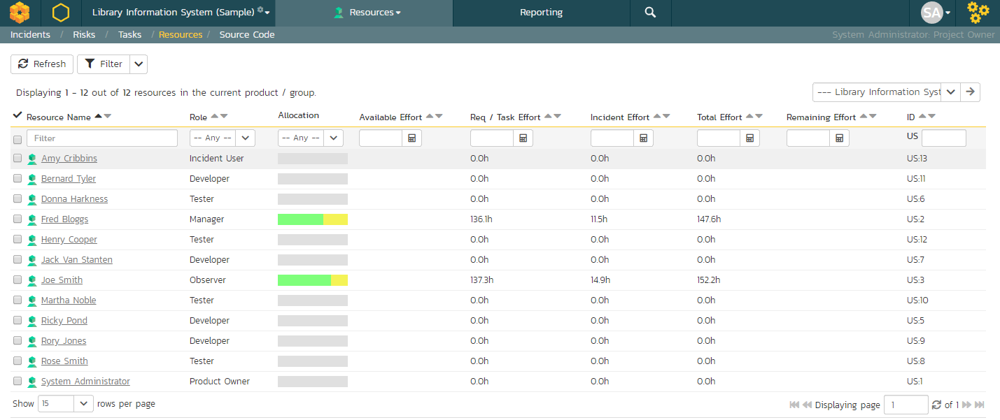
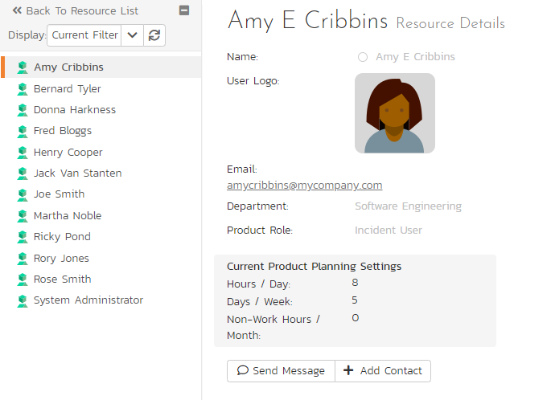
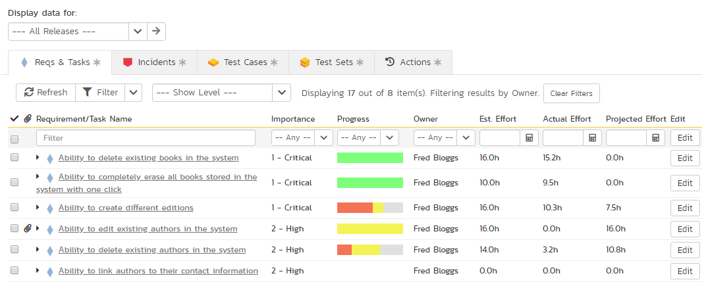
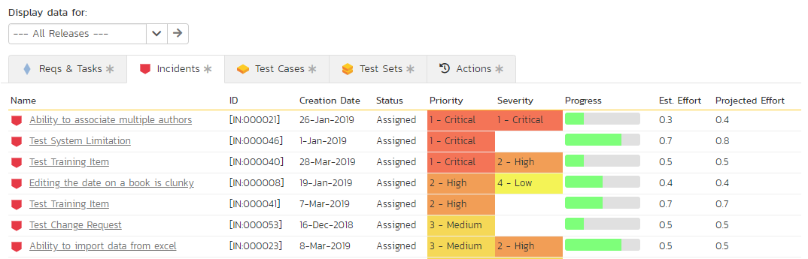
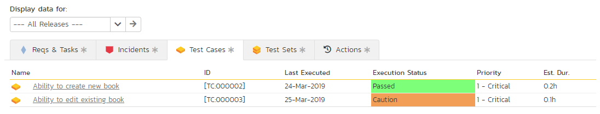
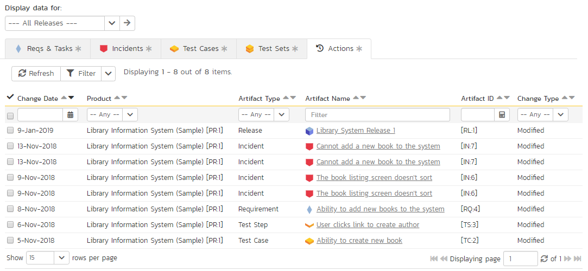

# Resource Tracking

This section outlines how you can use the Resource Tracking features of SpiraPlan® and SpiraTeam® to view the total workload for each of the product personnel resources assigned to a specific product. This allows you to verify that the work is evenly distributed amongst the product members and that no individual resource is overloaded.

When you click Tracking \> Resources on the global navigation bar, you will initially be taken to the product resources list screen illustrated below:

This screen lists all the personnel (product resources) that belong to the current product together with the total value of the projected effort of all the work assigned to them, the available effort based on the length of the current release/sprint, and the remaining effort (the difference between the previous two values). The effort is shown for tasks and incidents as well as a total of the two together.

Using the dropdown on the far right, you can display the workload:

-   For the product as a whole (as above).

<!-- -->

-   For a specific release (including all child sprints)
-   For a specific sprint

You can also display the workload for the entire program by selecting the program from the product/program selector from the navigation bar

There is a colored progress bar column called "Allocation" that graphically illustrates the % of the person's available effort that has been scheduled. If a person is over-scheduled, this bar will turn red. In addition, if any product resources have been assigned more work that they have time to complete during the length of the release/sprint, the background color of the remaining effort value will be also be colored in red, indicating that you need to offload some of the work to other product resources.

Clicking on a resource name will take you to the Resource Details page.

The toolbar also lets you:

- [download the list to a CSV file](Application-Wide.md/#download-as-csv)

## Resource Details

The resource details page will show you what artifacts a resource has been assigned, and time values for the items. A small panel on the left will show current configured values for the product for \# of hours per workday, \# of days per week, and how many non-work hours per month there are.

There are two options related to the instant messenger beneath the user's avatar. When you click the "***Send Message***" button it will open up a new instant message window to start a conversation with the selected resource. If the resource is not a contact of the current user, clicking the "***Add Contact***" button adds the selected resource to the user's
'My Contacts' list on the 'My Page' dashboard. Similarly if the resource is already a contact of the current user, clicking 'Remove Contact' will remove the resource as a contact.

Tabs along the bottom will show assigned requirements and tasks, incidents, test cases, test sets and recent actions. The views for each item are a subset of available columns, to show progress and completion information for all items listed. Clicking on an artifact's name will take you to the artifact details page. The data in all of these tabs can be filtered by all releases, by a release and its children, or by a specific sprint.

### Reqs & Tasks

This tab displays the list of requirements and child tasks that are assigned to the current resource:

### Incidents

This tab displays the list of incidents that are assigned to the current resource:

### Test Cases

This tab displays the list of test cases that are assigned to the current resource:

### Test Sets

This tab displays the list of test sets that are assigned to the current resource:

### Actions

This tab displays the list of recent actions make by the user in the product. It lets you quickly see all the changes they have made:

This can be useful when auditing the changes made by a specific user.