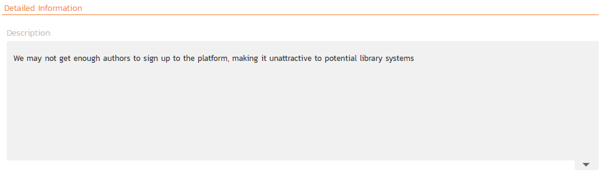

# Risks Management

This section outlines the risk management features of SpiraPlan® (not available in SpiraTest or SpiraTeam) and how they can be used to help understand, track, and mitigate risks across your products. The expected principle ways of managing risks is through assigning values to each risk's probability and impact. These two fields, multiplied together, represent the potential (negative) exposure from the risk: a highly likely risk that would have a large impact has a higher exposure (and should be managed with a higher priority) than an unlikely risk which will not have much real world impact.

## Risks List

When you click on the Tracking \> Risks global navigation link, you will initially be taken to the risks list screen illustrated below:

The risk list screen displays all the risks entered for the current product, in a filterable, sortable grid. The grid displays the risk number together with fields such as risk type (schedule, financial, etc.), status (open, evaluated, etc.), probability, impact, and exposure (calculated from the probability and impact). The choice of columns displayed is configurable per-user, per-product, giving extensive flexibility when it comes to viewing and searching risks.

The sidebar on the left gives you quick access to saved filters, along with useful charts to get an at-a-glance view of risks for this product.

In addition, you can view a more detailed description of the risk (along with any mitigations) by positioning the mouse pointer over the incident name hyperlink and waiting for the popup "tooltip" to appear. If you click on the risk name hyperlink, you will be taken to the [risk details](#risk-details) page. Clicking on any of the pagination links at the bottom of the page will advance you to the next set of risks in the list according to the applied filter and sort-order. There is also a drop-down-list at the bottom of the page which allows you to specify how many rows should be displayed in each page, helping accommodate different user preferences.

### Filtering & Sorting

Read about [how to create and manage filters, and how to sort the artifact list](Application-Wide.md#filtering).

### New Risk

Clicking on the "***New Risk***" button takes you to the new risk screen. This is essentially the same screen as the [risk details](#risk-details) screen except, depending on how the workflow has been configured for your product, certain fields may be disabled. For more details on setting and up configuring workflow for your product, please refer to the *SpiraTest Administration Guide*.

### Delete

Clicking on the "***Delete***" button deletes the risk(s) whose check-boxes have been selected in the risk list.

### Refresh

Clicking on the "***Refresh***" button simply reloads the list of risks; this is useful when new risks are being added by other users, and you want to make sure you have the most up-to-date list displayed.

### Show / Hide Columns

This drop-down list allows you to change the fields that are displayed in the risk list as columns for the current product. To show a column that is not already displayed, select that column from the list of "Show..." column names and to hide an existing column, select that column from the list of "Hide..." column names. This is stored on a per-product basis, so you can have different display settings for each product you are a member of. The fields can be any of the built-in fields or any of the custom properties set up by the product owner.

### Edit

Each risk in the list has an "***Edit***" button display in its right-most column. When you click this button or *double-click*
on any of the cells in the row, you change the item from "View" mode to "Edit" mode. The various columns are made editable, and "***Save***" buttons are displayed in the last column:

If you click "***Edit***" on more than one row, the "***Save***" buttons are only displayed on the first row, and you can make changes to all the editable rows and then update the changes by clicking the one "***Save***" button. Also, if you want to make the same change to multiple rows (e.g. to change five risks from "Resolved" status to "Closed"), you can click on the "fill" icon to the right of the editable item, which will propagate the new value to all editable items in the same column.

If you want to edit lots of items, first select their checkboxes and then click the "***Edit***" button on the same row as the Filters and it will switch all the selected items into edit mode.

When you have made your updates, you can either click "***Save***" to commit the changes, or "***Cancel***" to revert back to the original information. Alternatively, pressing the <ENTER\> key will commit the changes and pressing the <ESCAPE\> key will cancel the changes.

### Cloning Risks

To create a clone of an existing risk or set of risks, select the check-boxes of the risks you want to copy and then click Edit  "**Clone**". This makes a copy of the current risk with '... - Copy' added at the end of its name. When cloning the risks please be aware of the following:

- file attachments are copied
- risk mitigations are cloned
- tasks associated to the risk are also cloned and associated to the new risk
- an association between the original risk and cloned risk is created

### Exporting Risks

Read about [how to export artifacts from one product to another](Application-Wide.md#export-to-another-product).

### Printing Items

To quickly print a single risk or list of risks you can select the items' checkboxes and then click Tools \> Print Items. This will display a popup window containing a printable version of the selected items. You can also save the report in a variety of common formats from the same Tools menu.

## Risk Details

When you click on a risk item in the [risks list](#risks-list), you are taken to the risk details page illustrated below:

This page is made up of *three* areas;

1.  the left pane displays the risks list navigation;
2.  the right pane's header, which displays: the operations toolbar; the editable name of the selected risk; and the info bar (with a shaded background), which also contains the workflow status transitions (see below); and
3.  the right pane's tabbed interface with rich information related to the risk.

Please note that on smaller screen sizes the navigation pane is not displayed. While the navigation pane has a link to take you back to the risks list, on mobile devices a 'back' button is shown on the left of the operations toolbar.

The navigation pane can be collapsed by clicking on the "-" button, or expanded by clicking anywhere on the gray title area. On desktops the user can also control the exact width of the navigation pane by dragging and dropping a red handle that appears on hovering at the rightmost edge of the navigation pane.

The navigation pane shows a list of the peer risks to the one selected. This list is useful as a navigation shortcut; you can quickly view the coverage information of all the peer risks by clicking on the navigation links without having to first return to the risks list page. The navigation list can be switched between three different modes:

-   The list of risks matching the current filter
-   The list of all risks, irrespective of the current filter
-   The list of risks assigned to the current user
-   The list of risks detected by the current user

The bottom part of the right pane can be switched between four views:
"Overview", "Tasks", "Attachments", "History", each of which will be described in more detail below.

### Emailing

Read about [emailing a document to colleagues using Spira](Application-Wide.md#emailing).

### Followers

Read about [how to add and manage followers to an artifact](Application-Wide.md#followers).

### Workflows

Read about [using workflows to change the status of your artifact](Application-Wide.md#workflows).

### Overview - Details

The Overview tab is divided into a number of different sections. Each of these can be collapsed or expanded by clicking on the title of that section. It displays the description, fields and comments associated with the risk.

The top part of this tab displays the various standard fields and custom properties associated with the risk. Fields (both standard and custom) are grouped under the collapsible headings (marked by orange text and underline) in the screenshot below. For instance, all fields regarding dates are grouped together in the "Dates and Times" area.

### Overview -- Detailed Information

The Detailed Information section contains the long, formatted description of the risk, as well as any rich text custom fields. You can enter rich text or paste in from a word processing program or web page into these fields. Clicking on the shaded areas of one of these detailed fields will display the rich text toolbar.

### Overview -- Mitigations

The mitigations section is where you can enter information about any plans or ideas about how the risk in question can be mitigated, in other words how its impact or probability can and/or will be lowered. The list of mitigations displays the position number, and the description, and date fields.

Clicking on the "***Add***" button inserts a new mitigation *before* the currently selected (by means of the check-box) step. Clicking the "***Add***" button without selecting an existing step will insert a new mitigation at the end of the list. When a new mitigation is inserted, its fields are displayed in "Edit" mode, so the description and review date fields are editable, allowing you to enter the data:

To move the mitigations around in the list, click and hold on the mitigation you want to move and drag it to the location desired.

If at least one mitigation is selected (using the checkboxes on the left-hand side), then clicking "***Clone***" will clone those mitigations and add them to the bottom of the list.

### Overview - Comments
Read about [how the comments works](Application-Wide.md#comments)

### Tasks

This tab shows the list of product tasks that need to be completed for the risk to be properly managed/mitigated:

Each of the tasks is displayed together with, by default, its name, description (by hovering the mouse over the name), progress, priority, start-date, current owner, estimated effort, projected effort and numeric task identifier. Clicking on the task name will bring up the
[Task Details page](../Task-Tracking/#task-details). This allows you to edit the details of an existing task.

You can perform the following actions on a task from this screen:

- **New Task**: inserts a new task in the task list with a default set of values. The task will be associated with the current risk.
- **Remove**: removes the task from this risk without actually deleting the task
- **Delete**: click the arrow next to the Remove button to show the option of completetly deleting the task 
- **Refresh**: updates the list of tasks from the server, useful if other people are adding tasks to this risk at the same time.
- **Filter / Apply Filter**: Applies the entries in the filter boxes to the list of tasks
- **Clear Filters**: clears the current filter, so that all tasks associated with the current risk are shown.
- **Clone**: clones the selected tasks. The new tasks will have the same release, requirement, and task assigned to them as the originals
- **Edit**: clicking the "***Edit***" button to the right of the task allows you to edit the task inline directly on this screen. Only columns visible will be editable.
- **Show/Hide Columns**: allows you to choose which Task columns are visible

Note that if you create a new task on the risks page, the component, release/sprint, and owner are automatically copied from the parent risk. You can change these suggested values before clicking "***Save***"

### Attachments

Read about [how the attachments tab works](Application-Wide.md#attachments)

### Associations

You can associate other risks, incidents, test cases, and requirements to a risk from this tab. Read more about [how to manage and add associations to this artifact](Application-Wide.md#associations)

- **Risks associated with requirements**: document and track all the risks associated with a specific feature or requirement in SpiraPlan. For example, a new authentication module might have security risks associated with it, or a new reporting feature might have technical risks associated with it. This is one of the most important associations you can create in SpiraPlan, since it lets you document the risks associated with changes you plan on making.
- **Risks associated with test cases**: this is useful when one of the outcomes of the risk analysis and treatment is the need to perform tests to determine the probability or impact. For example, a risk around system performance might be linked to series of performance, load and stress tests that you need to carry out to understand how serious the risk is. 
- **Risks associated with incidents**: this is useful for two main purposes. First, you may have an identified risk that comes to pass and is now actually an issue rather than a risk. In this case you will close the risk and convert it to an issue, which will remain linked to the original risk. Second, whenever you make a change to the system, from a bug being fixed, enhancement being implement or change request being acted upon, you will have a risk of side effects. In this case, you will want to link the risk to the incident.
- **Risks associated with other risks**: this can be used for cases where one risk is dependent on another (if this happens, then that could also happen) or if they are just connected (this technical risk is similar to this other technical risk).

### History

Read about [how the history tab works](Application-Wide.md#history)