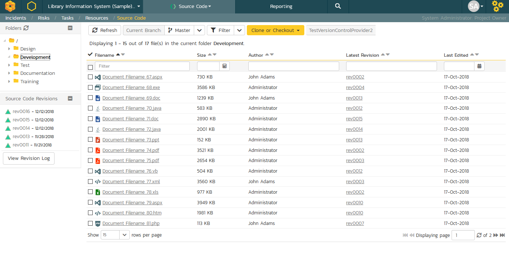
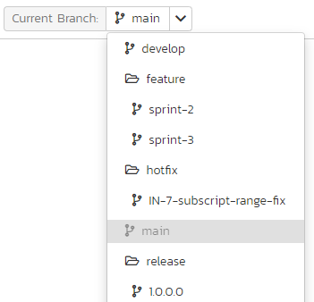
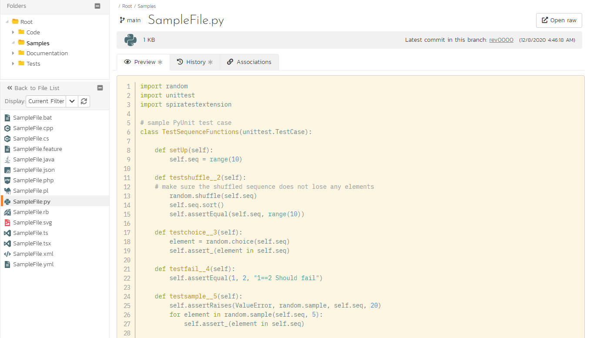
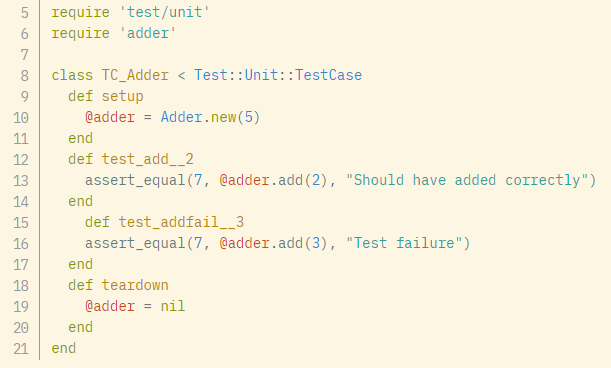
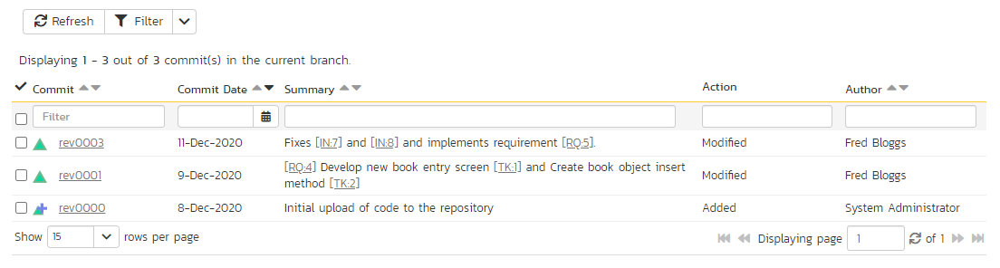
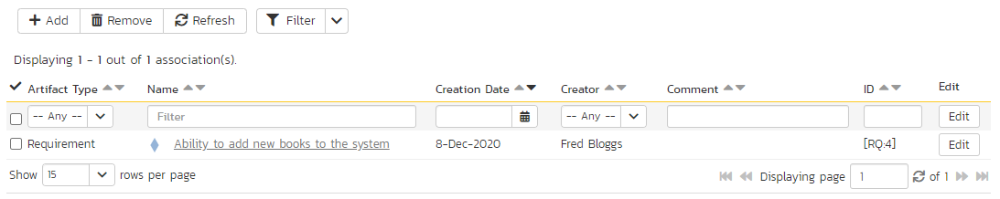

# Source Code
SpiraTeam®'s and SpiraPlan®'s source code integration features let you browse the source code associated with a particular product and link source code commits and specific source code files to SpiraPlan artifacts. Product members can quickly view files in the repository right from within SpiraPlan to see the end-to-end traceability from requirements, tasks, incidents, and more.

SpiraPlan integrates with many different source code / Software Configuration Management (SCM). You can connect SpiraPlan and your source code using Inflectra's cloud-hosted  [TaraVault](../../TaraVault-User-Manual/Activating-TaraVault/) or plugins for the different SCM's (including [Git](../../Version-Control-Integration/Integrating-with-Git/) and [Subversion](../../Version-Control-Integration/Integrating-with-Subversion/)). 

This section outlines SpiraPlan's source code features, whatever type of source code provider you are using. 

## Getting Started With Source Code 
To use the source code features in SpiraPlan you need to do 3 things:

1. a system administrator has setup the source code provider (for example, [Git](../../Version-Control-Integration/Integrating-with-Git/#configuring-git-in-spiraplan))
2. a system administrator has activated source code for the product and a product or system admin has configured source code for the product (for example, using [Git](../../Version-Control-Integration/Integrating-with-Git/#use-git-for-your-product))
3. SpiraPlan users have a [role](../../Spira-Administration-Guide/System-Users/#view-edit-product-roles) that lets them view source code (and commits) in the application. 

Once these steps are complete, the source code will be viewable within SpiraPlan. The rest of this section assumes these steps have all been taken.

## Troubleshooting Source Code Integration
Integration with a source code provider can sometimes not work as you expect:

- When you first view the source code or commits, this starts the process of generating the data to display. It may take several minutes for this data to properly load. You will see a message on the page explaining that the 'cache' is building. Please refresh the page after a few minutes and try again.
- If SpiraPlan does not display the login page, look for an error message (either on the page or in the Application Event Log) that says "Could not load file or assembly". If you get this error, it is probably because the source code provider dll or some of its dependent assemblies are not in the correct folder of the SpiraPlan installation. If you installed these yourself, make sure you are using the correct 32 bit or 64 bit version of the files. Download the correct version > from the Inflectra website, and overwrite the files in the > VersionControl folder.
- If SpiraPlan reports that the source code login information is incorrect, double check the source code settings (at the system admin level and for the specific product). Note, product settings over-ride system level settings for source code. Make sure the login information is correct and that the user specified can access to all branches of the source code.

## Source Code File List
When you click on Developing \> Source Code on the global navigation bar, you will be taken to the source code repository file list screen. This shows you all file in the current folder and the current branch. You can change the branch, sort and filter this list, or browse the different pages of files (up to 500 files can be displayed on the page at any one time).

This screen consists of two sections:

1. The left-hand pane shows the various folders that exist in the source code repository for the currently selected branch. Clicking on the expand icon will expand the child folders and clicking on the name of the folder will display its files in the main pane to the right.
2. The main right-hand pane shows a list of all the files in the currently selected folder. This list can be filtered and sorted, and you can choose how many rows to display on the page at once.

Above the list of files is the action toolbar. This lets you perform the following functions:

- Refresh the list of files to see any recent updates
- The **branch selector** lets you choose which branch[^old-scm] in the source code repository to view. This is stored for your user across the whole product, which means that you will see information for this same branch in other relevant places - eg when viewing files, when viewing commits, or on Product Home Page widgets. An example of the branch selector is shown below.
- Filter buttons to apply or clear the current filter
- Clone or Checkout information so you can see, if permitted, the url of the source code remote along with potentially other connection information
- The type of source code provider active for this product

For each file you can see the following information (you can sort or filter on all of these):

- Name - click on this to view the details for this file, and hover over the name to see a tooltip of the full filename and filepath
- Size
- Author (this is the most recent author - the person who made the most recent commit that changed this file in the current branch)
- Latest Commit - click to view details about the specific commit (this is the most recent commit that changed this file in the current branch)
- Last edited date - this is the date of the latest commit and if you hover over the date you will see a tooltip showing the date and time

[^old-scm]: Some older source code management systems (e.g. CVS, Visual SourceSafe) do not have the formal concept of branches, so the dropdown list will simply list the one main branch (usually called "Trunk").

## Source Code File Details
When you click on a file in the source code file list, you open the file details page for that file. This page shows you information about the file, its commit history, and where relevant a file preview. It also shows you links to other relevant files, commits, or artifacts. 

The page is made up of three areas:

1. the top of the left-hand pane shows the various folders that exist in the source code repository for the currently selected branch
2. the bottom of he left-hand pane has a link back to the list page and shows files in the folder selected in the pane above it (you can choose to see all files in the folder or only those that match the filter set on the file list page). Together with the pane above, you can quickly navigate across the source code folders and files and see detailed information about any file
3. the right-hand pane shows detailed information about the file. This pane is discussed more below.

The detailed information available at the top of the page is the:

- folder path of the file
- currently selected branch (useful to know what version of the file you are looking at)
- name of the file, along with its file extension
- A link to open or download the raw version of the file as it is/was at the most recent commit of the current branch
- icon for the file type
- file size
- identifier of the latest commit for this file (in the current branch) and a link to the [detailed page](../Commits/#commit-details) for that commit
- date and time of the above commit

There are 3 tabs on this page that each show additional information about the file. These are discussed below.

### Preview
This shows, where possible, a preview of the file. Image files are previewed, as are text files (for example, code), and markdown files (as HTML rendered previews). For code, syntax highlighting is applied based on the code file type (using the file extension) and line numbers are also shown.

Note that if you save a file with an incorrect extension (e.g. using .txt for a JavaScript file) it may not display the correct color-coding.

### History
This shows the full commit history for that file in the current branch. The list of commits is paginated and up to 500 rows of commits can be shown at one time. You can also filter this list of commits. 

Each commit is displayed with:

- its name/identifier - clicking on the commit identifier will open the [Commit File Details](../Commits/#commit-file-details) page for that file at that specific commit
- the date of the commit (hovering over this date will show a tooltip with the date and time)
- its commit message (or summary) - any artifact tokens (eg "[IN:7]") in the message are clickable and will open the details page for that artifact
- the type of action that was done to the file (eg added, or modified),
- the name of the person who made the commit

### Associations
This shows all current associations between this file and any artifacts in SpiraPlan. This lets you to see which requirements, test cases, incidents, tasks, etc. are linked to the file. Clicking on the artifact name will take you to the appropriate artifact page (assuming your user has permissions to access that information)

You can also add artifact associations to many other artifacts in the system from this panel. Read more about [how to manage and add associations to this artifact](Application-Wide.md#associations)

## Source Code Revision List 
Updated documentation is [here](../Commits/#commit-list).

## Source Code Revision Details 
Updated documentation is [here](../Commits/#commit-details).