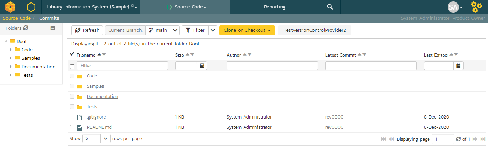

# Source Code

This section outlines the source code integration features of SpiraPlan®
and SpiraTeam® that can be used to browse the source code repository associated with a particular product and link artifacts in SpiraPlan to commits made in the source code repository. This functionality allows product members to quickly view files in the repository through a convenient web interface and also to see the end-to-end traceability from requirements, tasks and incidents to the code changes that addressed the requirement, fulfilled the task or resolved the incident

The software can be integrated with a variety of different version control / Software Configuration Management (SCM) systems by means of different plug-ins. This section will outline the general features irrespective of the type of version control provider being used. For details on using a specific provider (e.g. Subversion) please refer to the separate *SpiraPlan/Team Version Control Integration Guide*. This section also assumes that an administrator has already configured the product to be integrated with the version control provider. The steps for using the administrative interface are described in the separate *SpiraPlan Administration Guide*.

## Source Code File List

When you click on Tracking \> Source Code on the global navigation bar, you will be taken to the source code repository file list screen illustrated below:

This screen consists of three main sections:

The top left-hand pane displays a hierarchical list of the various folders that exist in the source code repository. Clicking on the expand icon will expand the child folders and clicking on the name of the folder will display the list of files in the folder in the main pane to the right.

The main right-hand pane displays a list of all the files contained within the currently selected folder. This list can be filtered and sorted, and you can choose how many rows of documents to display on the page at one time.

The bottom left-hand pane contains a list of the most recent commits, together with the option to view the overall commit log for the product, clicking on that will display the [commit log page](../Commits/#commit-list).

Above the main right-hand pane, there is the **branch selector**. This lets you choose which branch in the source code repository is being viewed:

Some older source code management systems (e.g. CVS, Visual SourceSafe) do not have the formal concept of branches, so the dropdown list will simply list the one main branch (usually called "Trunk").

## Source Code File Details

When you click on a file in the source code file list described above, you are taken to the file details page illustrated below:

This page is made up of three areas; the left pane is for navigation, the upper part of the main pane contains information regarding the file, and the bottom part of the right pane contains **three tabs** that display a preview of the file (if textual), the list of file commits stored in the version control system, and a list of associated artifacts.

The navigation pane consists of a link that will take you back to the source code file list, as well as a list of other files in the current folder. This latter list is useful as a navigation shortcut; you can quickly view the detailed information of all the peer files by clicking on the navigation links without having to first return to the main file list page.

The top part of the main pane allows you to view the details of the particular file in the version control system. Clicking on the "Source Code File" hyperlink will open the file in a separate window, and depending on the type of file, it may display in the page or prompt you to download it to your local computer. The "Latest Commit" hyperlink allows you to view [details of the latest commit](../Commits/#commit-details).

The lower part of the main pane can be switched between the three different views by clicking the appropriate tab. Initially the pane will be in "Preview" mode, but it can be switched to "commits", or "Associations" as well. The functionality in each of these views is described below:

### Preview

This view is only available for files that are textual and it will display the contents of the file inside the tab, with the text color-coded to match the syntax of the programming language it is written in:

The syntax highlighting is based on the file type and file extension, so if you save a file with an incorrect extension (e.g. using .txt for a JavaScript file) it may not display the correct color-coding. For text files that are not for a specific programming language, it will simply display as plain text

### Commits

This view displays the list of commits that have been committed for the current file:

Each commit in the list is displayed with its name, the name of the person who made the commit, a description of what was changed, the date the change was made and two flags that denote whether the content was changed and/or if any of the properties of the file were changed. Clicking on the commit name will take you to the [appropriate commit details page](../Commits/#commit-details).

### Associations

This view displays a list of the SpiraPlan artifacts in the current product that are associated with the current file. This allows you to see which requirements, test cases, incidents, tasks, etc. are linked to the file. Clicking on the hyperlink for the artifact will take you to the appropriate artifact page inside the product (assuming your user has permissions to access that information).

In addition, you can use the "***Add New Association***" button to add a new association from the current source code file to an existing artifact in SpiraTeam:

To add the association, you just need to select the type of artifact being associated (requirement, test case, incident, etc.) and the numeric ID of the artifact and then click the "***Add Association***" button.

For example, to add an association to Requirement RQ00005 you would choose Artifact Type = Requirement and Artifact ID = 5.

## Source Code Revision List 
Updated documentation is [here](../Commits/#commit-list).

## Source Code Revision Details 
Updated documentation is [here](../Commits/#commit-details).