# Task Tracking
| Artifact icon and name                              | Token | Description                                                                                                                                            |
| --------------------------------------------------- | ----- | ------------------------------------------------------------------------------------------------------------------------------------------------------ |
|  &nbsp; Task                | TK    | Manage small pieces of work with tasks, especially useful against requirements <span class="pill">SpiraTeam</span> <span class="pill">SpiraPlan</span> |
|  &nbsp; Task (pull request) | TK    | Review pull requests in Spira <span class="pill">SpiraTeam</span> <span class="pill">SpiraPlan</span>                                                  |

## Feature Overview and Tips
A task is a single piece of work. Tasks are flexible and can be used for lots of different activities. If you link tasks to a specific release or sprint, you can easily see the progress of all tasks in that release - this makes tasks a very powerful part of release management. You can break down [requirements](Requirements-Management.md/#tasks) or user stories into smaller chunks of work using tasks, to more easily divide up and manage the work.

Tasks have time tracking features so a user can record the expected time required to complete a task, as well as the actual time spent. 

=== "Tips and Tricks"
    - Adding tasks to a requirement helps you break down the work into smaller chunks and divide things up amongst the team
    - The easiest way to link a task to a requirement is from the requirement itself (from the task tab), but you can link an existing task to a requirement from the task details page
    - If enabled for a product, testers can create tasks for developers to work on, for issues they find during testing
    - You can make tasks that are not linked to any other work if you want to
    - [Pull requests](Pull-Requests.md) are a special type of task that help you track and manage requests to merge one branch into another, from within Spira
    - A task's "component" is not editable. This is because it is derived from its associated requirement.
    - Task statuses are not configurable by administrators

=== "Key Artifact Links"
    - **Releases**: a task can be added to a single release and the tasks linked to a release are used to determine the release's task progress
    - **[Requirements](Requirements-Management.md/#tasks)**: break down a requirement into smaller task and use the tasks to track a requirement's task progress
    - **[Test Cases](Test-Execution.md/#tasks)**: you can create tasks during test execution and track their progress against the test case (just like you can with test cases and incidents)

=== "Association Chart"
    ``` mermaid
    graph TD
    TK{{"`**Task**`"}} --> RL(Release);
    TK --> RQ(Requirement);
    TK --> IN(Incident);
    TK <-.-> TK2(Other tasks);
    TK -.-> TC(Test Case);
    SC(Source code commits) -.-> TK;
    ```

## Task List
When you click on the Tracking \> Tasks global navigation link, you will initially be taken to the tasks list screen illustrated below:

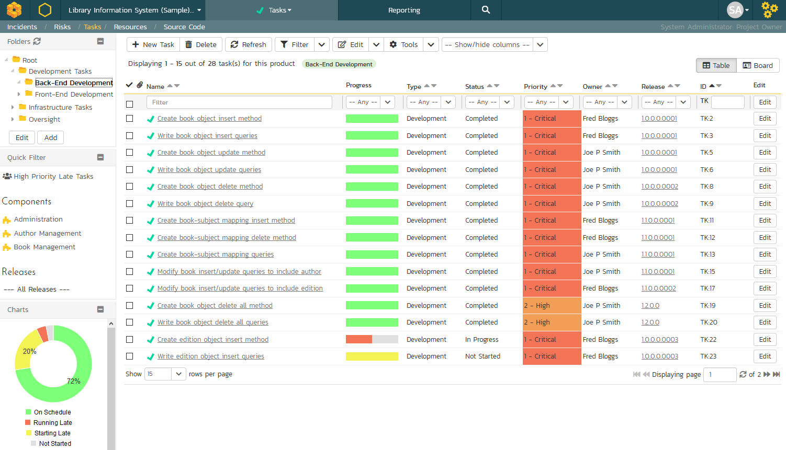

The task list screen displays all the tasks entered for the current product by folder, in a filterable, sortable grid. The grid displays the task number together with fields such as priority, name, assigned owner, start date, end date, scheduled release, etc. The choice of columns displayed is configurable per-user, per-product, giving extensive flexibility when it comes to viewing and searching tasks.

In addition, you can view a more detailed description of the task by positioning the mouse pointer over the task name hyperlink and waiting for the popup "tooltip" to appear. If you click on the task name hyperlink, you will be taken to the [task details page](#task-details) Clicking on any of the pagination links at the bottom of the page will advance you to the next set of tasks in the list according to the applied filter and sort-order. There is also a drop-down-list at the bottom of the page which allows you to specify how many rows should be displayed in each page, helping accommodate different user preferences.

### Task Progress

One special column that is unique to tasks is the 'progress indicator'. This illustrates graphically both the percentage completion of the task and also if the task is either starting late or finishing late. The following table illustrates the different type of status that can be conveyed by the indicator:

| Indicator Display              | Progress Description                                                                                                                                   |
| ------------------------------ | ------------------------------------------------------------------------------------------------------------------------------------------------------ |
|  | Task has not yet started, but the scheduled start date is still in the future.                                                                         |
|  | Task has not yet started, and the start date has elapsed. This is considered a 'Late Starting Task'                                                    |
|  | Task has started, and is approximately 25% complete. The scheduled end date is still in the future.                                                    |
|  | Task has started, and is approximately 50% complete. However the scheduled end date has elapsed already. This is a considered a 'Late Finishing Task'. |
|  | Task has been 100% completed.                                                                                                                          |

Essentially, the gray section of the bar indicates the % of the task yet to be completed, and the green/red section of the bar indicates the % of the task that has already been completed. If the bar changes from green to red it means that the end date has been reached and the task is not yet complete, and if the background changes from gray to yellow it means that the task has not yet started, but the scheduled start date has passed.


### Task Folders

SpiraPlan lets you group product tasks into different folders to make organization easier. In the left-hand **Quick Filters** panel, the system displays the various task folders defined in the product:

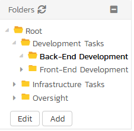

If you are a product administrator, you will see the 'Edit' and 'Add'
buttons beneath the folder tree, this lets you add, edit and delete task folders in the product. To add a new folder, click the 'Add' button:

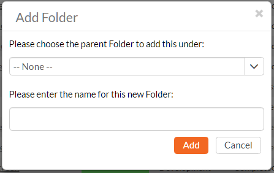

Choose the parent folder that you want to add the new folder under (or None if you are adding a new top-level folder) from the dropdown list and then enter the name of the new folder. Then click
'***Add'*** to save the new folder.

To edit or delete an existing folder, click the "***Edit***" button to switch the folder tree to edit mode. To edit or delete a specific folder, click on the "***Edit***" button next to the folder. When you attempt to delete a folder you will need to type in a confirmation to proceed.
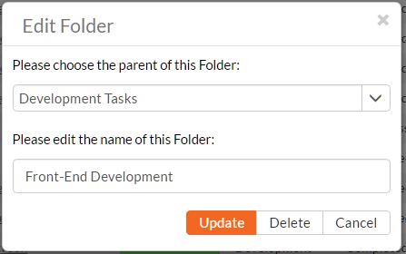

You can change the parent folder and/or name of the folder and click "***Update***" to commit the change or click "***Delete***" to delete the folder entirely.

To move a task / tasks between folders, click and drag the relevant task/tasks from the table on the right, and drag them over the desired folder in the tree view on the left. The destination folder will be highlighted to show where the task will be placed.[^folder-url]

[^folder-url]: when navigating to folders (for all artifacts that support them), the URL in your browser's address bar will change. Each folder has a unique, sharable URL that you can give to someone to display the list of artifacts with the appropriate folder selected. You can also open up multiple folders in different browser tabs and easily toggle between them from the same browser.

### Actions
- **Filtering & Sorting**: Read about [how to create and manage filters, and how to sort the artifact list](Application-Wide.md#filtering).
{: #filtering-sorting}
- **New Task**: Clicking on the "***New Task***" button creates a new task in the grid with an initial set of information. You can click on the name of the task to edit its information.
{: #new-task}
- **Delete**: Clicking on the "***Delete***" button deletes the tasks whose check-boxes have been selected in the task list.
{: #delete}
- **Refresh**: Clicking on the "***Refresh***" button simply reloads the list of tasks; this is useful when new tasks are being added by other users, and you want to make sure you have the most up-to-date list displayed.
{: #refresh}
- [download the list to a CSV file](Application-Wide.md/#download-as-csv)
- **show-hide-columns**: This drop-down list allows you to change the fields that are displayed in the task list as columns for the current product. To show a column that is not already displayed, simply select that column from the list of "Show..." column names and to hide an existing column, simply select that column from the list of "Hide..." column names. This is stored on a per-product basis, so you can have different display settings for each product that you are a member of. The fields can be any of the built-in fields or any of the custom properties set up by the product owner.
{: #Show / Hide Columns}
- **Cloning Tasks**: To create a clone of a task, a set of tasks, or a folder of tasks, select the check-boxes of the tasks you want to clone and then click "***Clone***". This will make a clone of the current task in the current folder with its name changed to add " - Copy" added to the end, to distinguish itself from the original. When cloning a folder of tasks, only the folder name gets changed. When cloning tasks note that:

- all standard fields (like status and owner) are cloned
- description (with formatting) are cloned
- remaining effort and execution progress are cloned
- any associated requirement is cloned
- file attachments are cloned
- followers, comments, and history are *not* cloned

{: #duplicating-tasks}
- **Exporting Tasks to Another Product**: Read about [how to export artifacts from one product to another](Application-Wide.md#export-to-another-product).
{: #exporting-tasks-to-another-product}
- **Printing and Saving Items**: To quickly print a single task, a list of tasks, or a folder of tasks you can select the items' checkboxes and then click Tools \> Print Items. This will display a popup window containing a printable version of the selected items. You can also save the report in a variety of common formats from the same Tools menu.
{: #printing-and-saving-items}


### Edit
Each task in the list has an "***Edit***" button display in its right-most column. When you click this button or just click on any of the cells in the row, you change the item from "View" mode to "Edit" mode. The various columns are made editable, and "***Save***" buttons are displayed in the last column:

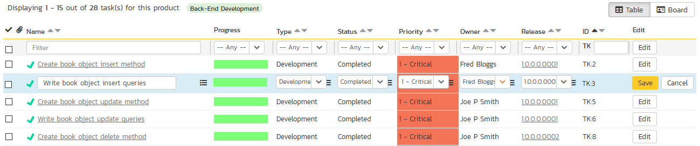

If you click "***Edit***" on more than one row, the "***Save***" buttons are only displayed on the first row, and you can make changes to all the editable rows and then update the changes by clicking the one "***Save***" button. Also, if you want to make the same change to multiple rows (e.g. to change five tasks from "Not Started" status to "In Progress"), you can click on the "fill" icon to the right of the editable item, which will propagate the new value to all editable items in the same column.

If you want to edit lots of items, first select their checkboxes and then click the "***Edit***" button on the same row as the Filters and it will switch all the selected items into edit mode.

When you have made your updates, you can either click "***Save***" to commit the changes, or "***Cancel***" to revert back to the original information. Alternatively, pressing the <ENTER\> key will commit the changes and pressing the <ESCAPE\> key will cancel the changes.


## Task Additional List Views
There are two additional task list views. These views are:

2. Task Board
1. Gantt chart view

You can pick between each of these views using the view selection button group at the top right of any requirement list page.

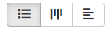


## Task board
!!! info "Task Board Overview"
    
    The SpiraPlan task board is a streamlined and highly customizable "kanban" style board. It lets you visualize tasks in a single place across a product. Based on the principles of **agile methodologies** such as Scrum and Kanban, the task board is a great tool for planning and managing tasks.

    To learn more about how boards in Spira are structured and their general features refer to our [board overview](Application-Wide.md/#boards). Here you can learn about:

    - [board structure and configuration](Application-Wide.md/#board-structure)
    - [special board views](Application-Wide.md/#special-board-views) 
    - [working with board cards](Application-Wide.md/#board-cards) 

    **Specific features of or differences in the task board are discussed more fully below**.

### Board configuration
The task board configuration button has a number of options to configure the board to your needs. 

The [releases dropdown](#release-options) can be set to either "all releases" or a specific release. The dropdown shows all open releases and sprints.The table below shows what options are available, when. Certain configuration are discussed in more detail in subsequent sections:

| View options | All releases                                        | A specific release or sprint                                                |
| ------------ | --------------------------------------------------- | --------------------------------------------------------------------------- |
| **Columns**  | Priority<br> Release<br> Status<br> Type<br> Person | Priority<br> Release<br> Status<br> Type<br> Person<br>Parent (requirement) |
| **Rows**     | Priority<br> Release<br> Status<br> Type<br> Person | Priority<br> Release<br> Status<br> Type<br> Person<br>Parent (requirement) |
| **Grouping** | Team (if rows is person)                            | Team (if rows is person)                                                    |

The following options support showing unassigned items[^unassigned-with-group]:

- priority
- release (only when viewing "All Releases")
- parent
- person

[^unassigned-with-group]: when rows is set to either person or parent, and grouping is applied, then unassigned sections will show as normal, but the feature is more limited than usual to ensure consistency.


#### Release options
The **release dropdown** shows:

| Options                                    | Meaning                                                     | What cards will show                                                       |
| ------------------------------------------ | ----------------------------------------------------------- | -------------------------------------------------------------------------- |
| All Releases                               | All open[^open-release-definition] releases combined        | Those planned for any open release                                         |
| Any open[^open-release-definition] release | Any single open[^open-release-definition] release or sprint | Those planned for the selected release and its child sprints (if relevant) |

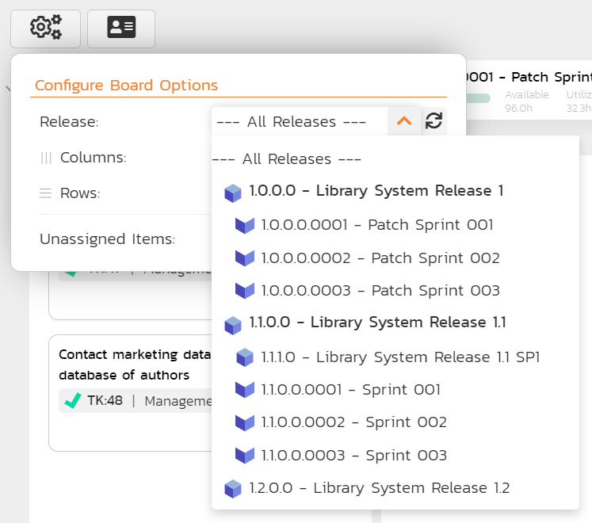


#### Customizing cards
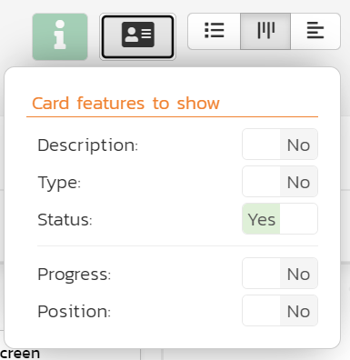

In addition to the standard [board card options](Application-Wide.md/#board-card-options), you can toggle whether to show each of the following features:

- **Progress**: a mini histogram chart of the task's progress, shown in the task progress mini section on the card (hover to see a tooltip with detailed information)

Below is an example of a task card showing all available data

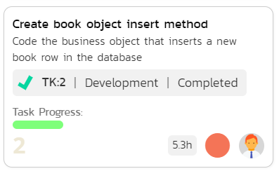


## Task Gantt Chart

This displays all active releases and sprints[^active-release] nested in the same hierarchy as on the main release list page (releases or sprints without any tasks are also shown). It also displays any task that are assigned to one of these releases.

Any release that has active children or open tasks has an expand / collapse toggle to the left of its name. This will show the child releases and/or the assigned tasks

To the right of the names is the timeline bar, which graphically shows the length of each release (blue) and task (green) between their start and end dates in individual horizontal bars. The names of the releases and tasks on the left or in the horizontal bars are clickable and will open the specific release or task.

Part of a release or task may be shaded darker than normal, from its left - this is based on how complete the release or task is.

- For releases, this represents the [requirements completion percentage](Release-Management.md/#requirements-completion) for that release. So if a release bar stretches for 3 months and 33% of its requirements are complete, the first month of the bar will be shaded darker. 
- For tasks, this represents the percentage complete of the task itself.

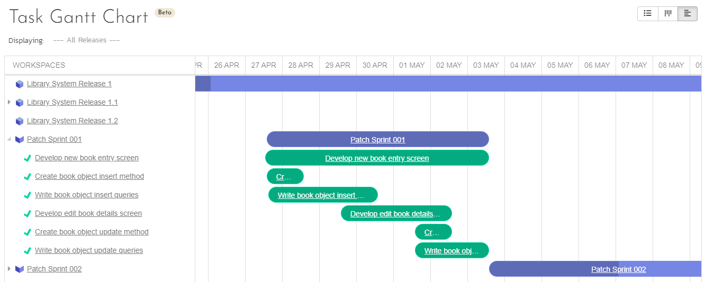

Above the Gantt chart is a toolbar that lets you:

- **refresh** the Gantt chart
- **add a new task**: users with permissions to create tasks can click the `Add` button to add a new dispaly a popup to fill in information about the new task. The new task's release is filled in if you select a release on the Gantt chart, or otherwise by the release you are filtering the page on (see below).  Click `Add Task` to add the task into the product.
- **filter the releases and tasks shown**: use the dropdown to pick a release. This shows a list of all active releases[^active-release] and syncs up with the release you set in other parts of the system (for instance on the product home page, or the reporting home page).

### Gantt Chart Inline Editing
To **view more information** about a release or task, click its name from the left hand sidebar or in the relevant Gantt bar. This will open popup with much more detail. If you ctrl/cmd+click on the artifact's name it will open the full details page for that artifact. Information shown in the popup includes all standard and custom fields. These fields are visible or hidden based on the workflow step that applies to that specific release or to that specific task.

You can **edit releases and tasks** straight from the Gantt chart. Users with bulk edit permissions for releases or tasks can edit each respective artifact (including adding a new comment) at any time by clicking on the artifact name. This opens a popup with full information about that artifact. At all times, which fields are shown, required, or hidden is based on the workflow step that applies to that specific artifact. To save any changes you must fill in all required fields. Please note: you cannot change the status in this edit mode, to do so open the artifact's detail page (you can do this from the popup by clicking the button next to the artifact's id at the top).

*Note*: only fields that users are able to edit are shown - fields that are always read only (like the creation date) are not shown in this view. 

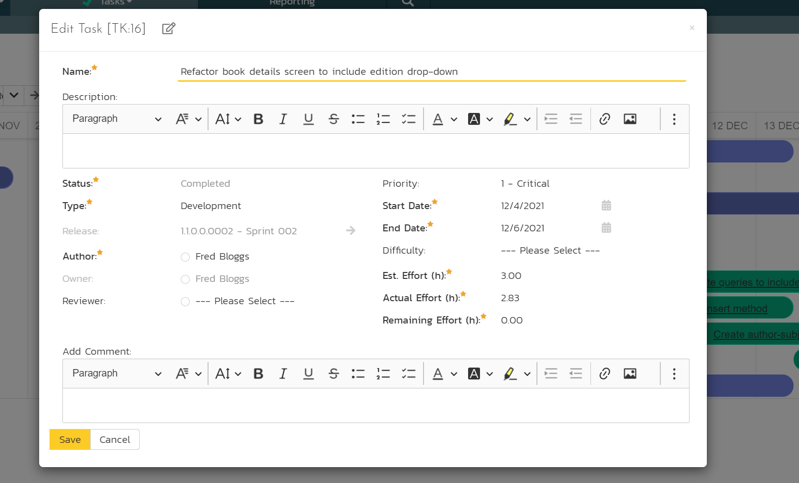

[^active-release]: any release / sprint / phase with a status that is *not* "Closed", "Deferred", or "Cancelled".


## Task Details

When you click on a task item in the lists displayed on either the main task list page or on the requirement / release details pages, you are taken to the task details page illustrated below:

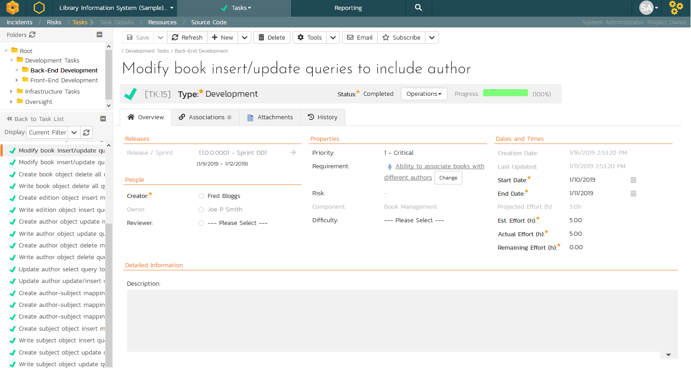

This page is made up of *three* areas;

1.  the left pane displays the tasks list navigation;

2.  the right pane's header, which displays: the operations toolbar; the [folder the task is in](Application-Wide.md#breadcrumbs); the editable name of the selected task; and the info bar (with a shaded background), which also contains the workflow status transitions (see below); and

3.  the right pane's tabbed interface with rich information related to the task.

Please note that on smaller screen sizes the navigation pane is not displayed. While the navigation pane has a link to take you back to the tasks list, on mobile devices a 'back' button is shown on the left of the operations toolbar.

The navigation pane can be collapsed by clicking on the "-" button, or expanded by clicking anywhere on the gray title area. On desktops the user can also control the exact width of the navigation pane by dragging and dropping a red handle that appears on hovering at the rightmost edge of the navigation pane.

The navigation pane consists of a link that will take you back to the task list, as well as a list of tasks, and another list of the other related tasks, nested under their parent task. This latter list is useful as a navigation shortcut; you can quickly view the peer tasks by clicking on the navigation links without having to first return to the tasks list pages. The navigation list can be switched between five different modes:

-   **Current Filter -** The list of tasks matching the current filter organized by task folder

-   **All Items** - The list of all tasks, irrespective of the current filter, organized by task folder

-   **Assigned** - The list of tasks assigned to the current user grouped by their parent requirement

-   **For Release** - The list of tasks assigned to the current release or sprint, grouped under that parent release/sprint.

-   **For Requirement** -- The list of tasks associated to the same requirement as the current task as well as other tasks at the same level in the requirement hierarchy.

The lower part of the right pane can be in one of *four* possible tabs that can be selected: "Overview Properties", "Attachments", "History" and "Associations". Each of the different views is described separately below.


### Toolbar Operations

- **Emailing**: read about [emailing an artifact to colleagues using Spira](Application-Wide.md#emailing).
{: #emailing}
- **Followers**: read about [how to add and manage followers to an artifact](Application-Wide.md#followers).
{: #followers}
- **Workflows**: read about [using workflows to change the status of your artifact](Application-Wide.md#workflows).
{: #workflows}

#### Task Splitting
Sometimes you may want to split a task into two: the original task, and a new task (based off the original one). The two tasks are associated together after this process. To do this click `Tools` > `Split`. This will bring up the task split dialog shown below.

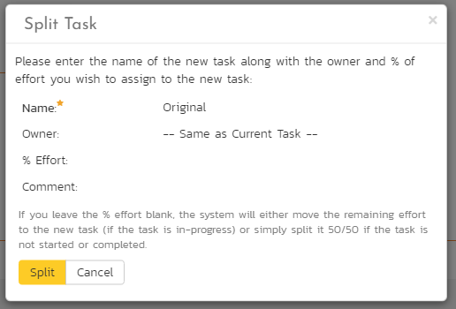

In this dialog you are focusing on the new task you are creating from performing the split. Here you can:

- change the name of the new task (by default, this will be the same as the original task)
- set the owner for the new task (by default, this will be the same as the original task)
- set the percentage of the remaining effort to move from the original task to the new task
- enter a comment to list against the association between the two tasks (visible after the split on the [associations tab](#associations))

To complete the split click the `Split` button.

**Notes about how the split works**:

- **New remaining effort**: this defaults to blank in the split dialog. If this is left blank and the original task has the status of "In Progress" all the remaining effort will be moved to the new task. If the original task has any other status than "In Progress" the remaining effort will be split equally between the original and new task (if the remaining effort percentage is left blank).
- **Status**: the new task's status will match that of the original task
- **Attachments** are copied over to the new task (and left unchanged on the original task)
- History, comments and followers are not copied over to the new task
- All standard and custom field information is copied over to the new task


### Overview -- Details

The Overview tab is divided into a number of different sections. Each of these can be collapsed or expanded by clicking on the title of that section. It displays the description, fields and comments associated with the task.

The top part of this tab displays the various standard fields and custom properties associated with the task. Fields (both standard and custom) are grouped under the collapsible headings (marked by orange text and underline) in the screenshot below. For instance, all fields regarding dates are grouped together in the "Dates and Times" area.


### Effort Fields

You can enter/edit the start-date, end-date (i.e. the due-date), estimated, actual and remaining effort. From this the system will calculate the progress, percentage complete and projected final effort.

The different effort values mean the following:

- **Estimated Effort** -- This is the original estimate for how long the task would take to complete.
- **Actual Effort** -- This is the current amount of effort that has been expended in completing the task. This does not indicate the completion progress
- **Remaining Effort** -- This is the estimate for how it will take from the current state to complete the task. The % complete is calculated from this value in conjunction with the estimated effort: % Complete = 100% - (Remaining Effort / Estimated Effort) - read more about [task progress](#task-progress)
- **Projected Effort** -- This is value that the system predicts it will take to complete the task:

    - If the task is Not Started or Completed, projected effort = the actual effort, or if the actual effort is blank then the estimated effort
    - If the task is neither Not Started or Completed, projected effort = the actual effort + remaining effort, or if the actual effort is blank then the estimated effort

**Note**: If the actual effort is not specified, the projected effort will be the same as the estimated effort.

**Note:** if the task is currently assigned to a release or sprint, the start-date and end-date of the task must lie within the date-range of the parent release/sprint. If your task looks like it will not be completed in the available timeframe, you will need to contact the product manager to get them to either extend the date-range of the task, or consider moving the task to the next sprint.


### Followers

Using the "***Subscribe***" button on the toolbar, you can quickly follow the item, and receive updates on certain changes to it. Depending on your role, you may also see a dropdown to this button, which let's you add another product member as a follower to this item.


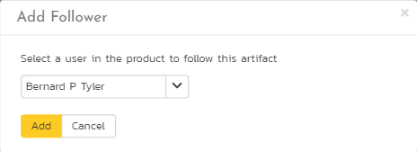

You can also quickly see who is following an incident under the "People" section in the Overview tab.


To view information about the follower, or to unfollow them from the item, hover over their avatar to display a user profile card.


### Component
For tasks, the component field works differently than it does normal as with other artifacts. The component field for a task is disabled and is derived from the component of any requirement that the task is associated with. If the task has no requirement associated with it, then the task's component field will be empty.


### Overview -- Comments
Read about [how the comments works](Application-Wide.md#comments)


### Attachments
Read about [how the attachments tab works](Application-Wide.md#attachments)


### Associations
You can associate other tasks and to a task from this tab. Read more about [how to manage and add associations to this artifact](Application-Wide.md#associations)

### Commits
Tasks that are pull requests will show the commits tab. Read more about the [commits tab](Pull-Requests.md/#commits).

### History
Read about [how the history tab works](Application-Wide.md#history)

### Creating an Incident from a Task

Sometimes you may have a task logged to, say, fix something before release, that now needs to be converted into an Incident (because it won't be able to get fixed before release). This workflow is useful because Incidents usually are more public facing, and have more process around them than tasks. There is a shortcut to create a new incident from the current task; and it automatically creates an association between the new incident and the task (and if the task is linked to a requirement an association is added between that requirement and the new incident too).[^in-tk]

To use this feature:

- go to the Associations tab
- click the `Add` button
- at the bottom right of the panel that displays click the `Create Incident from this Task` button 


[^in-tk]: 
    To create an incident from a task, the user needs must have the permission to create incidents (which makes sense).

    The creation process does **not** enforce the relevant incident workflow to make sure that all required fields are filled in.

    What gets copied over from the task to the new incident:

    - Name
    - Description
    - Owner
    - Creator becomes "Detected By"
    - Component (if this is set on the task from a linked requirement)
    - Release becomes "Detected Release" and "Planned Release"
    - Priority (using an intelligent match on score and name)
    - Custom Fields of type list or multilist that use the same list and have the same name (case insensitive)
    - Comments (using the name of the original author, but the comment creation date is the current date)
    - Auto-link any attachments linked to the task are linked to the incident too