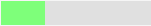

# Task Tracking
Task Tracking in SpiraPlan® and SpiraPlan® lets you view and manage tasks assigned to each person in the product. Each task can be assigned to an individual user and linked to a particular release or sprint. Product managers can track the the progress of tasks to see if the product is on schedule.

Tasks can be organized into different folders and categorized by different types (development, testing, infrastructure, etc.), each of which can have its own *workflow* which defines the way the task can change status during the product lifecycle.

Tasks can be used in a number of different parts of the system to manage and track work:

- standalone tasks: tasks not specifically linked to any other work.
- [tasks on a requirement](../Requirements-Management/#tasks): you can create tasks against any requirement to break down the work into smaller chunks and potentially divide up amongst the team. You may have some tasks on a requirement for developers, others for business analysts, others for QA, and others for marketing, and so on.
- [tasks resulting from testing](../Test-Execution/#tasks): if enabled for a product, testers can create tasks for developers during testing. This is a lighter touch way than incidents to communicate with others about your findings, or to ask questions.
- [pull request tasks](../Pull-Requests): pull requests are special types of tasks that let a developer flag that their feature branch is ready for merging into the main development branch.

## Task List

When you click on the Tracking \> Tasks global navigation link, you will initially be taken to the tasks list screen illustrated below:

The task list screen displays all the tasks entered for the current product by folder, in a filterable, sortable grid. The grid displays the task number together with fields such as priority, name, assigned owner, start date, end date, scheduled release, etc. The choice of columns displayed is configurable per-user, per-product, giving extensive flexibility when it comes to viewing and searching tasks.

In addition, you can view a more detailed description of the task by positioning the mouse pointer over the task name hyperlink and waiting for the popup "tooltip" to appear. If you click on the task name hyperlink, you will be taken to the [task details page](#task-details) Clicking on any of the pagination links at the bottom of the page will advance you to the next set of tasks in the list according to the applied filter and sort-order. There is also a drop-down-list at the bottom of the page which allows you to specify how many rows should be displayed in each page, helping accommodate different user preferences.

### Task Progress

One special column that is unique to tasks is the 'progress indicator'. This illustrates graphically both the percentage completion of the task and also if the task is either starting late or finishing late. The following table illustrates the different type of status that can be conveyed by the indicator:

| Indicator Display              | Progress Description                                                                                                                                   |
| ------------------------------ | ------------------------------------------------------------------------------------------------------------------------------------------------------ |
|  | Task has not yet started, but the scheduled start date is still in the future.                                                                         |
|  | Task has not yet started, and the start date has elapsed. This is considered a 'Late Starting Task'                                                    |
|  | Task has started, and is approximately 25% complete. The scheduled end date is still in the future.                                                    |
|  | Task has started, and is approximately 50% complete. However the scheduled end date has elapsed already. This is a considered a 'Late Finishing Task'. |
|  | Task has been 100% completed.                                                                                                                          |

Essentially, the gray section of the bar indicates the % of the task yet to be completed, and the green/red section of the bar indicates the % of the task that has already been completed. If the bar changes from green to red it means that the end date has been reached and the task is not yet complete, and if the background changes from gray to yellow it means that the task has not yet started, but the scheduled start date has passed.

### Task Folders

SpiraPlan lets you group product tasks into different folders to make organization easier. In the left-hand **Quick Filters** panel, the system displays the various task folders defined in the product:

If you are a product administrator, you will see the 'Edit' and 'Add'
buttons beneath the folder tree, this lets you add, edit and delete task folders in the product. To add a new folder, click the 'Add' button:

Choose the parent folder that you want to add the new folder under (or None if you are adding a new top-level folder) from the dropdown list and then enter the name of the new folder. Then click
'***Add'*** to save the new folder.

To edit or delete an existing folder, simply click the "***Edit***" button to switch the folder tree to edit mode. To edit or delete a specific folder, click on the "***Edit***" button next to the folder:

You can change the parent folder and/or name of the folder and click "***Update***" to commit the change or click "***Delete***" to delete the folder entirely.

To move a task / tasks between folders, click and drag the relevant task/tasks from the table on the right, and drag them over the desired folder in the tree view on the left. The destination folder will be highlighted to show where the task will be placed.[^folder-url]

### Actions
- **Filtering & Sorting**: Read about [how to create and manage filters, and how to sort the artifact list](Application-Wide.md#filtering).
{: #filtering-sorting}
- **New Task**: Clicking on the "***New Task***" button creates a new task in the grid with an initial set of information. You can click on the name of the task to edit its information.
{: #new-task}
- **Delete**: Clicking on the "***Delete***" button deletes the tasks whose check-boxes have been selected in the task list.
{: #delete}
- **Refresh**: Clicking on the "***Refresh***" button simply reloads the list of tasks; this is useful when new tasks are being added by other users, and you want to make sure you have the most up-to-date list displayed.
{: #refresh}
- **show-hide-columns**: This drop-down list allows you to change the fields that are displayed in the task list as columns for the current product. To show a column that is not already displayed, simply select that column from the list of "Show..." column names and to hide an existing column, simply select that column from the list of "Hide..." column names. This is stored on a per-product basis, so you can have different display settings for each product that you are a member of. The fields can be any of the built-in fields or any of the custom properties set up by the product owner.
{: #Show / Hide Columns}
- **Cloning Tasks**: To create a clone of a task, a set of tasks, or a folder of tasks, select the check-boxes of the tasks you want to clone and then click "***Clone***". This will make a clone of the current task in the current folder with its name changed to add " - Copy" added to the end, to distinguish itself from the original. When cloning a folder of tasks, only the folder name gets changed. When cloning tasks note that:

- all standard fields (like status and owner) are cloned
- description (with formatting) are cloned
- remaining effort and execution progress are cloned
- any associated requirement is cloned
- file attachments are cloned
- followers, comments, and history are *not* cloned

{: #duplicating-tasks}
- **Exporting Tasks to Another Product**: Read about [how to export artifacts from one product to another](Application-Wide.md#export-to-another-product).
{: #exporting-tasks-to-another-product}
- **Printing and Saving Items**: To quickly print a single task, a list of tasks, or a folder of tasks you can select the items' checkboxes and then click Tools \> Print Items. This will display a popup window containing a printable version of the selected items. You can also save the report in a variety of common formats from the same Tools menu.
{: #printing-and-saving-items}

### Edit
Each task in the list has an "***Edit***" button display in its right-most column. When you click this button or just click on any of the cells in the row, you change the item from "View" mode to "Edit" mode. The various columns are made editable, and "***Save***" buttons are displayed in the last column:

If you click "***Edit***" on more than one row, the "***Save***" buttons are only displayed on the first row, and you can make changes to all the editable rows and then update the changes by clicking the one "***Save***" button. Also, if you want to make the same change to multiple rows (e.g. to change five tasks from "Not Started" status to "In Progress"), you can click on the "fill" icon to the right of the editable item, which will propagate the new value to all editable items in the same column.

If you want to edit lots of items, first select their checkboxes and then click the "***Edit***" button on the same row as the Filters and it will switch all the selected items into edit mode.

When you have made your updates, you can either click "***Save***" to commit the changes, or "***Cancel***" to revert back to the original information. Alternatively, pressing the <ENTER\> key will commit the changes and pressing the <ESCAPE\> key will cancel the changes.

## Task Additional List Views
There are two additional task list views. These views are:

2. Task Board
1. Gantt chart view (beta)

You can pick between each of these views using the view selection button group at the top right of any requirement list page.

## Task Board

The task board is an alternative to the [task list page](#task-list) designed to let you view the tasks planned for the current product. You can access this feature by clicking on the **Board** icon in the top-right of the Tasks list page. You can switch back to the Task list page by clicking on the **Table** view.

The task board has the following different display modes:

-   **All Releases**

    -   By Release
    -   By Priority
    -   By Status
    -   By Person

-   **Release**

    -   By Sprint
    -   By Priority
    -   By Status
    -   By Person

-   **Sprint**

    -   By Priority
    -   By Status
    -   By Person

Each of these views is described below.

!!! info "Planning Boards and Editing"
    **Moving cards**: Please note that the purpose of a planning board or Kanban board, is to make it straightforward for users to move cards around the interface to plan out their work. Therefore we do **not** enforce workflow restrictions on the planning board when moving cards. Therefore only users with permissions to bulk edit the relevant artifact can move cards. If the template admin has prevented status changes while bulk editing, then noone can change a card's status by moving its card on the planning.

    **Viewing cards**: to view more information about the card you can: turn on Detailed View; hover on the card name to see a rich tooltip; click on the card's id to open a popup with much more detail; or ctrl/cmd+click on the card's id to open the full details page for that artifact. Information shown in the popup includes all standard and custom fields with fields being shown or hidden based on the workflow step that applies to that specific card. 

    **Editing cards**: users with bulk edit permissions can edit a planning board card at any time by click on the card's id (including adding a new comment). This opens a popup with full information about that card. At all times, which fields are shown, required, or hidden is based on the workflow step that applies to that specific card. To save any changes you must fill in all required fields. Please note: you cannot change the status in this edit mode, to do so open the artifact's detail page (you cand do this from the popup by clicking the button next to the artifact's id at the top).
    
    **Add new cards**: if you are able to create the requirements then you will see plus (add) symbols in different locations on the board. Clicking any of these will open an popup screen with all relevant fields available. Some of these fields may be prepopulated based on what add button you clicked and how you are using the board. For instance, if you are viewing for a release, that release will be preselected. And if you are grouping by person and click on a particular person, that person will be set as the owner of the artifact. The fields visible and required is driven based on what workflow step will apply to that new card.  

### Tasks -- By Priority

This view is designed to let you see the list of planned tasks organized by priority. Each of the possible priority values is displayed on the left-hand side and the tasks displayed in the same row on the right:

The top section will contain the list of tasks that are not assigned a priority, with the other sections containing the tasks that have been assigned to the specific priority.

### Tasks -- By Status

This view is designed to let you see the tasks in the current product /
release / sprint organized by their status. Each task status (not started, in progress, completed, blocked, deferred) is displayed as a heading, with the tasks displayed in the same column underneath:

You can click on the expand/collapse icons to hide any resources that are not relevant.

Depending on the view (all releases, release, or sprint), there may be sections with the release and sprint name. You can drag and drop the tasks between statuses or to/from the release/sprint backlog. Any tasks not assigned to a release/sprint will be listed in the (Unassigned Items) section at the top.

### Tasks - By Person

This view is designed to let you see the tasks in the current product /
release / sprint organized by resource / person. Each of the users that is a member of the current product is displayed as a heading, with the tasks displayed in the same column underneath. This view is often called the **Task Board**:

You can click on the expand/collapse icons to hide any resources that are not relevant. The system will display a progress bar for each resource to illustrate the allocation for that resource. Any resource that has a progress bar that is completely green has been fully scheduled and should not have any additional tasks assigned. If the progress bar for that resource turns red, it means that they have been over-scheduled and you need to reassign some of the tasks.

Depending on the view (all releases, release, or sprint), there may be sections with the release and sprint name; they contain tasks that are scheduled for the current release or sprint but have not yet been assigned to a resource. You can drag and drop the tasks between resources or to/from the release/sprint backlog (as long as the item has a status that let's you set or edit its owner field). Any tasks not assigned to a resource and release/sprint will be listed in the (Unassigned Items) section at the top.

### Tasks - By Release

This view is only available when you are displaying the task board for
'all releases'. Each of the active releases defined for the current product is displayed as a heading, with the tasks displayed in the same column underneath

You can drag and drop the tasks between the different releases. Once the task has been added to the release, the utilized effort for the release will increase, and the available effort will decrease by the same amount.

Note: The system will allow you to assign more tasks to a release than it is possible to complete, however this will result in a negative value for 'available effort'. If this happens, the "Available Effort" value will be displayed in red, and you need to rebalance the items, extend the release length or add product personnel resources to the release.

Clicking on the release hyperlinks in the headers will switch the task board into the release view.

### Tasks - By Sprint

This view is only available when you are displaying the task board for a specific release. Each of the sprints defined for the current release is displayed as a heading, with the tasks displayed in the same column underneath. This view is commonly used in **Scrum** products:

You can drag and drop the tasks between the different sprints. Once the task has been added to the sprint, the utilized effort for the sprint will increase, and the available effort will decrease by the same amount.

Note: The system will allow you to assign more tasks to a sprint than it is possible to complete, however this will result in a negative value for 'available effort'. If this happens, the "Available Effort" value will be displayed in red, and you need to rebalance the items, extend the sprint length or add product personnel resources to the sprint.

Clicking on the sprint hyperlinks in the headers will switch the task board into the sprint view.

### Tasks - By Requirement

This option is only available when you are displaying the task board for a specific release or sprint. 

In this case, the left hand side displays the requirements currently assigned to the current release / sprint, and the right hand column contains the tasks (in a card format) that are associated with that specific requirement, complete with color-coded progress bars. This view lets you quickly see all of the current user stories being worked, and the progress of completing the related tasks, in a single unified view.

[^folder-url]: when navigating to folders (for all artifacts that support them), the URL in your browser's address bar will change. Each folder has a unique, sharable URL that you can give to someone to display the list of artifacts with the appropriate folder selected. You can also open up multiple folders in different browser tabs and easily toggle between them from the same browser.

## Beta task board
!!! info "In beta, available in SpiraTeam and SpiraPlan"
    System admins [can enable](../../Spira-Administration-Guide/System/#general-settings) beta functionality across the application for their users from the System Admin > General Settings page.

To learn more about how the task board is structured or how to enter the beta please refer to our [general information about the beta boards](../Application-Wide/#beta-boards).

### Views summary
Details about what combinations of views is possible and how each feature works is discussed in detail the sections below. For ease of reference, here is a summary of the different options available (you cannot select the same value for multiple view options at the same time):

Releases can display "all releases" or a specific releases. The dropdown shows all open releases and sprints.

| View options | All releases                                                 | A specific release or sprint |
| ------------ | ------------------------------------------------------------ | ---------------------------- |
| **Grouping** | Priority  Release  Status  Type  Person  Team | ... and Requirement          |
| **Columns**  | Priority  Release  Status  Type  Person          | ... and Requirement          |
| **Rows**     | Priority  Release  Status  Type  Person          | ... and Requirement          |

### View controls
The **release dropdown** shows:

- "all releases": displays items planned for any release
- any release or sprint with an "open" status (a status of planned, in progress, or completed): displays items planned for the selected release and its children

Read about [**how grouping works**](../Application-Wide/#board-grouping).

Read about [**how to use columns**](../Application-Wide/#board-columns).

Read about [**how to use rows**](../Application-Wide/#board-rows).

Read about [**what cards show when**](../Application-Wide/#board-what-cards-show-when).

### Customizing the cards
You can customize what information is shown on each card. For each artifact the following fields are always shown:

- **Name** (click to open a popup with full details, or alt-click to open the details page for that item)
- **Artifact icon**: shown beneath the name in a gray bubble
- **ID token** of the artifact: shown to the right of the artifact icon
- **Effort** (if set): shown to the bottom right of the card (hover to see full information about the effort fields)
- **Priority** (if set): shown to the bottom right of the card in a circle the color of the priority
- **Owner** (if set): shown at the bottom right of the card in a circle with the avatar or initials of the person (hover on this to see their full name)

You can toggle whether to show each of the following features:

- **Description**: this will show a snippet of the full artifact description below the artifact name
- **Type**: the artifact type, shown to the right of the ID token
- **Status**: the artifact statuses, shown to the right of the ID token and the type
- **Progress**: a mini histogram chart of the task's progress, shown in the task progress mini section on the card (hover to see a tooltip with detailed information)
- **Position**: this shows a number in the bottom left of the card that represents the position of that card within the cell. For example, the topmost card will have position 1, and the card beneath it 2.

Below is an example of a task card showing all available data

### Moving and ordering cards
Read about this [here](../Application-Wide/#board-moving-and-ordering-cards).

### Editing and viewing cards
Read about this [here](../Application-Wide/#board-editing-and-viewing-cards).

### Viewing by release or sprint
Read about this [here](../Application-Wide/#board-viewing-by-release-or-sprint).

### Viewing by Person
Read about this [here](../Application-Wide/#board-viewing-by-person).

## Task Gantt Chart

This displays all active releases and sprints[^active-release] nested in the same hierarchy as on the main release list page (releases or sprints without any tasks are also shown). It also displays any task that are assigned to one of these releases.

Any release that has active children or open tasks has an expand / collapse toggle to the left of its name. This will show the child releases and/or the assigned tasks

To the right of the names is the timeline bar, which graphically shows the length of each release (blue) and task (green) between their start and end dates in individual horizontal bars. The names of the releases and tasks on the left or in the horizontal bars are clickable and will open the specific release or task.

Part of a release or task may be shaded darker than normal, from its left - this is based on how complete the release or task is.

- For releases, this represents the [requirements completion percentage](../Release-Management/#requirements-completion) for that release. So if a release bar stretches for 3 months and 33% of its requirements are complete, the first month of the bar will be shaded darker. 
- For tasks, this represents the percentage complete of the task itself.

Above the Gantt chart is a toolbar that lets you:

- **refresh** the Gantt chart
- **add a new task**: users with permissions to create tasks can click the `Add` button to add a new dispaly a popup to fill in information about the new task. The new task's release is filled in if you select a release on the Gantt chart, or otherwise by the release you are filtering the page on (see below).  Click `Add Task` to add the task into the product.
- **filter the releases and tasks shown**: use the dropdown to pick a release. This shows a list of all active releases[^active-release] and syncs up with the release you set in other parts of the system (for instance on the product home page, or the reporting home page).

### Gantt Chart Inline Editing
To **view more information** about a release or task, click its name from the left hand sidebar or in the relevant Gantt bar. This will open popup with much more detail. If you ctrl/cmd+click on the artifact's name it will open the full details page for that artifact. Information shown in the popup includes all standard and custom fields. These fields are visible or hidden based on the workflow step that applies to that specific release or to that specific task.

You can **edit releases and tasks** straight from the Gantt chart. Users with bulk edit permissions for releases or tasks can edit each respective artifact (including adding a new comment) at any time by clicking on the artifact name. This opens a popup with full information about that artifact. At all times, which fields are shown, required, or hidden is based on the workflow step that applies to that specific artifact. To save any changes you must fill in all required fields. Please note: you cannot change the status in this edit mode, to do so open the artifact's detail page (you can do this from the popup by clicking the button next to the artifact's id at the top).

*Note*: only fields that users are able to edit are shown - fields that are always read only (like the creation date) are not shown in this view. 

[^active-release]: any release / sprint / phase with a status that is *not* "Closed", "Deferred", or "Cancelled".

## Task Details

When you click on a task item in the lists displayed on either the main task list page or on the requirement / release details pages, you are taken to the task details page illustrated below:

This page is made up of *three* areas;

1.  the left pane displays the tasks list navigation;

2.  the right pane's header, which displays: the operations toolbar; the [folder the task is in](Application-Wide.md#breadcrumbs); the editable name of the selected task; and the info bar (with a shaded background), which also contains the workflow status transitions (see below); and

3.  the right pane's tabbed interface with rich information related to the task.

Please note that on smaller screen sizes the navigation pane is not displayed. While the navigation pane has a link to take you back to the tasks list, on mobile devices a 'back' button is shown on the left of the operations toolbar.

The navigation pane can be collapsed by clicking on the "-" button, or expanded by clicking anywhere on the gray title area. On desktops the user can also control the exact width of the navigation pane by dragging and dropping a red handle that appears on hovering at the rightmost edge of the navigation pane.

The navigation pane consists of a link that will take you back to the task list, as well as a list of tasks, and another list of the other related tasks, nested under their parent task. This latter list is useful as a navigation shortcut; you can quickly view the peer tasks by clicking on the navigation links without having to first return to the tasks list pages. The navigation list can be switched between five different modes:

-   **Current Filter -** The list of tasks matching the current filter organized by task folder

-   **All Items** - The list of all tasks, irrespective of the current filter, organized by task folder

-   **Assigned** - The list of tasks assigned to the current user grouped by their parent requirement

-   **For Release** - The list of tasks assigned to the current release or sprint, grouped under that parent release/sprint.

-   **For Requirement** -- The list of tasks associated to the same requirement as the current task as well as other tasks at the same level in the requirement hierarchy.

The lower part of the right pane can be in one of *four* possible tabs that can be selected: "Overview Properties", "Attachments", "History" and "Associations". Each of the different views is described separately below.

### Toolbar Operations

- **Emailing**: read about [emailing an artifact to colleagues using Spira](Application-Wide.md#emailing).
{: #emailing}
- **Followers**: read about [how to add and manage followers to an artifact](Application-Wide.md#followers).
{: #followers}
- **Workflows**: read about [using workflows to change the status of your artifact](Application-Wide.md#workflows).
{: #workflows}

#### Task Splitting
Sometimes you may want to split a task into two: the original task, and a new task (based off the original one). The two tasks are associated together after this process. To do this click `Tools` > `Split`. This will bring up the task split dialog shown below.

In this dialog you are focusing on the new task you are creating from performing the split. Here you can:

- change the name of the new task (by default, this will be the same as the original task)
- set the owner for the new task (by default, this will be the same as the original task)
- set the percentage of the remaining effort to move from the original task to the new task
- enter a comment to list against the association between the two tasks (visible after the split on the [associations tab](#associations))

To complete the split click the `Split` button.

**Notes about how the split works**:

- **New remaining effort**: this defaults to blank in the split dialog. If this is left blank and the original task has the status of "In Progress" all the remaining effort will be moved to the new task. If the original task has any other status than "In Progress" the remaining effort will be split equally between the original and new task (if the remaining effort percentage is left blank).
- **Status**: the new task's status will match that of the original task
- **Attachments** are copied over to the new task (and left unchanged on the original task)
- History, comments and followers are not copied over to the new task
- All standard and custom field information is copied over to the new task

### Overview -- Details

The Overview tab is divided into a number of different sections. Each of these can be collapsed or expanded by clicking on the title of that section. It displays the description, fields and comments associated with the task.

The top part of this tab displays the various standard fields and custom properties associated with the task. Fields (both standard and custom) are grouped under the collapsible headings (marked by orange text and underline) in the screenshot below. For instance, all fields regarding dates are grouped together in the "Dates and Times" area.

### Effort Fields

You can enter/edit the start-date, end-date (i.e. the due-date), estimated, actual and remaining effort. From this the system will calculate the progress, percentage complete and projected final effort.

The different effort values mean the following:

- **Estimated Effort** -- This is the original estimate for how long the task would take to complete.
- **Actual Effort** -- This is the current amount of effort that has been expended in completing the task. This does not indicate the completion progress
- **Remaining Effort** -- This is the estimate for how it will take from the current state to complete the task. The % complete is calculated from this value in conjunction with the estimated effort: % Complete = 100% - (Remaining Effort / Estimated Effort) - read more about [task progress](#task-progress)
- **Projected Effort** -- This is value that the system is producting it will take to complete the task. This is calculated from the Actual Effort and Remaining Effort: Projected Effort = (Actual Effort + Remaining Effort)

**Note**: If the actual effort is not specified, the projected effort will be the same as the estimated effort.

**Note:** if the task is currently assigned to a release or sprint, the start-date and end-date of the task must lie within the date-range of the parent release/sprint. If your task looks like it will not be completed in the available timeframe, you will need to contact the product manager to get them to either extend the date-range of the task, or consider moving the task to the next sprint.

### Followers

Using the "***Subscribe***" button on the toolbar, you can quickly follow the item, and receive updates on certain changes to it. Depending on your role, you may also see a dropdown to this button, which let's you add another product member as a follower to this item.

You can also quickly see who is following an incident under the "People" section in the Overview tab.

To view information about the follower, or to unfollow them from the item, hover over their avatar to display a user profile card.

### Overview -- Comments
Read about [how the comments works](Application-Wide.md#comments)

### Attachments
Read about [how the attachments tab works](Application-Wide.md#attachments)

### Associations
You can associate other tasks and to a task from this tab. Read more about [how to manage and add associations to this artifact](Application-Wide.md#associations)

### Commits
Tasks that are pull requests will show the commits tab. Read more about the [commits tab](../Pull-Requests/#commits).

### History
Read about [how the history tab works](Application-Wide.md#history)

### Creating an Incident from a Task

Sometimes you may have a task logged to, say, fix something before release, that now needs to be converted into an Incident (because it won't be able to get fixed before release). This workflow is useful because Incidents usually are more public facing, and have more process around them than tasks. There is a shortcut to create a new incident from the current task; and it automatically creates an association between the new incident and the task (and if the task is linked to a requirement an association is added between that requirement and the new incident too).[^in-tk]

To use this feature:

- go to the Associations tab
- click the `Add` button
- at the bottom right of the panel that displays click the `Create Incident from this Task` button 

[^in-tk]: 
    To create an incident from a task, the user needs must have the permission to create incidents (which makes sense).

    The creation process does **not** enforce the relevant incident workflow to make sure that all required fields are filled in.

    What gets copied over from the task to the new incident:

    - Name
    - Description
    - Owner
    - Creator becomes "Detected By"
    - Component (if this is set on the task from a linked requirement)
    - Release becomes "Detected Release" and "Planned Release"
    - Priority (using an intelligent match on score and name)
    - Custom Fields of type list or multilist that use the same list and have the same name (case insensitive)
    - Comments (using the name of the original author, but the comment creation date is the current date)
    - Auto-link any attachments linked to the task are linked to the incident too