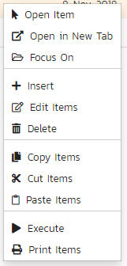
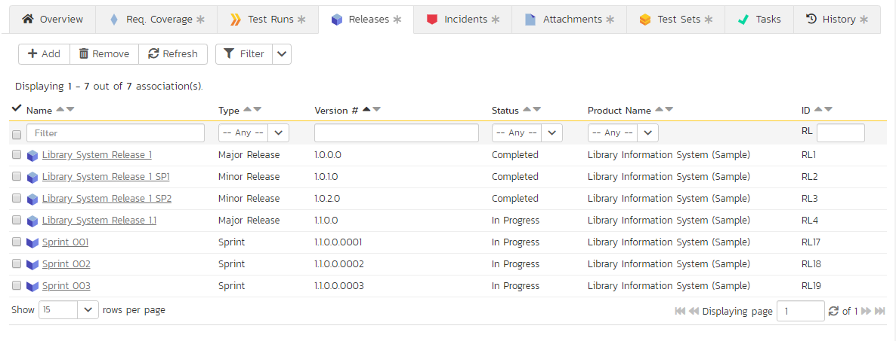
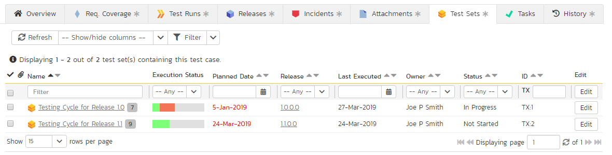
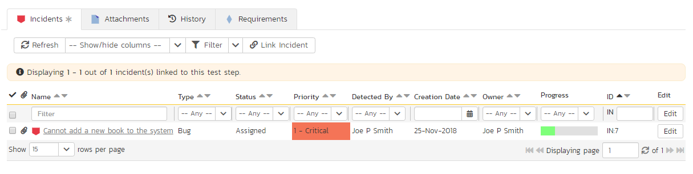
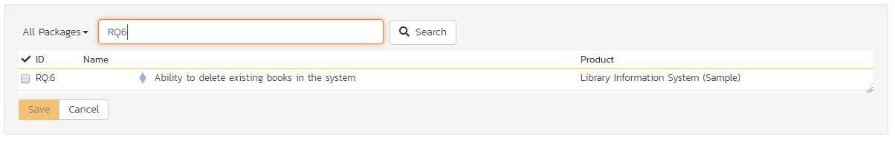

# Test Case Management

This section outlines how the use-case / test-case management features of SpiraPlan® can be used to develop the business use-cases for the system, which specify how the different pieces of functionality are expected to work in practice. In addition, these use/test-cases form the basis of the business specification of the system when associated with the underlying requirements matrix. Typically when starting a new product:

- The requirements matrix is entered first
- Then the list of use-cases is developed to outline the key scenarios that need to supported to implement the requirement
- Then the use-cases are fleshed out into full test-cases by adding the detailed test-steps with the expected result and suggested sample-data
- Finally the tests are grouped into test-sets so that they can be assigned to users in batches for execution and tracking.

However when migrating existing products into SpiraPlan®, you may need to migrate the test-case list first, and then add the supporting requirements matrix afterwards.

## Test Case List

When you click on the Testing \> Test Cases link on the global navigation bar, you will initially be taken to the test case list screen illustrated below:

The test case list consists of a hierarchical arrangement of the various test folders and test cases. The structure is very similar to the folder structure in Microsoft Windows® Explorer, and users will find this very familiar and intuitive to use. A folder tree is on the left hand side---with triangle icons to expand / collapse each folder. Contents of the selected folder (the one marked in bold on the folder tree) are shown on the right hand side.

When you create a new product, this list will initially be empty, and you will have to use the "***New Test Case***" button to start adding test cases to the system. A new product will also not have any test folders---only the base "Root" folder will be visible. To add a test folder, you click the "***Add***' button at the bottom of the folder tree on the left.

The list shows all test folders (shown with a folder icon), and test cases (shown with a document icon) inside the currently selected folder. You can place test folders and test cases into test folders.[^folder-url] All of the items in the list have a name, together with the most recent execution status (passed, failed or not-run), and owner, author, execution date, active flag and test case number. Clicking on a test case's hyperlink will take you to the [test case details](#test-case-details) page for the item in question.

It is important to understand that only test cases are assigned a status themselves; the test folders instead display a test execution bar graph that illustrates the aggregate execution status of its child test-cases. Thus, if the test folder contains two test cases, one of which passed, and one of which wasn't run, the graph will display 50% green and 50%
gray.

To determine the exact aggregate test folder execution status information, position the mouse pointer over the bar-chart, and the number of tests in each of the execution statuses (passed, failed, not-run, blocked, caution) will be displayed as a "tooltip". Note that if you change the owner of a test folder, then all the child test cases will be assigned the same owner. This allows you to more easily associate entire folders to test cases to be executed by a specific user.

### Add a Test Case

Click the "***New Test Case***" button will add a test case in the currently displayed folder (ie the one marked in bolder on the folder tree and also shown in the yellow information box). The new test case will be added at the bottom of the list.

Once the new test case has been inserted, the item is switched to "Edit" mode so that you can rename the default name and choose an owner and/or author. Note that all new test cases are initially set with an execution status of "Not Run".

### Delete

Clicking on the "***Delete***" button deletes all the test cases and/or test folders whose check-boxes have been selected. If any of the items are test folders, then the entire contents of that folder will also be deleted (as you would expect in Microsoft Windows® Explorer or OS X Finder).

### Execute

Clicking on the "***Execute Tests***" button (accessed from the "Tools" menu or context menu) executes all the test cases selected, together with all the test cases contained with any selected test folders. The test execution functionality of SpiraPlan® is explained in more detail in [Test Step Details](#test-step-details). NOTE: if the product does not allow you to execute test cases this button will not be available.

### Refresh

Clicking on the "***Refresh***" button simply reloads the test case list. This is useful as other people may be modifying the list of test cases at the same time as you, or executing specific test cases, and after stepping away from the computer for a short-time, you can click this button to make sure you are viewing the most current test case list for the product.

### Editing a Test Case

Each test case in the list has an "***Edit***" button in its right-most column. When you click this button (or *double-click* on any of the cells in the row), you change the item from "View" mode to "Edit" mode. The various columns are made editable, and "***Update***" buttons are displayed in the last column:

If you click "***Edit***" on more than one row, the "***Update***" buttons are only displayed on the first row, and you can make changes to all the editable rows and then update the changes by clicking the one "***Update***" button. Also, if you want to make the same change to multiple rows (e.g. to change the owner of five test cases from "Fred Bloggs" to "Joe Smith"), you can click on the "fill" icon to the right of the editable item, which will propagate the new value to all editable items in the same column.

If you want to edit lots of items, first select their checkboxes and then click the "***Edit***" button on the same row as the Filters (ie the topmost edit button) and it will switch all the selected items into edit mode.

When you have made your updates, you can either click "***Update***" to commit the changes, or "***Cancel***" to revert back to the original information. Alternatively, pressing the <ENTER\> key will commit the changes and pressing the <ESCAPE\> key will cancel the changes.

### Editing a Test Folder

Test folders shown on the right hand list pane do not have an "***Edit***" button. To edit a test folder, first click the "***Edit***" button at the bottom of the left hand folder tree. This will place the whole folder tree into edit mode---each folder will get a small "Edit" button of its own.

Clicking on the "***Edit***" button of the folder you want to edit will display a pop up dialog. This allows you to: move the folder into a new or different parent folder; edit the name of the folder; or add a more detailed description. Click "***Update***" to commit the changes, "***Cancel***" to revert back to the original information, or "Delete" to delete the folder (and all of its contents). Note that on clicking "***Delete***" a warning box will appear to make sure you don't accidentally delete something.

### Show / Hide Columns

This drop-down list allows you to change the fields that are displayed in the test case list as columns for the current product. To show a column that is not already displayed, simply select that column from the list of "Show..." column names and to hide an existing column, simply select that column from the list of "Hide..." column names. This is stored on a per-product basis, so you can have different display settings for each product that you are a member of. The fields can be any of the built-in fields or any of the custom properties set up by the product owner.

Note: If you hide the 'execution status' column, the test case folders will no longer show the count of test cases contained within the folder.

### Filtering & Sorting

Read about [how to create and manage filters, and how to sort the artifact list](Application-Wide.md#filtering).

### Viewing the Test Status for a Release

By default, when you view the list of test cases, it will display an aggregate status for all releases of the product. I.e. the test list will include all the test cases in the system (regardless of which release they apply to) and the execution status will reflect the most recent test run -- regardless of which release it was for.

To change the test case list to just display test cases and execution status for a particular release, change the release selected in the drop-down list located in the top-right from "All Releases" to a specific release:

As illustrated in the example above, when the drop-down list is changed to select a specific release, the list of test cases is filtered to just those mapped to the release in question. In addition, the execution status for the test cases will only reflect test runs for that specific release (and any child sprints if applicable). As can be seen in our example, many test cases that have been run for other releases now show the "Not Run" status since they've not been run for this specific release.

As a shortcut, when you select a specific release for viewing, subsequent execution of any of the test cases via the Tools \> Execute Tests menu option will default the test run to the selected release.

### Copying Test Cases

To copy one or more test cases, select the check-boxes of the test cases (or test case folder) you want to copy and then select Edit > Copy Items from the menu. This will copy the current test case / test case folder selection to the clipboard. Then select the place you want the test cases to be inserted and choose the Edit > Paste Items option.

The test cases will now be copied to the destination you specified. The name of the copied test cases will have " - Copy" added to the end to distinguish them from the originals. If you are copying test case folders, only the top level folders' name(s) will will have " - Copy" added to the end - the new copies of items in the folder will have the same names as the originals.

### Blocking and Unblocking Test Cases

To designate one or more test cases as blocked, select the check-boxes of the test cases and then select the Edit \> Block Test Cases menu option.  This temporarily blocks test cases so that testers know they are not available for testing. Unlike actually executing the test cases and recording an execution status, no test run is recorded and summary metrics (such as requirements test coverage and test set status) are not updated. Likewise, to unblock test cases, select their check-boxes and then select the Edit \> Unblock Test Cases menu option. This changes their Execution Status from Blocked to Not Run. The Edit menu will be enabled if the current user has Test Case \> Bulk Edit permission.   

### Moving Test Cases or Folders

There are two options for moving test cases or folders:

1.  Click on the test case/folder you want to move in the right hand list and drag it to the folder in the left hand folder tree you want it moved to. The background of the new folder will change to show where it will be inserted:

Once you have the test case/folder positioned at the correct place that you want it inserted, just release the mouse button. To move multiple items simply select their checkboxes and then drag-and-drop one of the selected items.

2.  Alternatively you can simply select the check-boxes of the test cases you want to move and then select the Edit \> Cut Items menu option. This will cut the current test selection to the clipboard. Then select the place where you want the test cases to be inserted and choose the Edit \> Paste Items option. The test cases will now be moved into the destination specified.

### Exporting Test Cases

Read about [how to export artifacts from one product to another](Application-Wide.md#export-to-another-product).

### Adding Test Cases to a Release, Test Set or Requirement

To quickly add a series of test cases to a Release, Test Set or Requirement, select the check-boxes of the appropriate test cases and then click Tools \> Add to Release / Test Set / Requirement. This will bring up a dialog box displaying either a list of available releases, test sets or requirements (depending on which option was chosen):

Once you have chosen the destination release / test set / requirement, clicking "***Add***" will add the selected test cases to the destination release / test set / requirement.

### Printing Items

To quickly print a single test case, test folder or list of test cases you can select the items' checkboxes and then click Tools \> Print Items. This will create a printable report of the selected items in a new window.

### Right-Click Context Menu

SpiraPlan® provides a shortcut -- called the *context menu* - for accessing some of the most commonly used functions, so that you don't need to move your mouse up to the toolbar each time. To access the context menu, right-click on any of the rows in the test case list and the following menu will be displayed:

You can now choose any of these options as an alternative to using the icons in the toolbar.

## Test Case Details

When you click on a test case item in the [test case list](#test-case-list), you are taken to the test case details page illustrated below:

This page is made up of *three* areas;

1.  the left pane displays the test case folders and list navigation;
2.  the right pane's header, which displays: the operations toolbar; the [folder the test case is in](Application-Wide.md#breadcrumbs); the editable name of the selected test case; and the info bar (with a shaded background), which also contains the workflow status transitions (see below); and
3.  the right pane's tabbed interface with rich information related to the test case.

The navigation pane consists of a link that will take you back to the test case list, as well as a list of the peer test cases to the one selected. This latter list is useful as a navigation shortcut: you can quickly view the detailed information of all the peer test cases by clicking on the navigation links without having to first return to the test cases list page. The navigation list can be switched between three different modes:

-   The list of test cases matching the current filter
-   The list of all test cases, irrespective of the current filter
-   The list of test cases assigned to the current user

The operations toolbar lets you, amongst standard operations like save and delete:

- create a replica of the current test case by clicking `Clone`
- discard any changes made by clicking `Refresh`
- export to a number of files formats or print it via one of the options in the `Tools` dropdown menu
- the `Execute` button will immediately prepare the current test case for execution and then take you to the [test execution screen](#execute-test-cases). NOTE: if the product does not allow you to execute test cases this button will not be available.

The lower part of the right pane can be switched between a number of different views by clicking the appropriate tab. Initially the pane will be in "Overview" mode, but it can be switched to "Requirements Coverage", "Test Runs", "Releases", "Incidents", "Attachments", "History", and "Test Sets" modes if so desired. Each of these views is described below.

### Emailing
Read about [emailing an artifact to colleagues using Spira](Application-Wide.md#emailing).

### Followers
Read about [how to add and manage followers to an artifact](Application-Wide.md#followers).

### Workflows
Read about [using workflows to change the status of your artifact](Application-Wide.md#workflows).

### Overview - Details

The Overview tab is divided into a number of different sections. Each of these can be collapsed or expanded by clicking on the title of that section. This tab displays the fields, detailed information, and comments associated with the test case.

The top part of this tab displays the various standard fields and custom properties associated with the test case. Fields (both standard and custom) are grouped under the collapsible headings (marked by orange text and underline) in the screenshot below. For instance, all fields regarding dates are grouped together in the "Dates and Times" area.

The Detailed Information section contains the long, formatted description of the test case, as well as any rich text custom fields. You can enter rich text or paste in from a word processing program or web page. Clicking on the shaded areas of one of these detailed fields will display the rich text toolbar.

The **Suspect** flag is automatically set on an approved test case, when one of the requirements linking to it changes. This lets you quickly find all the test cases impacted by a specific requirement change. For this to happen the requirement needs to be in an Accepted or later status (i.e. not Rejected, Rejected, Under Review, Obsolete) and the test case needs to be an approved status (i.e. not Draft, Obsolete, Rejected).

### Overview - Test Steps

This view displays the name of the test case together with all the defined test steps that a tester would need to perform to verify that the functionality works as expected. The list of test steps displays the position number, the description, the expected result, some suggested sample data and the most recent execution status of the individual test step:

Note: Test steps that are marked with a hyperlink and test case icon (e.g. "Call Login to Application" in the screen shot above) are in fact
*linked test cases.* Linked test cases are a useful way of reusing existing test steps from other test cases. For example if you want to have a set of steps be in more than one test case (e.g. a login step) then you would create a separate test case just containing these steps, then have all the other test cases just link to it. This avoids the need to have duplicate test steps throughout the product.

If you click on the step number hyperlink (e.g. Step 2) you will be taken to the test step details page which allows you to perform additional editing of a specific test step as well as attach documents, associate pre-existing incidents and view the change history.

### Insert Step

Clicking on the "***Insert Step***" button inserts a new test step *before* the currently selected (by means of the check-box) test step. Clicking the "***Insert Step***" button without selecting a test step will insert a new step at the end of the list. When a new step is inserted, the fields are displayed in "Edit" mode, so the description, expected result and sample data fields are editable, allowing you to enter the data:

Once you have entered the necessary information, you can click either "***Save and New***" to commit the changes. If you choose "***Save and New***" another new row will be inserted which is useful if you intend on entering lots of rows at once, whereas clicking "***Save***" will commit only the current row.

### Insert Link

Clicking on the "***Insert Link***" button brings up the following dialog box that allows you to either choose an existing test case to be inserted or create a new test case and step with parameters:

When linking an existing test case, first select its parent folder from the dropdown. Then select the name of the test case you want to insert as a link from the list. If the test case has declared [parameters](#parameters) you will see a list of parameters to fill out.

If it makes sense for your tests you can fill out the parameter values and then click "***Add***". The system will insert the test case as a link. These paramter values are passed down to the linked test at execution. These values override any default parameter values set on the test case. If a test step was already selected the link is inserted above that test step, otherwise the link is added at the end of the test step list.

If you want to create a test step with specific parameters and parameter values, you can do so by clicking the "***Create New Test Case***". This will change the dialog to one where you can assign a folder, name, and parameters to a new test case. On clicking the "***Add***" button: the new test case is created; a test step is created within that new test case; the parameters specified in the dialog are assigned to that test step, with the values set as the defaults for the step; and the new test case is added as a linked test case in the list of test steps.

### Delete

Clicking on the "***Delete***" button deletes the currently selected test steps, and reorders the test step position numbers to close any gaps in numbering.

### Clone

Clicking on the "***Clone***" button makes a duplicate of the current test step or linked test case and inserts the copied version directly above the original one.

### Refresh

Clicking on the "***Refresh***" button simply reloads the list of test steps. This is useful if other people are making changes to the test list and you want to make sure that you have the most current version.

### Show / Hide Columns

By default the test step list screen will display the Description, Expected Result and Sample Data fields. However the Expected Result and Sample Data fields are optional and can be hidden if necessary to make more space. If you have configured custom properties for test steps, you can use the Show/Hide features to display one or more of your custom properties instead. These fields will then be editable in this grid-view.

### Editing Test Steps

To modify an existing Test Step you simply need to click on the "***Edit***" button to the right of the step, or just
*double-click* on the cells in the row. That will switch the selected row into Edit mode. The various columns are turned into editable text-boxes, and "***Save***" and "***Cancel***" buttons are displayed in the last column:

If you click "***Edit***" on more than one row, the "***Save***" buttons are only displayed on the first row, and you can make changes to all the editable rows and then save the changes by clicking the one "***Save***" button. Also, if you want to make the same change to multiple rows, you can click on the "***fill***" icon to the right of the editable item, which will propagate the new value to all editable items in the same column. When you have made your changes, you can either click "***Save***" to commit the changes, or "***Cancel***" to revert back to the original information.

### Editing Test Links

To modify an existing Test Link you simply need to click on the "***Edit***" button to the right of the step, or double click on the cells in the row. This will open up the special dialog box used for editing the parameter values to pass into the specific linked test case:

This allows you to edit the parameters being passed from the current test step to the linked test case without having to recreate the test link from scratch. To commit the change click "***Save***" to close the dialog box, or click "***Cancel***" to revert back to the original information.

### Moving Test Steps

To move test steps in the list, click on the row you want to move and drag it where you want it moved to within the list of test steps. An empty space will appear to show you where it will be inserted.

### Parameters

Test cases can have parameters associated with them. This lets a single test case get called multiple times by another test case (as a link) and have different parameters passed in each case, making the operation different. 

!!! info "Parameter Example"
    You have a test case "login to application". This test case has 2 parameters: username; and password. It has default values for these parameters of "user" and "correct-password". We set the Sample Data field to read: "Username = ${username}, and password = ${password}". You can reuse this test case in other test cases by [linking links](#insert-link).
    
    - If you execute the "login to application" by itself you will see that sample data reads: "Username = user, and password = correct-password"
    - Now add this test case as a [linked step](#insert-link) to another test case "Can login successfully". When you do this you get the option to override the defaults. We don't want to do this yet, so we blank out the parameter values in the link test step doalig. When we execute "Can login successfully" sample data still reads: "Username = user, and password = correct-password". Even though our test case is not setting values for these at all, the linked test step uses its default parameter values.
    - Next, [edit the linked test step](#editing-test-links) "login to application". We see the two parameters with boxes to type in parameter values. We add a value for "username" of "admin" (but keep password blank still). Now when we execute "Can login successfully" sample data will be different - we are **overriding the default parameter values**: "Username = **admin**, and password = correct-password"
    - We have not changed the default values - we are passing down values that override the default values for this specific test case and to this specific linked test step. 

    Hopefully, the above example begins to show you the flexibility of parameters. You can add the same test case as a linked step multiple times and pass down / override different values each time - useful for testing different logins. You can link test cases together in more complex ways - with test cases nested inside each other. 
    
    With complex test case / link structures, you can still pass down parameter values. Building on the above example, let's add the test case "Can login successfully" to a new, third, test case called "Can login and logout successfully". We now have 3 test cases in a chain. When we add "Can login successfully" as a link we can only edit one of the original parameters: only "password". We are not able to edit "username". This is because when you override a parameter value in a link once, you cannot override from higher up in the chain. 
    
    In other words, during execution, parameter values are set by the linked step's defaults if no parent test case overrides them; and by the test case parent closest to the originating linked step that sets an overriding value for a parameter.
    
To **view / change the parameters** associated with the current test case, click on the "***Edit Parameters***" button in the toolbar to see and edit the list of current parameters for this test case:

Existing parameters are shown in a list. For each paramenter you can: 

- edit a parameter - you can change the token name, and update/add/remove the default value
- delete an existing parameter
- copy the parameter token to the clipboard. 
- insert the parameter token at the current cursor position. To do this:

    - edit the relevant test step
    - open the Edit Parameters popup
    - position the cursor where you want it in on one of the test step fields
    - click "***Insert at Cursor***".

To **add a new parameter** to the test case, use the form at the bottom of the popup dialog. Set the token name and (optionally) a default value then click "Add", and then "Save". 

### Overview - Automation

The Automation section displays the automated test script associated with the test case. To activate this section, choose an Automation Engine from the dropdown in the section. Automation can only run if it has an engine that it will run on - the application / framework that will actually run the script (e.g. Rapise). You can set up automation engines in [system administration](../../Spira-Administration-Guide/System-Integration/#test-automation). 

There are three types of automated test:

- **Attached**: this is when SpiraPlan physically stores the test script as an attachment in the system. This is only available for test automation tools that store their test scripts as plain text files. Examples of such tools are Selenium-RC and Squish.
- **Linked**: this is when SpiraPlan stores the location of the test script stored on the automation host itself or on an external network drive.
- **Repository**: This is a special option only available when using Rapise™, the test automation system from Inflectra. This allows you to store an entire folder of automated test script files in SpiraPlan and have them linked to the test case.

The screenshot below illustrates a sample Rapise automated test script attached to a test case:

The automation screen includes the following fields that you should populate when using SpiraPlan® to store an automated test script:

- **Automation Engine (required)**: this should be the name of the test automation engine that the test script should be executed with, as set up in [system administration](../../Spira-Administration-Guide/System-Integration/#test-automation).
- **Script Type**: This should be set to either "attached" or "linked". If you choose to attach the test script, the large text box at the bottom will be enabled, allowing you enter/edit the test script directly in SpiraPlan. If you choose linked, the test script is stored externally and SpiraPlan just stores a reference to it. The "repository" option is never selectable within SpiraPlan and will be automatically set by Rapise when it attaches a test script to the test case.
- **Filename**: If you are attaching the test script to the test case then this field just needs to contain the filename of the test script (no folders or path needed), whereas if you are choosing to link the test script, you need to follow the exact format that will be expected by the test automation engine. For details, please search for the automation engine name on this website. For non-Rapise scripts, beneathe filename is a link to open the test script attachment's dedicated document page
- **Document Type**: This should be set to the document type that you want the test script associated with.
- **Document Folder**: This should be set to the document folder that you want the test script to be stored in. Note that if the script type is repository then the folder is set automatically and cannot be edited by the user.
- **Version**: This should contain the version number of the test script.
- **Test Script**: If you are attaching a test script, this should contain the actual program code for executing the test script. The language and syntax will be dependent on the test automation engine being used. If you are linking the test script, this section will be disabled.
- **Parameters**: You can enter the various test case parameters by clicking on this hyperlink. Most of the automation tools that SpiraPlan integrates with will support the passing of parameter values from SpiraPlan to the automation tool.

### Overview - Comments

The Comments section allows users to add and view discussions related to the Test Case:

Existing comments are displayed by date (either newest-first or oldest-first) above the text box. To add a comment to the Test Case, enter your text into the textbox, then click the "***Add Comment***" button.

### Requirements Coverage

This tab displays the requirements coverage information for the test case in question:

The table shows the requirements, if any, mapped to this test case. Clicking on the hyperlinked names will jump you to the details screen for the item in question.

To map the test case to a new requirement, click the "***Add***" button to display the add association panel. You can search by the ID (if known) prefixed with the appropriate token (e.g. "RQ:4" to search for requirement 4). You can also browse by package, or search by name. Select the requirements you want and then click the "***Save***" button".

From the same add association panel there is a short to "***Create Requirement from This Test Case***". This button will create a new requirement in the list of covered requirements that will be automatically linked to this test case. This is useful when you have created a new test case and want to generate an initial placeholder requirement to be fleshed-out later.

Finally, to remove coverage for this test case, select any of the added requirements (those in the bottom table) and click the "***Remove***" button.

### Test Runs

This view displays the name of the test case together with a list of the previous execution runs that the test case has been put through. Each test run is listed together with the date of execution, the name of the test case, the name of the test set (if applicable), the name of the tester, the release/version of the system that the test was executed against, the overall execution status for the test case in that run and a link to the actual [test run details](#test-run-details). In addition, you can choose to display any of the custom properties associated with the test run.

The "show/hide columns" drop-down list allows you to change the fields that are displayed in the test run list as columns. To show a column that is not already displayed, simply select that column from the list of "Show..." column names and to hide an existing column, simply select that column from the list of "Hide..." column names. The displayed columns can be any standard field or custom property.

You can also filter the results by choosing items from the filter options displayed in the sub-header row of each field and clicking the "***Filter***" button. In addition, you can quickly sort the list by clicking on one of the directional arrow icons displayed in the header row of the appropriate field.

### Releases

This tab displays the name of the test case together with the release mapping information for the test case in question. It functions in a similar way to the Test Coverage tab described above: the table at the bottom of the panel shows the releases, if any, mapped to this test case. Clicking on the hyperlinked names will jump you to the details screen for the item in question. You can search for and add releases to this list using the "***Add***" button, or remove them using the "***Remove***" button.

### Incidents

This tab displays the list of incidents associated with the current test case. The incidents have either been created during an execution of the test case (and are thereby linked to one of the test runs) or manually linked to one of the test steps in the test case.

Each incident is listed together with the type, status, priority, name, owner, detector, detection date and a link to the actual incident details. You can customize the fields that are displayed using the "Show/Hide Columns" option. In addition, you can perform the following operations:

**Refresh** -- updates the list of incidents from the server, useful if other people are adding incidents to this release at the same time.

You can also **filter** the results by choosing items from the filter options displayed in the sub-header row of each field and clicking the "***Filter***" button. In addition, you can quickly sort the list by clicking on one of the directional arrow icons displayed in the header row of the appropriate field.

**Edit** -- Clicking the "***Edit***" button to the right of the incident allows you to edit the incident inline.

### Attachments

In this tab, the main pane displays the list of documents that have been "attached" to the test case. The documents can be in any format, though SpiraPlan® will only display an icon for certain known types.

The attachment list includes the filename that was originally uploaded together with the file-size (in KB), name of the person who attached it and the date uploaded. In addition, if you position the pointer over the filename and hold it there for a few seconds, a detailed description is displayed as a tooltip.

To actually view the document, simply click on the filename hyperlink and a new web browser window will open. Depending on the type of file, this window will either display the document or prompt you for a place to save it on your local computer. To delete an existing attachment from a test case, simply click the "***Remove***" button and the attachment will be removed from the list.

To attach a new document to the test case, you need to first click the "***Add New***" link to display the new attachment dialog box:

There are three different types of item that can be attached to a test case:

To upload a file, choose "File" as the type and then click the Browse button and select the file from your local computer, optionally enter a detailed description then click the "***Upload***" button. The document will be copied from your computer and attached to the artifact.

To attach a web-link (URL) to the artifact, you need to choose "URL" as the type and then enter the fully qualified URL (e.g.
[http://mywebsite.com?Document=1](http://mywebsite.com/?Document=1)), an optional description and then click the "***Upload***" button to attach the web-link.

To attach a screenshot to the artifact, you need to choose "Screenshot" as the type and then copy the image to your computer's clipboard (e.g. on Windows computers, the PRINT SCREEN button captures the current page and adds to the clipboard). Once the image is in the clipboard, paste it into the editor using CTRL+V (or the equivalent keystroke for your operating system) and the item will appear in the preview window. You can then fill in the other fields and click "***Upload***" to attach the image.

Note: If you are using a non-Windows® computer (e.g. Macintosh®) that doesn't put file extensions on filenames (e.g. .xls for an Excel sheet) automatically, then you will need to manually add the file extension to the filename before uploading if you want it to be displayed with the correct icon in the attachment list.

You can also associate an existing document (that's already stored in SpiraTeam) with the test case. To do that, click on the "***Add Existing***" button to bring up the add file association dialog box:

You can then choose to either associate a document stored in the SpiraPlan Documents repository or (in the case of SpiraPlan/SpiraTeam but not SpiraTest) from the linked source code repository. In either case you first select the appropriate folder, and then pick the document(s) from the file list on the right. In the case of a source code file association you can also add a comment.

### History

In this tab, the main pane displays the list of changes that have been performed on the test case artifact since its creation. An example test case change history is depicted below:

The change history displays the date that each change was made, together with the fields that were changed, the old and new values and the person who made the change. This allows a complete audit trail to be maintained of all changes in the system. In addition, if you are logged in as a product administrator you can also click on the "***Admin View***" button to navigate to where you can revert any unwanted changes.

### Test Sets

In this tab, the main pane displays the test sets that contain the current test case. Each test set is listed together with its name, release, the date of last execution, the owner, the status, the execution status, and a link to the actual [test set details](#test-set-details). In addition, you can choose to display any of the custom properties associated with the test set.

The "show/hide columns" drop-down list allows you to change the fields that are displayed in the test set list as columns. To show a column that is not already displayed, simply select that column from the list of "Show..." column names and to hide an existing column, simply select that column from the list of "Hide..." column names. The displayed columns can be any standard field or custom property.

You can also filter the results by choosing items from the filter options displayed in the sub-header row of each field and clicking the "***Filter***" button. In addition, you can quickly sort the list by clicking on one of the directional arrow icons displayed in the header row of the appropriate field.

### Associations

You can associate tasks and risks to a test case from this tab (which is only available to SpiraTeam and SpiraPlan users). Apart from creating links to an existing task from this tab, any tasks created during exploratory test execution will also be shown here.

Read more about [how to manage and add associations to this artifact](Application-Wide.md#associations)

## Test Step Details

When you click on one of the hyperlinks next to a test step in the test step list (see above), you will be taken to the test step details screen illustrated below:

This page is made up of three areas; the left pane is the navigation window, the upper part of the right pane contains the test step detailed information itself, and the bottom part of the right pane contains related information about the test step.

The navigation pane consists of a link that will take you back to the test step list, as well as a list of the peer test steps to the one selected. This latter list is useful as a navigation shortcut; you can quickly view the detailed information of all the peer test steps by clicking on the navigation links without having to first return to the test step list page. You can also switch between seeing the list of test steps with the current filter applier or simply unfiltered.

The top part of the right pane allows you to view and/or edit the details of the particular test step. You can edit the various fields (description, expected result and sample data) and custom properties. Once you are satisfied with them, click any "***Save***" button on the page to commit the changes. If you want to add a new test step to the test case, you should click "***Save and New***" from the dropdown menu of the "Save" button at the top of the page instead.

The lower part of the right pane can be switched between four different views by clicking the appropriate tab. Initially the pane will be on "Incidents" tab, but it can be switched to "Attachments", "History" or "Requirements" tabs if so desired. Each of the views is described separately below.

### Incidents

In this mode, the main pane displays a list of any incidents that are associated with this test step. They can either be linked indirectly due to being logged during a test run, or directly linked after the fact:

Each incident is listed together with the type, status, priority, name, owner, detector, detection date and a link to the actual incident details. You can customize the fields that are displayed using the "Show/Hide Columns" option. In addition, you can perform the following operations:

**Refresh** -- updates the list of incidents from the server, useful if other people are adding incidents to this release at the same time.

You can also **filter** the results by choosing items from the filter options displayed in the sub-header row of each field and clicking the "***Filter***" button. In addition, you can quickly sort the list by clicking on one of the directional arrow icons displayed in the header row of the appropriate field.

**Edit** -- Clicking the "***Edit***" button to the right of the incident allows you to edit the incident inline directly on this screen.

To create a new association between this test step and an existing incident, click the "***Link Incident***" button which will display the following panel:

You need to choose the specific incident(s) you want to link to, either by choosing the item from the scrolling selection box, or searching for them by name or ID. Before adding the chosen incidents you can add a comment that explains the rationale for the association.

### Attachments

Read about [how the attachments tab works](Application-Wide.md#attachments)

### History

Read about [how the history tab works](Application-Wide.md#history)

### Requirements

Normally within SpiraTest, you will link the test cases in a product with your requirements to describe which requirements are covered by each of the test cases. When all of the tests for a requirement pass, the requirement is considered fully tested.

However, in some industries (for example when developing Defense systems) there is an additional requirement to report on the traceability between the individual **test steps** and the requirements. For customers that have such a requirement, this tab lets you associate the current test step with specific requirements.

The tab displays a grid containing the requirements already mapped to this test step. You can filter that list by the requirement type, name, status, importance, product name and ID. You can remove an existing requirement by selecting its check box and clicking the 'Delete' button. This doesn't delete the requirement, just removes it from the test step.

Hovering the mouse over the names of the requirements will display a "tooltip" consisting of the requirement name, place in the hierarchy and a detailed description.

To add a new test case to the requirement, click the 'Add' button:

You can search for a requirement by its ID if you know it (make sure to include the "RQ" prefix):

Otherwise, you can search for the requirements by choosing a parent package from the dropdown and/or entering a partial name match:

One you have found the desired requirement(s), simply select their check boxes and click the 'Save' button to add them to the current test step:

## [Execute Test Case(s)](Test-Execution.md)

## [Test Run List](Test-Run-Management.md#test-run-list)

## [Test Run Details](Test-Run-Management.md#test-run-details)

## [Test Set List](Test-Set-Management.md#test-set-list)

## [Test Set Details](Test-Set-Management.md#test-set-details)

## [Automation Host List](Automation-Host-Management.md#automation-host-list)

## [Automation Host List](Automation-Host-Management.md#automation-host-details)

## [Test Configuration List](Test-Configuration-Management.md#test-configuration-list)

## [Test Configuration Details](Test-Configuration-Management.md#test-configuration-details)

[^folder-url]: when navigating to folders (for all artifacts that support them), the URL in your browser's address bar will change. Each folder has a unique, sharable URL that you can give to someone to display the list of artifacts with the appropriate folder selected. You can also open up multiple folders in different browser tabs and easily toggle between them from the same browser.