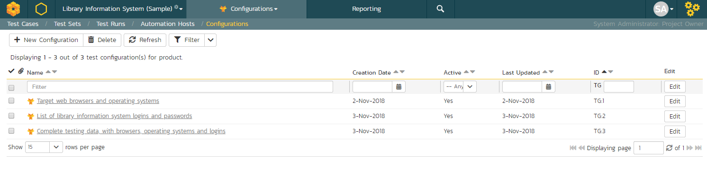
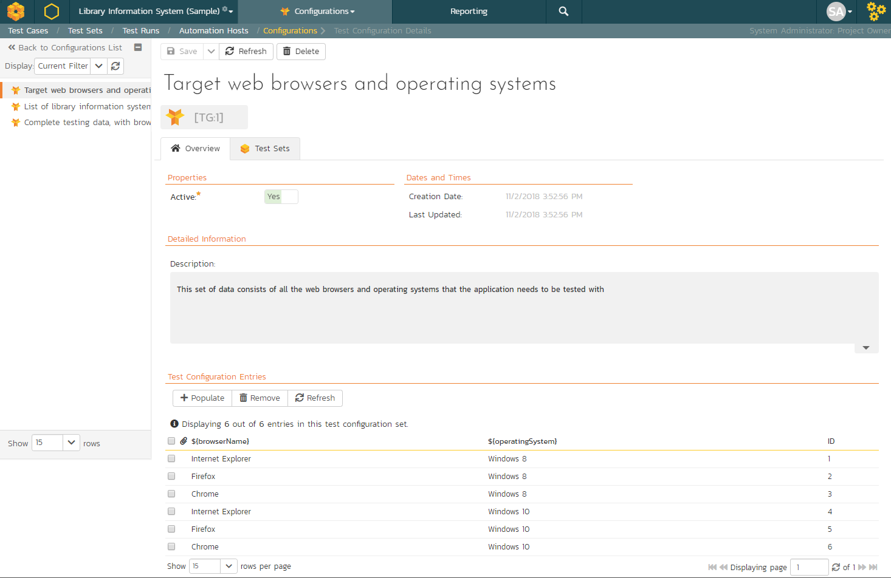
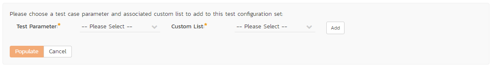
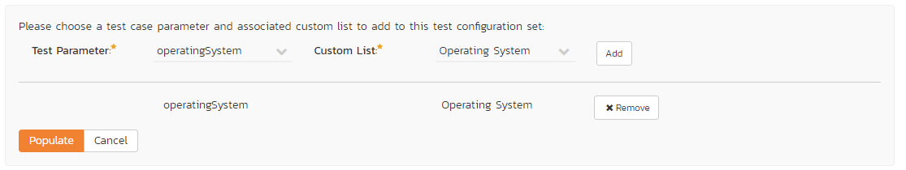
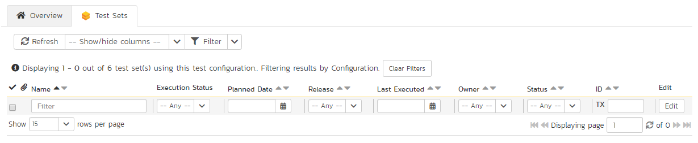

# Test Configuration Management
!!! abstract "Available in SpiraTest, SpiraTeam, SpiraPlan"

## Test Configurations List

This section outlines how to use the Test Configuration features of Spira to create and manage different configurations of parameters that tests (both manual and automated) can be run against. This offers tools to quickly create every combination of different parameters.

When you click on the Testing \> Test Configuration global navigation link, you will initially be taken to the test configuration list screen illustrated below:

The test configuration list screen displays all the test configurations for the current product, in a filterable, sortable grid. The grid displays the name, creation date, last updated date, ID, and whether the test configuration is active.

In addition, you can view a more detailed description of the test configuration by positioning the mouse pointer over the host name hyperlink and waiting for the popup "tooltip" to appear. If you click on the host name hyperlink, you will be taken to the [test configuration details page](#test-configuration-details). Clicking on any of the pagination links at the bottom of the page will advance you to the next set of hosts in the list according to the applied filter and sort-order. There is also a drop-down-list at the bottom of the page which allows you to specify how many rows should be displayed in each page, helping accommodate different user preferences.

In addition to the features described below, the toolbar also lets you:

- [download the list to a CSV file](Application-Wide.md/#download-as-csv)

### Filtering & Sorting
Read about [how to create and manage filters, and how to sort the artifact list](Application-Wide.md#filtering).

### New Test Configuration
Clicking on the "***New Configuration***" button adds a new test configuration to the bottom of the list with a default name.

### Delete
Clicking on the "***Delete***" button deletes the test configurations whose check-boxes have been selected in the host list.

### Refresh
Clicking on the "***Refresh***" button reloads the list of test configurations; this is useful when new configurations are being added by other users, and you want to make sure you have the most up-to-date list displayed.

### Edit
Each test configuration in the list has an "***Edit***" button in its right-most column. When you click this button or just
*double-click* on any of the cells in the row, you change the item from "View" mode to "Edit" mode. The various columns are made editable, and "***Save***" buttons are displayed in the last column.

If you click "***Edit***" on more than one row, the "***Save***" buttons are only displayed on the first row, and you can make changes to all the editable rows and then update the changes by clicking the one "***Save***" button. Also, if you want to make the same change to multiple rows (e.g. to change five test configurations from Active = No to Active = Yes), you can click on the "fill" icon to the right of the editable item, which will propagate the new value to all editable items in the same column.

If you want to edit lots of items, first select their checkboxes and then click the "***Edit***" button on the same row as the Filters and it will switch all the selected items into edit mode.

When you have made your updates, you can either click "***Save***"to commit the changes, or "***Cancel***" to revert back to the original information. Alternatively, pressing the <ENTER\> key will commit the changes and pressing the <ESCAPE\> key will cancel the changes.

## Test Configuration Details
When you click on a test configuration entry in the list, you are taken to the test configuration details page illustrated below:

This page is made up of three areas; the left pane is the navigation window, the upper part of the right pane contains the test configuration name and ID, and the bottom part of the right pane displays different information associated with the test configuration.

The navigation pane consists of a link that will take you back to the test configuration list, as well as a list of the peer test configurations to the one selected. This latter list is useful as a navigation shortcut; you can quickly view the peer configurations by clicking on the navigation links without having to first return to the list page. The navigation list can be switched between two different modes:

-   The list of configurations matching the current filter

-   The list of all configurations, irrespective of the current filter

The right pane allows you to view and/or edit the details of the particular test configuration. You can edit the various fields (name, description, etc.) and custom properties. Once you are satisfied with the changes, click either the "***Save***" button or the alternative options from the "***Save***" dropdown list. In addition you can delete the current automation host by clicking "***Delete***", or discard any changes made by clicking "***Refresh***".

### Overview

This tab shows the fields and description associated with the test configuration. Standard and custom fields are grouped by type (eg all date and time fields are grouped together).

### Overview -- Test Configuration Entries

This section shows the list of all entries from this test configuration, and that would be used by a test set to populate parameters. Each row represents a single unique combination of the parameters (shown on the header row of the table).

Entries can be reordered by dragging and drop one row or more. Individual entries can also be removed by checking the checkbox for that entry and then clicking "***Remove***" button.

To create new entries, first click the "***Populate***" button. This will display the following panel:

You must select a parameter from the left dropdown (which contains a list of all parameters defined in test cases in the current product), and a custom list with which to populate the parameter. Then click the "***Add***" button. For instance, the screenshot below would create a configuration using every operating system defined by the custom list "Operating System" and assigning these to the parameter called "operatingSystem."

Note: Custom lists are usually used in Spira for custom fields on various artifacts. However, you can create custom lists that are solely for the purpose of test configurations, should you so wish -- for instance, to contain a list of usernames.

Once you are happy with the lists and parameters selected, click the "***Populate***" button. This will overwrite all existing entries in this test configuration. It will create every combination based on the lists specified. So if you select two parameters, each with a list that has ten items, one hundred entries will be created in the test configuration.

### Test Sets

This tab displays the list of all the test sets that are using the test configuration. Each test set is listed together with its name, release, the date of last execution, the owner, the status, the execution status, and a link to the actual test set details. In addition, you can choose to display any of the custom properties associated with the test set.

The "Show/hide columns" drop-down list allows you to change the fields that are displayed in the test set list as columns. To show a column that is not already displayed, simply select that column from the list of "Show..." column names and to hide an existing column, simply select that column from the list of "Hide..." column names. The displayed columns can be any standard field or custom property.

You can also filter the results by choosing items from the filter options displayed in the sub-header row of each field and clicking the "***Filter***" button. In addition, you can quickly sort the list by clicking on one of the directional arrow icons displayed in the header row of the appropriate field.