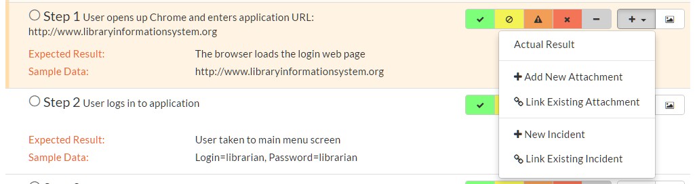
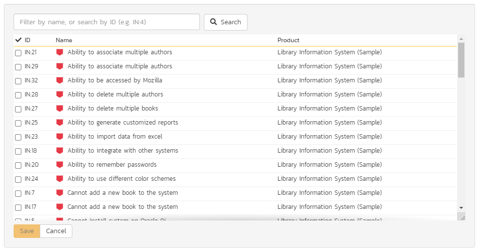

# Execution of Test Case(s)

## Introduction
!!! info "Customizing Test Execution"
    There are a number of ways that a product admin can tailor or customize test execution. Certain features can be disabled / enabled via the [testing settings](../../Spira-Administration-Guide/Product-Planning/#testing-settings) page. The below describes using test execution with default settings and flags the key places where customizing these settings can change testers' experiences. 

This section describes how a tester can follow the steps defined for a series of test cases and record what actually happened in the process. In addition, recorded failures of test cases can be used to automatically generate new incidents that will be added to the [incident tracking module](../Incident-Tracking/) and, optionally, to [tasks](../Task-Tracking/).

You start test case execution in SpiraPlan by either:

1.  selecting test cases or test sets on their respective page(s) and clicking the "***Execute***" button;
2.  clicking the "***Execute***" button on the test cases / test sets listed on your personalized home page under "My Test Cases" or "My Test Sets".

If you execute a test set then the values of the selected release and custom list properties for the test run are automatically populated from the test set, whereas if you directly execute a test case itself, those values can be chosen by the tester.

If you attempt to execute a single test case that you are in the middle of testing (from either a test case, group of test cases, or a test set) a popup will ask if you want to resume one of those existing, not-yet-completed pending test runs, or start a new test run. The popup will show the five most recent relevant pending test runs with their dates and names. 

Regardless of the route taken to launch the test execution module, the first screen that will be displayed will look like the following:

Before actually executing the test scripts, you need to select the release (if not already set) and optionally the specific build of the system that you will be testing against. You can also specify any test run custom properties that have been defined by the product owner. This ensures that the resulting test runs and incidents are associated with the correct release of the system, and that the test runs are mapped to the appropriate custom properties (e.g. operating system, platform, browser, etc.).

If you have not configured any releases for the product, then the release drop-down list will be disabled and the test runs/incidents will not be associated with any particular release. If the test run was launched from a test set, the release and any list custom properties will be pre-populated from the test set itself and will not be changeable on this screen (unless they weren't set by the test set).

Once you have chosen the appropriate release name and/or custom properties, click the "***Next***" button to begin executing test steps. By default you will see the default test execution module, shown below.

There is a second test execution view: the [exploratory test execution module](#exploratory-test-execution). This has much in common with standard test execution but differs in a number of important ways. You will automatically see this module if the following three conditions are met;

1.  you are executing a single test case (not a test set or a test case as part of a test set);
2.  that test case type has its "Is Exploratory" flag set to true / yes (in the template administration that the product uses); and
3.  you have the necessary permissions (you can create test cases)

The screen is divided up into three main areas (each is explained in more detail in the sections below):

**The header area** at the top of the page, which displays the name (if any) of the test run, along with the selected release. This section also contains buttons to control how the "test execution area" looks and functions for the tester.

**The Progress Bar**, which shows a summary graphical view of the whole test run. The progress bar also has a number of navigation buttons to help you move around the test run, or to leave the test execution page. Between the buttons are indicator blocks. For test runs with relatively few test steps, each indicator block represents a single test step. A tall dotted line is used to indicate the end of one test case and the start of another. When there are many test steps to a test run, each indicator block represents a test case. Hovering over an indicator block will display a tooltip with information about the test step or case represented. The color of the indicator block matches the color of any assigned execution status for the test step or test case (see below).

The rest of the page contains the "**test execution area**". This has details about all of the steps in the test run. It can be used to both navigate between test cases and test steps, as well as to actions on any test case or test step (for instance assigning an execution status or logging an incident). This area can look markedly different depending on which display mode a user has selected. However, in every mode, a tester will be able to readily view the name and description of the test step (and at times the parent test case), along with the description of the test step, instructions for carrying out it, and any expected results. The test can then compare the results with those listed as expected. As described below, depending on how the actual system responds, you will use the buttons and fields on the page to record what actually happened.

Note: on first accessing this screen, the user will be given a guided tour of many of the features of this page. This can be accessed at any time via the options menu (discussed below)

!!! bug "What to do if you see an error"
    Sometimes, you will not be able to start a test execution because the system is blocked and cannot continue. If this happens to you check the following:

    - if the product has a release, make sure to select a release from the dropdown at the start of test execution
    - to execute a test case it must have test steps. If a test case does not have any test steps, then you will not be able to execute it
    - if you are executing a test set and see this message "There are no test runs in this pending set to be resumed" it means that the test set is using a test configuration that is empty (it has no entries). To resolve, either remove the test configuration from the test set or edit the test configuration to populate its entries.

## Display Modes

The display mode toolbar is at the top right of the test execution screen. There are three different display modes. Each display mode has two sub-modes, using simple graphical images to indicate what they do (each pair of buttons to change sub-mode becomes visible on activating a particular display mode).

All of these modes affect how the test cases and test steps are displayed in the "test execution area". The different views have been designed to suit different ways of testing, depending on how your organization works; or the needs of a tester for a particular test.

There are three parts in the "test execution area", which are visible or hidden depending on the view.

- **Table**: this shows a list of every test case and step in the test run. The level of information it displays depends on the display mode.
- **Inspector**: this is a detailed form containing full information about a single test step (and its associated test case as needed). It also always shows the full set of actions that can be taken on that step
- **Iframe**: if you are testing an internal website (or external site that allows access via iframes) you can access it directly from this iframe browser. This allows you to have the test execution page and what you are testing open in the same web browser tab.

There are three main display modes:

**Split mode**: shows a simplified list of test steps on the left (in the table) and full details about the currently selected test step on the right (in the inspector). The sub modes in the split view either show a narrow table and wide inspector, or a wide table and narrow inspector.

**Table mode**: in this mode the table takes up the full width of the "test execution area", with both the inspector and iframe completely hidden. The list of test cases and steps displays all the information about each---the same information as is shown in the inspector. This view makes it easy to quickly scan through a number of test steps and take quick actions on many steps in sequence. The sub-modes in this view either expand or collapse any fields with more than one line or text in them. This is helpful to give either a very detailed or summary view to the table. Note too that every field that takes up more than one line will have a little expand or collapse button to its left, allowing for control of individual fields as needed.

**Mini mode**: this mode fills the entire "test execution area" with the inspector, or a combination of the inspector and iframe. The table is completely hidden in this mode. The mini mode is designed to help you maximize space for the inspector or to allow you to test a website in the embedded mini browser (in the iframe) right next to a narrow inspector.

## Navigating Around a Test Run

There are several ways to move through the different cases and steps of a particular test run. In the default "split" mode you are guided through a test run in order, however at any time, in any display mode, you can easily and quickly move steps. Note that if you click on a test case, the first test step in that test case will be selected as well.

**Using the progress bar buttons**: the left-hand side of the progress bar has three buttons: backward, forward, and play/pause (the last of these is discussed in more detail below). Clicking on the backward or forward buttons will move to the previous or next progress bar indicator block (and the associated test step or test case).

**Using the progress bar indicator blocks:** clicking on any indicator block will immediately focus the test execution area on that test step or test case.

**Using the table**: when the table view is visible (in either split mode or table mode) clicking on any item will immediately focus the test execution area on that test step or test case.

**Progressing through steps using the inspector**: when the inspector is visible (in split or mini display mode), on properly setting a status for a test step (see [Viewing and Recording Execution Details](#viewing-and-recording-execution-details) for further details), the next test step is automatically loaded into the inspector. If you were on step 3 of 5, you would be moved to step 4. If you were on the last step of a test case, you will be moved to the next test case, if one is available.

**Pause/Play button**: the time spent on every test step is recorded, by default, during test execution. This allows an accurate assessment of exactly how long a test run took to complete and these timing details are saved with the test run and its results. If you wish to pause the behind-the-scenes timer (for instance if taking a break) click the pause/play button. To resume the time click it again.

The currently selected progress bar indicator block will be outlined with a peach border. The currently selected test case and test step on the table view will be indicated with a peach bar along their left edge, and will also be highlighted in a light peach.

## Viewing and Recording Execution Details

There is a small icon to the left of each test step title and test case title. For test steps this is a circle, for test cases a square note. Once a status has been recorded for a test step (or once a test case has been assigned a status based on the statuses of its test steps) these icons will be filled with a visual indicator of its current status. The icons both become colored and are given a small symbol, based on the status. In the inspector view the associated button to that status has a gray bar beneath it.

The same colors and symbols used to show a status are used on the buttons to record a status. The colors and symbols used are: green / tick = "Passed"; yellow / stop sign = "Blocked"; orange / warning triangle = "Caution", red / cross = "Failed", gray / dash = "Not Run".

Depending on the display mode and device, the buttons may show the text name of the status along with the symbol (see examples below---the top button set is that on the inspector, the bottom from the table (when the display mode is set to table).

**NOTE**: by default all of the above buttons are visible during testing. However, a product admin can remove any or all of the "Caution", "Blocked", or "N/A" buttons on the [testing settings](../../Spira-Administration-Guide/Product-Planning/#testing-settings) page.

The various statuses when recorded against test steps will appear as below, respectively:

You will notice that softer shades are used above compared to the buttons. Similarly soft shades are also used on the progress bar indicator blocks, as shown below.

The status of a test case is determined by its test steps. If any of the steps are marked as "Caution", "Blocked", or "Fail" then the overall test case is marked with the most severe status of those statuses applied to any of the test steps from "Caution", to "Blocked", to "Fail" (e.g. if one is marked as "Caution, the test case will be marked "Caution"; but if one is marked as "Caution", and another "Blocked", the case will be marked "Blocked). If *all* the test steps passed, or if steps are marked either passed or "N/A", then the overall test case is marked as "Passed"; any other case results in the test case being marked as "Not Run".

If the expected results are indeed observed, then you simply need to click the "***Pass***" button to mark the test step as passed, and advance to the next test step, or if all the steps have passed, you can click "***Pass All***" to pass all the steps at once (this ability can be disabled by product admins in [testing settings](../../Spira-Administration-Guide/Product-Planning/#testing-settings)).

On the inspector, the "***Pass All***" button is visible via a dropdown to the right of the "***Pass***" button whenever the parent test case information is also displayed with the test step (typically only for the first step in a test case). This is illustrated in the screen shot below:

When in the table display mode, the "***Pass All***" button is shown on the right-hand side of the test case row, as illustrated below:

Below the main pane there are two optional sections. The first one allows you to log an incident in the system associated with the test step. For failures this will typically be used to log a bug relating to the failure. However even if you pass a step you can still log an incident, which may be useful for logging non-critical cosmetic items that are not serious enough for a failure to be recorded. This tab also displays any pre-existing incidents that were associated with the test step being viewed.

The second tab displays a list of attachments that are related to the current test case and/or test step. This list initially contains any documents that have been attached to either the test case in general or the test step in particular. However as you perform the testing, you can attach additional documents to this list that are relevant to the test results (e.g. screenshots of an error page); these attached documents will be associated with both the test run itself and any incidents that are created.

Once all the test steps have passed, you will be automatically be taken to the first step in the next test; if it is the last test case being executed, the <Finish\> button will be displayed instead.

If the actual results differ from those expected, you need to enter a description of the actual result observed and click one of `Fail`, `Caution`, or `Blocked` buttons (if enabled). If you don't enter anything into the actual result description box, the system will display an error message and re-prompt you again for input. By default, you will not see this prompt for passing a step, however product admins can force testers to enter an actual result when passing a step on the [testing settings](../../Spira-Administration-Guide/Product-Planning/#testing-settings) page.

In the inspector, the actual results text box is shown in the first tab below the information provided to the tester for a test step, as illustrated below:

In the table display mode, previously entered actual results are always visible (below the information provided to the tester for a test step). On attempting to mark a step as anything other than "Pass" the actual results text box will automatically be displayed.

You can also choose to manually show the actual results text box by selecting "Actual Result" option from the "+" dropdown menu.

## Saving Screenshots to a Test Step

Often, testers will want to provide visual documentation of what they have found during the testing process. A screenshot of what they are testing is a great way to do this. To add a screenshot to the results of a test step, first copy your screenshot to the clipboard. Next, paste the screenshot into the actual results text box.

## Recording Extra Information
### Incidents

In addition to logging the result of a test step, you can optionally choose to generate a new incident at the point of logging the execution status of a test step. When the incident form is visible (see below) enter a name, select a type and fill in any other required fields. The description for the new incident is automatically populated from the test step details. To add the new incident either click the `Add` button at the bottom of the incident form, or clicking an execution status button for that test step.

The newly created incident will also be linked to the test step, allowing traceability from within the incidents module. The functionality for managing incidents is described in more detail in
[Incident Tracking](../Incident-Tracking/).

If the inspector is visible, go to the "Incidents" tab. This will show any already linked incidents, show a detailed form for creating a new incident.

You can instead link the test step to an existing incident (by clicking the "***Link Existing Incident***" button). The following popup will be displayed, where you can either enter an incident ID (if known), or choose one from the list.

When in the table display mode, open the "+" dropdown menu to show options to either add a new incident or link an existing incident. Click on the option required to display the appropriate popup. Note that on clicking `Add` the incident will be immediately linked to the selected test step.

**NOTE**: via [testing settings](../../Spira-Administration-Guide/Product-Planning/#testing-settings) the product admin can require every test step to have an incident linked to it. If this setting has been enabled and the test step does NOT have an incident already AND you are not passing the step, in order to move to the next step you will need to create a new incident or link to an existing one.

### Attachments
If you need to attach documents to the test run (in addition to any screenshots), you can either attach a new or link an existing document. From the inspector, go to the "Attachments" tab to see any documents already linked, or to add a document as needed. In the table display mode, select either "Add New Attachment" or "Link Existing Attachment" from the "+" dropdown menu. See [Attachments](#attachments) for additional information about how to the different available options (e.g. either upload a document, url link, or screenshot, or to link a document or from source code).

### Tasks
By default you will not see a Task tab during test execution. But a "Tasks" tab will be visible if:

- this feature has been enabled for a product on the [testing settings](../../Spira-Administration-Guide/Product-Planning/#testing-settings) page
- you are using SpiraTeam or SpiraPlan
- you have permissions to view and create tasks

The task tab allows the tester to quickly create tasks based on the current test step. These tasks are attached to the test run as a whole, so any previously entered tasks will be visible even when changing steps. Creating a task is a light touch way of communicating with others about your findings and alerting them that some work is likely required to fix or clarify a feature. It is quicker to enter and manage than an incident.

When creating a task the following fields are available:

- Task name
- Description (if you click the link above the description box you can quickly paste in your test step information and actual result into the description field)
- Owner (optional)

Tasks are shown as a list of cards with their left edge showing their priority by color. On creation a task's status will be gray -- showing that no priority has yet been set. The title of the task can be clicked to open the details page for that task.

## Leaving the Test Execution Page

If you are not able complete the whole test run in a single session, click the "Leave" button on the right of the progress bar---shown with an eject symbol (see below). This will return you to the page where you began the execution from. You can resume testing at a later date by locating the test run on your 'My Page' under 'My Pending Test Runs' and choosing to resume testing. Note that the system will remember every result you have logged, along with the last test step you were working so you can pick up right where you left off.

Once either all steps in a test have an execution status recorded, or at least one step in each test case has been recorded with any status other than "Pass" the test run can be finished. An orange button at the far right of the progress bar with a stop symbol will appear (see below). Clicking this button will save and archive the entire test run (so it can no longer be amended) and the page will automatically exit the test execution page.

## Extra Test Execution Options

There are a number of ways that some users may wish to alter the test execution page, depending on how they work. Options to change this are available from the menu button to the right of the display buttons.

The following actions are available from this dropdown menu:

**Refresh**: this simply reloads the test run data. This is useful if other people are working on different test cases within the same test run and you want to make sure that you have the most current information about the statuses they have recorded.

**Always show test case**: by default, the inspector only shows the test case details when the first test step of a test case is displayed. Checking this item will mean that the test case details will be shown on every test step.

**Show custom properties**: by default, only a handful of system fields are shown for the test case and test step. If your organization places important and relevant information into custom fields as well, you can check this item to make them visible in the inspector for every case and step. Note that these fields will not be visible in the table display mode.

**Show guided tour**: if you missed or want to revisit the visual guided tour of the test execution page, click this button to run the tour again.

## Exploratory Test Execution

As mentioned above, there are a number of conditions that must be satisfied for a test to run in exploratory mode. Exploratory testing is designed for relatively experienced testers and rather than to record the results of a pre-determined set of steps, to instead adjust and create the testing sequence during the act of testing itself. During exploratory testing test steps can be added, removed, edited, moved freely, at any time.

Care must therefore be taken that this form of testing and of recording the results of a test are used appropriately. The conditions set by the system are one means of limiting its use.

When starting exploratory testing the main screen will resemble the one below. Note that it looks broadly similar to that for standard test execution and is made up of three different areas:

1.  a list of test steps on the left;
2.  details about the currently selected step on the right; and
3.  information at the top of the page about the test run itself (it's name and description, release, and how many steps it contains), along with a mini toolbar. In exploratory testing there is no progress bar, or options to layout the page in different views.

All fields in the right hand details area, or the top part of the page can often be edited. Their contents and associated label will be grayed out if they are read only fields (for instance if they are information from a custom property). To edit a field, click on it, change the text as required, then click out of the field. The information will be automatically saved. Note that any test steps that come from a link test case will be read only and as such their contents cannot be edited, nor can they be deleted.

Just like with normal test execution, you can navigate between steps using the list of steps on the left; and steps can be passed, or failed using the execution status toolbar on the right hand section of the page. The unique actions you can take on test steps (besides editing their fields) are below:

-  **add a step**: click on the plus button beneath the list of test steps on the left

-  **clone an existing step**: when you hover a test step in the list, you will see a button appear on its right. Click on this to show a mini menu with an option to clone the step. This will create a clone, at the bottom of the list of test steps, with a blank actual result

 

 

-  **delete an existing step**: if you have more than one test step, any editable test step can be deleted. Click on the button for that step (as explained above) and click delete from the mini menu.

-  **move an existing step**: to move an editable step click and drag it to the desired location in the test step list.

Below the main detailed section there are two or three tabs. SpiraTest users will only see two tabs -- incidents and attachements. SpiraPlan users may see the additional  tasks tab (if enabled by the product admin). 

The toolbar at the top right of the page has a number of buttons:

-  **Pause/Play button**: the time spent on every test step is recorded, by default, during test execution. This allows an accurate assessment of exactly how long a test run took to complete and these timing details are saved with the test run and its results. If you wish to pause the behind-the-scenes timer (for instance if taking a break) click the pause/play button. To resume the time click it again.
-  **Leave button**: as with normal test execution, if you are not able complete the exploratory test in a single session, click the "Leave" button---shown with an eject symbol. You can resume testing at a later date by locating the test run on your 'My Page' under 'My Pending Test Runs' and choosing to resume testing. Note that the system will remember every result you have logged, along with the last test step you were working so you can pick up right where you left off.
-  **Finish button**: once either all steps in a test have an execution status recorded, or at least one step has been recorded with any status other than "Pass" the test run can be finished. An orange with a stop symbol will appear (see below). Clicking this button will give you two options. "Update Test Case" will update the test case execution status, and also change its name, description, and test steps to reflect those on this page (adding, deleting, moving, editing as necessary). "Just Finish" will only change the execution status of the test case only---leaving all details of the test case unchanged. Either option will archive the entire test run (so it can no longer be amended) and the page will automatically exit the test execution page.

-  **Options**: the right most button on the toolbar gives additional options for customizing the page. Specifically a user can decide what fields they wish to show or hide based on how they prefer to work in exploratory testing mode. Additionally this menu let's you revisit the introductory tour shown the first time the page is visited.

