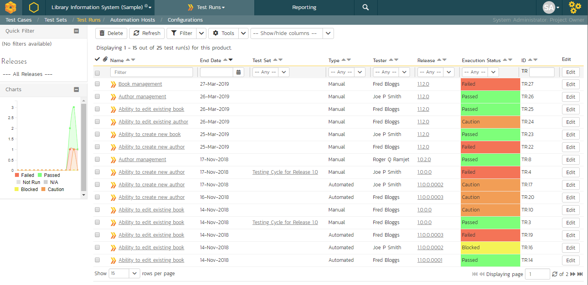
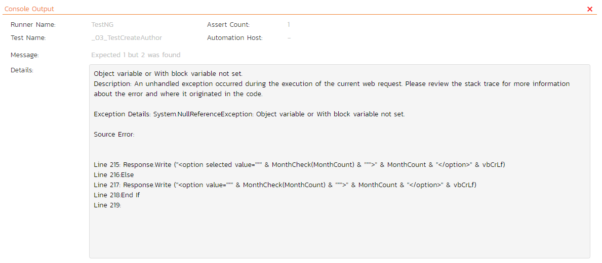
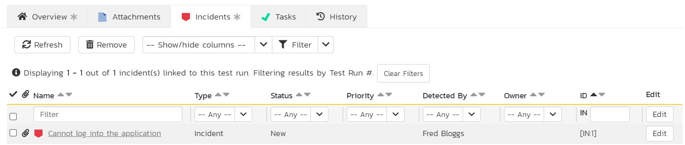
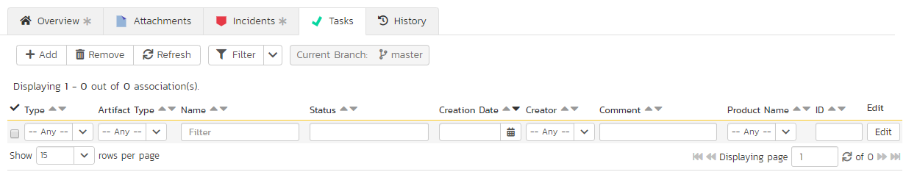

# Test Run Management

## Test Run List

When you click on the Testing \> Test Runs global navigation link, you will be taken to the test run list screen illustrated below:

The test run list screen displays all the individual test executions performed in the current product, in a filterable, sortable grid. The grid displays the test run number together with fields such as execution status, name, assigned tester, execution date, test set, specified release, etc. The choice of columns displayed is configurable per-user, per-product, giving extensive flexibility when it comes to viewing and searching test runs.

In addition, you can view a more detailed description of the test run by hovering over the test run name hyperlink to display a "tooltip". If you click on this test run hyperlink, you will be taken to the test run details page described in the next section. Clicking on any of the pagination links at the bottom of the page will advance you to the next set of test runs in the list according to the applied filter and sort-order. There is also a drop-down-list at the bottom of the page which allows you to specify how many rows should be displayed in each page, helping accommodate different user preferences.

The sidebar shows a chart of the last 30 days of test run activity, broken down, for each day, by the test run status. This is a useful chart to quickly track the testing activity of the product -- this is not the same as overall product status. (For info, this chart matches that on the Product Homepage's  Test Run Progress widget)

In addition to the features described below, the toolbar also lets you:

- [download the list to a CSV file](Application-Wide.md/#download-as-csv)

### Refresh
Clicking on the "***Refresh***" button simply reloads the test run list. This is useful as other people may be completing test runs, and after stepping away from the computer for a short-time, you can click this button to make sure you are viewing the most current test run list for the product.

### Show / Hide Columns
This drop-down list allows you to change the fields that are displayed in the test run list as columns for the current product. To show a column that is not already displayed, simply select that column from the list of "Show..." column names and to hide an existing column, simply select that column from the list of "Hide..." column names. This is stored on a per-product basis, so you can have different display settings for each product that you are a member of. The fields can be any of the built-in fields or any of the custom properties set up by the product owner.

### Filtering & Sorting
Read about [how to create and manage filters, and how to sort the artifact list](Application-Wide.md#filtering).

### Printing Items
To quickly print a single test run or list of test runs you can select the items' checkboxes and then click the Print icon. This will display a popup window containing a printable version of the selected items.

## Test Run Details
When you click on any of the individual test runs in the test run list, you are taken to the Test Run details page (not to be confused with the Test Case details page) shown below:

This page consists of three panes:

1.  The left hand navigation pane displays a list of related test runs with a color indicator for their current execution status. The display dropdown will let you choose whether the list contains test runs that are for the same release, test case or test set, or are just a filtered/unfiltered list based on your last search in the main test run list page.

2.  The top right area shows headline information about the test run details of the test run itself

3.  The main pane on the right displays tabs for detailed information about the test run, and its associations. The overview tab is initially loaded and shows the name, description, release, test set, estimated and actual duration, tester name, test run type, automation host fields, along with others, including custom fields. Underneath this is shown the list of test run steps, and any console output from a test automation engine such as Rapise, NUnit, JUnit, QTP, or Selenium.

### Re-running a Test

There is a button on the main test run toolbar called
'***Re-Test***". If you click this button, SpiraPlan will launch the test execution wizard for this specific test case, with current release and/or test set already selected for you. This is a handy way of quickly re-running a failed test that has been addressed by the developers. NOTE: this button will not display if the product does not allow you to execute test cases (instead only letting you execute test sets).

### Editing a Test Run

When reviewing the test run, you may find that you need to change the results of the test run (e.g. the user selected the wrong release or custom property value). Many of the fields are editable at a later date, and to make changes, just modify the appropriate fields and click any "***Save***" button.

### Deleting the Test Run

If you need to delete a test run that was erroneously captured, all you need to do is click on the link to access the invalid test run and then click the "***Delete***" button to remove it from the system. This will then force the system to update the status of the test case itself from the other logged test runs.

### Test Run Steps

In the case of a manual test run, this section displays all the steps of the test case *as they appeared during the test run in question.* This means that if the test steps were changed after running the test, the list here will reflect the original information.

Each test run step is displayed along with the description, expected result, suggested sample data, a link back to the current version of the test step in question, the actual result and the execution status for this step *in this particular test run*. Where an actual result was recorded, an additional "***View Incidents***" button will be displayed. This allows you to view any incidents that are associated with this particular test run step:

Clicking on the link will open up a popup dialog box that displays a list of all the incidents associated with the selected test run step. Each of the incidents listed will reflect the most up-to-date information regarding that incident, including its type, status, priority, name, assigned owner, detection date and who first detected it. Clicking on the incident name will take you to the details page for that incident, which is described in [Incident Tracking > Incident Details](Incident-Tracking.md/#incident-details).

If you have modify all permissions for test runs you will be able to click the small link button at the right of the test run step. This is the "link existing incident" button. This will display a popup that lets you link an existing incident to the selected test run step.

### Console Output

In the case of an automated test run, this tab will display the details of the test run as reported from the test runner application. These details will vary depending on the type of automated tool being used, but typically they include the name of the automated test runner, the number of assertions raised, the name of the corresponding test case in the tool, the status of the test run and a detailed error message, and the stack-trace in the case of a failure. An example test run as reported from the NUnit automated test runner is illustrated below:

Details on how to use SpiraPlan® in conjunction with an automated testing tool are provided in the *SpiraPlan® Automated Testing Integration Guide,* which can be downloaded from the Inflectra®
website.

### Attachments

Read about [how the attachments tab works](Application-Wide.md#attachments)

### History

Read about [how the history tab works](Application-Wide.md#history)

### Incidents

This tab displays the list of incidents associated with the current test run. The incidents have either been linked during test execution or can be linked to a test run step from the Overview tab of the test run details page.

Each incident is listed together with (by default) the type, status, priority, name, owner, detector, detection date and a link to the actual incident details. On this tab you can perform the following actions:

- Customize the fields shown using the **Show/Hide Columns** dropdown
- **Refresh**: updates the list of incidents from the server, useful if other people are adding incidents to this release at the same time
- **Remove**: if you can modify the current test case you can remove any selected incidents by clicking the "Remove" toolbar button. This will remove all links between the incident and any relevant test run steps of the test run. Note: this feature is currently only available if baselining is disabled for the product.
- **Filter** the results by choosing items from the filter options displayed in the sub-header row. You can use the filter dropdown to remove the filter, or clicke the "Clear Filters" button. You can also sort the list by clicking on one of the directional arrow icons displayed in the header row of the appropriate field.
- **Edit**: if you can bulk edit incidents you can edit the incidents. Click the "Edit" button to the right of an incident, or select incidents using the checkbox and click the edit button at the top of the table to edit incident(s) inline.

### Tasks

This tab is only visible to users of SpiraPlan or SpiraTeam. It shows the list of tasks associated with the current test run. Tasks can only be added to a test run created from an exploratory test case. These tasks will have been logged during the execution of the test.

