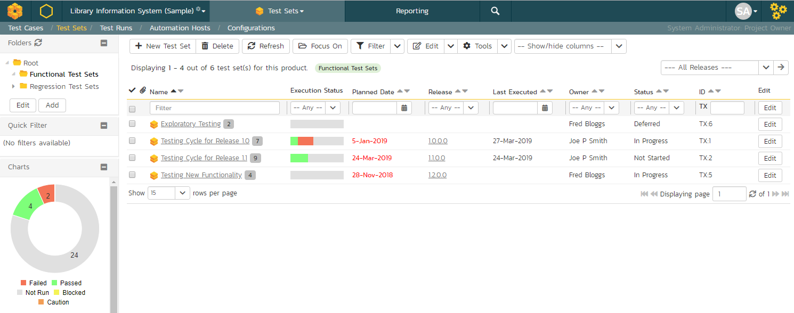
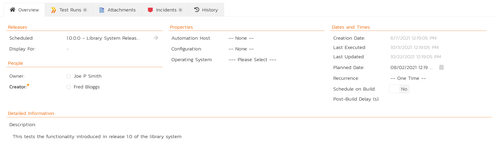
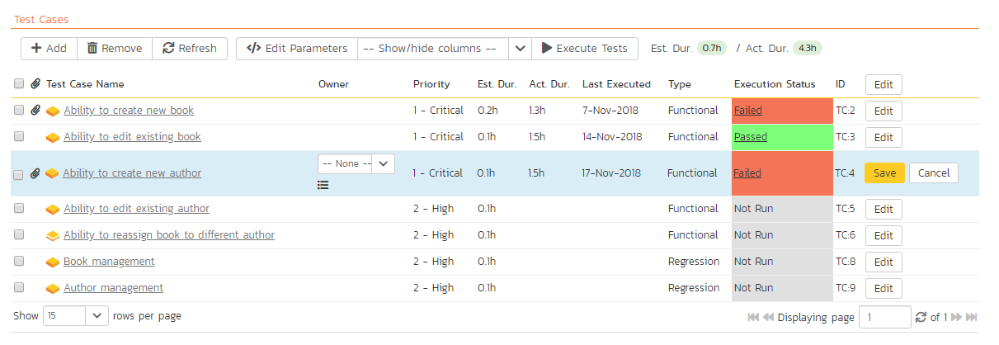
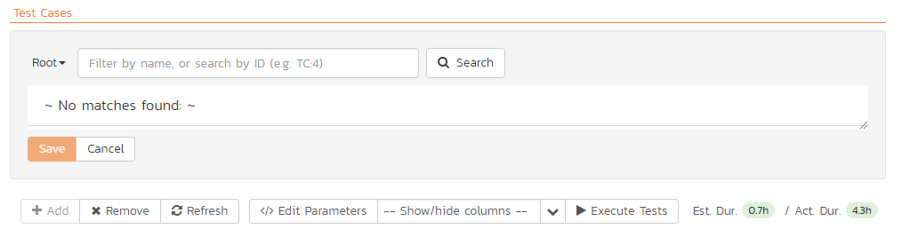

# Test Set Management
| Artifact icon and name                   | Token | Description                           |
| ---------------------------------------- | ----- | ------------------------------------- |
|  &nbsp; Test Set | TX    | Combine test cases together to create |

## Feature Overview and Tips
As well as being able to organize test cases into folders, you can also create separate groupings of test cases called test sets which can then be assigned to testers as a package. Test sets are a way to group test cases together. They are useful to manage larger and more complex manual test executions. Additionally, test sets let you automate test case execution if you are using automation tools like [Rapise](https://www.inflectra.com/Rapise/), so you can schedule tests to run automatically. 

=== "Tips and Tricks"
    - Use test sets to organize a series of test cases in a specific order
    - If your needs are met with test cases, there is no need to use tests sets - use them when you need more than test cases alone can do
    - You can add the same test case multiple times to the same test set if you want
    - Test sets should contain a focused number of test cases that cover a specific feature. 
    - Try and keep the total number of test cases in a test set to around 10-20
    - Set the release on a test set to make it easier to record results against the right release
    - To track test runs from test sets against test coverage for a release add the test cases to the release directly 

=== "Key Artifact Links"
    - **Releases**: like most artifacts, test sets are set with a single release at a time that they will run and record results against
    - **Test Cases**: test cases are the core building block of test sets
    - **Configurations**: using test configurations on a test set is an advanced feature that lets you test many different test scenarios dynamically

=== "Association Chart"
    ``` mermaid
    graph TD
    TX{{"`**Test Set**`"}} --> RL(Release);
    TC(Test Case) --> TX;
    TG(Configuration) --> TX;
    ```


## Test Set List
To view the list of test sets for a product, click on Testing > Test Sets in the global navigation:



The test set list consists of hierarchical list of all the test sets in the current product organized into folders. The structure is very similar to the folder structure in Microsoft Windows® Explorer, and users will find this very familiar and intuitive to use. A folder tree is on the left hand side---with triangle icons to expand / collapse each folder. Contents of the selected folder (the one marked in bold on the folder tree) are shown on the right hand side.[^folder-url]

When you create a new product, this list will initially be empty, and you will have to use the "***New Test Set***" button to start adding test sets to the system.

Each test set is listed along with the number of test cases contained (in parenthesis), the aggregate execution status of the contained test cases (using a graphical bar-chart), the date that the test set has been scheduled to be executed (planned date), the date that it was last executed, the person currently assigned to execute the test set, the status and the test set id. Clicking on a test set's hyperlink will take you to the test set details page for the item in question.

Note: the test set status is separate from the execution status of the individual test cases and represents where the test set is in its lifecycle:

- **Not Started**: The test set has been assigned to a tester or automation host and no testing has been performed.
- **In Progress**: The test set has been assigned to a tester or automation host and the testing is in progress.
- **Completed**: The test set was previously assigned and has since been executed (either the full test set was executed, or only some of its test cases were selected for execution) with the tester concluding testing by clicking the Finish button in the test execution wizard.
- **Blocked**: The tester or automation host was unable to execute the assigned test set because of a failure external to the actual test case.
- **Deferred**: The test set was previously assigned, but: execution had not been completed (at least one test case does not have a recorded execution status); and the Tester deleted the Pending Test Run entry from their My Page.

In addition to the features described below, the toolbar also lets you:

- [download the list to a CSV file](Application-Wide.md/#download-as-csv)

### Delete
Clicking on the "***Delete***" button deletes the currently selected test sets. It will delete the association between the test set and its contained test cases, but it will not delete the test cases themselves.

### Refresh
Clicking on the "***Refresh***" button simply reloads the list of test sets. This is useful if other people are making changes to the test set list and you want to make sure that you have the most current version.

### Focus On
The "***Focus On***" button is a useful when you have performed a filter on the list of test sets and then wish to quickly navigate to the folder of a particular test set shown in the list. After selecting a test set, clicking the button will move the left hand folder tree to the folder that contains the selected test set. It will also change the list view on the right to show all of the test sets within that folder (i.e. the selected test set and its siblings).

### Edit
Each test set in the list has an "***Edit***" button in its right-most column. When you click this button, *double-click* on any of the cells in the row, or select a row and click the "***Edit***" button in the toolbar at the top of the page. This will change the item from "View" mode to "Edit" mode. The various columns are made editable, and "***Save***" and "***Cancel***" buttons are displayed in the last column:


If you click "***Edit***" on more than one row, the "***Save***" buttons are only displayed on the first row, and you can make changes to all the editable rows and then update the changes by clicking the one "***Save***" button. Also, if you want to make the same change to multiple rows (e.g. to change the owner of five test sets from "Fred Bloggs" to "Joe Smith"), you can click on the "***fill***" icon to the right of the editable item, which will propagate the new value to all editable items in the same column.

If you want to edit lots of items, first select their checkboxes and then click the "***Edit***" button on the same row as the Filters and it will switch all the selected items into edit mode.

When you have made your updates, you can either click "***Save***" to commit the changes, or "***Cancel***" to revert back to the original information. Alternatively, pressing the <ENTER\> key will commit the changes and pressing the <ESCAPE\> key will cancel the changes.


### Show / Hide Columns
This drop-down list allows you to change the fields that are displayed in the test set list as columns for the current product. To show a column that is not already displayed, simply select that column from the list of "Show..." column names and to hide an existing column, simply select that column from the list of "Hide..." column names. This is stored on a per-product basis, so you can have different display settings for each product that you are a member of. The fields can be any of the built-in fields or any of the custom properties set up by the product owner.

### Filtering & Sorting
Read about [how to create and manage filters, and how to sort the artifact list](Application-Wide.md#filtering).

### Viewing the Test Status for a Release
By default, when you view the list of test sets, it will display an aggregate status for all releases of the product. This means that the list shows:

- all the test sets in the system (regardless of which release they apply to) 
- for each test set, the execution status will reflect the most recent test run - regardless of which release it was for
- next to the name of each test set there is a little badge with a number in it - this is the number of test cases currently in the test set 

If you change what release to display data for, by selecting a release from the dropdown in the top right, the list will show:

- only the test sets that were executed against that release 
- for each test set, the execution status will reflect the most recent test run against that release (and any child sprints if applicable)
- next to the name of each test set the little badge with a number in it shows the number of test cases that were in the test set when it was last run against that release
- test sets that have not been run for this release but have run against other releases may show as "Not Run" since they've not been run (yet) for this specific release 


As a shortcut, when you select a specific release for viewing, subsequent execution of any of the test sets via the Tools \> Execute Tests menu option will default the test run to the selected release.


### Copying Test Sets
To copy one or more test sets, select the check-boxes of the test sets (or test set folder) you want to copy and then select Edit > Copy Items from the menu. This will copy the current test set / test set folder selection to the clipboard. Then select the place you want the test sets to be inserted and choose the Edit > Paste Items option.

The test sets will now be copied to the destination you specified. The name of the copied test sets will have " - Copy" added to the end to distinguish them from the originals. If you are copying test set folders, only the top level folders' name(s) will will have " - Copy" added to the end - the new copies of items in the folder will have the same names as the originals.


### Moving Test Sets
There are two options for moving test sets or folders:

1.  Click on the test set/folder you want to move in the right hand list and drag it to the folder in the left hand folder tree you want it moved to. The background of the new folder will change to show where it will be inserted:


Once you have the test set/folder positioned at the correct place that you want it inserted, just release the mouse button. To move multiple items simply select their checkboxes and then drag-and-drop one of the selected items.

2.  Alternatively you can simply select the check-boxes of the test sets you want to move and then select the Edit \> Cut Items menu option. This will cut the current test set selection to the clipboard. Then select the place where you want the test cases to be inserted and choose the Edit \> Paste Items option. The test sets will now be moved into the destination specified.

### Printing or Exporting Items
To quickly print a single test set, test set folder or list of test sets you can select the items' checkboxes and then click Tools \> Print Items. This will display a popup window containing a printable version of the selected items.

Alternatively you can save the selected items into a number of formats, available via the Tools dropdown.

### Right-Click Context Menu
SpiraPlan® provides a shortcut -- called the *context menu* - for accessing some of the most commonly used functions, so that you don't need to move your mouse up to the toolbar each time. To access the context menu, right-click on any of the rows in the test set list and the following menu will be displayed:


You can now choose any of these options as an alternative to using the icons in the toolbar.


## Test Set Details

When you click on a test set item in the test set list described in the previous section, you are taken to the test set details page illustrated below:


This page is made up of three areas:

1.  the left pane displays the test set folders and list navigation
2.  the right pane's header, which displays: the operations toolbar; the [folder the test set is in](Application-Wide.md#breadcrumbs); the editable name of the selected test set; and the info bar (with a shaded background)
3.  the right pane's tabbed interface with rich information related to the test set

The navigation pane consists of a link that will take you back to the test set list, as well as a list of the peer test sets to the one selected. This latter list is useful as a navigation shortcut; you can quickly view the detailed information of all the peer test sets by clicking on the navigation links without having to first return to the test sets list page. The navigation list can be switched between three different modes:

-   The list of test sets matching the current filter
-   The list of all test sets, irrespective of the current filter
-   The list of test sets assigned to the current user

The operations toolbar lets you, amongst standard operations like save and delete:

- create a duplicate of the current artifact by clicking `Clone` - note that:

    - standard fields (like type and owner, except 'configuration' and 'scheduled on build') and custom fields are cloned
    - description (with formatting) are cloned
    - file attachments are cloned
    - associated test runs and incidents are *not* cloned
    - followers, comments, execution status and history are *not* cloned

- export to a number of files formats, to a different product, or print it via one of the options in the `Tools` dropdown menu

- the `Execute` button will execute all the test cases in the set against the release specified in the test set and then take you to the
[test execution screen](./Test-Case-Management.md/#execute-test-cases)
- Emailing: read about [emailing an artifact to colleagues using Spira](Application-Wide.md#emailing)
{: #emailing}
- Followers: read about [how to add and manage followers to an artifact](Application-Wide.md#followers)
{: #followers}

At the top of the pane, you will see the test set's:

- name
- status
- current execution status in a mini bar chart - this matches the execution status on the list page and is determined based on if you are [viewing the Test Status for a release or not](#viewing-the-test-status-for-a-release). You can see the release currently being displayed in the Overview tab.

Initially the pane will be set to the "Overview" tab, but it can be switched to "Test Runs", "Attachments", "Incidents" and "History" tabs. Each of these is described separately below.

### Overview -- Details

The top part of this tab displays the various standard fields and custom properties associated with the test set. Fields (both standard and custom) are grouped under the collapsible headings (marked by orange text and underline) in the screenshot below. For instance, all fields regarding releases are in the "Releases" group and dates are grouped together in the "Dates and Times" area.

The **Display For** field in the "Releases" section tells you what release execution status results are displaying for the test set. This field controls the results for the test set overall and also for its individual test cases. This field is read only. To change it, you must use the "Display For" dropdown on the list page.

The Detailed Information section contains the long, formatted description of the test case, as well as any rich text custom fields. You can enter rich text or paste in from a word processing program or web page. Clicking on the shaded areas of one of these detailed fields will display the rich text toolbar.



If you have **test configuration sets** defined in your product, you can assign them to a specific Test Set and use them for both manual and automated testing by setting the **Configuration** dropdown value. If you have a test configuration associated with the test set, when you execute the test set, SpiraPlan will generate a test run entry for each of the test configuration entries multiplied by each of the test cases in the set.

The Description section contains the long, formatted description of the test set. You can enter rich text or paste in from a word processing program or web page.

!!! info "Manual or Automated Test Sets"
    Test Sets can be marked as either for "Manual" or "Automated" test runs (via the "Type" field). 

    - Manual: the test set can be executed (manually) by a tester from their "My Page". 
    - Automated: the test set will be executed by the automation host you specified.


!!! question "How is the Test Set Last Execution Date Calculated"
    The test set last execution date varies based on the release being viewed (if any). It is calculated by:
    
    - get the most recent test run for each test case in the test set (for the release being viewed if selected, otherwise across any release)
    - look at the execution dates for those test cases 
    - find the earliest execution date 
    - set the test set's last execution date from this value

    **For example**: imagine you are viewing a test set against release "bravo", and that test set has three test cases. Spira looks for the most recent time each test case was run against release "bravo". Let's imagine that the most recent test run of each test case in the test set are: 14 March, 23 February, and 2 March. The test set's last execution date will be 23 February because it is the earliest date of the three.

    In this way, the last execution date field can help test managers identify potentially outdated test runs of the test set more easily. If instead, the last executed date was the most recent execution date of one of the relevant test runs, it would be very hard to know if part of the test set had not been tested recently enough.


#### Scheduling Test Sets
How do you say *when* the test set should execute? You have two options.

Use the *Planned Date* field:

- For manual test sets, only the date component is used. 
- For automated tests you also set the time. This time is based on the time zone of the application (for reference, this is shown in the footer of the application on all pages).
- You can additionally specify a **recurrence schedule** for the test set by changing the recurrence dropdown from "One Time" to "Hourly", "Daily", etc so that SpiraPlan executes the same test set according to the specified frequency.

Use the **Schedule on Build** field:

- This will tell SpiraPlan to automatically set the *Planned Date* to the exact date and time that a relevant build completes
- Using the **Post Build Wait Time** field you can add an offset (in seconds) for how long after the build to kick off the test sets
- Only builds that finish against the release or sprint that the test set is set to will trigger the test set to execute
- With this method, test sets can be setup to automatically run only after the build completes and at the exact delay you need.

### Overview - Parameters

Test cases can have [parameters](Test-Case-Management.md/#parameters) associated with them. This enables one test case to be called several times and have different parameters passed in each case, making the operation different. E.g. you could have a generic "login to application" test case that others call as an initial step, which could be provided with different login information depending on the calling test case. In addition these parameters may be used by certain test automation engines.

The Parameters section on the test set page lets you set a shared value for all of the parameters contained within the different test cases of the test set. The screenshot below shows that there are three parameters contained in the test cases that have been set at the test set level. In this example, every case that has a Parameter called 'browserName' will have its value set to 'Safari'. This is a quick way of setting values for many test cases at once. Test Set Values will override any default values of a Parameter (defined for each specific test case).


You can add any additional Parameters not already set by clicking on the "***Add Parameter Value***" button. In this example, you can see that one of the parameters not yet set is called 'url'.


You can also delete an existing Parameter specified for the whole test set by clicking the "***Delete***" button in the Operations column of the Parameter in question. Clicking the "***Edit***" button will let you alter the Test Set Value.


Note that the Default Value is derived from the test cases that use a specific Parameter. It is shown in this table for information only---to help testers know what value will be run in the absence of specifying a Test Set Value.


### Overview - Test Cases

This section displays the list of test cases currently contained within the test set. You can add, remove, reposition and remove test cases from the list. The execution status displayed next to each test case is the most recent execution status of the test case *when run in the context of the current test set and, if specified, the release we are displaying data for*.


To move the test cases, click the test case icon and drag it to the appropriate position in the list.

To modify an existing Test Case click the "***Edit***" button in the right-most column, or *double-click* on the cells in the row. That will switch the selected row into Edit mode. The Owner and Planned Date fields (if visible) can then be set at the test case level. Setting the owner field here is useful if you want the different test cases in the set to be executed by different testers (e.g. in integrated, scenario tests).



To add a new test case to the Test Set, click on the "***Add***" button to display the panel:



First, select the folder containing the test cases desired. You can then select the checkboxes of the individual test cases that you want to add to the test set (note: clicking the checkbox in the header row of the table will select ever test case in the currently selected folder). Once you have selected the desired items, click the "***Save***" button to add them to the test set.

As discussed above in [Overview - Parameters](#overview-parameters), test cases can have parameters defined with specific values. These are created on the [Test Case details page](Test-Case-Management.md#test-case-details). If you need to specify different values for a parameter for different test cases in the test set, you can override both any default parameter values and any test set parameter values. To do so, click "Edit Parameters" for the required test case in this view. You can do this by either select the checkbox of a test set and click "Edit Parameters" at the top of the section, or right-click on the test case and choose "Edit Parameters":


You can then specify the values of the parameters that the test set will pass to this specific test case. Once you have entered / modified the values, click "***Save***" to commit the changes.

!!! question "Matching execution status of test cases to the test set"
    The execution status shown for the test set at the top of the page is calculated from the most recent test run of the whole set for the release being displayed for (or most recent across all releases, if displaying for all releases). The execution status for the test cases in the test set is calculated in the same way.

    As you change your test set over time, you may add and remove test cases. The list of test cases is always the currently included test cases. This means that if you are showing results for an old release, and since then you have REMOVED test cases from the test set, you will not see those test cases and their execution statuses in this list. The same happens if you have since ADDED test cases: they will show as Not Run, even if the test set's execution status has no Not Runs. When it was executed these new test cases weren't there to be run.
    
    In this way, the overall test set execution status may not always match what you see in the test case list. 

#### Cross Product Test Cases
If another product [shares test cases](../Spira-Administration-Guide/Product-General-Settings.md/#product-associations) with the current product, then you will be able to add any test case from the other product (or products) to a test set in the current product.

Cross product test cases in test sets let you build modular and powerful test sets that draw in test cases from multiple different locations.

To add a test case from another product to a test set, click the "Add" button and select the product from the dropdown that says "Current Product". If you do not see this dropdown it means that no product is sharing test cases with the current product.

In many ways cross product test cases will feel the same to a tester as another test case in the test set:

- parameters will be visible and can be edited
- parameters set on the test set will cascade to the test case
- you can set the test case owner
- during execution, all test cases from all products appear as normal
- you can add actual results, screenshots, attachments, incidents, and tasks as relevant to any test run step- attachments, incidents, and tasks will be linked to the test run and visible on the test run pages
- results of the execution are reflected against the test set's execution status when showing results for all releases (and will include cross product test cases)
- test set reports include relevant test cases and test runs where possible
- test run reports include all associated attachments and incidents 
- cloning a test run brings over all associations and test cases, including those from other products

In reality, a test case from another product always lives in that other product, which presents some limitations to how cross product test sets work. Specifically:

- a tester must have the necessary permissions to execute test runs in each of the products with test cases in the test set
- the test run from a cross product test case:

    - lives in the product of the test case, not that of the test set
    - can not have any release set against it, because the release the test set runs against does not exist in the test run's product
    - will only get custom properties set during execution if its product uses the same template as that of the test set
    - cannot, after testing, have an attachment or an incident manually added to them

- attachments (including screenshots), incidents, and tasks against a test run are part of the test set's product, not the test run's product
- a user can only access linked artifacts to a test run (like incidents) if they have the correct permissions in the test set's product, as well as that of the test run
- the test set's execution status when showing results for a specific release will exclude any results from cross product test cases (because those test runs do not have any release data as explained above)
- incidents created in the test set's product are not visible against the test case, if the test case is in a different product to the test set (this is a current known limitation)
- when cloning a product, cross product test cases are not copied over to the new test sets. Also, any attachments, incidents, and tasks created against test runs from other products are not correctly linked to the test set (note: this will be resolved in a future release) 

### Overview - Comments
Read about [how the comments works](Application-Wide.md#comments)

### Exporting a Test Set to a different product

Read about [how to export artifacts from one product to another](Application-Wide.md/#export-to-another-product).

This will copy the Test Set along with its Test Cases and Test Steps. In case any of the Test Cases have a linked Test Step, they will also be copied to the destination product. Parameters will also be exported. 

Please note:

- Copied Test Cases are placed in a folder named after the Test Set token (`[TX:123]`)
- If you export the same Test Set more than once, it will get duplicated in the destination product as it will its test cases
- These properties of the Test Set are not exported: Automation Host, Test Configuration
- The cross-product Test Cases of the Test Set are not exported

### Test Runs

This tab displays the list of all the test runs executed against the test set. Each test run is listed together with the date of execution, the name of the test case, the name of the tester, the release/version of the system that the test was executed against, the overall execution status for the test case in that run and a link to the [actual test run details](./Test-Run-Management.md/#test-run-details). In addition, you can choose to display any of the custom properties associated with the test run.


The "Show/hide columns" drop-down list allows you to change the fields that are displayed in the test run list as columns. To show a column that is not already displayed, simply select that column from the list of "Show..." column names and to hide an existing column, simply select that column from the list of "Hide..." column names. The displayed columns can be any standard field or custom property.

You can also filter the results by choosing items from the filter options displayed in the sub-header row of each field and clicking the "***Filter***" button. In addition, you can quickly sort the list by clicking on one of the directional arrow icons displayed in the header row of the appropriate field.


### Attachments

Read about [how the attachments tab works](Application-Wide.md#attachments)


### History

Read about [how the history tab works](Application-Wide.md#history)


### Incidents

This tab displays the list of incidents associated with the current test set. Each incident will either have been: created during the execution of a test case in the test set (and are thereby linked to one of the test runs); or manually linked to one of the test steps in a test case of the set.


[^folder-url]: when navigating to folders (for all artifacts that support them), the URL in your browser's address bar will change. Each folder has a unique, sharable URL that you can give to someone to display the list of artifacts with the appropriate folder selected. You can also open up multiple folders in different browser tabs and easily toggle between them from the same browser.