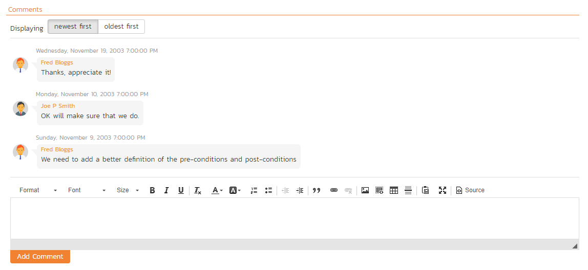

## Test Set List

As well as being able to organize test cases into folders, you can also create separate groupings of test cases called test sets which can then be assigned to testers as a package. To view the list of test sets for a product, click on Testing \> Test Sets in the global navigation:

The test set list consists of hierarchical list of all the test sets in the current product organized into folders. The structure is very similar to the folder structure in Microsoft Windows® Explorer, and users will find this very familiar and intuitive to use. A folder tree is on the left hand side---with triangle icons to expand / collapse each folder. Contents of the selected folder (the one marked in bold on the folder tree) are shown on the right hand side.[^folder-url]

When you create a new product, this list will initially be empty, and you will have to use the "***New Test Set***" button to start adding test sets to the system.

Each test set is listed along with the number of test cases contained (in parenthesis), the aggregate execution status of the contained test cases (using a graphical bar-chart), the date that the test set has been scheduled to be executed (planned date), the date that it was last executed, the person currently assigned to execute the test set, the status and the test set id. Clicking on a test set's hyperlink will take you to the test set details page for the item in question.

Note: the test set status is separate from the execution status of the individual test cases and represents where the test set is in its lifecycle:

-   **Not Started** -- The test set has been assigned to a tester or automation host and no testing has been performed.

-   **In Progress** -- The test set has been assigned to a tester or automation host and the testing is in progress.

-   **Completed** -- The test set was previously assigned, but has now been completed, with all test cases having an execution status recorded and the tester having clicked the Finish button in the test execution wizard.

-   **Blocked** -- The tester or automation host was unable to execute the assigned test set because of a failure external to the actual test case.

-   **Deferred** -- The test set was previously assigned, but: execution had not been completed (at least one test case does not have a recorded execution status); and the Tester deleted the Pending Test Run entry from their My Page.

### Delete

Clicking on the "***Delete***" button deletes the currently selected test sets. It will delete the association between the test set and its contained test cases, but it will not delete the test cases themselves.

### Refresh

Clicking on the "***Refresh***" button simply reloads the list of test sets. This is useful if other people are making changes to the test set list and you want to make sure that you have the most current version.

### Focus On

The "***Focus On***" button is a useful when you have performed a filter on the list of test sets and then wish to quickly navigate to the folder of a particular test set shown in the list. After selecting a test set, clicking the button will move the left hand folder tree to the folder that contains the selected test set. It will also change the list view on the right to show all of the test sets within that folder (i.e. the selected test set and its siblings).

### Edit

Each test set in the list has an "***Edit***" button in its right-most column. When you click this button, *double-click* on any of the cells in the row, or select a row and click the "***Edit***" button in the toolbar at the top of the page. This will change the item from "View" mode to "Edit" mode. The various columns are made editable, and "***Save***" and "***Cancel***" buttons are displayed in the last column:

If you click "***Edit***" on more than one row, the "***Save***" buttons are only displayed on the first row, and you can make changes to all the editable rows and then update the changes by clicking the one "***Save***" button. Also, if you want to make the same change to multiple rows (e.g. to change the owner of five test sets from "Fred Bloggs" to "Joe Smith"), you can click on the "***fill***" icon to the right of the editable item, which will propagate the new value to all editable items in the same column.

If you want to edit lots of items, first select their checkboxes and then click the "***Edit***" button on the same row as the Filters and it will switch all the selected items into edit mode.

When you have made your updates, you can either click "***Save***" to commit the changes, or "***Cancel***" to revert back to the original information. Alternatively, pressing the <ENTER\> key will commit the changes and pressing the <ESCAPE\> key will cancel the changes.

### Show / Hide Columns

This drop-down list allows you to change the fields that are displayed in the test set list as columns for the current product. To show a column that is not already displayed, simply select that column from the list of "Show..." column names and to hide an existing column, simply select that column from the list of "Hide..." column names. This is stored on a per-product basis, so you can have different display settings for each product that you are a member of. The fields can be any of the built-in fields or any of the custom properties set up by the product owner.

### Filtering & Sorting

Read about [how to create and manage filters, and how to sort the artifact list](Application-Wide.md#filtering).

### Copying Test Sets

To copy one or more test sets, simply select the check-boxes of the test sets you want to copy and then select the Edit \> Copy Items menu option. This will copy the current test set selection to the clipboard. Then select the place where you want the test sets to be inserted and choose the Edit \> Paste Items option.

The test sets will now be copied into the destination you specified. The name of the copied test sets will be prefixed with "Copy of..." to distinguish them from the originals.

### Moving Test Sets

There are two options for moving test sets or folders:

1.  Click on the test set/folder you want to move in the right hand list and drag it to the folder in the left hand folder tree you want it moved to. The background of the new folder will change to show where it will be inserted:

Once you have the test set/folder positioned at the correct place that you want it inserted, just release the mouse button. To move multiple items simply select their checkboxes and then drag-and-drop one of the selected items.

2.  Alternatively you can simply select the check-boxes of the test sets you want to move and then select the Edit \> Cut Items menu option. This will cut the current test set selection to the clipboard. Then select the place where you want the test cases to be inserted and choose the Edit \> Paste Items option. The test sets will now be moved into the destination specified.

### Printing or Exporting Items

To quickly print a single test set, test set folder or list of test sets you can select the items' checkboxes and then click Tools \> Print Items. This will display a popup window containing a printable version of the selected items.

Alternatively you can save the selected items into a number of formats, available via the Tools dropdown.

### Right-Click Context Menu

SpiraPlan® provides a shortcut -- called the *context menu* - for accessing some of the most commonly used functions, so that you don't need to move your mouse up to the toolbar each time. To access the context menu, right-click on any of the rows in the test set list and the following menu will be displayed:

You can now choose any of these options as an alternative to using the icons in the toolbar.

## Test Set Details

When you click on a test set item in the test set list described in the previous section, you are taken to the test set details page illustrated below:

This page is made up of *three* areas;

1.  the left pane displays the test set folders and list navigation;

2.  the right pane's header, which displays: the operations toolbar; the [folder the test set is in](Application-Wide.md#breadcrumbs); the editable name of the selected test set; and the info bar (with a shaded background), which also contains the workflow status transitions (see below); and

3.  the right pane's tabbed interface with rich information related to the test set.

The navigation pane consists of a link that will take you back to the test set list, as well as a list of the peer test sets to the one selected. This latter list is useful as a navigation shortcut; you can quickly view the detailed information of all the peer test sets by clicking on the navigation links without having to first return to the test sets list page. The navigation list can be switched between three different modes:

-   The list of test sets matching the current filter

-   The list of all test sets, irrespective of the current filter

-   The list of test sets assigned to the current user

The operations toolbar lets you, amongst standard operations like save and delete:

- create a duplicate of the current artifact by clicking `Clone`
- export to a number of files formats or print it via one of the options in the `Tools` dropdown menu
- the `Execute` button will execute all the test cases in the set against the release specified in the test set and then take you to the
[test execution screen](#execute-test-cases)

Initially the pane will be in "Overview" mode, but it can be switched to "Test Runs", "Attachments", "Incidents" and "History" modes if so desired. Each of the views is described separately below.

### Emailing

Read about [emailing an artifact to colleagues using Spira](Application-Wide.md#emailing).

### Followers

Read about [how to add and manage followers to an artifact](Application-Wide.md#followers).

### Overview -- Details

The top part of this tab displays the various standard fields and custom properties associated with the test set. Fields (both standard and custom) are grouped under the collapsible headings (marked by orange text and underline) in the screenshot below. For instance, all fields regarding dates are grouped together in the "Dates and Times" area.

The Detailed Information section contains the long, formatted description of the test case, as well as any rich text custom fields. You can enter rich text or paste in from a word processing program or web page. Clicking on the shaded areas of one of these detailed fields will display the rich text toolbar.

Test Sets can be specified as being either for "Manual" or "Automated" test runs (via the "Type" field. If you choose Manual, then the test set can be executed by a tester from their "My Page." However if you choose "Automated", the test set will be executed by the automation host you specified. In this case, the *planned date* *and time* will be used by the automated test engine to know when to execute the automated test scripts. For manual test sets, only the date component is used. In addition, you can specify a *recurrence schedule* for the test set by changing the recurrence dropdown from "One Time" to "Hourly", "Daily", etc. so that SpiraPlan executes the same test set according to the specified frequency. The "Planned Date" field lets you specify the date and time to execute the test using the popup time picker.

The **Schedule on Build** field will tell SpiraTest to automatically set the Planned Date to the current date/time plus the **Post Build Wait Time** offset (in seconds) whenever a new build is performed against the release or sprint that the test set is scheduled for. This allows you to automatically run a set of regression tests immediately after a build is completed.

If you have **test configuration sets** defined in your product, you can assign them to a specific Test Set and use them for both manual and automated testing by setting the **Configuration** dropdown value. If you have a test configuration associated with the test set, when you execute the test set, SpiraPlan will generate a test run entry for each of the test configuration entries multiplied by each of the test cases in the set.

The Description section contains the long, formatted description of the test set. You can enter rich text or paste in from a word processing program or web page.

### Overview - Comments

The Comments section allows users to add and view discussions relating to the test set:

Existing comments are displayed by date (either newest-first or oldest-first) above the text box. To add a comment to the Test Set, enter your text into the textbox, then click the "***Add Comment***" button.

### Overview - Parameters

As discussed in [Parameters](#parameters). test cases can have parameters associated with them. This enables one test case to be called several times and have different parameters passed in each case, making the operation different. E.g. you could have a generic "login to application" test case that others call as an initial step, which could be provided with different login information depending on the calling test case. In addition these parameters may be used by certain test automation engines.

The Parameters section on the test set page lets you set a shared value for all of the parameters contained within the different test cases of the test set. The screenshot below shows that there are three parameters contained in the test cases that have been set at the test set level. In this example, every case that has a Parameter called 'browserName' will have its value set to 'Safari'. This is a quick way of setting values for many test cases at once. Test Set Values will override any default values of a Parameter (defined for each specific test case).

You can add any additional Parameters not already set by clicking on the "***Add Parameter Value***" button. In this example, you can see that one of the parameters not yet set is called 'url'.

You can also delete an existing Parameter specified for the whole test set by clicking the "***Delete***" button in the Operations column of the Parameter in question. Clicking the "***Edit***" button will let you alter the Test Set Value.

Note that the Default Value is derived from the test cases that use a specific Parameter. It is shown in this table for information only---to help testers know what value will be run in the absence of specifying a Test Set Value.

### Overview - Test Cases

This section displays the list of test cases contained within the test set. You can add, remove, reposition and remove test cases from the list. The execution status displayed next to each test case is the most recent execution status of the test case *when run in the context of the current test set*.

To move the test cases, click the test case icon and drag it to the appropriate position in the list.

To modify an existing Test Case click the "***Edit***" button in the right-most column, or *double-click* on the cells in the row. That will switch the selected row into Edit mode. The owner field can then be set at the test case level. This is useful in situations where you want the different test cases in the set to be executed by different testers (e.g. in integrated, scenario tests)

To add a new test case to the Test Set, click on the "***Add***" button to display the panel:

First, select the folder containing the test cases desired. You can then select the checkboxes of the individual test cases that you want to add to the test set (note: clicking the checkbox in the header row of the table will select ever test case in the currently selected folder). Once you have selected the desired items, click the "***Save***" button to add them to the test set.

As discussed above in [Overview - Parameters](#overview-parameters), test cases can have parameters defined with specific values. These are created on the Test Case details page (see [Parameters](#parameters)). If you need to specify different values for a parameter for different test cases in the test set, you can override both any default parameter values and any test set parameter values. To do so, click "Edit Parameters" for the required test case in this view. You can do this by either select the checkbox of a test set and click "Edit Parameters" at the top of the section, or right-click on the test case and choose "Edit Parameters":

You can then specify the values of the parameters that the test set will pass to this specific test case. Once you have entered / modified the values, click "***Save***" to commit the changes.

### Overview - Comments

The Comments section allows users to add and view discussions related to the Test Set:

Existing comments are displayed by date (either newest-first or oldest-first) above the text box. To add a comment to the Test Set, enter your text into the textbox, then click the "***Add Comment***" button.

### Test Runs

This tab displays the list of all the test runs executed against the test set. Each test run is listed together with the date of execution, the name of the test case, the name of the tester, the release/version of the system that the test was executed against, the overall execution status for the test case in that run and a link to the [actual test run details](#test-run-details). In addition, you can choose to display any of the custom properties associated with the test run.

The "Show/hide columns" drop-down list allows you to change the fields that are displayed in the test run list as columns. To show a column that is not already displayed, simply select that column from the list of "Show..." column names and to hide an existing column, simply select that column from the list of "Hide..." column names. The displayed columns can be any standard field or custom property.

You can also filter the results by choosing items from the filter options displayed in the sub-header row of each field and clicking the "***Filter***" button. In addition, you can quickly sort the list by clicking on one of the directional arrow icons displayed in the header row of the appropriate field.

### Attachments

Read about [how the attachments tab works](Application-Wide.md#attachments)

### History

Read about [how the history tab works](Application-Wide.md#history)

### Incidents

This tab displays the list of incidents associated with the current test set. Each incident will either have been: created during the execution of a test case in the test set (and are thereby linked to one of the test runs); or manually linked to one of the test steps in a test case of the set.

[^folder-url]: when navigating to folders (for all artifacts that support them), the URL in your browser's address bar will change. Each folder has a unique, sharable URL that you can give to someone to display the list of artifacts with the appropriate folder selected. You can also open up multiple folders in different browser tabs and easily toggle between them from the same browser.