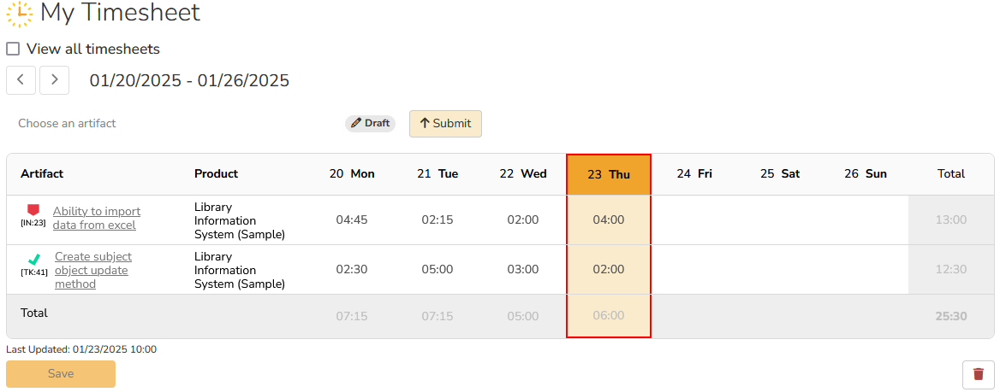

# Timesheets
Spira's timesheets functionality lets users track how much time they have spent on incidents and tasks across all their products. They can record time against each artifact for a given day in the current week or any week in the past. This time data is used to update the effort recorded against each artifact. Users can also easily see timesheets from the past. SpiraTeam SpiraPlan

!!! tip "Locking down actual efforts" 
    If you want to ensure that effort values are only updated by timesheet entries, and not by editing the individual task or incident, you can update the workflows to make the Actual Effort field read only for every status.

!!! info "Timesheets will continue to evolve"
    Currently timesheets provide valuable features that let users track their time quickly and conveniently. We will be adding more features to timesheets in future releases to make this even more powerful, including with support for reporting, approval workflows, and more. 

## My Timesheet
You can access "My Timesheet" from the User Profile dropdown on the [Global Navigation](./User-Product-Management.md/#global-navigation) menu.

When you load the My Timesheet page, the page will have the following parts:

- **View all timesheets**: chech this checkbox to open a summary list of all your timesheets. You can navigate to any timesheet by clicking on it. This only appears if you have at least 1 timesheet.
- **Navigation buttons**: these let you navigate backward or forward to see previously saved timesheets. Each button is disabled if there are no earlier/later timesheets to navigate to.
- **Artifact dropdown**: this lists all the incidents and tasks you own across all active products you are a member of.
- **Timesheet data range**: a heading showing the start and end date of the current timesheet. Click on it to bring up a datepicker. Selecting a date will navigate you to the timesheet for that relevant period. If there is no timesheet for that date then a new timesheet is automatically created.
- **Timesheet status & submit** SpiraPlan: when [timesheet approvals](#my-timesheet-approvals) is enabled, you can see the status of the current timesheet.
- **Timesheet grid**: a table for viewing and recording timesheet entries for each day of the timesheet. Each time you load the page it will start by showing the current week's timesheet.

### Viewing
When viewing the timesheet for the current week, today will be highlighted to help you more easily add data for today.

### Adding
The timesheet grid will be empty at first. To add information, select an artifact from the artifact dropdown. This will automatically add a row for that artifact. 

To add a time entry to an artifact, click into the cell for the relevant artifact and day. Type the time in the format hh:mm (min 00:01, max 23:59).

You cannot add timesheet entries to an artifact that you do not have permission to modify. If you try to, then you will see a warning telling you which artifacts were not updated upon save. The same is true if the artifact has been deleted.

If you add an artifact to the timesheet but do not enter any time for any day then the artifact is not saved to the timesheet.

### Editing 
To edit a newly entered or existing entry to an artifact on a timesheet, click into the relevant cell and adjust the time as needed. Setting the time to 0:00 will effectively delete the time in that cell (doing so for all cells for an artifact will delete the artifact from that timesheet). 

If there are unsaved time entries in the timesheet the save button will be enabled. Click Save to commit the changes. This will update the actual effort for each task or incident. If you add 1 hour to a task for 3 different days on the timesheet, then the actual effort for that task will be increased by 3 hours. 

### Deleting
To delete any row of a relevant timesheet, access the context menu (right click) on that row and choose delete. Deleting a row will remove the effort against that artifact and record a new history entry for that change. You can not delete a row for an artifact that has, itself, been deleted. You also cannot delete a row if you no longer have permissions to change the artifact's effort.

To delete an entire timesheet, click the trash can icon below the timesheet on the far right. Deleting a whole timesheet is equivalent to deleting each of its rows in turn, meaning that effort changes are made and history entries are created for each artifact row removed. The delete button will be disabled if there is any row on the timesheet that is disabled.

You can not delete a timesheet that has been submitted for approval or has been approved.

### Downloading
To download a timesheet in CSV format, access the context menu (right click) on any row and choose to download the timesheet as a CSV file.

### My Timesheet approvals
If [timesheet approvals](../Spira-Administration-Guide/System.md/#general-settings) is enabled for your organization, then you will see the timesheet's status next to the artifact dropdown. This status indicator will only show if there is at least one entry will in the timesheet. 

There are four timesheet statuses:

- **Draft**: the default for any new timesheet
- **Submitted**: the timesheet has been submitted for approval. Timesheets in this status cannot be edited or deleted.
- **Approved**: the timesheet (previously submitted) has been approved by a timesheet manager. Timesheets in this status cannot be edited or deleted.
- **Rejected**: the timesheet (previously submitted) has been rejected by a timesheet manager. Timesheets in this status can be edited and even deleted, to allow you to make the changes required by the manager before you resubmit it.

Once you have fully completed a draft timesheet, you can submit it for approval. To do so click on the `Submit` button next to the status indicator. You will see a confirmation message: "Do you wish to submit this timesheet for approval?" Click Yes to change the status to "Submitted". 

Once submitted, this timesheet is in the list of timesheets to be [reviewed by timesheet managers(#timesheets-approvals).

### List of My Timesheets
Check the "View all timesheets" checkbox to see a list of all of your timesheets. For each timesheet the list shows the start date, end date, total number of hours entered, and the last time it was updated. If timesheet approvals are enabled, you will also see the current status. You can click any row to open the details of that timesheet. You can filter the list by any column, apart from the total hours.

### Other features to note
- The timesheet is sorted by the artifact name in alphabetical order
- A single history record is recorded for each artifact modified in each save, even if multiple days are modified for a given artifact in a single save
- You can see totals for how much time you have recorded against each artifact, each day, and across the whole timesheet

## Timesheets Approvals 
To access the timesheet approvals page:

- navigate to the Enterprise workspace from the workspace dropdown in the global navigation
- if not automatically selected, select "Timesheets" from the artifact dropdown

This page allows [timesheet managers](../Spira-Administration-Guide/System-Users.md/#edit-an-existing-user) to review and approve any timesheet submitted by any user. Only timesheet managers are able to access this page, and only if [approvals are enabled at the system level](../Spira-Administration-Guide/System.md/#general-settings). SpiraPlan.

The page shows a list of all submitted timesheets. For each timesheet the list shows the timesheet owner (the person who submitted it), start date, end date, total number of hours entered, and the date and time it was submitted. This list can be sorted by any column and filtered by any column except the total hours.

### Timesheet approval details 
When a timesheet manager is ready to review a timesheet, they select it from the list. This opens a details section below the list. This lets you review full details about the timesheets, including all its entries against specific artifacts. 

After reviewing the timesheet, a manager can either approve or reject it. A comment can be provided in both cases, but is required for rejections to let the user know why it was rejected. 

When re-reviewing a previously rejected timesheet, the comment from the last review will be shown. This comment is also displayed on the users My Timesheet page, so they are aware of the reason it was rejected. 

