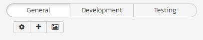
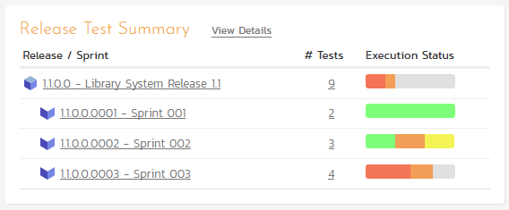
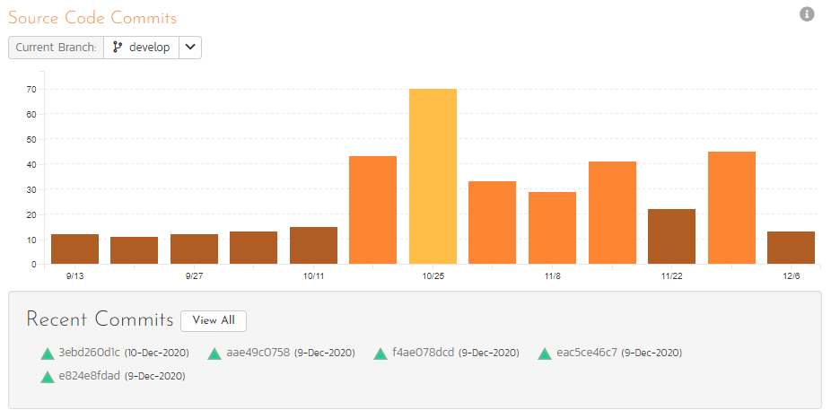

# User/Product Management

This section outlines how you can log into SpiraPlan®, view your
personalized home-page that lists the key tasks that you need to focus
on, and drill-down into each of your assigned products in a single
dashboard view. In addition to your personal homepage, each of your
products has its own dashboard that depicts the overall product health
and status in a single comprehensive view.

## Login Screen

Upon entering the SpiraPlan® URL provided by your system administrator
into your browser, you will see the following login screen:

You need to enter your given user-name and password into the system in
the appropriate boxes then click the ***Log In*** button
to gain access to the application. Normally you only remain logged in to
the application whilst in active use, and you will be asked to log-in
again after either closing the browser or 20 minutes of inactivity. To
prevent this, and to stay logged-in to SpiraPlan® regardless of browser
window closing or inactivity, select the "Keep me logged in" check-box
before clicking the ***Log In*** button. Note that this
setting is specific to each individual computer you are logging-in from,
and that it will be reset when you explicitly log-out with the [log-out
link](#global-navigation).

If for any reason you are unable to login with the provided
username/password combination, and error message will be displayed. If
you cannot remember the correct log-in information, click on the "Forgot
your password" link and your password will be emailed to the email
address currently on file. The reset password screen is illustrated
below:

If you don't have a SpiraPlan® account setup, clicking on the "Register
for an account?" link will take you to a form that you need to fill-in,
which will be forwarded to the system administrator, who will need to
approve your account before it is active in the system. This screen is
illustrated below:

In addition, the system will prevent you logging on to the system with
the same username *at the same time* on multiple computers. This is to
avoid the system getting confused by a user trying to make contradictory
actions at the same time. If for any reason you do try and log in to the
system when you already have an active session in progress, you will see
the following screen:

You have two choices: you can either click the "Log Out" link and try
logging in as a different user, or if you want to log-off any other
active sessions (e.g. you closed the browser and the session is still
listed as active), simply click the "Sign Off The Other Locations" link,
and you will be logged in to the application.

Since SpiraPlan® is licensed to organizations for a specific number of
concurrent users -- unless they have purchased an unlimited Enterprise
license -- only a fixed number of users may be active at the same time.
So, for example if an organization has a five (5) concurrent user
license and a sixth user tries to log-in, they will be presented with
the following screen:

This means that one of the other users who is already logged-in, needs
to click the "Log Out" button so that one of the concurrent licenses is
freed for your use. If the user has logged out by closing the browser,
the system may not have detected the logout. In this case, the other
user needs to log back in, and then click the "Log Out" link.

## My Page

Once you have successfully logged in, you will initially be taken to
your personalized home page called "My Page". Please note, that the very
first time you log in you will be asked if you want to take a quick
orientation tour of the application (which will look similar to the
screenshot below).

Note that once you have successfully logged-in and chosen a product,
SpiraPlan® remembers this selection, and on subsequent log-ins will
automatically select that product, and highlight it for you in the ["My
Products" list](#my-products).

Your homepage contains all the information relevant to
you---consolidated onto a single page for you to take immediate action.
By default the page lists the information for all products that you are
a member of. However, you can choose to filter by the current product,
to get a more focused list.

Next to some of the widgets is an RSS icon
(

), this allows you to subscribe to the
information as a Really Simple Syndication (RSS) newsfeed. This can be
useful if you want to be notified about recently assigned items without
having to setup email notifications or being logged into SpiraPlan
continuously. If you don't see an RSS icon next to the widgets on your
My Page it means that you have not enabled RSS newsfeeds in your
profile. For more details on configuring your RSS preferences, please
refer to [My Profile](#my-profile).

Initially the page is loaded in 'view mode' which means that the various
'widgets' on the page are displayed with minimum visual clutter (no
toolbars or control icons) that makes it easy to scan the items on the
page and see what work has been assigned. To switch the page to 'edit
mode', click on the button with the cog icon
() on the right:

In this mode, each of the 'widgets' displayed on the page can be
minimized by clicking on the arrow icon
() in the top-left of the window, or
closed by clicking-on the cross icon
() in the top-right of the window. This
allows you to customize your page to reflect the types of information
that are relevant. If you have closed a widget that you subsequently
decide you want to reopen, you can add them back to the page display by
clicking the "Add Items" button at the top of the page. In addition, the
various widgets have a "settings" icon
() that allows you to customize how that
widget appears. The settings are specific to each widget and in general
allow you to specify how many rows of data are displayed and what
columns are displayed.

You can move and reposition the various widgets on the dashboard by
clicking the mouse on the title bar of the widget you want to move and
dragging it to the desired location. This change will be remembered when
you next login to the system. Once you have the dashboard configured the
way you like it, you can click "Return to Normal View" to switch back to
'view mode'.

When you load your 'My Page' for the first time it will consists of the
following main elements:

- My Products
- My Saved Searches
- My Assigned Requirements
- My Assigned Test Cases
- My Assigned Test Sets
- My Pending Test Runs
- My Assigned Incidents
- My Detected Incidents
- My Assigned Tasks
- Quick Launch
- My Contacts

However these are not the only widgets available. If you click on the
"Add/Remove" items hyperlink it will display the list of any additional
widgets that are available:

You can add the additional widgets by selecting the appropriate
checkbox, choosing the destination location (left side vs. right side)
and then click the \[Add\] button. The additional widgets available in
the My Page are:

- My Saved Reports
- My Subscribed Artifacts
- My News Feeds

### My Products

This section lists all the products you have been given access to,
together with the name, description, program and date of creation. To
view the description of the product, simply position the mouse pointer
over the link, and a tooltip window will popup containing the
description.

When you initially view the page, all of the products will be shown as
links. When you click on a product to view, you will be taken to that
product's home-page, and that product will be set as the current
product. That product will now appear highlighted in your home-page (see
above screen-shot). To change the currently selected product, simply
click on the link of another product name. You can always change your
current product by clicking on the drop-down-list of products displayed
on the global navigation bar to the right of the "Search" box.

If you are a program member, the name of the program will also be
displayed as a hyperlink. In which case, clicking on the program
hyperlink will take you to the [Program dashboard](#program-home).

### My Saved Searches

This section lists any filters/searches you have saved from the various
artifact list screens throughout the application. This allows you to
store specific combinations of searches that you need to perform on a
regular basis (e.g. display all newly logged incidents, display all
requirements that are completed but have no test coverage).

The name of the saved search is displayed along with an icon that
depicts which artifact it's for and the product it refers to. Clicking
on the name of the saved search will take you to the appropriate screen
in the product and set the search parameters accordingly. Clicking the
"Delete" button next to the saved search will delete it. Clicking on the
RSS icon will allow you to subscribe to the specific search so that it
will be displayed in your RSS newsreader. This allows you to setup
customized lists of information that can be displayed outside of
SpiraPlan.

### My Assigned Requirements

This section lists all the requirements you have been made owner of,
across *all the different products* you are a member of. This typically
means that the product manager has assigned you to be responsible for
either developing the supporting test cases or decomposing the
requirement into its detailed work breakdown structure of product tasks.
The requirement name is displayed, along with its status (requested,
accepted, in-progress, etc.) and its importance.

### My Assigned Test Cases

This section lists all the test cases you have been made owner of,
across *all the different products* you are a member of. This typically
means that the product manager has assigned you to be responsible for
executing the assigned test scripts. To aid in this process, the script
name is displayed, along with its last execution status (failed, passed
or not-run) and date of last execution. This enables you to see how
recently the tests have been run, and whether they need to be re-run.

If you click on the test-name hyperlink, you will be taken to the
[details page for this test-case](../Test-Case-Management/#test-case-details) and the product that
the test-case belongs to will be made your current product. If you click
on the play button to its right you will launch the test-case in the
[test-case execution module](../Test-Case-Management/#execute-test-cases) so that you can easily
retest failed cases.

### My Assigned Test Sets

This section lists all the test sets (groups of test cases) you have
been made owner of, across *all the different products* you are a member
of. This typically means that the product manager has assigned you to be
responsible for executing the test cases contained within the test set
against a specified release of the system under test. To aid in this
process, the test set name is displayed, along with its status, the
product it belongs to, the number of remaining test cases to be
executed, and the date by which all the tests need to have been run.

If you click on the test-set name hyperlink, you will be taken to the
[details page for this test-set](../Test-Case-Management/#test-run-details) and the product that
the test-set belongs to will be made your current product. If you click
on the play button to its right you will 
[launch the test-cases](../Test-Case-Management/#execute-test-cases) contained
within the test-set in the test-case execution module
so that you can easily carry out your assigned testing task.

### My Pending Test Runs

This section lists any test runs that you started executing in the test
case module but haven't yet completed. Until a test case or test set is
fully executed, a pending test run entry is stored in the system so that
you can continue execution at a later date.

Any pending test run can be either deleted or resumed by clicking on the
appropriate button. In addition, there is the option to reassign the
test run to another user that is a member of the product.

### My Assigned Tasks

This section lists all the product tasks that you have been made the
owner of across *all the different products* you are a member of. This
typically means that the manager of the product in question has assigned
development tasks to you that need to be completed so that a release can
be completed and/or a requirement can be fulfilled. The tasks are listed
in ascending date order so that the items with the oldest due-dates are
displayed first. In addition, each task is displayed with a progress
indicator that graphically illustrates its completion against schedule.
See [Task Tracking](../Task-Tracking/) -- task management for details of the different progress
indicators.

Clicking on the task name hyperlink will take you to the task details
page. This page will describe the task in more detail, illustrate which
requirement and release it is associated with, and also allow you to
view the change log of actions that have been performed on it.

### My Assigned Incidents

This section lists all the open incidents you are the owner of, across
*all the different products* you are a member of. This typically means
that the product manager has assigned you to be responsible for
resolving the incident. In the case of a bug, this can mean actually
fixing the problem, whereas for other incident types (e.g. training
item) it may mean simply documenting a workaround. In either event, this
section highlights the open incidents you need to manage, ranked by
importance/priority and categorized by type, with the open date
displayed to give you a sense of the age of the incident.

Clicking on the incident name hyperlink takes you to the 
[incident details page](../Incident-Tracking/#incident-details)) that describes the incident in more
detail, and allows you to add new information or change its status to
indicate actions taken. In addition, if you position the mouse pointer
over the name of the incident, a more detailed description is displayed
as a "tooltip".

### My Detected Incidents

This section lists all the open incidents that you have detected, across
*all the different products* you are a member of. These incidents are
not necessarily ones that you need to take an active role in resolving,
but since you were the originator -- either by executing a test case or
just logging a standalone incident -- you can watch them to make sure
that they are resolved in a timely manner.

Clicking on the incident name hyperlink takes you to the 
[incident details page](../Incident-Tracking/#incident-details)) that describes the incident in more
detail, and allows you to add new information or change its status to
indicate actions taken. In addition, if you position the mouse pointer
over the name of the incident, a more detailed description is displayed
as a "tooltip".

### Quick Launch

This widget allows users to quickly record a new incident in any of the
products that they belong to. It's a shortcut that avoids having to
first select a product, go to Tracking \> Incidents and then click "New
Incident". Instead you simply choose the product from the dropdown list
and click the arrow icon to bring up the new incident creation screen.

### My Contacts

This widget displays a list of any other users in the system that you
have listed as a personal contact:

Each user is displayed along with their graphical avatar, department and
a colored indicator that lets you know if they are online or not. If
they are online you can then send them an instant message (which will be
described later in [Global Navigation](#global-navigation). To remove an existing contact, just
click on the 'Remove' button. To add a new user, simply locate them in
the Tracking \> Resources page and then use the <Add As Contact\>
button.

### My Saved Reports

This section lists any reports you have saved from the reports center.
This allows you to store specific combinations of report elements,
format, filters and sorts (see the section on Reporting for more details
on how to configure a report) for reports that you need to run on a
regular basis:

### My Subscribed Artifacts

This widget displays a list of all the artifacts in the system that you
have subscribed to (by clicking on the Subscribe icon on the item). You
can display the item by simply clicking on the hyperlink. In addition,
if changes are made to any of the artifacts an email notification will
be sent to you. You can click on the "Unsubscribe" button to remove the
item from this list.

### My News Feeds

This widget allows you to subscribe to an external newsfeed and have the
results be displayed inside SpiraPlan. By default it will be set to the
newsfeed from the Inflectra website that displays a list of recent
company and product announcements. You can add multiple instances of the
widget to the dashboard, allowing you to read multiple news sources at
once. Typical uses for this widget are to add news from product
management and testing news sites/blogs or to add information from other
tools in your organization that can display their data in RSS format.

### My Assigned Risks (SpiraPlan only)

This section lists all the risks you are the owner of across *all the
different products* you are a member of. Clicking on the risk name
hyperlink will take you to the risk details page. This page will
describe the risk in more detail.

### My Assigned Documents

This section lists all the documents you are the owner of across *all
the different products* you are a member of. Clicking on the risk name
hyperlink will take you to the documents details page. This page will
describe the documents in more detail.

## Global Navigation

Regardless of the page you are on, SpiraPlan® will always display the
global navigation bar, consisting of a number of different sections,
depending on the user and where they are in the system.

Under some of the icons and headings are secondary menu options that
display when you click on the section in question. The sections and
menus available in the global navigation are show below:

- **Product Icon** (shown as SpiraPlan above): this will always take you
to "My Page" as discussed above
- **Workspace Icon**: this shows you the type of workspace you are on, for
example a [program](#program-home) or a [product](#product-home). Clicking it will take you to that
workspace's homepage
- **Workspace Selector**: this shows the name of the current workspace.
Clicking it will show all your available workspaces and clicking any of
these will change you to that workspace
- **Artifacts Selector**: when visible, this shows the name of the current
artifact for the current workspace. Clicking it will show all your
available artifacts and clicking any of these will change you to that
artifacts main page. For product workspaces these artifacts are grouped
as follows:
    - Planning
        - [Requirements](../Requirements-Management/)
        - [Planning Board](../Planning-Board/)
        - [Releases](../Release-Management/)
        - [Documents](../Document-Management/)
    - Testing
        - [Test Cases](../Test-Case-Management/)
        - [Test Sets](../Test-Case-Management/#test-set-list)
        - [Test Runs](../Test-Case-Management/#test-run-list)
        - [Automation Hosts](../Test-Case-Management/#automation-host-list)
    - Tracking
        - [Incidents](../Incident-Tracking/)
        - [Tasks](../Task-Tracking/)
        - [Risks](../Risks-Management/)
        - [Resources](../Resource-Tracking/)
        - [Source Code](../Source-Code/)

- [**Reporting**](../Reports-Center/)
- **User Profile Icon**

    - [My Profile](#my-profile)
    - [My Timecard](#my-timecard)
    - [Documentation](#documentation)
    - [Show on boarding tours](#show-onboarding-tours)
    - [Keyboard shortcuts](../Appendix-1-Keyboard-Shortcuts/)
    - [Log Out](#log-out)

- **Administration Icon**: This is visible if you are a system
administrator, or if you are an owner/administrator of the current
workspace or its template. Clicking the icon will display the relevant
administration menu. This is described in the separate *SpiraPlan
Administration Guide*.

### Global Search

SpiraPlan includes a global search that can be used to search across
product and artifact type for items that include the entered keywords in
either the name or description field:

You can search for individual keywords by simply entering them in the
search box and clicking the arrow button on the right. You can search
for phrases by enclosing the words in double quotes. You can also
**search for a specific artifact** by its unique **two-letter prefix and
ID number**.

For example, searching on **book name** will find any artifacts that
include either of the two words book and name in the name or
description. Searching on **"book name"** will only return items that
have that exact phrase in either the name or description. Searching on
**TC2** will display just the Test Case with ID=2:

When you get a list of search results, you can choose to order by
relevance (the default) or by most recent. Searching by relevance finds
the artifacts that have the greatest match with the keywords:

The search by date is useful when you want to find recent items that
match the search keywords:

In addition, you can filter the results by artifact type and/or product
to narrow down the search:

For example, if you filter by requirement, the list of results will be
narrowed accordingy:

### Log Out

Clicking on the "Log Out" link will immediately log you out of your
current session and return you to the [login page](#login-screen). If you had set the "Keep Me Logged In" option during your previous
login, that setting will be reset; so if you want to avoid having to
keep logging-in, you'll need to re-check that box during your next
log-in.

### Documentation

Clicking on this link on any page will bring up the online version of
this manual shown below:

Clicking on any of the triangles expand links in the left hand table of
contents will open up the detailed list of topics for each of the main
areas of the system. In each area, clicking on one of the individual
links will open the appropriate section in the help manual. By default,
the reading-pane will open to the help item that is most closely related
to the screen you happened to be on when you clicked the "Help" link.

You can search the index by using the "Index" tab.

If you want to share a specific help page with a colleague in your
organization, send them the url from the address bar.

### Choosing a Workspace

Workspaces in SpiraPlan set out the scope for the data you want to view
and interact with. The most common workspace type is a product:

-   A product contains all the requirements, sprints, defects, and tests
associated to it.

-   Programs are groups of products, where you can look across all the
products in that program at once

Choosing, for example, a Product or Program from the list of your
assigned workspaces in the drop-down-menu allows you to quickly and
easily jump between workspace regardless of the page you happen to be
on. When you choose a new workspace, you will be taken to the same page
in the selected workspace (assuming that you have permissions to view
that page). Any workspace with a little cog at the end is a workspace
that you are an owner/admin of.

You can use CTRL+click to open the new product in a separate browser
tab:

### Show Onboarding Tours

When you first login to SpiraTeam, the system will show you a welcome
page, together with a tour that walks you through the key features of
the application. If you would like to see that again, you need to click
on the "Show Onboarding Tours" option, under the user profile menu.
SpiraPlan will then display the **onboarding tour** main dialog again:

You can click 'No Thanks to dismiss it, or 'Yes Please' to start the
tour.

### Instant Messenger

The Spira instant messenger is available in both SpiraPlan® and
SpiraPlan® and allows you to send short messages instantaneously to
other users in the system. You can see the status of other users by
looking for the small green circle next to the list of users in the 'My
Contacts' widget as well as the various user fields in the system:

When a user is online and available to communicate with, the small
circle will be filled-in green. If you click on the green circle, it
will open up the instant messenger window for that user:

You can then enter in a message to the other user, which will then cause
a conversation window to open inside their web browser with your message
displayed. The other user can then enter in their responses, allowing
the two users to have a real-time conversation:

To make it easier to see what's new, all unread messages are displayed
in a message box with a darker shade. In addition, the user's avatar
image is displayed at the start of each message group.

If the message window appears on a SpiraPlan® window that contains a
specific artifact (e.g. a requirement, test case, task, etc.) there will
be the option to 'Post as Comments'. If you click this option, any
messages selected with a checkbox will be automatically posted to the
current artifact as comments. This is useful if you have a conversation
related to a specific item and you want to have the outcome permanently
recorded as part of the audit trail. Otherwise, instant messages will be
automatically purged from the system after 90 days.

## Product Home

When you click on either the "Product Home" tab or the name of the
product in the "My Page" product list, you will be taken to the homepage
of the specific product in question:

This page summarizes all of the information regarding the product into a
comprehensive, easily digestible form that provides a "one-stop-shop"
for people interested in understanding the overall status of the product
at a glance. It contains summary-level information for all types of
artifact (requirements, test cases, incidents, etc.) that you can use to
drill-down into the appropriate section of the application.

You will see a small "i" in a circle at the top right of every chart.
Hovering or clicking on this will show you information about that chart.

In addition to viewing the product home page, you can choose to filter
by a specific release, to get the homepage for just that release (and
any child sprints).

Just like the 'My Page', the Product Home dashboard is initially loaded
in 'view mode' with pre-configured set of widgets. The Product Home also
offers 3 versions you can quickly switch between. While each of these
can be customized as you want, by default they are designed to help
different types of product member -- be they managers, testers, or
developers.

To download an image of the entire dashboard click the 'picture' button
beneath the currently selected view.

To switch the page to 'edit mode', you should click on the button with
the cog icon
() below the currently selected Product
Home view.

Once in 'edit mode', each of the 'widgets' displayed on the product
homepage can be minimized by clicking on the arrow icon
() in the top-left of the window, or
closed by clicking-on the cross icon
() in the top-right of the window. In
addition, the widgets allow you change their settings by clicking on the
settings icon
().This allows you to customize your view
of the product to reflect the types of information that are relevant to
you. If you have closed a widget that you subsequently decide you want
to reopen, you can rectify by clicking the "***Add
Items***" button at the top of the page, and locating the
closed item from the list of 'Closed Widgets'.

When you load your 'Product Home' for the first time it will default to
the "General" view. The following table shows which widgets are
displayed on the different views of the 'Product Home':

| Widget Name                        | General   | Development   | Testing |
| ---------------------------------  | --------- | ------------- | ------- |
| Product Overview                   | Y         | Y             | Y
| Activity Stream                    | Y         | Y             | Y
| Shared Searches                    | Y         |               | 
| Requirements Summary               | Y         | Y             | Y
| Requirements Coverage              | Y         |               | Y
| Release Task Progress              | Y         | Y             | 
| Requirements Graphs                | Y         | Y             | 
| Late Finishing Tasks               | Y         | Y             | 
| Task Graphs                        | Y         | Y             | 
| Top Open Issues                    | Y         | Y             | 
| Risk Summary                       | Y         |               | 
| Top Open Risks                     | Y         |               | 
| Test Execution Status              | Y         |               | Y
| Release Test Summary               | Y         |               | Y
| Incident Summary                   | Y         | Y             | Y
| Incident Open Count                | Y         | Y             | Y
| Requirement Incident Count         | Y         | Y             | Y
| Requirements Regression Coverage   |           |               | Y
| Test Set Status                    |           |               | Y
| Incident Aging                     |           | Y             | 
| Incident Test Coverage             |           |               | 
| Tag Cloud                          |           |               | 
| Recent Builds                      |           | Y             | 
| Late Starting Tasks                |           | Y             | 
| All Pending Test Runs              |           |               | Y
| Source Code Commits                |           | Y             | 
| Test Run Progress                  |           |               | Y
| Test Case Progress By Day          |           |               | Y

Please note that different widgets are shown by default for the
"Developer" and for the "Tester" views.

If you click on the "***+ Add***" items button it will
display the list of any additional widgets that are available for that
view. Below is what this looks like for the 'General' view:

You can add the additional widgets by selecting the appropriate
checkbox, choosing the destination location (left side vs. right side)
and then click the "***Add***" button.

Each of the different widgets listed is described in more detail below:

### Product Overview

This section displays the name of the product, together with a brief
description, the web-site that points to any additional information
about the product, and the names of the owners of the product.

### Shared Searches

This section lists any filters/searches have been saved from the various
artifact list screens throughout the application and marked as **shared
filters**. This allows users to store specific combinations of searches
that the product team needs to perform on a regular basis (e.g. display
all newly logged incidents, display all requirements that are completed
but have no test coverage).

The name of the saved search is displayed along with an icon that
depicts which artifact it's for and the person who created it. Clicking
on the name of the saved search will take you to the appropriate screen
in the product and set the search parameters accordingly. If you are the
creator of the saved search, clicking the "***Delete***"
button next to the saved search will delete it. Clicking on the RSS icon
will allow you to subscribe to the specific search so that it will be
displayed in your RSS newsreader. This allows you to setup customized
lists of information that can be displayed outside of SpiraPlan.

### Requirements Summary

This section consists of a summary table that displays the aggregate
count of requirements in the system broken-down by importance (on the
x-axis) and status (on the y-axis). This allows the product manager to
determine how many critical vs. low priority enhancements are waiting to
be implemented, vs. actually being implemented. In addition, it makes a
distinction between those requirements simply requested and those
actually planned for implementation, so the product manager can see what
the backlog is between the customer's demands, and the plan in place.
Clicking on the "***View Details***" button at the top of
the table simply brings up a detail graph that you can customize by
selecting the axes. Clicking on the individual values in the cells will
display the requirements list with the filter set to match the
importance and status of the value.

### Requirements Coverage

This section consists of a bar graph that displays the aggregated count
of requirements test coverage for the product. The Passed, Failed,
Blocked, Caution and Not-Run bars indicate the total count of
requirements that have tests covering them, allocated across the
execution status of the covering tests. For example, if a requirement is
covered by *four tests*, two that have passed, one that has failed and
one that has not yet been run, the counts would be passed = 0.5, failed
= 0.25 and not-run 0.25. These fractional quantities are then summed
across all the requirements to give the execution status breakdown of
the covered requirements.

In addition to the five statuses for the covered requirements, the sixth
("Not Covered") bar depicts the total number of requirements that have
no tests covering them, putting the five other bars into perspective.
Typically a product is in good health if the "Not Covered" bar is zero,
and the count of "Passed" requirements is greater than "Failed",
"Caution" or "Not Run". The greatest risk lies with the "Blocked", "Not
Covered" and "Not Run" status codes, since the severity/quantity of any
bugs lurking within is not yet fully known.

If you position the mouse pointer over any of the four bars, the color
of the bar changes slightly and the underlying raw data is displayed as
a tooltip, together with the percentage equivalent. Clicking on the any
of the bars in the chart will take you to the [requirements list page](../Requirements-Management/#requirements-list) with the corresponding filters set.

When you filter the product home by release/sprint, this widget will
filter the requirements coverage graph to only include ***requirements
that are specifically mapped to the selected release/sprint***. This is
useful when you want to determine the test coverage of new requirements
that are being added to the specific release/sprint. If instead you want
to determine the regression test coverage for a release, you should add
the separate "Requirements Regression Coverage" widget to the page
instead.

### Requirement Incident Count

This section displays a count of the total number of incidents, and the
number of open incidents mapped against requirements in the system,
sorted by the requirements that have the most open incidents first. This
section is useful for determining the parts of the application that have
the most instability, as you can look at the requirements that have
yielded the greatest number of incidents. Clicking on any of the
requirements hyperlinks will take you to the 
[detail page](../Requirements-Management/#requirements-details) for the
requirement in question. *You can configure in the
settings whether to include requirements with no open incidents, and
also how many rows of data to display.*

### Top Open Issues

This section displays a breakdown of the top issues logged against the
product, in order of decreasing priority. Note that items not given a
priority are listed at the top, since critical issues could be lurking
in that list, and the product manager will want to immediately review
these to assign priorities. Clicking on the issue item hyperlink will
take you to the incident details page for the issue in question (see
[Incident Tracking > Incident Details](../Incident-Tracking/#incident-details)). *You can configure in the settings whether to use Priority
or Severity for the display, and also how many rows of data to display.*

### Risk Summary

This section displays a two dimensional matrix of the open risks logged
against the product of impact against probability. Combined these two
dimensions are reflected in the risks exposure and each differently
colored rectangle in the matrix represents one possible exposure. The
number of risks that have a particular exposure are shown inside each
rectangle as appropriate. Clicking on that number will take you to the
risk list page filtered by the relevant exposure*.*

### Top Open Risks

This section displays a breakdown of the top risks logged against the
product, in order of decreasing priority. Note that items not given a
priority are listed at the top, since critical risks could be lurking in
that list, and the product manager will want to immediately review these
to assign priorities. Clicking on the risk item hyperlink will take you
to the [incident details page](../Incident-Tracking/#incident-details) for the risk in question.
*You can configure in the settings whether to use Priority or Severity
for the display, and also how many rows of data to display.*

### Release Test Summary

This widget allows you to quickly ascertain the test execution status of
each of the active releases that make up the current product in one
snapshot. Each release is displayed together with a graphical display
that illustrates the execution status with different colored bars. In
addition, if you hover the mouse over the graphical display it will
display a tooltip that provides a more detailed description of the
number of tests in each status.

Each release will display the aggregate status of any test cases
directly assigned to itself, together with the test status of any child
sprints that are contained within the Release. Clicking on one of the
releases will drill you down one level further and display the test
execution status for the parent release as well as each of the child
sprints separately:

### Incident Summary

This section consists of a summary table that displays the aggregate
count of incidents in the system broken-down by priority (on the x-axis)
and status (on the y-axis). This allow the product manager to determine
how many critical vs. low priority incidents are waiting to be
addressed, and how many new items need to be categorized and assigned.
Clicking on the "View Details" link at the top of the table simply
brings up a detail graph that you can customize by selecting the axes.
Clicking on the individual values in the cells will display the incident
list with the filter set to match the priority and status of the value.

By default this summary table displays the total count of all incidents
-- regardless of type, however my changing the drop-down list to a
specific incident type (e.g. bug, enhancement, issue, etc.), the product
manager can filter the summary table to just items of that type. *You
can also configure in the settings whether to use Priority or Severity
for the x-axis*

### Test Execution Status

This section consists of a bar graph that displays the aggregated count
of test cases in each execution status for the product. Note that this
graph does not consider past test-runs when calculating the totals in
each status (Passed, Failed, Not Run, etc.), it simply looks at each
test-case and uses the last-run status as the best health indicator.
Thus if a test case that previously passed, has subsequently failed upon
re-execution, it will be considered a failure only.

If you position the mouse pointer over any of the five bars, the color
of the bar changes slightly and the underlying raw data is displayed as
a tooltip, together with the percentage equivalent. Clicking on any of
the bars will bring up the [product test case list](../Test-Case-Management/#test-case-list) with
the appropriate filter applied.

In addition to the bar-chart, there is also a display of the total
number of test runs recorded for the product, and a list of the *five
most recent* days of recorded test-runs, together with the daily count.

### Release Task Progress

This widget allows you to quickly ascertain the task progress of each of
the active releases that make up the current product in one snapshot.
Each release is displayed together with a graphical display that
illustrates the completion percentage and status with different colored
bars. In addition, if you hover the mouse over the graphical display it
will display a tooltip that provides a more detailed description of the
number of tasks in each status.

Each release will display the aggregate progress of any tasks directly
assigned to itself, together with the task progress of any child sprints
that are contained within the Release. Clicking on one of the releases
will drill you down one level further and display the task progress for
the parent release as well as each of the child sprints separately:

### Late Finishing Tasks

This section displays the list of any product tasks that have not yet
been completed, but whose scheduled end date has already elapsed. A
graphical progress bar is included with each task in the grid, so that
you can easily see which tasks are nearest completion.

### Late Starting Tasks

This section displays the list of any product tasks that have not yet
started, but whose scheduled start date has already elapsed:

Each task is listed along with its owner, priority and due-date so that
you quickly ascertain how many days late it will be starting, how
important it is to the product, and who needs to be contacted to get
more information.

### Requirements Regression Coverage

This section consists of a bar graph that displays the aggregated count
of requirements test coverage for the product in a similar fashion to
the 'Requirements Coverage' widget:

However, unlike the 'Requirements Coverage' widget, when you filter the
product home by release/sprint, this widget will filter the requirements
coverage graph to include all requirements (regardless of
release/sprint), but only considering covering test cases that are
associated with the selected release/sprint. This is useful when you
want to determine the regression requirements test coverage of a
specific release (i.e. does running all the tests relevant to this
release cover all the necessary requirements, not just new
requirements).

### Test Set Status

This section consists of a bar graph that displays the aggregated count
of test cases in each execution status for each test set
in the product:

Therefore if you have the same test cases stored in multiple test sets,
then this widget will display the total test case count for all
combinations of test set. This is useful if you have the same test cases
being executed in different environments -- represented by different
test sets -- and you need to make sure that the tests passed
successfully in all environments.

If you position the mouse pointer over any of the five bars, the color
of the bar changes slightly and the underlying raw data is displayed as
a tooltip, together with the percentage equivalent. Clicking on any of
the bars brings up the [product test set list](../Test-Case-Management/#test-run-details) page with
the appropriate filter applied. In addition to the bar-chart, there is
also a display of (up to) the *five most overdue test sets in the
product*.

### Incident Aging

This section displays the number of days incidents have been left open
in the system. The chart is organized as a histogram, with the count of
incidents on the y-axis and different age intervals on the x-axis.

### Incident Test Coverage

This section displays a bar-graph that illustrates the execution status
of any test cases that previously failed and resulted in the generation
of an incident that has subsequently been resolved. This is very useful
when a test case was executed in Release 1.0 and an incident was logged.
That incident has now been resolved in Release 1.1 (and is in a closed
status) but we need to know that the test case that caused the failure
has been successfully re-run. Any test cases listed as Blocked, Caution,
Not-Run, Not Applicable, or Failed in this graph need to be executed to
verify that all resolved bugs in the release have truly been fixed.

### Task Graphs

This widget lets you quickly view the three main graphs used when
measuring the progress of tasks in an agile methodology:

1.  **Task Velocity** -- this graph shows the total estimated and actual
effort delivered in each product release and/or sprint

2.  **Task Burnup** -- this graph shows the cumulative amount of work
outstanding for each release/sprint in the product with separate
lines for the estimated, remaining and completed effort.

3.  **Task Burndown** -- this graph shows the remaining work that needs
to be done for each release/sprint in the product with separate
lines for the estimated, remaining and completed effort.

For each of the three graphs you can click on the "Display Data Grid"
link to display a grid of the underlying data that is represented in the
graph and also there are options to save the graph in a variety of
different image formats.

### Tag Cloud

This widget lets you see the list of document tags being used in the
product:

The size of the tag name indicates the relative frequency of its usage
in the product. Clicking on a document tag will open up the [Document
List]((../Document-Management/#document-list)) page with the filter set to the tag you clicked
on. This will display a list of related documents that have been tagged
with the same tag name.

### Recent Builds

This widget displays a list of the most recent builds that have been
performed as part of the current release or sprint:

For each build it will display whether the build succeeded or failed,
the date the build occurred and the name of the build together with a
hyperlink to the [build details](../Release-Management/#test-runs). Note: If no release
or sprint is selected then the widget will not display any data.

### Requirements Graphs

This widget lets you quickly view four different graphs used when
measuring the progress of requirements in an agile methodology. They are
described in more detail in [Reports](../Reports-Center/#snapshot-graphs).

1.  **Requirement Velocity** -- this graph shows the actual velocity
delivered in each product release and/or sprint compared to the
product average and the rolling average.

2.  **Requirement Burnup** -- this graph shows the cumulative number of
story points outstanding for each release/sprint in the product with
separate lines for the actual and ideal burnup overlaid on top of a
bar-graph that shows the completed story points per release/sprint.

3.  **Requirement Burndown** -- this graph shows the remaining number of
story points that needs to be done for each release/sprint in the
product with separate lines for the actual and ideal burndown
overlaid on top of a bar-graph that shows the completed story points
per release/sprint.

4.  **Requirements Coverage** -- this graph shows the number of
requirements that have test cases that are passed, failed, blocked,
cautioned, not run as well those requirements that do not have any
test cases (not covered). Unlike the main Requirements Coverage
graph on the home page, this one is segmented by requirement
importance.

For each of the three graphs you can click on the "Display Data Grid"
link to display a grid of the underlying data that is represented in the
graph and also there are options to save the graph in a variety of
different image formats.

### Test Run Progress

This section consists of a chart that displays the last 30 days of test
run activity, broken down, for each day, by the test run status. This is
a useful chart to quickly track the testing activity of the product --
this is not the same as overall product status.

### Test Case Cumulative Progress

This section consists of a chart that displays the last 30 days of test
case executions cumulatively. That means it will display for each day,
the total number of test cases executed plus the status from any
previous days that have not been changed. Any test cases not executed up
to that point will be considered "not run" and will appear in the "not
run" category. For example, if you have 10 test cases created on day 1
you will see 10 test cases "not run" on day 1. On day 2, you execute 5
test cases and fail them all, you will now see 5 test cases failed and 5
not run. On day 3, you execute 3 of the previous 5 test cases and pass
them. You will now see 3 test cases passed, 2 failed and 5 not run.

### Source Code Commits

This section consists of a chart that displays the last 3 months of code
commits to the product (if you are using the source code functionality
of the application). Commits are aggregated by week. The chart is color
coded by bottom quartile, the middle 50%, and the top quartile of
activity.

### Incident Open Count

This section show a bar chart to visualize the breakdown of all open
incidents in the product by priority. The chart's bar match the color
assigned to that priority. Clicking on the "View Details" link at the
top of the widget loads a chart builder where you can further refine and
filter the chart to meet your needs.

### All Pending Test Runs

This section lists all the test runs that are currently being executed
by testers in the product. Until a test case or test set is fully
executed, a pending test run entry is stored in the system so that you
can continue execution at a later date.

Any pending test run can be either deleted or reassigned to another user
that is a member of the product by the product manager or test manager.

## Program Home

When you click on either the Program name in the global navigation or
the name of the program in the "My Page" product list, you will be taken
to the homepage of the specific program in question:

This page summarizes all of the information regarding the program into a
comprehensive, easily digestible form that provides a "one-stop-shop"
for people interested in understanding the overall status of the group
as a whole as well as the relative performance of the different products
that make up the group. It contains summary-level metrics for all types
of artifact (requirements, test cases, tasks, incidents, etc.) that you
can use to drill-down into the appropriate product for more details.

You will see a small "i" in a circle at the top right of every chart.
Hovering or clicking on this will show you information about that chart.

In a similar manner to the 'My Page', the Program Home dashboard is
initially loaded in 'view mode' which means that the various 'widgets'
on the page are displayed with minimum visual clutter (no toolbars or
control icons) that makes it easy to scan the items on the page and see
the health of the status of the product at a glance. To switch the page
to 'edit mode', you should click the button with the cog icon
() on the right.

Once in 'edit mode', each of the 'widgets' displayed on the program
homepage can be minimized by clicking on the arrow icon
() in the top-left of the window, or
closed by clicking-on the cross icon
() in the top-right of the window. In
addition, the widgets allow you change their settings by clicking on the
settings icon
().This allows you to customize your view
of the program to reflect the types of information that are relevant to
you. If you have closed a widget that you subsequently decide you want
to reopen, you can rectify by clicking the "***+ Add***"
button at the top of the page, and locating the closed item from the
list of 'Closed Widgets'.

When you load the 'Program Home' for the first time it will consists of
the following main elements:

- Group Overview
- Requirements Coverage
- Task Progress
- Product List
- Test Execution Status
- Incident Aging
- Recent Builds

However these are not the only widgets available. If you click on the
"Add/Remove" items hyperlink it will display the list of any additional
widgets that are available:

You can add the additional widgets by selecting the appropriate
checkbox, choosing the destination location (left side vs. right side)
and then click the "***Add***" button. The additional
widgets available in the Program Home dashboard are:

- Top Open Issues
- Top Open Risks

Each of the different widgets listed is described in more detail below:

### Program Overview

This section displays the name of the program, together with a brief
description, the web-site that points to any additional information
about the program, and the names of the owners of the program.

### Product List

This section lists all the active products that make up the group,
together with the name, description, program and date of creation. To
view the description of the product, simply position the mouse pointer
over the link, and a tooltip window will popup containing the
description.

### Requirements Coverage

This section consists of a bar graph that displays the aggregated count
of requirements test coverage for the entire program. The Passed,
Failed, Blocked, Caution and Not-Run bars indicate the total count of
requirements that have tests covering them, allocated across the
execution status of the covering tests

Under the main bar graph is displayed a table containing each product in
the group and a colored bar illustrating the specific requirements
coverage distribution for that product. That way you can see both the
aggregate coverage and also the relative coverage for the products. *You
can configure in the widget settings whether you want to see the
aggregate bar graph, and/or the product-specific requirements coverage.*

### Task Progress

This section consists of a bar graph that displays the aggregated count
of tasks by progress category for the entire program. The 'On Schedule',
'Late Finish', 'Late Start' and 'Not Started' bars indicate the total
count of tasks that are in that category for all the products in the
group.

Under the main bar graph is displayed a table containing each product in
the group and a colored bar illustrating the specific task progress for
that product (using the same coloring convention as the main graph).
That way you can see both the aggregate task progress and also the
relative progress for each product. *You can configure in the widget
settings whether you want to see the aggregate bar graph, and/or the
product-specific task progress.*

### Test Execution Status

This section consists of a bar graph that displays the aggregated count
of test cases by execution status for the entire program. The Passed,
Failed, Blocked, Caution and Not-Run bars indicate the total count of
test cases that are in that category for all the products in the group.

Under the main bar graph is displayed a table containing each product in
the group and a colored bar illustrating the specific test case
execution status for that product (using the same coloring convention as
the main graph). That way you can see both the aggregate test status and
also the relative status for each product. *You can configure in the
widget settings whether you want to see the aggregate bar graph, and/or
the product-specific test status.*

### Incident Aging

This section displays the number of days incidents have been left open
in the system. The chart is organized as a histogram, with the count of
incidents on the y-axis (for all products in the group) and different
age intervals on the x-axis.

Under the main bar graph is displayed a table containing each product in
the group and a colored bar illustrating the distribution of open
incidents by priority for that product. That way you can
see both the aggregate aging for the group and also the relative
priority of open incidents for each product. *You can configure in the
widget settings whether you want to see the aggregate aging histogram,
and/or the product-specific incident count by priority.*

### Top Open Issues

This section displays a breakdown of the top issues logged against any
of the products in the group, in order of decreasing priority. Note that
items not given a priority are listed at the top, since critical issues
could be lurking in that list, and the product manager will want to
immediately review these to assign priorities. Clicking on the issue
item hyperlink will take you to the incident details page for the issue
in question (see [Incident Tracking > Incident Details](../Incident-Tracking/#incident-details)). *You can configure in the settings
whether to use Priority or Severity for the display, and also how many
rows of data to display.*

### Top Open Risks

This section displays a breakdown of the top risks logged against any of
the products in the group, in order of decreasing priority. Note that
items not given a priority are listed at the top, since critical risks
could be lurking in that list, and the product manager will want to
immediately review these to assign priorities. Clicking on the risk item
hyperlink will take you to the [incident details](../Incident-Tracking/#incident-details) page for the risk in
question . *You can configure in the settings whether
to use Priority or Severity for the display, and also how many rows of
data to display.*

### Recent Builds

This widget displays a list of the most recent build and its status for
each product in the program/program. For each product it will display
whether the build succeeded or failed, the date the build occurred and
the name of the build together with a hyperlink to the [build details](../Release-Management/#test-runs).

## My Profile

When you click on the "***My Profile***" button (the top
item in the user dropdown) in the global navigation, you will be taken
to the page in the system that allows you to view and edit your personal
profile:

You can change your user information including your first-name,
last-name, middle-initial, avatar icon, department and your choice of
start-page. Clicking the "***Save***" button will commit
the changes, whereas clicking <Cancel\> returns you back to either
"Product Home" or "My Page" depending on whether you have a product
currently selected or not.

If you want to be able to subscribe to RSS feeds of the information
assigned to you in the "My Page", make sure that the "Enable RSS Feeds"
switch is set to "Yes" and an RSS token has been generated underneath.

You can change your start page to be any of the following:

-   **My Page** -- When you first log-in, you will be taken to your "My
Page" dashboard

-   **Last Opened Product** -- When you first login-in, you will be
taken to the home page for the product you last had open

-   **Last Opened Program** - When you first login-in, you will be taken
to the home page for the program you last had open

### Change Password

In addition to being able to update your user information, you can
optionally change your password at the same time. To change your
password, on the Change Password tab fill in the three boxes with your
current password, and your new password repeated for verification. Then
when the "***Save***" button is clicked, the system will
update your password, otherwise you will simply get a warning message
indicating what needs to be corrected.

You can also change the current password retrieval question and answer
by entering in your current password (for security reasons) as well as
the new password question and answer.

Note: If your SpiraTest user profile is linked to an account stored in
an external LDAP server, you may find the change password option is
disabled. This is because the system uses the password held in the
external server. To change the password in this case, please contact
your system administrator who will be able to help you change the
password in your LDAP environment.

### Email Preferences

Here you can configure the email address that the application will send
notifications to, and whether or not you want to receive email
notifications.

If the Enable Notifications cannot be changed, it means that the system
is either not configured to send out notifications, or the administrator
has disabled user's ability to opt out of notifications being sent.

### LDAP Settings

This tab will show configured LDAP options for your account. At this
time, no configurable options are on this tab, it is for reference only.

### Regional Settings

This tab will display the current culture and timezone associated with
your profile:

By default all profiles will be set to use the application's default
culture and timezone. This means that the language, number formats and
timezone used in the application will be the ones decided by the person
who installed the system. However there are cases where you want to use
a different language, timezone or number format (for example, a German
employee working in the German office of a French company might want to
use the German culture instead of French). You can change the culture
and/or timezone to any of the options listed in the dropdown list.

Note: The system will only be installed with a certain number of
language packs, so in some cases a selected culture will only change the
number formats and not the languages displayed.

### Actions

This tab displays the list of recent actions that you have performed in
the system (across all products):

You can search and filter the grid to find changes by product, change
date range, artifact type and type of change (added, deleted, or
modified).

## My Timecard

When you click on My Page \> My Timecard the system will display a
timecard that allows you to enter the effort worked on incidents and
tasks currently assigned to you (across all your products):

The system will only include products that have time-tracking enabled
for incidents and tasks, so if some of your assigned incidents or tasks
are missing, please check with the product owner of the products
affected to have them enable time-tracking.

Each task or incident will be displayed along with its priority,
severity, start-date, end-date, product name effort remaining and effort
expended to date. For each item you can then indicate the additional
actual effort performed (which will be added to the "actual effort") and
modify the amount of hours remaining. Once you are satisfied, click
\[Submit Timecard\] to commit the changes.

