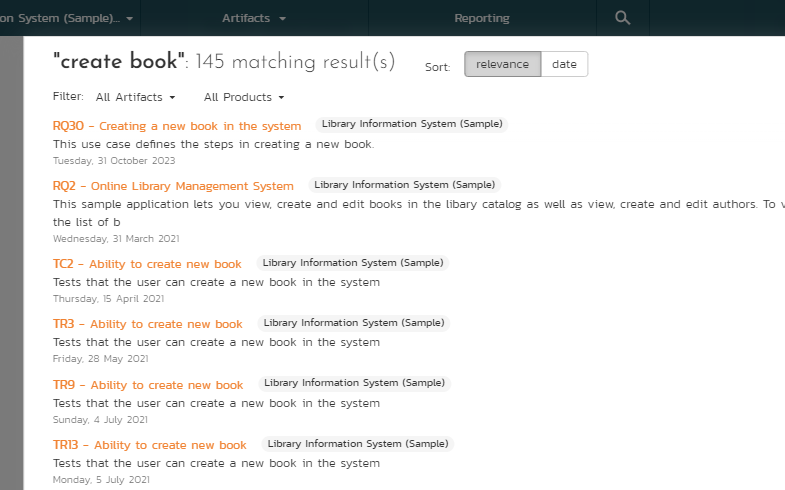

# User/Product Management

This section outlines how you can log into SpiraPlan®, view your personalized home-page that lists the key tasks that you need to focus on, and drill-down into each of your assigned products in a single dashboard view. In addition to your personal homepage, each of your products has its own dashboard that depicts the overall product health and status in a single comprehensive view.

## Login Screen

Upon entering the SpiraPlan® URL provided by your system administrator into your browser, you will see the following login screen:

You need to enter your given user-name and password into the system in the appropriate boxes then click the ***Log In*** button to gain access to the application. Normally you only remain logged in to the application whilst in active use, and you will be asked to log-in again after either closing the browser or 20 minutes of inactivity. To prevent this, and to stay logged-in to SpiraPlan® regardless of browser window closing or inactivity, select the "Keep me logged in" check-box before clicking the ***Log In*** button. Note that this setting is specific to each individual computer you are logging-in from, and that it will be reset when you explicitly log-out with the [log-out link](#global-navigation).

If for any reason you are unable to login with the provided username/password combination, and error message will be displayed. If you cannot remember the correct log-in information, click on the "Forgot your password" link and your password will be emailed to the email address currently on file. The reset password screen is illustrated below:

If you don't have a SpiraPlan® account setup, clicking on the "Register for an account?" link will take you to a form that you need to fill-in, which will be forwarded to the system administrator, who will need to approve your account before it is active in the system. This screen is illustrated below:

In addition, the system will prevent you logging on to the system with the same username *at the same time* on multiple computers. This is to avoid the system getting confused by a user trying to make contradictory actions at the same time. If for any reason you do try and log in to the system when you already have an active session in progress, you will see the following screen:

You have two choices: you can either click the "Log Out" link and try logging in as a different user, or if you want to log-off any other active sessions (e.g. you closed the browser and the session is still listed as active), simply click the "Sign Off The Other Locations" link, and you will be logged in to the application.

Since SpiraPlan® is licensed to organizations for a specific number of concurrent users -- unless they have purchased an unlimited Enterprise license -- only a fixed number of users may be active at the same time. So, for example if an organization has a five (5) concurrent user license and a sixth user tries to log-in, they will be presented with the following screen:

This means that one of the other users who is already logged-in, needs to click the "Log Out" button so that one of the concurrent licenses is freed for your use. If the user has logged out by closing the browser, the system may not have detected the logout. In this case, the other user needs to log back in, and then click the "Log Out" link.

## Logging in Using An External Provider
If you organisation uses a Single Sign On / OAuth provider like Okta or Google, underneath the standard username and password field you will see a button for each enabled provider. 

To login using your account with this provider:

1. click on the provider button
2. follow the instructions from the provider (eg log in to or select your account, and provide authorisation)
3. when you get back to the SpiraPlan login screen, you can connect that provider account to an existing SpiraPlan user
4. Follow the on screen instructions to enter the username and password of your SpiraPlan user and click `Login`. You are now connected to this provider!
5. Alternatively, you can choose to set up a new SpiraPlan account with that external provider account (if allowed by your system admin). Click the link and follow the on screen instructions to complete the registration. Once successful, your system admin will be alerted to the new user request
6. Once they have approved you, you are all set

Once you have a SpiraPlan user that authenticates with the provider, to log in to Spira click the provider button on the login page.

## My Page

Once you have successfully logged in, you will initially be taken to your personalized home page called "My Page". Please note, that the very first time you log in you will be asked if you want to take a quick orientation tour of the application (which will look similar to the screenshot below).

Note that once you have successfully logged-in and chosen a product, SpiraPlan® remembers this selection, and on subsequent log-ins will automatically select that product, and highlight it for you in the ["My Products" list](#my-products).

Your homepage contains all the information relevant to you---consolidated onto a single page for you to take immediate action. By default the page lists the information for all products that you are a member of. However, you can choose to filter by the current product, to get a more focused list.

Next to some of the widgets is an RSS icon (

), this allows you to subscribe to the information as a Really Simple Syndication (RSS) newsfeed. This can be useful if you want to be notified about recently assigned items without having to setup email notifications or being logged into SpiraPlan continuously. If you don't see an RSS icon next to the widgets on your My Page it means that you have not enabled RSS newsfeeds in your profile. For more details on configuring your RSS preferences, please refer to [My Profile](#my-profile).

Initially the page is loaded in 'view mode' which means that the various
'widgets' on the page are displayed with minimum visual clutter (no toolbars or control icons) that makes it easy to scan the items on the page and see what work has been assigned. To switch the page to 'edit mode', click on the button with the cog icon () on the right:

In this mode, each of the 'widgets' displayed on the page can be minimized by clicking on the arrow icon () in the top-left of the window, or closed by clicking-on the cross icon () in the top-right of the window. This allows you to customize your page to reflect the types of information that are relevant. If you have closed a widget that you subsequently decide you want to reopen, you can add them back to the page display by clicking the "Add Items" button at the top of the page. In addition, the various widgets have a "settings" icon () that allows you to customize how that widget appears. The settings are specific to each widget and in general allow you to specify how many rows of data are displayed and what columns are displayed.

You can move and reposition the various widgets on the dashboard by clicking the mouse on the title bar of the widget you want to move and dragging it to the desired location. This change will be remembered when you next login to the system. Once you have the dashboard configured the way you like it, you can click "Return to Normal View" to switch back to
'view mode'.

When you load your 'My Page' for the first time it will consists of the following main elements:

- Recent Products
- Recent Artifacts
- My Saved Searches
- My Assigned Requirements
- My Assigned Test Cases
- My Assigned Test Sets
- My Pending Test Runs
- My Assigned Incidents
- My Detected Incidents
- My Assigned Tasks
- Quick Launch
- My Contacts

However these are not the only widgets available. If you click on the "Add/Remove" items hyperlink it will display the list of any additional widgets that are available:

You can add the additional widgets by selecting the appropriate checkbox, choosing the destination location (left side vs. right side) and then click the \[Add\] button. The additional widgets available in the My Page are:

- My Saved Reports
- My Subscribed Artifacts
- My News Feeds

## Recent Products
This widgets shows the most recent products you have visited. Each time you visit a page for a different product the list of most recent products is updated. By default, it shows the five most recent products -- this can be edited in the widget edit controls to any number fifty or less.

For each recent product visited, the widget shows name for:

- the product itself
- the product's program
- the product's portfolio (SpiraPlan only)

Each product name is a link to that product's home page. The program and portfolio names are links to the relevant home pages if you have access to view those home pages.  

## Recent Artifacts
This widgets shows the most recent artifacts you have visited. If you last looked at Requirement X in Product Y then Requirement X will show at the top of the list. The widget will show specific artifacts across all artifact types and all products. By default, it shows the five most recent artifacts -- this can be edited in the widget edit controls to any number fifty or less.

For each recent artifact, the widget shows:

- the artifact's icon
- the artifact's name (which is a link to go back to that artifact)
- the name of the product the artifact is in
- the date you last looked at that specific artifact (hovering over the date will show the full date and time)

If "All Products" is selected at the top of the My Page, the list shows the most recent artifact across all products.

If "Current Product" is selected at the top of the My Page, the list shows only the recent artifacts that are from the current product (if any).

## My Saved Searches

This section lists any filters/searches you have saved from the various artifact list screens throughout the application. This allows you to store specific combinations of searches that you need to perform on a regular basis (e.g. display all newly logged incidents, display all requirements that are completed but have no test coverage).

The name of the saved search is displayed along with an icon that depicts which artifact it's for and the product it refers to. Clicking on the name of the saved search will take you to the appropriate screen in the product and set the search parameters accordingly. Clicking the "Delete" button next to the saved search will delete it. Clicking on the RSS icon will allow you to subscribe to the specific search so that it will be displayed in your RSS newsreader. This allows you to setup customized lists of information that can be displayed outside of SpiraPlan.

## My Assigned Requirements

This section lists all the requirements you have been made owner of, across *all the different products* you are a member of. This typically means that the product manager has assigned you to be responsible for either developing the supporting test cases or decomposing the requirement into its detailed work breakdown structure of product tasks. The requirement name is displayed, along with its status (requested, accepted, in-progress, etc.) and its importance. Requirements are included based on their importance: the list is ordered by importance (highest at top) and requirements with the same importance are ordered by their IDs.

## My Assigned Test Cases

This section lists all the test cases you are the owner of, across *all products* you are a member of. This typically means that the product or test manager has assigned you to be responsible for executing these test scripts. Test cases are included based on their last execution status and date: the list is ordered by execution status (failed at the top), test cases with the same execution status are ordered by last execution date, and if those match, then by their IDs. For each test case in the list you can see:

- its name (this is a link to the to the [details page for this test-case](../Test-Case-Management/#test-case-details))
- the product it belongs to
- its last execution status (for example failed or passed) - hover to see a tooltip showing the last execution date
- its last execution date (not shown by default)
- its workflow status
- a reassign button that let's users with the right permissions assign the test case to another test in that product
- a play (execute) button. This will execute the test case in the [test-case execution module](../Test-Case-Management/#execute-test-cases). This button will not be there if the product the test case belongs to does not allow you to execute test cases (instead only letting you execute test sets).

If you edit the widget you can: change the number of rows to show; show or hide the last executed date; and show or hide and the workflow status.

## My Assigned Test Sets

This section lists all the test sets (groups of test cases) you are the owner of, across *all products* you are a member of. This typically means that the product or test manager has assigned you to be responsible for executing the test cases contained within the test set against a specified release of the system under test. Test sets are included based on their planned date: this list is ordered by planned date (oldest at top) and test sets with the same planned are ordered by their IDs. For each test set in the list you can see:

- its name (this is a link to the to the [details page for this test-set](../Test-Set-Management/#test-set-details)) - in a badge at the end of the name is a mini badge showing the number of remaining test cases to be executed
- the product it belongs to
- its due date
- its status 
- a play (execute) button. This will [execute the test set](../Test-Case-Management/#execute-test-cases)

## My Pending Test Runs

This section lists any test runs that you started executing in the test case module but haven't yet completed. Until a test case or test set is fully executed, a pending test run entry is stored in the system so that you can continue execution at a later date.

Any pending test run can be either deleted or resumed by clicking on the appropriate button. In addition, there is the option to reassign the test run to another user that is a member of the product.

## My Assigned Tasks

This section lists all the product tasks that you have been made the owner of across *all the different products* you are a member of. This typically means that the manager of the product in question has assigned development tasks to you that need to be completed so that a release can be completed and/or a requirement can be fulfilled. The tasks are listed by priority: tasks with no priority at the top, and after that the highest priority tasks. In addition, each task is displayed with a progress indicator that graphically illustrates its completion against schedule. See [Task Tracking](../Task-Tracking/) -- task management for details of the different progress indicators.

Clicking on the task name hyperlink will take you to the task details page. This page will describe the task in more detail, illustrate which requirement and release it is associated with, and also allow you to view the change log of actions that have been performed on it.

## My Assigned Incidents

This section lists all the open incidents you are the owner of, across *all the different products* you are a member of. This typically means that the product manager has assigned you to be responsible for resolving the incident. In the case of a bug, this can mean actually fixing the problem, whereas for other incident types (e.g. training item) it may mean simply documenting a workaround. In either event, this section highlights the open incidents you need to manage, ranked by priority (incidents with no priority are at the top) and categorized by type, with the open date displayed to give you a sense of the age of the incident.

Clicking on the incident name hyperlink takes you to the [incident details page](../Incident-Tracking/#incident-details)) that describes the incident in more detail, and allows you to add new information or change its status to indicate actions taken. In addition, if you position the mouse pointer over the name of the incident, a more detailed description is displayed as a "tooltip".

## My Detected Incidents

This section lists all the open incidents that you have detected, across
*all the different products* you are a member of. These incidents are not necessarily ones that you need to take an active role in resolving, but since you were the originator -- either by executing a test case or just logging a standalone incident -- you can watch them to make sure that they are resolved in a timely manner. The incidents shown are ranked by last updated date (most recent at the top).

Clicking on the incident name hyperlink takes you to the [incident details page](../Incident-Tracking/#incident-details)) that describes the incident in more detail, and allows you to add new information or change its status to indicate actions taken. In addition, if you position the mouse pointer over the name of the incident, a more detailed description is displayed as a "tooltip".

## Quick Launch

This widget allows users to quickly record a new incident in any of the products that they belong to. It's a shortcut that avoids having to first select a product, go to Tracking \> Incidents and then click "New Incident". Instead you simply choose the product from the dropdown list and click the arrow icon to bring up the new incident creation screen.

## My Contacts

This widget displays a list of any other users in the system that you have listed as a personal contact:

Each user is displayed along with their graphical avatar, department and a colored indicator that lets you know if they are online or not. If they are online you can then send them an instant message (which will be described later in [Global Navigation](#global-navigation). To remove an existing contact, just click on the 'Remove' button. To add a new user, simply locate them in the Tracking \> Resources page and then use the <Add As Contact\>
button.

## My Saved Reports

This section lists any reports you have saved from the reports center. This allows you to store specific combinations of report elements, format, filters and sorts (see the section on Reporting for more details on how to configure a report) for reports that you need to run on a regular basis.

## My Subscribed Artifacts

This widget displays a list of all the artifacts in the system that you have subscribed to (by clicking on the Subscribe icon on the item). You can display the item by simply clicking on the hyperlink. In addition, if changes are made to any of the artifacts an email notification will be sent to you. You can click on the "Unsubscribe" button to remove the item from this list.

## My News Feeds

This widget allows you to subscribe to an external newsfeed and have the results be displayed inside SpiraPlan. By default it will be set to the newsfeed from the Inflectra website that displays a list of recent company and product announcements. You can add multiple instances of the widget to the dashboard, allowing you to read multiple news sources at once. Typical uses for this widget are to add news from product management and testing news sites/blogs or to add information from other tools in your organization that can display their data in RSS format.

## My Assigned Risks (SpiraPlan only)

This section lists all the risks you are the owner of across *all the different products* you are a member of. Clicking on the risk name hyperlink will take you to the risk details page. This page will describe the risk in more detail. Risks are shown ranked by their exposure (the highest exposure at the top), risks with the same exposure are ordered by their IDs.

## My Assigned Documents

This section lists all the documents you are the owner of across *all the different products* you are a member of. Clicking on the risk name hyperlink will take you to the documents details page. This page will describe the documents in more detail. The list is ranked by last updated date.

## Global Navigation

Regardless of the page you are on, SpiraPlan® will always display the global navigation bar, consisting of a number of different sections, depending on the user and where they are in the system.

Under some of the icons and headings are secondary menu options that display when you click on the section in question. The sections and menus available in the global navigation are show below:

- **Product Icon** (shown as SpiraPlan above): this will always take you to "My Page" as discussed above
- **Workspace Icon**: this shows you the type of workspace you are on, for example a [program](#program-home) or a [product](#product-home). Clicking it will take you to that workspace's homepage
- **Workspace Selector**: this shows the name of the current workspace. Clicking it will show all your available workspaces and clicking any of these will change you to that workspace
- **Artifacts Selector**: when visible, this shows the name of the current artifact for the current workspace. Clicking it will show all your available artifacts and clicking any of these will change you to that artifacts main page. For product workspaces these artifacts are grouped as follows:
    - Planning
        - [Requirements](../Requirements-Management/)
        - [Planning Board](../Planning-Board/)
        - [Releases](../Release-Management/)
        - [Documents](../Document-Management/)
    - Testing
        - [Test Cases](../Test-Case-Management/)
        - [Test Sets](../Test-Case-Management/#test-set-list)
        - [Test Runs](../Test-Case-Management/#test-run-list)
        - [Automation Hosts](../Test-Case-Management/#automation-host-list)
    - Tracking
        - [Incidents](../Incident-Tracking/)
        - [Tasks](../Task-Tracking/)
        - [Risks](../Risks-Management/)
        - [Resources](../Resource-Tracking/)
        - [Source Code](../Source-Code/)

- [**Reporting**](../Reports-Center/)
- **User Profile Icon**

    - [My Profile](#my-profile)
    - [My Timecard](#my-timecard)
    - [Documentation](#documentation)
    - [Show on boarding tours](#show-onboarding-tours)
    - [Keyboard shortcuts](../Appendix-1-Keyboard-Shortcuts/)
    - [Log Out](#log-out)

- **Administration Icon**: This is visible if you are a system administrator, or if you are an owner/administrator of the current workspace or its template. Clicking the icon will display the relevant administration menu. This is described in the separate *SpiraPlan Administration Guide*.

## Global Search

SpiraPlan includes a global search that can be used to search across product and artifact type for items that include the entered keywords in either the name or description field:

You can search for individual keywords by simply entering them in the search box and clicking the arrow button on the right. You can search for phrases by enclosing the words in double quotes. You can also
**search for a specific artifact** by its unique **two-letter prefix and ID number**.

For example, searching on **book name** will find any artifacts that include either of the two words book and name in the name or description. Searching on **"book name"** will only return items that have that exact phrase in either the name or description. Searching on
**TC2** will display just the Test Case with ID=2:

When you get a list of search results, you can choose to order by relevance (the default) or by most recent. Searching by relevance finds the artifacts that have the greatest match with the keywords:

The search by date is useful when you want to find recent items that match the search keywords:

In addition, you can filter the results by artifact type and/or product to narrow down the search:

For example, if you filter by requirement, the list of results will be narrowed accordingy:

## Log Out

Clicking on the "Log Out" link will immediately log you out of your current session and return you to the [login page](#login-screen). If you had set the "Keep Me Logged In" option during your previous login, that setting will be reset; so if you want to avoid having to keep logging-in, you'll need to re-check that box during your next log-in.

## Documentation

Clicking on this link on any page will bring up the online version of this manual shown below:

Clicking on any of the triangles expand links in the left hand table of contents will open up the detailed list of topics for each of the main areas of the system. In each area, clicking on one of the individual links will open the appropriate section in the help manual. By default, the reading-pane will open to the help item that is most closely related to the screen you happened to be on when you clicked the "Help" link.

You can search the index by using the "Index" tab.

If you want to share a specific help page with a colleague in your organization, send them the url from the address bar.

## Choosing a Workspace

Workspaces in SpiraPlan set out the scope for the data you want to view and interact with. The most common workspace type is a product:

-   A product contains all the requirements, sprints, defects, and tests associated to it.

-   Programs are groups of products, where you can look across all the products in that program at once

Choosing, for example, a Product or Program from the list of your assigned workspaces in the drop-down-menu allows you to quickly and easily jump between workspace regardless of the page you happen to be on. When you choose a new workspace, you will be taken to the same page in the selected workspace (assuming that you have permissions to view that page). Any workspace with a little cog at the end is a workspace that you are an owner/admin of.

You can use CTRL+click to open the new product in a separate browser tab:

## Show Onboarding Tours

When you first login to SpiraTeam, the system will show you a welcome page, together with a tour that walks you through the key features of the application. If you would like to see that again, you need to click on the "Show Onboarding Tours" option, under the user profile menu. SpiraPlan will then display the **onboarding tour** main dialog again:

You can click 'No Thanks to dismiss it, or 'Yes Please' to start the tour.

## Instant Messenger

The Spira instant messenger is available in both SpiraTeam® and SpiraPlan® and allows you to send short messages instantaneously to other users in the system. You can see the status of other users by looking for the small green circle next to the list of users in the 'My Contacts' widget as well as the various user fields in the system:

When a user is online and available to communicate with, the small circle will be filled-in green. If you click on the green circle, it will open up the instant messenger window for that user:

You can then enter in a message to the other user, which will then cause a conversation window to open inside their web browser with your message displayed. The other user can then enter in their responses, allowing the two users to have a real-time conversation:

To make it easier to see what's new, all unread messages are displayed in a message box with a darker shade. In addition, the user's avatar image is displayed at the start of each message group.

If the message window appears on a SpiraPlan® window that contains a specific artifact (e.g. a requirement, test case, task, etc.) there will be the option to 'Post as Comments'. If you click this option, any messages selected with a checkbox will be automatically posted to the current artifact as comments. This is useful if you have a conversation related to a specific item and you want to have the outcome permanently recorded as part of the audit trail. Otherwise, instant messages will be automatically purged from the system after 90 days.

## My Profile

When you click on the "***My Profile***" button (the top item in the user dropdown) in the global navigation, you will be taken to the page in the system that allows you to view and edit your personal profile:

You can change your user information including your first-name, last-name, middle-initial, avatar icon, department and your choice of start-page. Clicking the "***Save***" button will commit the changes, whereas clicking <Cancel\> returns you back to either "Product Home" or "My Page" depending on whether you have a product currently selected or not.

If you want to be able to subscribe to RSS feeds of the information assigned to you in the "My Page", make sure that the "Enable RSS Feeds" switch is set to "Yes" and an RSS token has been generated underneath.

You can change your start page to be any of the following:

-   **My Page** -- When you first log-in, you will be taken to your "My Page" dashboard

-   **Last Opened Product** -- When you first login-in, you will be taken to the home page for the product you last had open

-   **Last Opened Program** - When you first login-in, you will be taken to the home page for the program you last had open

## Account Security

In addition to being able to update your user information, you can optionally change your password at the same time. To change your password, on the Change Password tab fill in the three boxes with your current password, and your new password repeated for verification. Then when the "***Save***" button is clicked, the system will update your password, otherwise you will simply get a warning message indicating what needs to be corrected.

You can also change the current password retrieval question and answer by entering in your current password (for security reasons) as well as the new password question and answer.

Note: If your SpiraTest user profile is linked to an account stored in an external LDAP server, you may find the change password option is disabled. This is because the system uses the password held in the external server. To change the password in this case, please contact your system administrator who will be able to help you change the password in your LDAP environment.

#### LDAP Information
If your account authenticates using LDAP, this tab will show you information about the configured LDAP options for your account. This is for reference only.

#### Login Provider
If your account authenticates using an external provider (like Google or Okta), this tab will show you information about which provider you are using.

Click the `Unlink Account` button to stop using the external provider. The popup will make you enter new security information. You will use this, along with your username, to login to SpiraPlan, once the unlinking process is complete

## Email Preferences

Here you can configure the email address that the application will send notifications to, and whether or not you want to receive email notifications.

If the Enable Notifications cannot be changed, it means that the system is either not configured to send out notifications, or the administrator has disabled user's ability to opt out of notifications being sent.

## Regional Settings

This tab will display the current culture and timezone associated with your profile:

By default all profiles will be set to use the application's default culture and timezone. This means that the language, number formats and timezone used in the application will be the ones decided by the person who installed the system. However there are cases where you want to use a different language, timezone or number format (for example, a German employee working in the German office of a French company might want to use the German culture instead of French). You can change the culture and/or timezone to any of the options listed in the dropdown list.

Note: The system will only be installed with a certain number of language packs, so in some cases a selected culture will only change the number formats and not the languages displayed.

## Actions

This tab displays the list of recent actions that you have performed in the system (across all products):

You can search and filter the grid to find changes by product, change date range, artifact type and type of change (added, deleted, or modified).

## My Timecard

When you click on My Page \> My Timecard the system will display a timecard that allows you to enter the effort worked on incidents and tasks currently assigned to you (across all your products):

The system will only include products that have time-tracking enabled for incidents and tasks, so if some of your assigned incidents or tasks are missing, please check with the product owner of the products affected to have them enable time-tracking.

Each task or incident will be displayed along with its priority, severity, start-date, end-date, product name effort remaining and effort expended to date. For each item you can then indicate the additional actual effort performed (which will be added to the "actual effort") and modify the amount of hours remaining. Once you are satisfied, click
\[Submit Timecard\] to commit the changes.

## Redirects
- [Product Homepage](../Product-Homepage)
- [Program Homepage](../Program-Homepage)