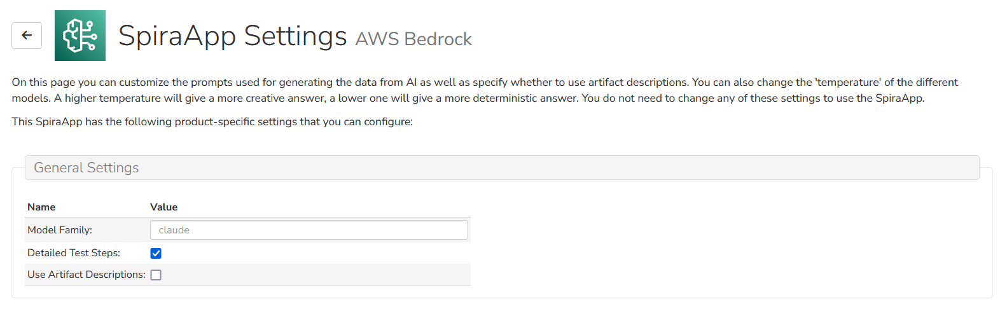
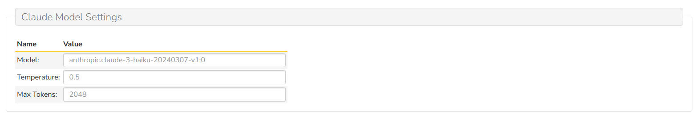

# AWS Bedrock SpiraApp

!!! warning "Some of this SpiraApp's functionality is not compatible with SpiraTest"

This SpiraApp lets you generate downstream artifacts from Spira requirements, test cases and risks using a variety of LLM models hosted in AWS Bedrock.
The current functionality uses the power of generative AI to suggest probable test cases with steps from requirements, generate the likely
development tasks for the requirement, generate the BDD scenarios for the requirement, and identify common business and technical risks.
It also will let you generate the test steps for an existing test case, and suggest mitigations for an existing risk.

It can provide an easy and effective way for users to create a foundational set of items that they can refine and tailor easily and effectively. Note that Tasks and Risks are not available in SpiraTest.

By using this SpiraApp users will, by necessity, share information with AWS Bedrock. For that reason, system admins must configure this SpiraApp to an existing AWS Bedrock service for your organization.

!!! info "About this SpiraApp"
    - [x] system settings
    - [x] product settings 
    - [ ] product template setup required
    - [x] toolbar button on requirement details page
    - [x] toolbar button on test case details page
    - [x] toolbar button on risk details page
    - [x] toolbar button on task details page

## AWS Bedrock Setup
Log into your AWS Console and navigate to the **Bedrock** services section. Then click on the sidebar menu entry for **Model access*:


On this page you can request access to various LLM model families and models. Please request access to at least one **Anthropic Claude** model and/or **Meta Llama** model:


Once you have been granted access to the models, navigate over to the **IAM** AWS Service page, and create a new IAM user called `aws-bedrock-service-user`.


In line with AWS best practices, we will also create an IAM group called `aws-bedrock-service-group`. Make sure to add your new user to this new group.


Now that you have the IAM group created, attach the following policies/permissions to the group: 


- **AmazonBedrockReadOnly** - this is a built-in AWS managed permission
- **Invoke-Any-Foundational-Model** - this is an inline permission that we need to create.

To create the new Invoke Any Foundational Model permission, we need to use the inline policy editor:


To simplify things, simply use the following JSON policy:

```json
{
	"Version": "2012-10-17",
	"Statement": [
		{
			"Sid": "VisualEditor0",
			"Effect": "Allow",
			"Action": "bedrock:InvokeModel",
			"Resource": "arn:aws:bedrock:*::foundation-model/*"
		}
	]
}
```

Finally, we need to create an **Access Key** for this user so that we can call it from our SpiraApp. Click on the section **Access Keys**:


Click on the button **Create access key** to start the access key creation wizard. On the first page, choose **Application running outside AWS**.

On the second page, enter in a description of what this access key will be used for. For example, `Used to connect the AWS SpiraApp to Bedrock`:


Once the access key has been created, you will be given two pieces of information:
- Access Key
- Secret Access Key

Copy both of these values into your secure credential storage. You will need them in the next section for setting up the SpiraApp.

## SpiraApp Setup
### System Settings
- [x] Enter the AWS region you want to connect to. Leaving this setting blank uses the default region of `us-east-1`
- [x] Enter the Access Key created for accessing AWS Bedrock
- [x] Enter the Secret Access Key created for accessing AWS Bedrock


### Product Settings
Once the SpiraApp has been activated system wide, and enabled for a product you can edit its product settings. **All of these settings are optional**. You can use the SpiraApp without editing any of the product settings. The settings are here to help you customize the results from the SpiraApp, including if using languages other than English.

#### General Settings

This is where you can specify the general SpiraApp product settings:



- [x] **Model Family:** Which LLM model family do you want to use in this product. The only accepted values currently are `llama` or `claude`, the default is `claude`.
- [x] **Detailed Test Steps:** Should we create detailed test steps for test cases, or just a single step
- [x] **Use Artifact Descriptions:** Should we use the artifact descriptions as well as the names in the prompts

#### Llama Model Settings

This is where you can specify settings specific to the Llama model:


| Setting name            | Default Value                                                                                                                         | Explanation                                                                                                                                                      |
| ----------------------- | ------------------------------------------------------------------------------------------------------------------------------------- | ---------------------------------------------------------------------------------------------------------------------------------------------------------------- |
| Model                   | meta.llama3-70b-instruct-v1:0                                                                                                                         | The name of the Llama model we want to use                                                                                                                     |
| Temperature             | 0.2                                                                                                                                   | Use a lower value to decrease randomness in the response (minimum 0, maximum 1, default 0.5) |
| Top p     | 0.9                                                                                                                         | Use a lower value to ignore less probable options. Set to 0 or 1.0 to disable (minimum 0, maximum 1, default 0.9)                                                                                                                     |
| Max Generated Tokens     | 2048                                                                                                                         | Specify the maximum number of tokens to use in the generated response. The model truncates the response once the generated text exceeds (minimum 1, maximum 2048, default 2048)                                                 |


#### Claude Model Settings

This is where you can specify settings specific to the Claude model:




| Setting name            | Default Value                                                                                                                         | Explanation                                                                                                                                                      |
| ----------------------- | ------------------------------------------------------------------------------------------------------------------------------------- | ---------------------------------------------------------------------------------------------------------------------------------------------------------------- |
| Model                   | anthropic.claude-3-haiku-20240307-v1:0                                                                                                                         | The name of the Claude model we want to use                                                                                                                    |
| Temperature             | 0.5                                                                                                                                   | Use a lower value to decrease randomness in the response (minimum 0, maximum 1, default 0.5) |
| Max Tokens     | 2048                                                                                                                         | Specify the maximum number of tokens to use in the generated response. The model truncates the response once the generated text exceeds (minimum 1, maximum 4096, default 2048)                                             |


#### Code Generation

This is where you can customize the list of programming languages available:


- **Coding Languages**: In this text box, provide a comma-separated list of programming languages that the user can pick from. If you don't provide a value, the default list of languages will be provided.
- **Unit Test Frameworks**: In this text box, provide a comma-separated list of programming languages and unit test frameworks that the user can pick from. The programming language and unit test framework should be separated by a pipe (|) symbol If you don't provide a value, the default list of languages and unit test frameworks will be provided.


#### Prompt Customization

This is where you can customize the prompts sent to the LLM:


| Setting name            | Default Value                                                                                                                         | Explanation                                                                                                                                                      |
| ----------------------- | ------------------------------------------------------------------------------------------------------------------------------------- | ---------------------------------------------------------------------------------------------------------------------------------------------------------------- |
| Global Prompt        | You are a business analyst that only speaks in JSON. Do not generate output that isn't in properly formatted JSON. | This prompt is used to control the output format of all the repsonses to be JSON.                                                                                        |
| Test Case Prompt        | Write the test cases for the following software requirement as { \"TestCases\": [] }. For each test case include the description, input and expected output in the following format { \"Description\": [Description of test case], \"Input\": [Sample input in plain text], \"ExpectedOutput\": [Expected output in plain text] } | This prompt is used to generate the test cases from the requirement                                                                                              |
| Task Prompt             | Write the development tasks for the following software requirement as { \"Tasks\": [] }. For each task include the name and description in the following format { \"Name\": [name in plain text], \"Description\": [description in plain text] }  | This prompt is used to generate the tasks from the requirement                                                                                                   |
| Risk Prompt             | Identify the possible business and technical risks for the following software requirement as { \"Risks\": [] }. For each risk include the name and description in the following format { \"Name\": [name in plain text], \"Description\": [description in plain text] } | This prompt is used to generate the risks from the requirement.                                                                                                  |
| BDD Prompt        | Write the BDD scenarios for the following software requirement as { \"Scenarios\": [] }. For each scenario use the following Gherkin format { \"Name\": [The name of the scenario], \"Given\": [single setup in plain text], \"When\": [single action in plain text], \"Then\": [single assertion in plain text] }     | This prompt is used to generate the BDD steps for the requirement.                                                                                               |
| Test Step Prompt        | Write at least 10 test steps for the following test case as { \"TestSteps\": [] }. For each test step include the description, expected result, and sample data in the following format { \"Description\": [Description of test step], \"ExpectedResult\": [The expected result], \"SampleData\": [Sample data in plain text] }        | This prompt is used to generate the test steps steps for the test case.                                                                                               |
| Requirement Prompt        | Write the requirements for the following test case as { \"Requirements\": [] }. For each requirement include the name and description in the following format { \"Name\": [name in plain text], \"Description\": [description in plain text] }          | This prompt is used to generate the requirements for the test case.                                                                                               |
| Mitigation Prompt        | Write the possible mitigations for the following risk as { \"Mitigations\": [] }. For each mitigation include the description in the following format { \"Description\": [description in plain text] }                    | This prompt is used to generate the mitigations for the risk.                                                                                               |


## Using the SpiraApp

The user can navigate to different pages to use the SpiraApp, each one will have a toolbar with various generation options.

### Requirement Details Page

When a user goes to the requirement details page, they will see an extra button in the toolbar. To generate relevant data they should follow these steps:

- Click the "Azure OpenAI" button
- Select the artifact to generate (e.g. Tasks)


- This will send the requirement name (and optionally the description) to Azure OpenAI
- The information coming back is parsed and analyzed by the SpiraApp and then created in Spira

A message will show at the top of the page informing the user when information is sent or if there was a problem.


### Test Case Details Page

When a user goes to the testc ase details page, they will see an extra button in the toolbar. To generate relevant data they should follow these steps:

- Click the "Azure OpenAI" button
- Select the artifact to generate (e.g. Test Steps)


- This will send the test case name (and optionally the description) to Azure OpenAI
- The information coming back is parsed and analyzed by the SpiraApp and then created in Spira

A message will show at the top of the page informing the user when information is sent or if there was a problem.

### Task Details Page

When a user goes to the task details page, they will see an extra button in the toolbar. To generate relevant data they should follow these steps:

- Click the "Azure OpenAI" button
- Select the type of code to generate (e.g. Source Code)


Once you choose the appropriate code generation option, a dialog box will be displayed where you can choose which programming langauage (and optionally unit test framework) to use:


- This will send the task name (and optionally the description) to Azure OpenAI
- The information coming back is parsed and analyzed by the SpiraApp and then created in Spira

A message will show at the top of the page informing the user when information is sent or if there was a problem.

### Risk Details Page

When a user goes to the risk details page, they will see an extra button in the toolbar. To generate relevant data they should follow these steps:

- Click the "Azure OpenAI" button
- Select the artifact to generate (e.g. Mitigations)


- This will send the risk name (and optionally the description) to Azure OpenAI
- The information coming back is parsed and analyzed by the SpiraApp and then created in Spira

A message will show at the top of the page informing the user when information is sent or if there was a problem.

### Extra details to be aware of

- The generated artifacts only have their names and descriptions populated, with the exception of test cases that will have detailed test steps.
- To generate artifacts the user must have create permission for that artifact.
- BDD steps can only be generated on requirements of types that support steps.

## Appendix - Default prompts

If you are interested in customizing the prompts used in the plugin, please use the following starting points:

### Global Prompt

`You are a business analyst that only speaks in JSON. Do not generate output that isn't in properly formatted JSON.`

### Requirement Prompts

#### 1. Generate Test Cases

`Write the test cases for the following software requirement as { \"TestCases\": [] }. For each test case include the description, input and expected output in the following format { \"Description\": [Description of test case], \"Input\": [Sample input in plain text], \"ExpectedOutput\": [Expected output in plain text] }`

#### 2. Generate Tasks

`Write the development tasks for the following software requirement as { \"Tasks\": [] }. For each task include the name and description in the following format { \"Name\": [name in plain text], \"Description\": [description in plain text] }`

#### 3. Generate Scenarios

`Write the BDD scenarios for the following software requirement as { \"Scenarios\": [] }. For each scenario use the following Gherkin format { \"Name\": [The name of the scenario], \"Given\": [single setup in plain text], \"When\": [single action in plain text], \"Then\": [single assertion in plain text] }`

#### 3. Generate Risks

`Identify the possible business and technical risks for the following software requirement as { \"Risks\": [] }. For each risk include the name and description in the following format { \"Name\": [name in plain text], \"Description\": [description in plain text] }`

## Risk Prompts

#### 1. Generate Mitigations

`Write the possible mitigations for the following risk as { \"Mitigations\": [] }. For each mitigation include the description in the following format { \"Description\": [description in plain text] }`

## Test Case Prompts

#### 1. Generate Steps

`Write at least 10 test steps for the following test case as { \"TestSteps\": [] }. For each test step include the description, expected result, and sample data in the following format { \"Description\": [Description of test step], \"ExpectedResult\": [The expected result], \"SampleData\": [Sample data in plain text] }`

#### 2. Generate Requirements

`Write the requirements for the following test case as { \"Requirements\": [] }. For each requirement include the name and description in the following format { \"Name\": [name in plain text], \"Description\": [description in plain text] }`

## Task Prompts

#### 1. Generate Source Code

`You are a programmer working in the [CODE_LANGUAGE] programming language. Write sample code that implements the following feature in the following format { \"Filename\": [filename for source code], \"Code\": [source code in plain text as a single escaped string] }`

#### 2. Generate Source Code with Unit Tests

`You are a programmer working in the [CODE_LANGUAGE] programming language. Could you write a sample unit test for the following feature using [CODE_LANGUAGE] and the [TEST_FRAMEWORK] framework in the following format { \"Filename\": [filename for source code], \"Code\": [source code in plain text as a single escaped string] }`