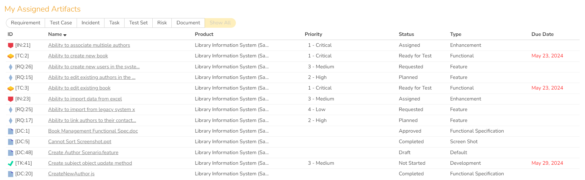
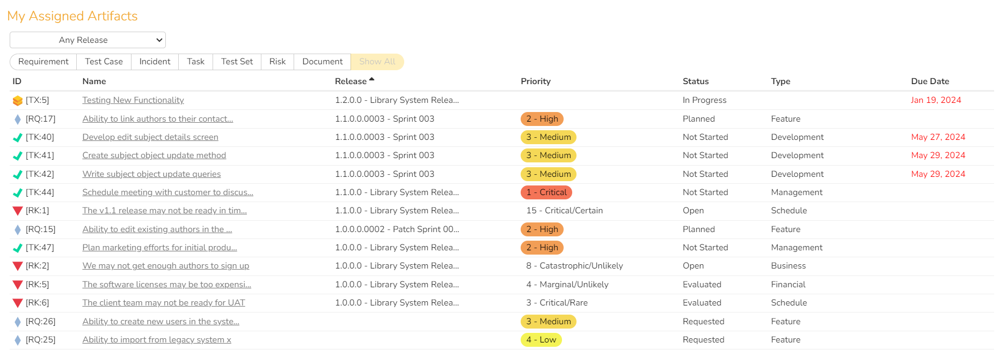

# My Assigned Artifacts

!!! warning "Some of this SpiraApp's functionality is not compatible with SpiraTest"

This SpiraApp adds a widget to the user's My Page that allows them to view their owned Artifacts in an interactive grid.

!!! info "About this SpiraApp"
    - [ ] system settings
    - [ ] product settings 
    - [ ] product template setup required
    - [x] my page widget

## Setup
### Adding the My Assigned Artifacts Widget to your My Page

To add the widget to your My Page, edit the page and then open the "SpiraApp Widgets" section. Add the widget to the section of the page you want.

## Using the SpiraApp
### Using the My Assigned Artifacts Widget
This widget displays a grid of many of your owned (and open) artifacts. Included artifacts are: Requirements, Test Cases, Incidents, Tasks, Test Sets, Documents, and Risks SpiraTeam SpiraPlan.
When the My Page is filtering on **All Products**, for each row, you see:

- **ID**: Shows the type of Artifact and ID
- **Name**: hovering shows the ID and full name, and clicking the name opens the artifact details page
- **Product**: hovering shows the full name
- **Priority**: shows Importance for Requirements, and Exposure for Risks
- **Status**
- **Type**
- **Due Date**: shows the End Date for Tasks, Review Date for Risks, Execution Date for Test Cases, and Planned Date for Test Sets. Shows the date in red text if the date has passed

When the My Page is filtering instead on **Current Product**, the **Product** column is replaced by **Release** and, if the user is allowed to see Releases in the product, a releases dropdown select is added above the filter buttons.

### Filtering and Sorting the My Assigned Artifacts Widget
Above the artifact grid is a row of Artifact Type filter buttons, which can be used to individually toggle which artifacts are shown. In **Current Product** mode, the releases dropdown can be used to include only artifacts attached to a specific release.

By default, the grid is sorted in ascending order by Name. To change the sorting key, click any of the column headers. To swap between ascending and descending order, click the same column header again.

Your filters and sorting choices are saved locally and will persist if you leave the page and come back, in the same browser on the same device.