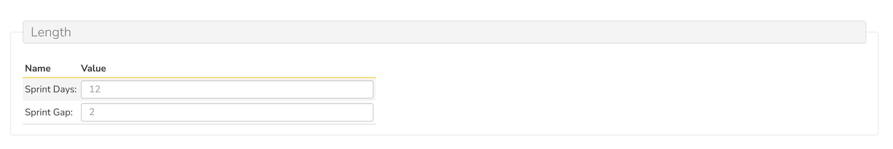
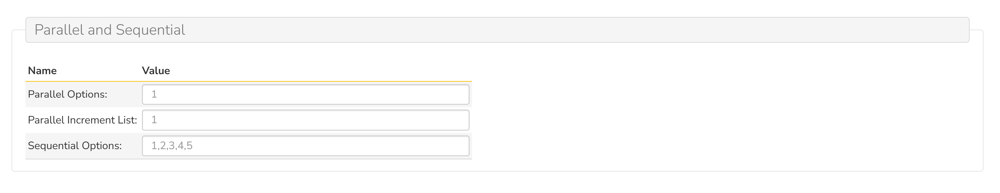
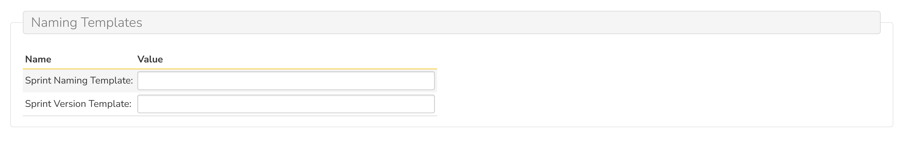
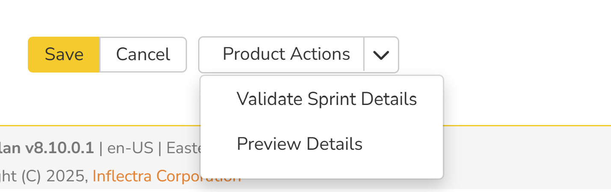
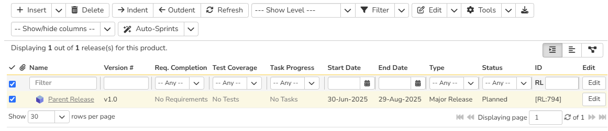
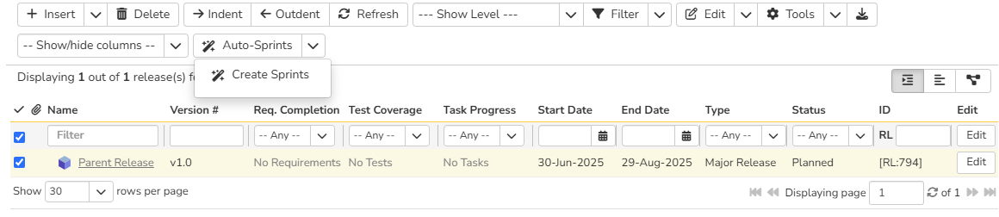
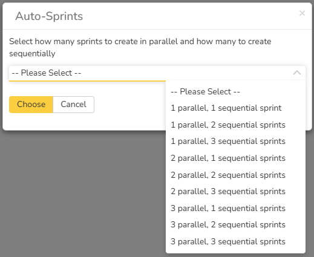

# Auto-Sprints

<!-- // is it compatible with the spiratest, or teams -->
!!! warning "This SpiraApp works with v8.3+" 

This SpiraApp automates sprint creation based on your product's settings for a selected major or minor release within the Release List page.

!!! info "About this SpiraApp"
    - [ ] system settings
    - [x] product settings 
    - [ ] product template setup required
    - [x] runs automatically on the release list page
    - [x] toolbar button on the release list page
    - [x] automatically generates sprints based on configured product settings.

## Setup
### Product Settings

Once the SpiraApp has been activated system-wide and enabled for a specific product, you can configure its product-level settings. All settings, except for "Sprint Gap" (which defaults to 0), are **required**. These settings allow you to customize sprint names and versions, ensuring uniqueness during sprint generation.

**Important:** The SpiraApp cannot generate sprints without these settings properly configured. Attempting to do so will result in a sprint generation failure.

#### Length

This section allows you to define the duration of your sprints and any gaps between them.

  * **Sprint Days:** Enter an integer value between 2 and 60. This value determines the length, in days, of each generated sprint. This is a **required** field.
  * **Sprint Gap:** Enter an integer value between 0 and 30. This value determines the number of days between the end of one sprint and the start of the next. A value of `0` means sprints will start immediately after the previous one ends.

#### Parallel and Sequential

Configure the number of parallel and sequential sprints you wish to generate, along with naming conventions to differentiate parallel sprints.

  * **Parallel Options:** Provide up to 3 comma-separated integer values, each between 1 and 5. These values determine how many parallel sprints will run concurrently.
  * **Parallel Increment List:** Provide up to 5 comma-separated names. These names are used to uniquely identify parallel sprints that start at the same time. If "Parallel Options" is set to `1`, this field can be left empty. Otherwise, you must provide enough names to match the maximum number of parallel sprints specified.
  * **Sequential Options:** Provide up to 5 comma-separated integer values, each between 1 and 10. These values determine the total number of sequential sprints to be generated.

#### Naming Templates

Customize the naming and versioning conventions for your generated sprints using a combination of predefined tokens.

 
  * **Sprint Naming Template:** Define how your sprints will be named. You can use the following allowed tokens:

      * `{release}`: Replaced by the name of the selected parent release.
      * `{product}`: Replaced by the name of the current product.
      * **Date Tokens:**
          * `{yyyy}`: Full year (e.g., 2025)
          * `{yy}`: Two-digit year (e.g., 25)
          * `{mm}`: Two-digit month (e.g., 01 for January)
          * `{mmm}`: Three-letter month abbreviation (e.g., Jan)
          * `{dd}`: Two-digit day (e.g., 05)
          * `{d}`: Day of the week (1 for Monday, 7 for Sunday).
          * `{ww}`: Two-digit week number (e.g., 01)
      * `{s-increment}`: Represents the sequential depth of the sprint (e.g., 1, 2, 3...).
      * `{p-increment}`: Differentiates between parallel sprints (uses values from "Parallel Increment List").

  * **Sprint Version Template:** Define the versioning template for your sprints. You can use the following allowed tokens:

      * `{version}`: Takes the full version number of the parent release (e.g., 1.0.0).
      * `{version,stop=X}`: Takes the part of the parent release version up to the first occurrence of character `X` (e.g., if version is `1.2.3` and `X` is `.`, this token would result in `1`).
      * **Date Tokens:** (Same as Sprint Naming Template)
          * `{yyyy}`, `{yy}`, `{mm}`, `{mmm}`, `{dd}`, `{d}`, `{ww}`
      * `{s-increment}`: Represents the sequential depth of the sprint (e.g., 1, 2, 3...).
      * `{p-increment}`: Differentiates between parallel sprints (uses values from "Parallel Increment List").

#### Product Actions Button

These buttons allow you to validate your settings and preview the generated sprint details.

  * **Validate Sprint Details:** It's crucial to use this button to **verify your configurations are valid** before saving. If any validation fails, the app will clearly indicate what needs to be corrected, preventing sprint generation failures on the Release List page.
  * **Preview Details:** Use this button to **see a sample of your sprint names and versions** based on your current template configurations. 
   **Please Note:**
    * For preview purposes, tokens like `{release}`, `{product}`, and `{version}` use static example values (e.g., 'R1' for release, 'ProdX' for product, '1.0' for version). The actual values will be used during final sprint generation.
    * The preview will display a maximum of the first four example names and versions.
    * If your settings are invalid, a pop-up error will inform you which fields need to be fixed, and no preview will be available.

##### Example of Product Admin Configuration
Here is a detailed worked example demonstrating how to configure the SpiraApp for automated sprint generation.

* **Scenario:** You want to generate sprints for a new major/minor release with the following requirements:
    * Each sprint should be 10 days long.
    * There should be a 2-day gap between sprints.
    * You want two parallel sets of sprints.
    * You need a total of 3 sequential sprints within each parallel set.
    * Sprint names should include the product name, release name, the sequential increment, and a parallel identifier.
    * Sprint versions should be based on the release version, with a sequential increment and parallel identifier.

* **Product Settings Configuration:** Based on the scenario, here's how you would configure each section:
    * **Length:**
        * **Sprint Days:** `10`
        * **Sprint Gap:** `2`
    * **Parallel and Sequential:**
        * **Parallel Options:** `2`
        * **Parallel Increment List:** `A,B`
        * **Sequential Options:** `3`
    * **Naming Templates:**
        * **Sprint Naming Template:** `{product} - {release} - S{s-increment} - {p-increment} {yy}{mm}{dd}`
        * **Sprint Version Template:** `{version}.{s-increment}.{p-increment}`

* **Preview:**
        Assuming the static preview values and a starting date of June 20, 2025, here's what the generated sprints *would look like* in the preview:

        | Sprint Name (Example)                       | Sprint Version (Example) |
        | :------------------------------------------ | :----------------------- | 
        | ProdX - R1 - S1 - A 250620                  | 1.0.1.A                  |
        | ProdX - R1 - S1 - B 250620                  | 1.0.1.B                  |
        | ProdX - R1 - S2 - A 250702                  | 1.0.2.A                  |
        | ProdX - R1 - S2 - B 250702                  | 1.0.2.B                  |

## Using the Spira App

Once the Auto-Sprints app is configured in the product settings, its functionality becomes available directly from the Release List page, allowing you to generate sprints for your major or minor releases.

### Release List Page

To use this SpiraApp, navigate to the Releases list page of your project and follow the steps below:

1.  **Select a Release:** Navigate to the Release List page. Select a **single major or minor release** by checking its corresponding checkbox.

2.  **Access Auto-Sprints:** Click the **"Auto-Sprints"** toolbar button.
3.  **Initiate Sprint Creation:** From the "Auto-Sprints" dropdown menu, select **"Create Sprints"**.

4.  **Choose Sprint Configuration:** A pop-up window will appear presenting a dropdown list of available sprint configurations. These options are generated based on your "Parallel Options" and "Sequential Options" defined in the product settings.

5.  **Generate Sprints:** Select your desired configuration from the dropdown. Once selected, click "Confirm" and the Auto-Sprints app will automatically generate the specified number of sprints as children of your selected major or minor release, adhering to all your configured product settings.