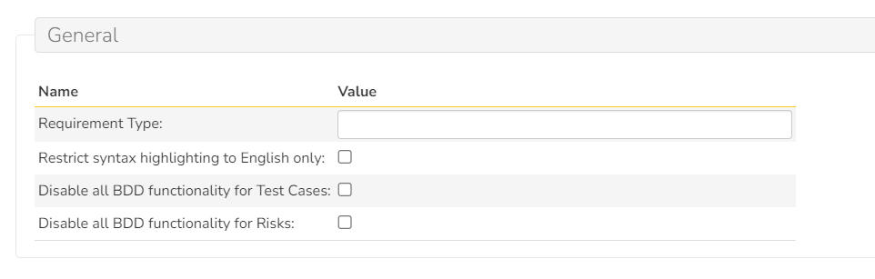

# BDD

!!! warning "Some of this SpiraApp's functionality is not compatible with SpiraTest"

!!! warning "Some of this SpiraApp's functionality requires Spira 8.2"

This SpiraApp automatically highlights Gherkin syntax within Requirement Steps, Test Case Steps, and Risk Mitigations SpiraTeam SpiraPlan. It also adds a toolbar button to these details pages to export the artifact steps as an attached .feature file.

!!! info "About this SpiraApp"
    - [ ] system settings
    - [x] product settings 
    - [ ] product template setup required
    - [x] runs automatically on the requirement details page
    - [x] runs automatically on the test case details page
    - [x] runs automatically on the risk details page
    - [x] toolbar button on requirement details page
    - [x] toolbar button on test case details page
    - [x] toolbar button on risk details page
    - [x] officially supports Gherkin syntax in English, German, French, Portuguese, Spanish, and other languages.

## Setup
### Product Settings
No setup per product is required. All features of the BDD SpiraApp are enabled by default for all products.

There are optional settings that can be enabled per product, if desired.

| Setting name                                 | Default value | Explanation                                                                                                          |
| -------------------------------------------- | ------------- | -------------------------------------------------------------------------------------------------------------------- |
| Requirement Type                             | empty         | When set, determines what type Requirements created from Feature files will have.                                    |
| Restrict syntax highlighting to English only | unchecked     | When checked, only Gherkin syntax in English will be highlighted                                                     |
| Disable all BDD functionality for Risks      | unchecked     | When checked, the SpiraApps features (syntax highlighting, and the ability to export to a feature file are disabled) |
| Disable all BDD functionality for Test Cases | unchecked     | When checked, the SpiraApps features (syntax highlighting, and the ability to export to a feature file are disabled) |

## Using the SpiraApp
### Automatic Highlighting on Details Pages
!!! warning "This functionality requires Spira 8.2"

The BDD highlighting is automatically applied any time any user either opens a relevant details page, or when they save the description of a Requirement Step, Test Step (from the test case details page), or Risk Mitigation. Note that the user must be able to modify the artifact for the syntax highlighting to be applied.

- Syntax highlighting is added to all BDD/Gherkin titles and keywords at the start of lines:

    - **Title keywords**: Feature, Scenario, Background, Scenario Outline, Scenario Template
    - **Statement keywords**: Given, When, Then, And, But

- Syntax highlighting is added to all BDD comments, quotes, and tags:

    - **Comments** are lines starting with a # sign
    - **Quotes** are parts of a line enclosed in `“ ”` characters (note the use of smart quotes here not `" "`. Smart quotes are added automatically when typing in Spira)[^quotes]
    - **Tags** start with an @ symbol and contain any characters other than whitespace.

[^quotes]: Normal double and single quotes are not supported as the automatic syntax highlighter cannot differentiate them from hidden quote characters in the rich text field. If a quote is not getting highlighted try adding and removing a space from the end quote to resolve.

![Shows the following step description with @tags colored in red, "Scenario: ..." line bolded and colored in blue, Given/When/Then keywords bolded and colored green, "quoted strings" colored in bright cyan, and the comment line starting with # colored in gray: `@bdd @highlighting (new line) Scenario: BDD syntax highlighting is applied on saving a requirement step (new line) Given I have written a requirement step using BDD syntax using words like “Scenario:, Given, When, Then” (new line) When I save the requirement step (new line) Then I will see that the BDD highlighting has been applied automatically. (new line) # -describes feature requested by Customer A` ](img/bdd-highlight-example.png)

### Exporting from Details Pages
If you can create documents, you can use the "BDD" > "Export Feature" toolbar button to export the current artifact's steps or mitigations as a `.feature` file. The file will be saved to Spira's document repository for that product (at the root level). The filename itself and first line of the feature file will be the name of the artifact (e.g. the requirement name). 

Please note that a feature file is a plain text file. Indentation is preserved but all other formatting is removed (including images, tables, links).

While viewing a document details page, if you can create Requirements, Test Cases, or Risks, you can use the "BDD" > "Create Requirement", "Create Test Case", or "Create Risk" toolbar buttons to create the respective Artifact out of the current file. This functionality is only available for `.feature` files and works best on well-formatted feature files. The "Feature: " line is used for the artifact name, and the filename is used instead if it is missing. All properly indented Scenarios are used for the artifact steps/mitigations. All other text in the file is used for the artifact description. The feature file is also added as an attachment to the newly created artifact.

### Example Localizations
=== "French"
    - **And**: Et (que/qu/)
    - **Background**: Contexte
    - **But**: Mais (que/qu/)
    - **Feature**: Fonctionnalité
    - **Given**: Soit, Sachant (que/qu/), (Etant/Étant) donné (que/qu/), (Etant/Étant) donné(s/es)
    - **Scenario**: Exemple, Scénario
    - **Scenario Outline**: Plan du scénario
    - **Then**: Alors, Donc
    - **When**: Quand, Lorsque, Lorsqu

=== "German"
    - **And**: Und
    - **Background**: Grundlage, Hintergrund, Voraussetzungen, Vorbedingungen
    - **But**: Aber
    - **Feature**: Funktionalität, Funktion
    - **Given**: Angenommen, Gegeben sei, Gegeben seien
    - **Scenario**: Beispiel, Szenario
    - **Scenario Outline**: Szenariogrundriss, Szenarien
    - **Then**: Dann
    - **When**: Wenn
  
=== "Portuguese"
    - **And**: E
    - **Background**: Contexto, Cenário de Fundo, Cenario de Fundo, Fundo
    - **But**: Mas
    - **Feature**: Funcionalidade, Característica, Caracteristica
    - **Given**: Dad(o/a), Dad(os/as)
    - **Scenario**: Exemplo, Cenário, Cenario
    - **Scenario Outline**: Esquema do Cenário, Esquema do Cenario, Delineação do Cenário, Delineacao do Cenario
    - **Then**: Então, Entao
    - **When**: Quando

=== "Spanish"
    - **And**: Y, E
    - **Background**: Antecedentes
    - **But**: Pero
    - **Feature**: Característica, Necesidad del negocio, Requisito
    - **Given**: Dad(o/a), Dad(os/as)
    - **Scenario**: Ejemplo, Escenario
    - **Scenario Outline**: Esquema del escenario
    - **Then**: Entonces
    - **When**: Cuando