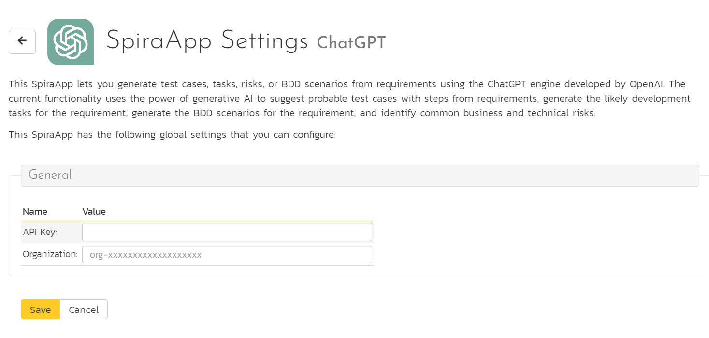
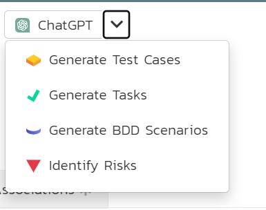

# ChatGPT SpiraApp

!!! warning "Some of this SpiraApp's functionality is not compatible with SpiraTest or SpiraTeam"

This SpiraApp lets you generate test cases, tasks, risks, or BDD scenarios from requirements using the ChatGPT engine developed by OpenAI. The current functionality uses the power of generative AI to suggest probable test cases with steps from requirements, generate the likely development tasks for the requirement, generate the BDD scenarios for the requirement, and identify common business and technical risks.

It can provide an easy and effective way for users to create a foundational set of items that they can refine and tailor easily and effectively. Note that Tasks are not available in SpiraTest and Risks are only supported in SpiraPlan.

By using this SpiraApp users will, by necessity, share information with OpenAI. For that reason, system admins must configure this SpiraApp to an existing OpenAI subscription for your organization.

!!! info "About this SpiraApp"
    - [x] system settings
    - [x] product settings 
    - [ ] product template setup required
    - [x] toolbar button on requirement details page

## Setup
### System Settings
- [x] Enter the the API Key users will access OpenAI with
- [x] Enter the OpenAI organization reference

### Product Settings
Once the SpiraApp has been activated system wide, and enabled for a product you can edit its product settings. **All of these settings are optional**. You can use the SpiraApp without editing any of the product settings. The settings are here to help you customize the results from the SpiraApp, including if using languages other than English.

| Setting name            | Default Value                                                                                                                         | Explanation                                                                                                                                                      |
| ----------------------- | ------------------------------------------------------------------------------------------------------------------------------------- | ---------------------------------------------------------------------------------------------------------------------------------------------------------------- |
| **General Settings**    |                                                                                                                                       |                                                                                                                                                                  |
| Temperature             | 0.2                                                                                                                                   | A number between 0 and 2, used to control the output's randomness. A higher temperature gives a more random output, a lower one give a more deterministic output |
| Model                   | gpt-3.5-turbo                                                                                                                         | The name of the OpenAI model you want to use                                                                                                                     |
| **ChatGPT Prompts**     |                                                                                                                                       |                                                                                                                                                                  |
| Test Case Prompt        | "Write the test cases for the following software requirement. For each test case include the description, input and expected output." | This prompt is used to generate the test cases from the requirement                                                                                              |
| Task Prompt             | "Write the development tasks for the following software requirement."                                                                 | This prompt is used to generate the tasks from the requirement                                                                                                   |
| Risk Prompt             | "Identity the possible business and technical risks for the following software requirement."                                          | This prompt is used to generate the risks from the requirement.                                                                                                  |
| Test Case Prompt        | "Write the BDD scenarios for the following software requirement."                                                                     | This prompt is used to generate the BDD steps for the requirement.                                                                                               |
| **Regular Expressions** |                                                                                                                                       |                                                                                                                                                                  |
| Test Case Regex         | "/Test case[0-9\s]*:\nDescription: (.*?)\nInput: (.*?)\nExpected Output: (.*?)\n/gsi"                                                 | This regular expression is used to parse the returned test cases                                                                                                 |
| Task Regex              | "/[0-9]*\.(.*?)\n(.*?)\n/gsi"                                                                                                         | This regular expression is used to parse the returned tasks                                                                                                      |
| Risk Regex              | "/[0-9]*\.(.*?)\n/gsi;"                                                                                                               | This regular expression is used to parse the returned risks                                                                                                      |
| BDD Regex               | "/(Feature: (.*?))?Scenario[ 0-9]*: (.*?)^\n/gsim;"                                                                                   | This regular expression is used to parse the returned BDD steps                                                                                                  |

## Using the SpiraApp
When a user goes to the requirement details page, they will see an extra button in the toolbar. To generate relevant data they should follow these steps:

- Click the "ChatGPT" button
- Select the artifact to generate (e.g. Tasks)

- This will send the requirement name (only) to OpenAI
- The information coming back is parsed and analyzed by the SpiraApp and then created in Spira

A message will show at the top of the page informing the user when information is sent or if there was a problem.

### Extra details to be aware of

- The generated artifacts only have their names or titles populated
- To generate artifacts the user must have create permission for that artifact
- BDD steps can only be generated on requirements of types that support steps