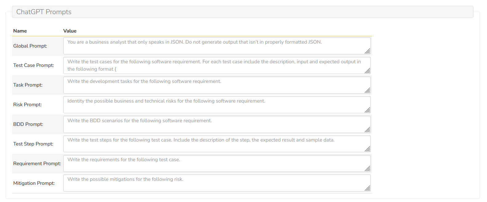
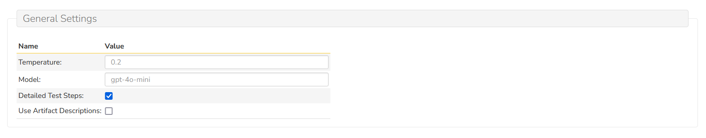
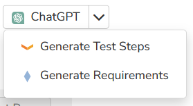
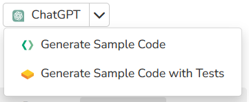
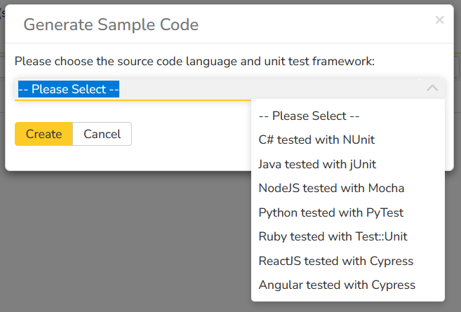
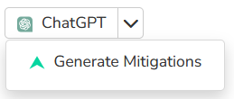

# ChatGPT SpiraApp

!!! warning "Some of this SpiraApp's functionality is not compatible with SpiraTest"

This SpiraApp lets you generate downstream artifacts from Spira requirements, test cases and risks using one of the GPT Large Language Models (LLM) developed by OpenAI. The current functionality uses the power of generative AI to suggest probable test cases with steps from requirements, generate the likely development tasks for the requirement, generate the BDD scenarios for the requirement, and identify common business and technical risks. It also will let you generate the test steps for an existing test case, and suggest mitigations for an existing risk. 

It can provide an easy and effective way for users to create a foundational set of items that they can refine and tailor easily and effectively. Note that Tasks and Risks are not available in SpiraTest.

By using this SpiraApp users will, by necessity, share information with OpenAI. For that reason, system admins must configure this SpiraApp to an existing OpenAI subscription for your organization.

!!! info "About this SpiraApp"
    - [x] system settings
    - [x] product settings 
    - [ ] product template setup required
    - [x] toolbar button on requirement details page
    - [x] toolbar button on test case details page
    - [x] toolbar button on risk details page
    - [x] toolbar button on task details page

## Setup
### System Settings
- [x] Enter the the API Key users will access OpenAI with
- [x] Enter the OpenAI organization reference

### Product Settings
Once the SpiraApp has been activated system wide, and enabled for a product you can edit its product settings. **All of these settings are optional**. You can use the SpiraApp without editing any of the product settings. The settings are here to help you customize the results from the SpiraApp, including if using languages other than English.

#### Code Generation

This is where you can customize the list of programming languages available:

- **Coding Languages**: In this text box, provide a comma-separated list of programming languages that the user can pick from. If you don't provide a value, the default list of languages will be provided.
- **Unit Test Frameworks**: In this text box, provide a comma-separated list of programming languages and unit test frameworks that the user can pick from. The programming language and unit test framework should be separated by a pipe (|) symbol If you don't provide a value, the default list of languages and unit test frameworks will be provided.

#### Prompt Customization

This is where you can customize the prompts sent to the LLM:

| Setting name            | Default Value                                                                                                                         | Explanation                                                                                                                                                      |
| ----------------------- | ------------------------------------------------------------------------------------------------------------------------------------- | ---------------------------------------------------------------------------------------------------------------------------------------------------------------- |
| Global Prompt        | You are a business analyst that only speaks in JSON. Do not generate output that isn't in properly formatted JSON. | This prompt is used to control the output format of all the repsonses to be JSON.                                                                                        |
| Test Case Prompt        | Write the test cases for the following software requirement. For each test case include the description, input and expected output in the following format { \"Description\": [Description of test case], \"Input\": [Sample input in plain text], \"ExpectedOutput\": [Expected output in plain text] } | This prompt is used to generate the test cases from the requirement                                                                                              |
| Task Prompt             | Write the development tasks for the following software requirement. For each task include the name and description in the following format { \"Name\": [name in plain text], \"Description\": [description in plain text] }                                                                 | This prompt is used to generate the tasks from the requirement                                                                                                   |
| Risk Prompt             | Identify the possible business and technical risks for the following software requirement. For each risk include the name and description in the following format { \"Name\": [name in plain text], \"Description\": [description in plain text] }                                          | This prompt is used to generate the risks from the requirement.                                                                                                  |
| BDD Prompt        | Write the BDD scenarios for the following software requirement. Write the BDD scenarios for the following software requirement. For each scenario use the following Gherkin format { \"Name\": [The name of the scenario], \"Given\": [single setup in plain text], \"When\": [single action in plain text], \"Then\": [single assertion in plain text] }                                                                     | This prompt is used to generate the BDD steps for the requirement.                                                                                               |
| Test Step Prompt        | Write the test steps for the following test case. For each test step include the description, expected result, and sample data in the following format { \"Description\": [Description of test step], \"ExpectedResult\": [The expected result], \"SampleData\": [Sample data in plain text] }                                                                     | This prompt is used to generate the test steps steps for the test case.                                                                                               |
| Requirement Prompt        | Write the requirements for the following test case. For each requirement include the name and description in the following format { \"Name\": [name in plain text], \"Description\": [description in plain text] }                                                                     | This prompt is used to generate the requirements for the test case.                                                                                               |
| Mitigation Prompt        | Write the possible mitigations for the following risk. For each mitigation include the description in the following format { \"Description\": [description in plain text] }                                                                     | This prompt is used to generate the mitigations for the risk.                                                                                               |

#### General Settings

This is where you can specify the other SpiraApp settings:

| Setting name            | Default Value                                                                                                                         | Explanation                                                                                                                                                      |
| ----------------------- | ------------------------------------------------------------------------------------------------------------------------------------- | ---------------------------------------------------------------------------------------------------------------------------------------------------------------- |
| Temperature             | 0.2                                                                                                                                   | A number between 0 and 2, used to control the output's randomness. A higher temperature gives a more random output, a lower one give a more deterministic output |
| Model                   | gpt-4o-mini                                                                                                                         | The name of the OpenAI model you want to use                                                                                                                     |
| Detailed Test Steps     | false                                                                                                                         | Should we create detailed test steps for test cases, or just a single step?                                                                                                                     |
| Use Artifact Descriptions     | false                                                                                                                         | Should we use the artifact descriptions as well as the names in the prompts?                                                                                                                     |

## Using the SpiraApp

The user can navigate to different pages to use the SpiraApp, each one will have a toolbar with various generation options.

### Requirement Details Page

When a user goes to the requirement details page, they will see an extra button in the toolbar. To generate relevant data they should follow these steps:

- Click the "ChatGPT" button
- Select the artifact to generate (e.g. Tasks)

- This will send the requirement name (and optionally the description) to OpenAI
- The information coming back is parsed and analyzed by the SpiraApp and then created in Spira

A message will show at the top of the page informing the user when information is sent or if there was a problem.

### Test Case Details Page

When a user goes to the testc ase details page, they will see an extra button in the toolbar. To generate relevant data they should follow these steps:

- Click the "ChatGPT" button
- Select the artifact to generate (e.g. Test Steps)

- This will send the test case name (and optionally the description) to OpenAI
- The information coming back is parsed and analyzed by the SpiraApp and then created in Spira

A message will show at the top of the page informing the user when information is sent or if there was a problem.

### Task Details Page

When a user goes to the task details page, they will see an extra button in the toolbar. To generate relevant data they should follow these steps:

- Click the "ChatGPT" button
- Select the type of code to generate (e.g. Source Code)

Once you choose the appropriate code generation option, a dialog box will be displayed where you can choose which programming langauage (and optionally unit test framework) to use:

- This will send the task name (and optionally the description) to OpenAI
- The information coming back is parsed and analyzed by the SpiraApp and then created in Spira

A message will show at the top of the page informing the user when information is sent or if there was a problem.

### Risk Details Page

When a user goes to the risk details page, they will see an extra button in the toolbar. To generate relevant data they should follow these steps:

- Click the "ChatGPT" button
- Select the artifact to generate (e.g. Mitigations)

- This will send the risk name (and optionally the description) to OpenAI
- The information coming back is parsed and analyzed by the SpiraApp and then created in Spira

A message will show at the top of the page informing the user when information is sent or if there was a problem.

### Extra details to be aware of

- The generated artifacts only have their names and descriptions populated, with the exception of test cases that will have detailed test steps.
- To generate artifacts the user must have create permission for that artifact.
- BDD steps can only be generated on requirements of types that support steps.