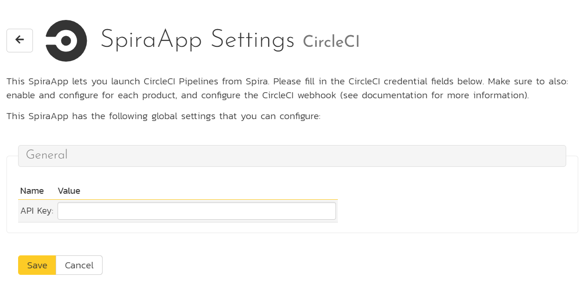
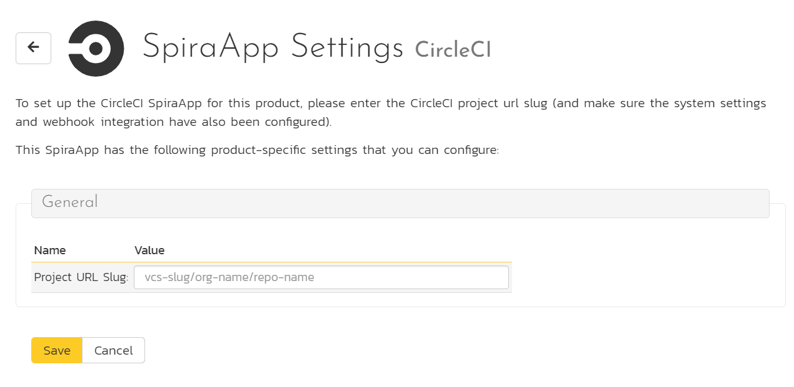
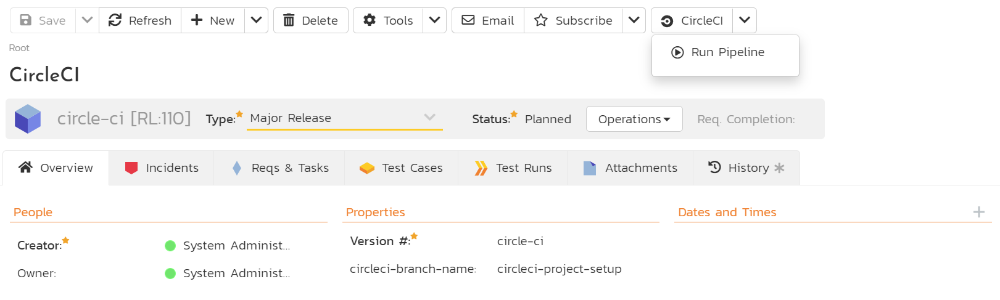

# CircleCI SpiraApp

This SpiraApp lets you integrate SpiraPlan and CircleCI so users can launch pipelines from Spira and see their results in Spira as builds.

!!! info "About this SpiraApp"
    - [x] system settings
    - [x] product settings 
    - [x] product template setup required
    - [x] toolbar button on release details page
    - [x] additional integration required to record results in Spira
    - [x] configuration in CircleCI (for recording results in Spira)

## Setup
This SpiraApp has two independent parts (you do not need one for the other to work):

- a button on the release details page so users can manually kick off a new CircleCI Pipeline 
- backend integration (using webhooks) so the results of all relevant Pipelines are recorded in Spira as new builds

To record builds in SpiraPlan, you must [setup the webhook integration with CircleCI](../../Build-Server-Integration/CircleCI-Pipelines/). 

To configure this SpiraApp that lets users manually kick off a new Pipeline, you must additionally do the following:

### System settings
- [x] Enter a user-level [Personal API Token](https://circleci.com/docs/2.0/managing-api-tokens#creating-a-personal-api-token) - make sure the PAT has read and write API permissions. Note: you can not use a project level API token.

### Product Settings
- [x] Enter the slug of the CircleCI project

To find the slug:

- go to your list of CircleCI projects
- click on the relevant project to go its home page
- the url will be in the form of https://app.circleci.com/pipelines/github/{my github username}/{project name}
- take "https://app.circleci.com/pipelines/" off the url. What is left ("github/{my github username}/{project name}") is the project slug

### Product Template Setup
- [x] Add a plain text custom property called `circleci-branch-name` for Releases in the product's template. Note: you may already have a custom property for this already if you setup the webhook integration - if you have, do not create a second one.

## Using the SpiraApp
To use the SpiraApp to start a new CircleCI Pipeline go to a release in that product. 

You must make sure the custom property "circleci-branch-name" has the exact name of the branch in the relevant repo (for instance "develop") that you are building the release/sprint against. Note: this field is used by both the CircleCI SpiraApp and the CircleCI webhook integration.

Once the release has the branch name filled in, at any time you can click on the CircleCI button in the top toolbar. This opens the dropdown. Click "Run Pipeline" to start the pipeline on CircleCI. You will see an info message telling you the Pipeline has started. 

Because a pipeline can take a while to run, do not expect to automatically see the build as soon as the info popup goes away. It may take a few minutes or more for the build to be recorded (if this part of the integration has been configured).