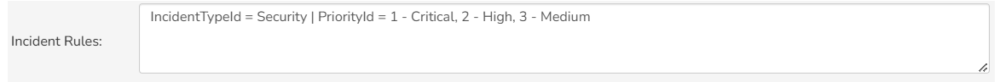
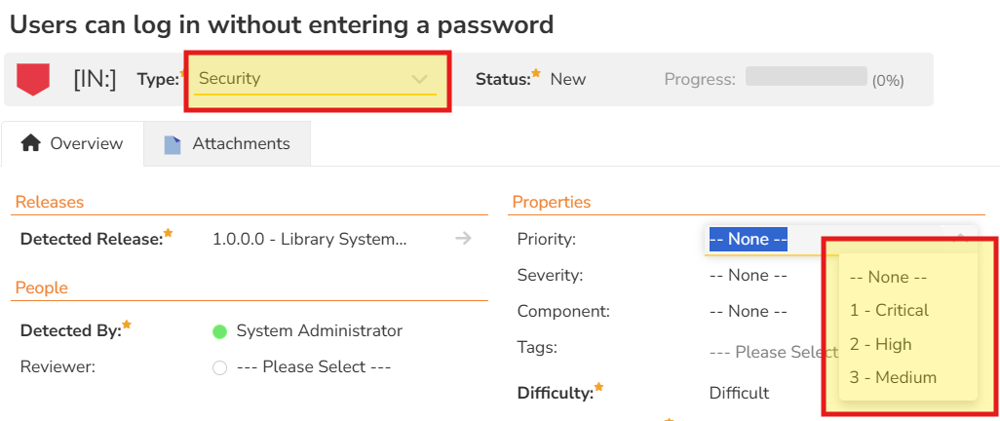

# Conditional Lists

!!! warning "Some of this SpiraApp's functionality is not compatible with SpiraTest"

This SpiraApp helps admins create dynamic and powerful customizations for end users when they work with artifacts on details pages. It lets you conditionally control what values are available in one list dropdown, based on the selected values of other list fields. In other words, changing one list dynamically updates the options in other lists. For example, an Incident of Type 'Enhancement' could have its owner field limited to a certain group of users, but an incident of type "Bug" could have the owner field limited to a different group of users. The SpiraApp is highly customizable using the product settings to meet a variety of different use cases.

!!! info "About this SpiraApp"
    - [ ] system settings
    - [x] product settings 
    - [ ] product template setup required
    - [x] toolbar button on product settings page
    - [x] runs automatically on the requirement details page
    - [x] runs automatically on the release details page
    - [x] runs automatically on the test case details page
    - [x] runs automatically on the test set details page
    - [x] runs automatically on the incident details page
    - [x] runs automatically on the document details page
    - [x] runs automatically on the task details page (not available in SpiraTest)
    - [x] runs automatically on the risk details page (not available in SpiraTest)

!!! warning "Limitations"
    This SpiraApp is intended to guide your employees in best practices and simplify your workflows without adding extra permissions. It works specifically by limiting dropdown options on artifact details pages only for both single select and multi-select list fields.
    
    This SpiraApp does not: 
    
    - work on artifact list pages
    - work with any fields that are not lists
    - change the actual value of any field (only the items shown in its dropdown)
    - restrict any changes made on list pages or via the API 
    - modify or impact the workflow (including control the available transitions based on a list field)

## Setup
### Product Settings
Once the SpiraApp has been activated system wide and enabled for a product you can edit its product settings.

This is where you define the rules to conditionally control List fields on artifacts. Use the following format for each rule in an artifact's setting textbox:  

`{primary field name}={field value} | {affected field name}={comma separated list of field values}`  

See the following screenshot for an example:  

!!! info "Example admin configuration"
    Here is a more detailed worked example for the incident artifact window:

    - select the **primary field** using the [field names](../Developers/SpiraApps-Reference.md/#available-field-names). This is the field that, when changed, will conditionally limit what is shown in the affected list's dropdown. This field must be a list (dropdown) field. For example, if you want the primary field to be the incident type, enter `IncidentTypeId`. The setting should now look like this: `IncidentTypeId`
    - for the primary field's **field value** enter the exact text as it appears in the dropdown for the field on the details page. This is the value that, when selected, will change the values visible in the affected list chosen. For example, if you want to control what happens when the incident type is a "Security", enter `Security`. This setting should now look like this: `IncidentTypeId=Security`
    - next, you need to specify the list that you want the primary field to affect. This must also be a list (dropdown) field. For example, if you want the affected field to be the incident priority field, enter `PriorityId`. The setting should now look like this: `IncidentTypeId=Security |  PriorityId`
    - finally, you need to provide the list of values that the priority field should show when the incident type is Security (with all other values being hidden). For example, because security incidents are so important, let's assume we want to hide the lowest priorities, and instead want to show only the critical, high, and medium priorities. To do this copy and paste these values as displayed in the application, separated by commas. The setting should now look like this: `IncidentTypeId=Security | PriorityId = 1 - Critical, 2 - High, 3 - Medium`
    - to add extra settings, place them on a new line

You can also use **multiple primary fields** (up to a maximum of 10) so that the affected list is only changed if each specific primary field's value is set as specified. In the example below we have a setting for requirements:

  

This rule specifies that if a requirement has both a Type of Feature *and* a Component of Database, then owner dropdown list will be limited to only "Backend Developer". In reality, 'Backend Developer' would be replaced by the first and last name of a user in your Spira instance.

**Custom properties** are supported. These must be listed like "Custom_01" for the field name. For the field values, you use the user-defined text values as they appear on the details page, just like built-in fields.

You can also set multiple rules to affect the same list field. In this case, if both rules apply at the same time then the affected list's dropdown will be limited to the values shared between the limiting rules. For example:

In this case, there are 2 task rules that both apply to the owner field - one with a primary field of type, and the other of component.

- When a task has the Development type, its owner field would be limited to the four users listed. 
- When a task has the Administration component, its owner field would be limited to the two users listed.
- When a task has both a type of Development and a component of Administration, then its owner field will be limited to the overlap between the four users and the two users in each rule, which will be just the Product Manager, because that is the only option included in both rules.

The menu button at the bottom of the settings page can be used to **validate your settings**. It will check each settings box for valid field names and make sure none of the rules conflict with any other for a specific artifact. If there are any conflicts or a field name is spelled incorrectly, it will say which artifact setting has invalid rules and log detailed error messages in the browser console.

#### Valid Fields

There are specific fields that can be used by the Conditional Lists SpiraApp. This includes all lookup fields, Tags, Custom properties, and a couple user fields not marked as lookups. The full list is below.

=== "Documents"
- AuthorId
- Custom_01...Custom_99
- DocumentStatusId
- DocumentTypeId
- EditorId
- Tags

=== "Incidents"
- ComponentIds
- Custom_01...Custom_99
- DetectedReleaseId
- IncidentStatusId
- IncidentTypeId
- OpenerId
- OwnerId
- PriorityId
- ResolvedReleaseId
- SeverityId
- Tags
- VerifiedReleaseId

=== "Releases"
- CreatorId
- Custom_01...Custom_99
- OwnerId
- ReleaseStatusId
- ReleaseTypeId
- Tags

=== "Requirements"
- AuthorId
- ComponentId
- Custom_01...Custom_99
- ImportanceId
- OwnerId
- ReleaseId
- RequirementStatusId
- RequirementTypeId
- Tags

=== "Risks"
- ComponentId
- CreatorId
- Custom_01...Custom_99
- OwnerId
- ReleaseId
- RiskImpactId
- RiskProbabilityId
- RiskStatusId
- RiskTypeId
- Tags

=== "Tasks"
- ComponentId
- CreatorId
- Custom_01...Custom_99
- OwnerId
- ReleaseId
- Tags
- TaskPriorityId
- TaskStatusId
- TaskTypeId

=== "Test Cases"
- AuthorId
- ComponentIds
- Custom_01...Custom_99
- OwnerId
- Tags
- TestCasePriorityId
- TestCaseStatusId
- TestCaseTypeId

=== "Test Sets"
- AutomationHostId
- CreatorId
- Custom_01...Custom_99
- OwnerId
- ReleaseId
- Tags
- TestConfigurationSetId
- TestSetStatusId
- TestSetTypeId

#### Current Limitations

Status fields only work on page load or on save in Spira 8.8, and are only intended to work as Primary fields, not affected fields. Tags are supported only for Primary fields and cannot be used as affected fields in Spira 8.8.

## Using the SpiraApp
This SpiraApp works automatically on the details page for the following artifacts:

- Requirements
- Releases
- Test Cases
- Test Sets
- Incidents
- Documents
- Tasks
- Risks

The SpiraApp applies the appropriate rules to the dropdown menus on a page in three cases: 

- When a user first opens the details page
- When a user changes the artifact on the details page (for example, by selecting one from the sidebar)
- When a list field that is set as a primary field in any setting is changed. 

This will mean that list field dropdown options will always be limited based on the rules specified when working with artifacts on the details page.

Here is an example of using this SpiraApp to limit the Priority of incidents of the type "Security".

Notice that the options listed in the Priority dropdown are the exact options listed above in the [Incident Rules](#product-settings). 

When the type is set to something other than "Security", you still see all of the normal options, as shown below.

