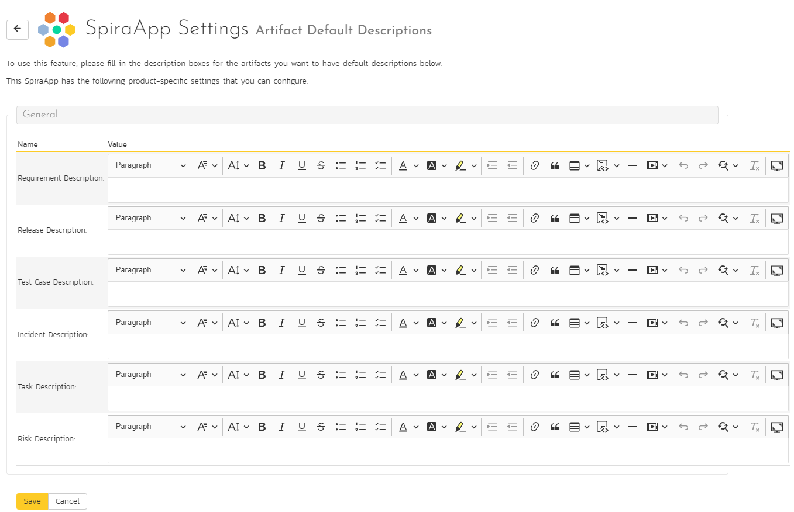

# Default Descriptions SpiraApp
!!! abstract "Compatible with SpiraTest, SpiraTeam, SpiraPlan"

This SpiraApp lets users to create artifacts from their details pages with pre-populated default descriptions. These descriptions are added automatically when creating new artifacts from the relevant details page. The following artifacts are supported: requirements, releases, test cases, incidents, tasks, and risks.

!!! info "About this SpiraApp"
    - [ ] system settings
    - [x] product settings 
    - [ ] product template setup required
    - [x] runs automatically on the requirement details page
    - [x] runs automatically on the release details page
    - [x] runs automatically on the test case details page
    - [x] runs automatically on the incident details page
    - [x] runs automatically on the task details page
        {: .edition-spiraplan .edition-spirateam}
    - [x] runs automatically on the risk details page
        {: .edition-spiraplan .edition-spirateam}

## Setup
### Product Settings
Once the SpiraApp has been activated system wide, and enabled for a product you can edit its product settings to add/update the default descriptions for the relevant artifacts.

Enter the default description desired in each of the rich text boxes. If a rich text box is left blank, no default description will be added when making that artifact. You can use all available formatting options, except for pasting images. 

## Using the SpiraApp
Any default description set is automatically added as the description when any user creates a new artifact (not a clone of an existing artifact):

- on the details page for any relevant artifact (including when creating children of a requirement)
- by clicking the New button on the artifact list pages for Incidents and Risks
- using the [Quick Launch widget](../Spira-User-Manual/User-Product-Management.md/#quick-launch) to create a new Incident 

Once the new artifact has been created, the user can continue to edit the newly created artifact as normal, including editing the description. Once an artifact has been created there is no way to reset or reinsert the default description for that artifact.

**Note** when creating artifacts (like requirements) on the list page, the default description is not added. You must create the artifact from the standard details page.