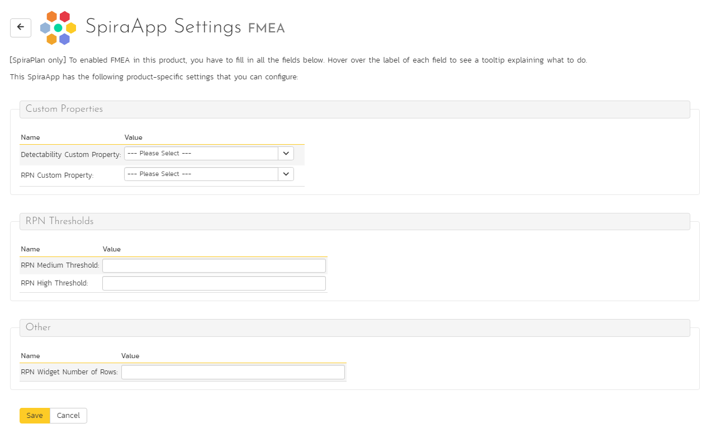
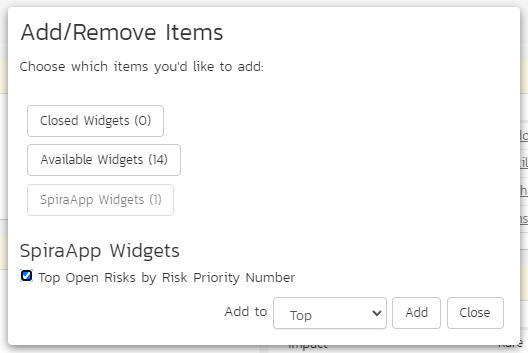
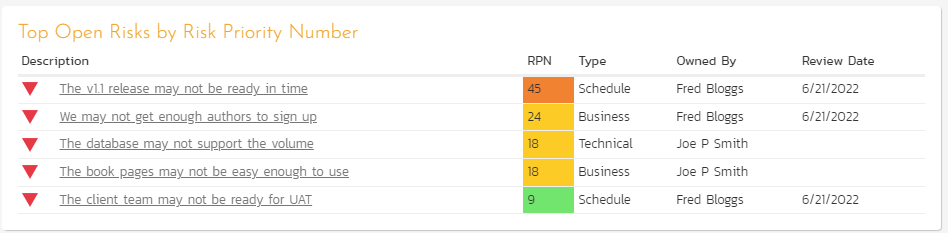

# FMEA SpiraApp

!!! warning "This SpiraApp works with v8.2+ and is not compatible with SpiraTest"

This SpiraApp extends the built-in risk functionality by supporting FMEA with a dedicated FMEA SpiraApp that calculates the Risk Priority Number (RPN) by multiplying together values for the risk's probability, impact, and detectability. It also provides a replacement "Top Open Risks" widget for the product home page and reporting home page that is ranked by and shows the RPN.

!!! info "About this SpiraApp"
    - [ ] system settings
    - [x] product settings 
    - [x] product template setup required
    - [x] runs automatically on the risk details page
    - [x] product home page widget
    - [x] reporting home page widget

## Setup
To effectively implement FMEA in your product, you have to set up the fields that will store the FMEA data (detectability and the RPN itself). You can also optionally configure how the "Top Open Risks by Risk Priority Number" widget will display.

### Product Template Setup
In the product template for each product that uses FMEA, you need to setup a few different fields:

**1. Create a detectability list** to store all the options available for detectability

- Go to Product Template Administration > Custom Properties > Edit Custom Lists
- Create a dedicated custom list that will store the different options for "Detectability". You can call this list whatever you want, but we suggest something meaningful like "Detectabilities"
- Add values to your custom list, where each name in the list is in the format of "{number} - Name". For example, "1 - Very High", "3 - Moderate", and "5 - Very Low"
- You can have as many values as you like. The numbers at the front of the names are used to calculate the RPN (along with the probability and impact) and normally higher numbers means greater overall levels of risk.

**2. Create a detectability property** to set the detectability of each risk

- Go to Product Template Administration > Risks > Custom Properties
- Create a new custom custom property of type List. You can call this whatever you like but we recommended "Detectability". 
- Set this property to use the detectability list created above

**3. Create a custom property to store the calculated RPN**

- Go to Product Template Administration > Risks > Custom Properties
- Create a new custom custom property of type Integer. We recommend calling this "RPN"

**4. Optionally, update workflows**. This is not required, but we recommend making the following changes to all risk workflows in templates whose products will use FMEA:

- Make the "Detectability" custom property required in all workflow steps where the standard risk fields "Probability" and "Impact" are required. This will ensure that the "Detectability" value is completed properly
- Disable the "RPN" custom property for all workflow steps. This field is used to display the RPN number. It is calculated automatically as part of this SpiraApp and should not be adjusted by a user

### Product Settings
Once the FMEA SpiraApp has been activated system wide, and enabled for a product, there are a number of settings:

**Custom Properties**: these must be filled in for the FMEA SpiraApp to work. 

- Detectability Custom Property: set this to the property created at step 2 in the "Product Template Setup" guide above
- RPN Custom Property: set this to the property created at step 3 in the "Product Template Setup" guide above

**RPN Thresholds**: these are optional fields to fill but we recommend filling them in if you intend for users to show the "Top Open Risks by Risk Priority Number" widget. The widget shows a list of risks by RPN score. The score can have three colors: red, yellow, or green. Fill in these threshold fields to determine what scores get which color. Unless both of these values are filled in, RPNs will not have any color on the widget.

- RPN Medium Threshold: RPN scores below this threshold are considered "low" and will be green. RPN scores of this value or higher and lower than the RPN High Threshold are considered "medium" and will be yellow
- RPN High Threshold: RPN scores of this value or above are considered "high" and will be red

Note that if your 3 values for RPN (probability, impact, and detectability) all range from 1 through 5, RPN scores will be in the range 1-125.

**Other**: you can optionally set the RPN Widget Number of Rows to set the maximum number of rows that every user will be able to see when using the widget. If blank every user will see up to 5 rows. You can enter any number here, but note that the widget will display a maximum of 50 rows (even if you enter a larger value).

## Using the SpiraApp
### Risk Details Page
The core functionality of the FMEA SpiraApp is to allow users to set detectability on a risk, and using that value and the risks probablity and impact, calculate a Risk Priority Number (RPN). Users do this on the risk details page.

While on the risk details page (either creating a new risk or editing an existing one) they will see, as per workflow, fields for probability, impact, and detectability. If all three of these fields have a value, then the RPN score for the risk is calculated and saved to the RPN field. Every time the underlying RPN fields are changed, while on this page, the RPN will be updated to reflect that.

The RPN is shown in the dedicated RPN custom property. The Risk Exposure is still calculated and shown at the top of the page, and is independent of the RPN.

!!! warning "On the risk list page: users can but should not edit the RPN; editing risk probability, impact, or detectability on the risk list page will not update the RPN"

### Using the Top Open Risks by Risk Priority Number Widget
This widget displays a breakdown of the top open risks in the product, in order of decreasing RPN score. The widget is available on any of the product home pages, and on the product reporting home page. 

Risks in the widget are filtered by any release currently selected for the page. To add the widget to a page, edit the page and then open the "SpiraApp Widgets" section. Add the widget to the section of the page you want.

The number of rows shown matches that in the product settings for this SpiraApp. For each row you see:

- **Risk name**: hovering shows the risk ID, and clicking the name opens the risk details page
- **RPN**: the score is shown with a red, yellow, or green background based on the threshold settings for this product
- **Type**
- **Owned By**
- **Review Date**

### View Detectability and RPN in other places
Because the Detectability and RPN fields are custom properties, they can be viewed and queried in the same way as any other custom property. For example you can see this information on the:

- Risk List page by showing the relevant columns
- In standard Risk reports in the custom property section
- In custom reports by accessing the relevant custom property field
