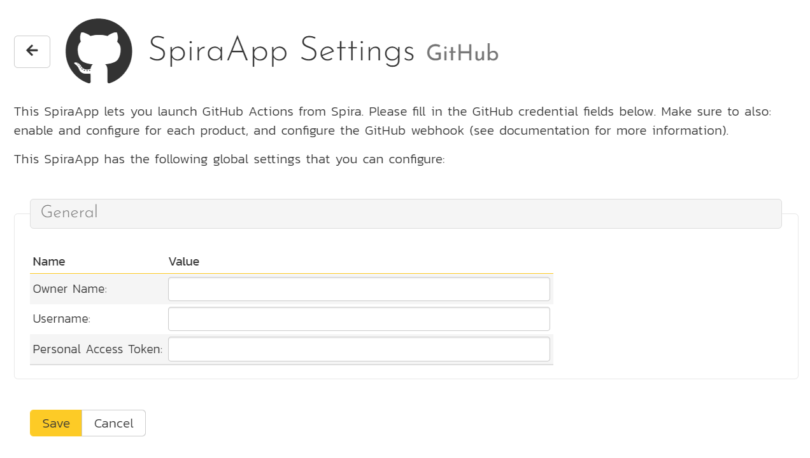
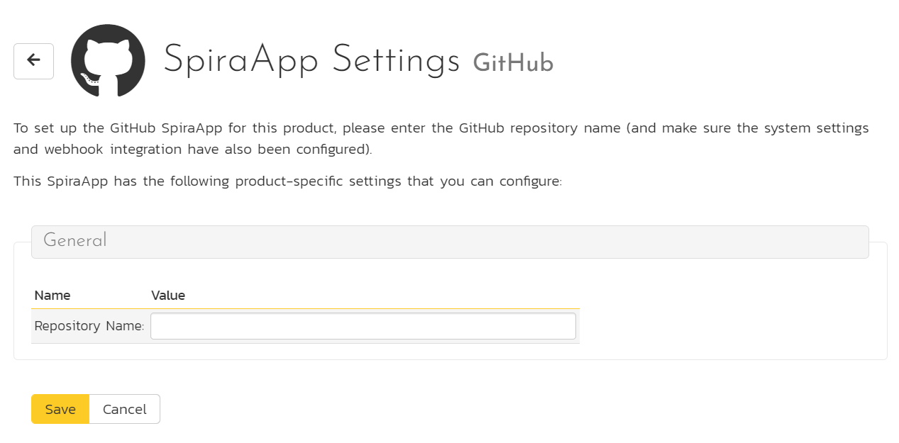
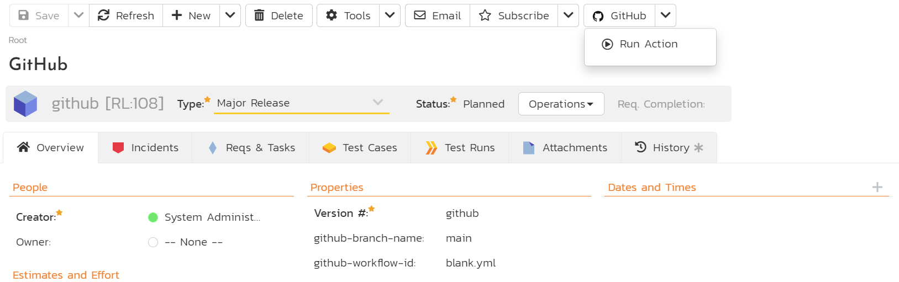

# GitHub SpiraApp

This SpiraApp lets you integrate SpiraPlan and GitHub so users can launch Actions from Spira and see their results in Spira as builds.

!!! info "About this SpiraApp"
    - [x] system settings
    - [x] product settings 
    - [x] product template setup required
    - [x] toolbar button on release details page
    - [x] additional integration required to record results in Spira
    - [x] configuration in GitHub (for recording results in Spira)

## Setup
This SpiraApp has two independent parts (you do not need one for the other to work):

- a button on the release details page so users can manually kick off a new GitHub Action 
- backend integration (using webhooks) so the results of all relevant Actions are recorded in Spira as new builds

To record builds in SpiraPlan, you must [setup the webhook integration with GitHub](../../Build-Server-Integration/GitHub-Actions/). 

To configure this SpiraApp that lets users manually kick off a new Action, you must additionally do the following:

### System settings
- [x] Enter the name of the Owner of the repos that SpiraPlan will start Actions in. This is likely to be the organization name of your GitHub, but you can also use a personal GitHub by entering the username
- [x] Enter the GitHub username - this is the name used to login to GitHub
- [x] Enter the [Personal Access Token](https://docs.github.com/en/authentication/keeping-your-account-and-data-secure/creating-a-personal-access-token) - make sure to enable the Workflow permissions (this will also enable all repo permissions)

### Product Settings
- [x] Enter the name of the GitHub repo

### Product Template Setup
- [x] Add a plain text custom property called `github-branch-name` for Releases in the product's template. Note: you may already have a custom property for this already if you setup the webhook integration - if you have, do not create a second one.
- [x] Add a plain text custom property called `github-workflow-id` for Releases in the product's template.

## Using the SpiraApp
To use the SpiraApp to start a new GitHub Action go to a release in that product. 

You must make sure:

- the custom property "github-branch-name" has the exact name of the branch in the relevant repo (for instance "develop") that you are building the release/sprint against. Note: this field is used by both the GitHub SpiraApp and the GitHub webhook integration.
- the custom property "github-workflow-id" has the name of the Action file (including its extension) for the relevant workflow. Note that if the full path to the file in your repo is ".github/workflows/blank.yml", then put "blank.yml" into this field. You can also use the actual ID field, which you can find out by running an [API query on GitHub](https://docs.github.com/en/rest/actions/workflows#get-a-workflow).

Once the release has the branch name filled in, at any time you can click on the GitHub button in the top toolbar. This opens the dropdown. Click "Run Action" to start the Action on GitHub. You will see an info message telling you the Action has started. 

Because a Action can take a while to run, do not expect to automatically see the build as soon as the info popup goes away. It may take a few minutes or more for the build to be recorded (if this part of the integration has been configured).