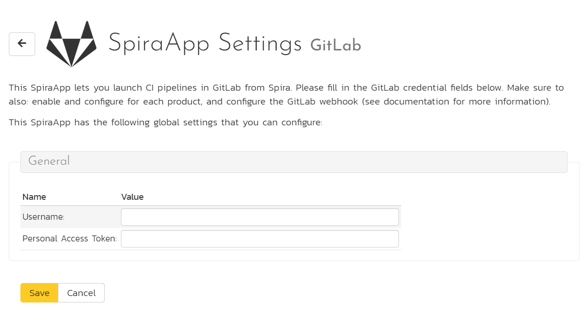
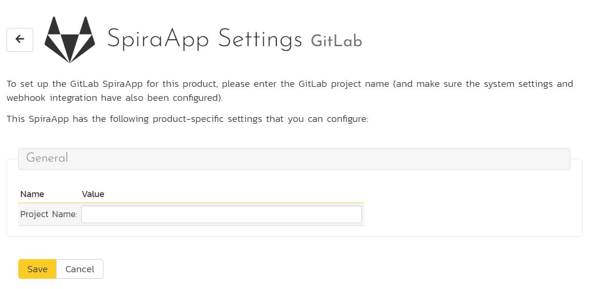
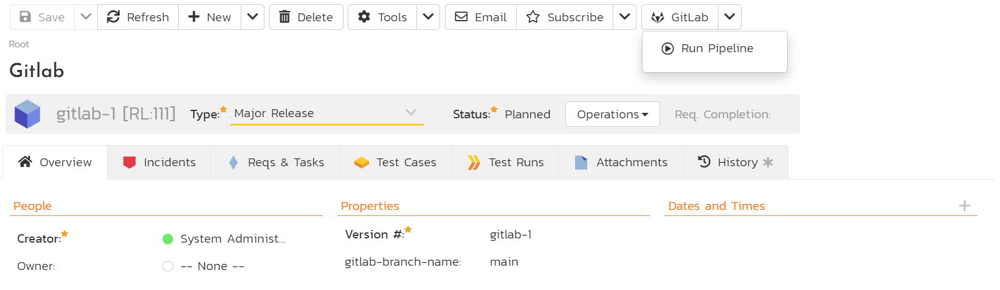

# GitLab SpiraApp
!!! abstract "Compatible with SpiraTest, SpiraTeam, SpiraPlan"

This SpiraApp lets you integrate SpiraPlan and GitLab so users can launch pipelines from Spira and see their results in Spira as builds.

!!! info "About this SpiraApp"
    - system settings
    - product settings 
    - product template setup required
    - toolbar button on release details page
    - additional integration required to record results in Spira
    - configuration in GitLab (for recording results in Spira)

## Setup
This SpiraApp has two independent parts (you do not need one for the other to work):

- a button on the release details page so users can manually kick off a new GitLab Pipeline 
- backend integration (using webhooks) so the results of all relevant Pipelines are recorded in Spira as new builds

To record builds in SpiraPlan, you must [setup the webhook integration with GitLab](../Build-Server-Integration/GitLab-Pipelines.md). 

To configure this SpiraApp that lets users manually kick off a new Pipeline, you must additionally do the following:

### System settings
- [x] Enter the **GitLab account name** - for example, if your URL is `https://gitlab.com/my-company/my-project` you should enter `my-company`
- [x] Enter the [Personal Access Token](https://docs.gitlab.com/ee/user/profile/personal_access_tokens.html#personal-access-tokens) - make sure the PAT has read and write API permissions
- [x] If your instance of GitLab is self-hosted, you will need to enter in the base URL (without the `https://`). If you are using `gitlab.com` then you can leave this field blank.

### Product Settings
- [x] Enter the URL friendly name of the **GitLab project** - for example, if your URL is `https://gitlab.com/my-company/my-project` you should enter `my-project`
- [x] If you want to have a different personal access token for this project, you can enter in the project-specific `Username` and `Personal Access Token` on this screen. If you leave this blank, the values from system settings are used instead. 

!!! check "Handling GitLab Project Hierarchies"

    If you have a more complex project hierarchy in GitLab, you will need to enter the project name as a URL fragment with the path separator `/` escaped as `%2F`.

    For example, if you have GitLab URL: `https://gitlab.com/my-company/my-program/my-department/my-project` then you would use the following in the SpiraApp settings:

    - **Username:** `my-company`
    - **Project Name:** `my-program%2Fmy-department%2Fmy-project`

### Product Template Setup
- [x] Add a plain text custom property called `gitlab-branch-name` for Releases in the product's template. Note: you may already have a custom property for this already if you setup the webhook integration - if you have, do not create a second one.

## Using the SpiraApp
To use the SpiraApp to start a new GitLab Pipeline go to a release in that product. 

You must make sure the custom property "gitlab-branch-name" has the exact name of the branch in the relevant repo (for instance "develop") that you are building the release/sprint against. Note: this field is used by both the GitLab SpiraApp and the GitLab webhook integration.

Once the release has the branch name filled in, at any time you can click on the GitLab button in the top toolbar. This opens the dropdown. Click "Run Pipeline" to start the pipeline on GitLab. You will see an info message telling you the Pipeline has started. 

Because a pipeline can take a while to run, do not expect to automatically see the build as soon as the info popup goes away. It may take a few minutes or more for the build to be recorded (if this part of the integration has been configured).