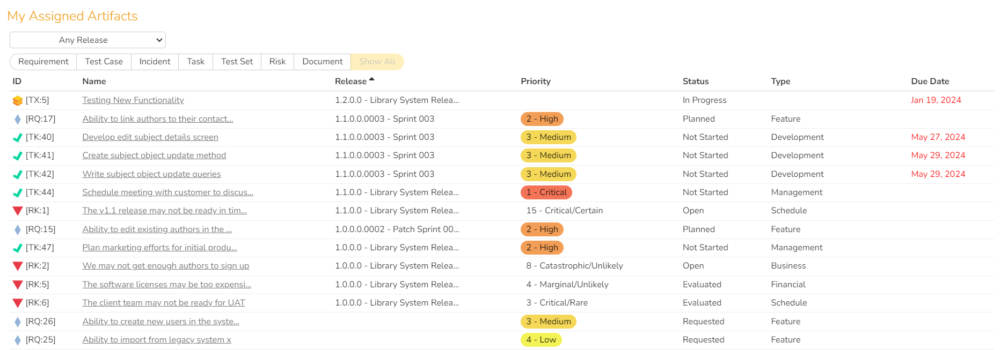

# My Assigned Work

!!! warning "Some of this SpiraApp's functionality is not compatible with SpiraTest"

This SpiraApp adds a widget to the user's My Page that allows them to view their owned Artifacts in an interactive grid. It provides an alterative way to use the My Page and can replace most of the "My Assigned..." widgets.

!!! info "About this SpiraApp"
    - [ ] system settings
    - [ ] product settings 
    - [ ] product template setup required
    - [x] my page widget

## Setup
### Adding the My Assigned Work Widget to your My Page
To add the widget to your My Page, edit the page and then open the "SpiraApp Widgets" section. Add the widget to the section of the page you want.

## Using the SpiraApp
### Using the My Assigned Work Widget
This widget displays a grid of the most recent open artifacts that you have been assigned (open vs closed is defined differently for each artifact based on the status). Included artifacts are: Requirements, Test Cases, Incidents, Tasks, Test Sets, Documents, and Risks SpiraTeam SpiraPlan.

When the My Page is set to view **All Products**, for each row, you see:

- **ID**: the artifact icon and token
- **Name**: hovering shows the ID and full name, and clicking the name opens its details page
- **Product**: hovering shows the full name
- **Priority**: shows Importance for Requirements, and Exposure for Risks. These are shown with any preset colors only when the page is shown for the current product
- **Status**
- **Type**
- **Due Date**: this is the End Date for Tasks, the Review Date for Risks, the Execution Date for Test Cases, the Planned Date for Test Sets, and is blank for other artifact types. The date turns red if it is in the past. 

When the My Page is set to view the **Current Product** (from the top right of the page), the **Product** column is replaced by **Release**. If the user can see releases in the product, you will see a releases dropdown above the filter buttons. For Incidents, the Planned Release field is used, and releases is always blank for Releases and Test Cases.

### Filtering and Sorting the My Assigned Artifacts Widget
Above the artifact grid is a row of Artifact Type filter buttons, which can be used to individually toggle which artifacts are shown. In **Current Product** mode, the releases dropdown can be used to include only artifacts attached to a specific release.

By default, the grid is sorted in ascending order by Name. To change the sorting key, click any of the column headers. To swap between ascending and descending order, click the same column header again.

Your filters and sorting choices are saved locally and will persist if you leave the page and come back, in the same browser on the same device.