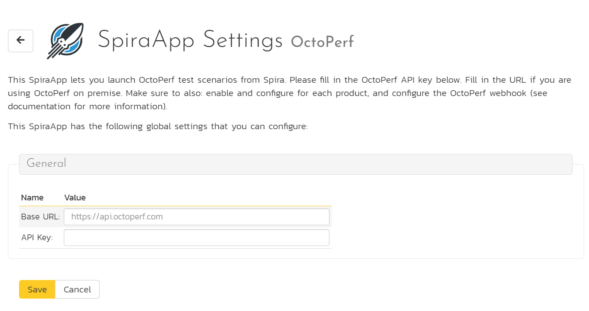
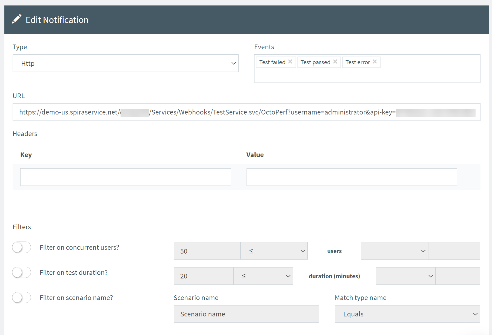
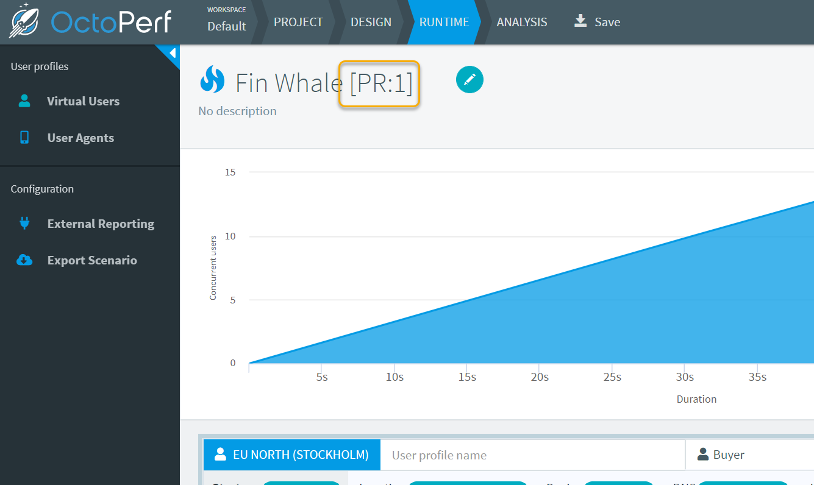
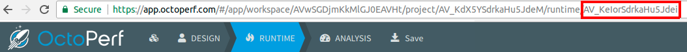
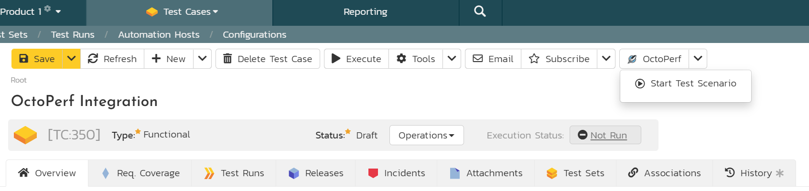
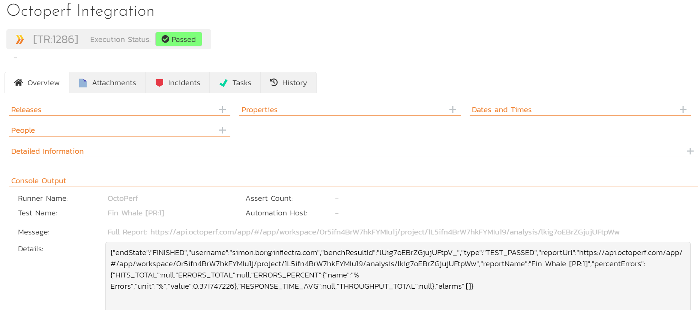

# OctoPerf SpiraApp
!!! abstract "Compatible with SpiraTest, SpiraTeam, SpiraPlan"

This SpiraApp lets you integrate SpiraPlan (and SpiraTest and SpiraTeam) and OctoPerf so users can launch Actions from Spira and see their results in Spira as builds.

!!! info "About this SpiraApp"
    - [x] system settings
    - [x] product template setup required
    - [x] toolbar button on test case details page
    - [x] additional integration required to record results in Spira
    - [x] configuration in OctoPerf (for recording results in Spira)

## Setup
This SpiraApp has two interdependent parts that are both required for full functionality:

- a button on the test case details page so users can manually launch a new OctoPerf test 
- backend integration (using webhooks) so the results of all relevant Actions are recorded in Spira as new test runs

**Note** that only OctoPerf tests launched from SpiraPlan using this SpiraApp will create associated SpiraPlan test runs

### System settings
- [x] Enter the OctoPerf base url - OctoPerf cloud customers should enter `https://api.octoperf.com`, while OctoPerf on-premise customers should enter their on premise URL
- [x] Enter the [API Key](https://doc.octoperf.com/account/profile/#apikey) for the user that will be used for launching tests in OctoPerf from Spira

### Product Template Setup
- [x] Add a plain text custom property called `octoperf-scenario-id` for Test Cases in the product's template.
- [x] Add a plain text custom property called `octoperf-benchresult-id` for Test Cases in the product's template.

This step is not required, but we strongly recommend updating your workflows to make the "octoperf-benchresult-id" custom property either hidden or disabled for all workflow steps. This is field is used to store data sent from OctoPerf so that Spira can match up the the results to the correct test case.

### Webhook Setup in OctoPerf
To complete the next part of the setup, login to your OctoPerf Application.

- [x] **Create a notification**: go to the [notifications page](https://doc.octoperf.com/notifications/) in OctoPerf and [add a new notification](https://doc.octoperf.com/notifications/#add-or-edit-a-notification) with the specific settings below:

    - **Type**: Http
    - **Events**: "Test failed", "Test passed", and "Test error" (tip: click in the Events box to get a list of options to select from)
    - **URL**: use a url in the form: `{{base url}}/Services/Webhooks/BuildService.svc/OctoPerf?username={{username}}&api-key={{api key}}`. This is the url that OctoPerf uses to talk to SpiraPlan. See the example below.
    - Leave every other field as the default

!!! example "The webhook URL"
    The webhook URL is made of different parts.

    - First get the base url of your instance - for instance `https://mysite.spiraservice.net`. This is the start of every URL you use when using SpiraPlan
    - Add the following to the end of that URL `/Services/Webhooks/TestService.svc/OctoPerf`
    - Add your SpiraPlan user authentication to the end of this url. This needs a username and an [api-key](../HowTo-Guides/Users-profile-management.md/#how-to-get-or-make-your-rss-token-or-api-key). The user must be a member of the relevant product and be able to create releases. This part of the URL looks like `?username={{username}}&api-key={{api key}}`

    The final URL will look like this: `https://mysite.spiraservice.net/Services/Webhooks/TestService.svc/OctoPerf?username=hobikdoc&api-key={11111111-1111-1111-1111-111111111111}`

- [x] **Link the scenario to your SpiraPlan product**: go to a Scenario in OctoPerf that you want to launch from SpiraPlan. Change its name so that the SpiraPlan product token (for example, `[PR:1]`) appears in the name field. 

**Note**: you need to complete the above step for every OctoPerf scenario that you want to connect to SpiraPlan. Each scenario must have the product token in its name.

## Using the SpiraApp
To use the SpiraApp to start a new OctoPerf Action go to a test case in that product. 

You must make sure:

- the custom property "octoperf-scenario-id" is correctly filled in. To find scenario id:

    - Go to OctoPerf and to the scenario you wish
    - Look at the URL in your browser. The ID is the last one in the URL

Once the test case has the scenario id filled in, at any time you can click on the OctoPerf button in the top toolbar. This opens the dropdown. Click "Start Test Scenario" to start the test scenario on OctoPerf. You will see an info message telling you the Action has started. 

Because a test can take a while to run, do not expect to automatically see the test run and updated test execution status as soon as the info popup goes away. It may take a few minutes or more for the test run to be recorded. The test run created will have information about the test scenario in the Console Output, including a link to view the full report in OctoPerf itself.

The execution status is determined based on the test status passed from OctoPerf:

| OctoPerf | SpiraPlan |
|----------|-----------|
| Passed   | Passed    |
| Failed   | Failed    |
| Error    | Blocked   |
