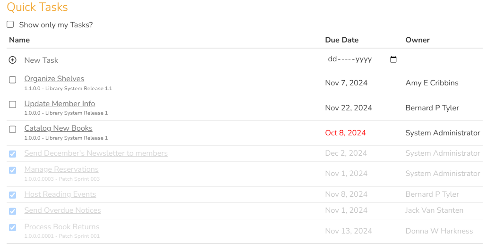

# Quick Tasks SpiraApp

!!! warning "This SpiraApp's functionality requires SpiraTeam or SpiraPlan to work."

This SpiraApp lets users create, complete, and view tasks from a convenient Product Home Page widget. 

!!! info "About this SpiraApp"
    - [ ] system settings
    - [x] product settings 
    - [ ] product template setup required
    - [x] product home page widget

## Setup
To effectively implement Quick Tasks in your product, you have to set up the Task Type that will be used and optionally, make it use a specific workflow. 

### Product Settings
For each product that uses Quick Tasks, a product administrator must select the default Quick Task Type in the Quick Tasks SpiraApp product settings.

!!! tip "Creating a dedicated Workflow and Task Type for Quick Tasks"

    Optionally, if you want to use a dedicated Task Type (e.g. "Quick Task") and use a dedicated Workflow for Quick Tasks, follow the steps below. This is useful when you have a highly customized Workflow in your template or just want to keep the Quick Tasks operations separated from the workflow rules of other Taks in your template.
    
    **To create a dedicated Task Workflow**, go to Administration > Tasks > Workflow and add a new Workflow (e.g. "Quick Task Workflow").

    **To create a dedicated Task Type**, go to Administration > Tasks > Type and add a new Type (e.g."Quick Task").

## Using the SpiraApp

!!! warning "Users must have 'Modify All' Tasks permission in order to complete their owned tasks using this widget"

!!! warning "Users must have 'View' permissions for Releases in order to use this widget"

### Using the Quick Tasks Widget

This widget serves as a group to-do list for all users who can create Tasks in the product. The widget displays the Name, End Date, and Owner of the most recent Quick Tasks, along with the Release if the Task has one. Select the option ‘Show only my Tasks?’ to limit the list to Tasks where you are the Owner.

You can use the top row of the table to create a new Quick Task. This is automatically assigned to you, given the "In Progress" Status, and given the Type chosen in the product setting. 

If a release is selected using the Product Home Page release dropdown, only Quick Tasks for that release will be shown, and any newly created Quick Tasks will be added to that release.

Below the New Task row, the widget displays up to fifty incomplete Quick Tasks, sorted first by latest Creation Date and then alphabetically by Owner. The widget considers any Quick Tasks with a Status of "Not Started", "In Progress", "Blocked", or "Under Review" as incomplete, and includes only those tasks in this section. You can click the empty checkbox to the left of an incomplete Quick Task to mark it as Completed.

Below the incomplete Quick Tasks, the widget also shows up to five Completed Quick Tasks, sorted by latest updated. You can click the filled checkbox to the left of a completed Quick Task to mark it as In Progress, which moves it back to the upper section.

Note that when a release is selected on the product home page, the end date for the task will always match the end date for the release, and cannot be changed by the user.