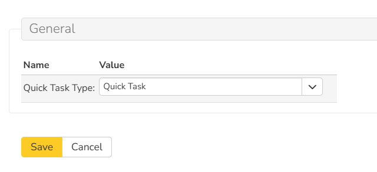

# Quick Tasks SpiraApp
This SpiraApp adds a widget on the product home page where you and your team can quickly and easily create and work on shared tasks in a streamlined user interface. Creating and checking off tasks in Spira has never been faster. 

!!! warning "This SpiraApp's functionality requires SpiraTeam or SpiraPlan to work."

!!! info "About this SpiraApp"
    - [ ] system settings
    - [x] product settings 
    - [ ] product template setup required
    - [x] product home page widget

## Setup
### Product Settings
For each product that uses Quick Tasks, select the specific task type that the Quick Tasks SpiraApp should use, from SpiraApp's product admin settings page.

!!! tip "Create a custom Workflow and Task Type for Quick Tasks"
    While you can use an existing task type and its workflow for this SpiraApp, you may prefer to have a dedicated workflow and task type. This optional step will mean that any tasks created from the Quick Task widget are classified and managed differently from normal tasks. This is useful when you have a highly customized Workflow in your template that you want to enforce in general, but not for your Quick Tasks.
    
    **To create a dedicated Task Type**, go to Administration > Tasks > Type and add a new Type (e.g."Quick Task").

    **To create a dedicated Task Workflow**, go to Administration > Tasks > Workflow and add a new Workflow (e.g. "Quick Task Workflow").

## Using the SpiraApp
!!! warning "Users must have 'Modify All' Tasks permission in order to complete their owned tasks using this widget"

!!! warning "Users must have 'View' permissions for Releases in order to use this widget"

### Using the Quick Tasks Widget
The SpiraApp's product home page widget serves as a group to-do list for all users who can create Tasks in the product. The widget displays, for each of the most recent relevant tasks:

- Name
- End Date
- Owner
- Release (if the Task has one)

Select the option "Show only my Tasks?" to limit the list to tasks you own.

You can use the top row of the table to create a new Quick Task. This is automatically assigned to you, given the "In Progress" Status, and given the Type chosen in the product setting. 

If a release is selected using the Product Home Page release dropdown, only Quick Tasks for that release will be shown. Any newly created Quick Tasks will be added to that release and the task end date will match the end date of the release and cannot be changed from the widget.

Below the New Task row, the widget displays up to fifty incomplete Quick Tasks, the most recently created at the top. The widget considers any Quick Tasks with a Status of "Not Started", "In Progress", "Blocked", or "Under Review" as incomplete, and includes only those tasks in this section. You can click the empty checkbox to the left of an incomplete Quick Task to mark it as Completed.

Below the incomplete Quick Tasks, the widget also shows up to five Completed Quick Tasks, sorted by last updated. You can click the filled checkbox to the left of a completed Quick Task to move it back to not done (this marks the tasks as In Progress and moves it back to the upper section).

