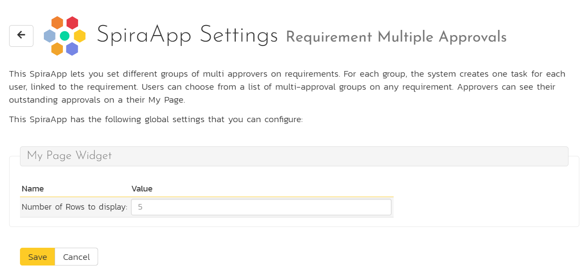
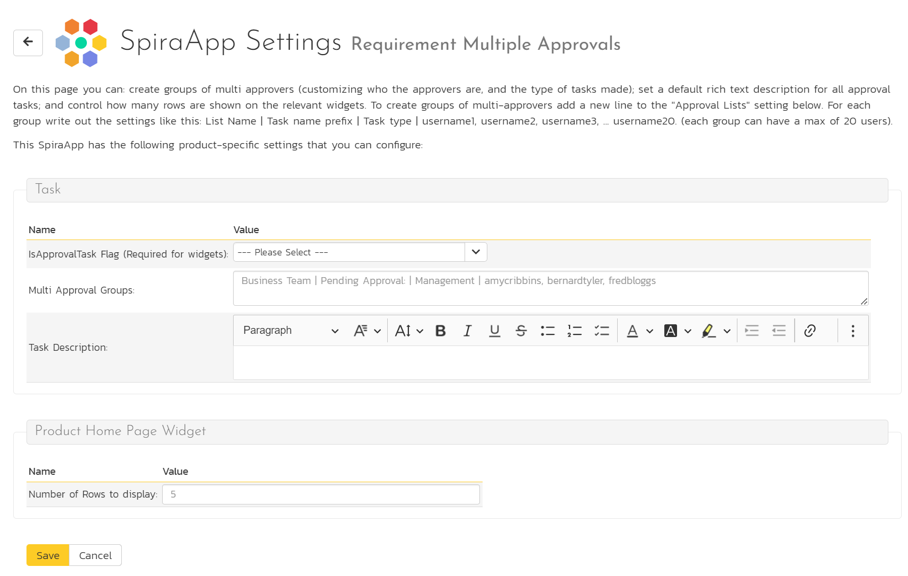
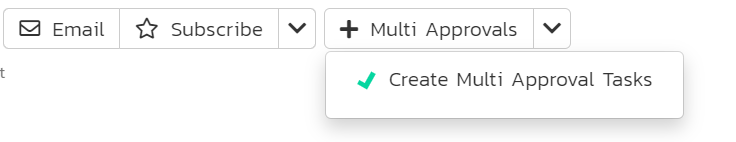
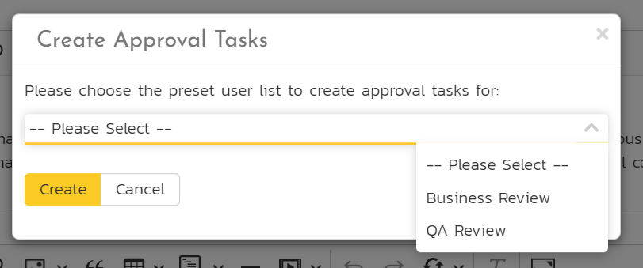
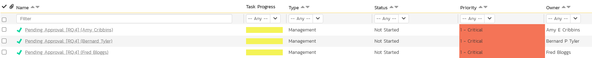
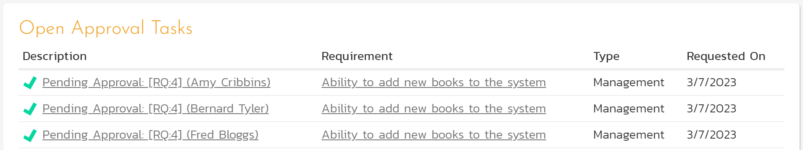
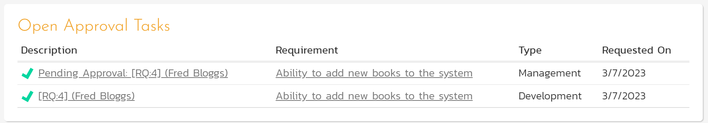

# Requirement Multi Approvers 

!!! warning "This SpiraApp functionality is limited to SpiraTeam and SpiraPlan"

This SpiraApp lets you create groups of customizable tasks against requirements to ensure multiple named users must approve a requirement before it can progress through the workflow. Product admins can create groups of tasks with a consistent description and name style, but with specific assigned users and types. Requirement users can create these task groups that link to the relevant requirement. Widgets on the product home page and My Page help users manage these approval tasks. Note that Tasks are not available in SpiraTest.

!!! info "About this SpiraApp"
    - [x] system settings
    - [x] product settings 
    - [x] product template setup required
    - [x] toolbar button on requirement details page

## Setup
### System Settings
Once the SpiraApp has been activated system wide, the system admin can set the number of approval tasks that should be shown on the My Page widget. If this setting is left blank then five tasks will be shown. You can show up to a maximum of fifty approval tasks.

### Product Template Setup
In the product template for each product that uses the requirement multi approvers, you need to setup a dedicated custom field. This powers the SpiraApp's widgets. **Create a boolean task custom property called "IsApprovalTask" exactly**.

### Product Settings
Once the SpiraApp has been activated system wide, and enabled for a product you can edit its product settings.

First, pick the "IsApprovalTask" custom property from the dropdown for the IsApprovalTask Flag field. This will make sure that the product home page widget will work correctly.

To create a multi approval group, fill in Multi Approval Groups text box. Each group should be on its own line. For each group you specify:

- the group name (the name that users will see when they want to create multi approval tasks)
- any text to add at the start of each task name (optional - without this set the task name is in the form "[RQ:4] (Amy Cribbins)")
- the type the task should be (optional - the default task type is used if this is not used)
- a list of usernames to create approval tasks for (up to a maximum of 20)

Start each line with the group name, then a "|", then the task name prefix followed by "|", then the task type followed by "|", then a comma separated list of usernames. Your final line should be in this format: `List name | Task name prefix | Task type name | username, username, username…`

!!! info "Example multi approval groups"

    `Business Review | Pending Approval: | Management | amycribbins, bernardtyler, fredbloggs`

    In this example we are creating a group:

    - Called "`Business Review"
    - That will create 3 tasks (one each for Amy, Bernard, and Fred)
    - Each task will be set to be of type "Management"
    - The name of each task will start with "Pending Approval: "

    `QA Review | | | amycribbins, fredbloggs`

    In this example we are creating a group:

    - Called "`QA Review"
    - That will create 2 tasks (one each for Amy and Fred)
    - Each task will be set to the default type
    - Nothing is added at the start of the automatically generated task name

All approval tasks across all groups can share a default task description. Fill in the Task Description rich text field with any required text. This lets you provide standard instructions to all approvers.

Finally, you can set the number of approval tasks that should be shown on the product home page widget. If this setting is left blank then five tasks will be shown. You can show up to a maximum of fifty approval tasks.

## Using the SpiraApp
### Requirement Details Page
When a user goes to the requirement details page, they will see an extra button in the toolbar. To add a group of multi approval tasks they should follow these steps:

- Click the "Multi Approvals" button
- Click "Create Multi Approval Tasks"

- This will display a popup dialog with a dropdown of all available multi approval groups
- Select the desired preset
- Click "Create"

A message will show at the top of the page stating that the tasks are being created. This message will disappear after all the approval tasks have been created. You can see the new tasks on the requirement's task tab. Below is an example.

Each of the multi approval tasks created has the following fields set:

- Name (with the requirement token and username, with any prefix specified for the group)
- Type (default or the one specified for the group)
- Description (if set) 
- Creator (the person who created the tasks using the multi approval SpiraApp)
- Owner
- Requirement linked up
- Release (taken from any set on the requirement)
- Priority (taken from the requirement's importance)
- Start and End dates (taken from the dates of a release if any is set on the requirement)
- the IsApprovalTask custom property (if present) is set to true / yes

### Product Home Page Widget
This widget displays open multi approval tasks in the product (or for the release in that product if the page is set to display for a particular release). Approval tasks are shown in order of when they were created (oldest first). The widget is available on any of the product home pages. To add the widget to a page, edit the page and then open the "SpiraApp Widgets" section. Add the widget to the section of the page you want.

The number of rows shown matches that in the product settings for this SpiraApp (up to a maximum of 50). For each row you see:

- **Description**: the approval task name - hovering shows the task ID, and clicking the name opens the task details page
- **Requirement**: the name of the associated requirement - hovering shows the requirement ID, and clicking the name opens the requirement details page
- **Type**
- **Requested On** (the creation date)

Note that only approval tasks that have the IsApprovalTask custom property present and set to Yes will show on the widget.

- The same applies as above for the My Page widget, except instead of showing all approval tasks of a product, it instead shows all approval tasks assigned to the user who is currently viewing their My Page. For this to work, the custom properties which marks tasks as approval tasks need to be named “IsApprovalTask” exactly.
- Product page release selector and My Page all / Current projects selectors should both filter the results of their associated widgets to align with the constraint the user is attempting to apply

### My Page Widget
This widget displays open multi approval tasks assigned to the current user. Approval tasks are shown in order of when they were created (oldest first). When the My Page is set to show content for "All Products" the widgets shows approval tasks system wide. When the My Page is set to show content for "Current Product" the widgets only shows approval tasks (if any) in the current product. 

To add the widget to a page, edit the page and then open the "SpiraApp Widgets" section. Add the widget to the section of the page you want.

The number of rows shown matches that in the system settings for this SpiraApp (up to a maximum of 50). For each row you see:

- **Description**: the approval task name - hovering shows the task ID, and clicking the name opens the task details page
- **Requirement**: the name of the associated requirement - hovering shows the requirement ID, and clicking the name opens the requirement details page
- **Type**
- **Requested On** (the creation date)

Note that only approval tasks that have the IsApprovalTask custom property present and set to Yes will show on the widget.