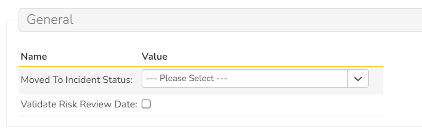

# Risks+ SpiraApp

!!! warning "This SpiraApp is not compatible with SpiraTest"

This SpiraApp extends the built-in risk functionality by adding a "Move to Incident" button on the Risk details page, as well as adding optional validation for the Review Date field.

!!! info "About this SpiraApp"
    - [ ] system settings
    - [x] product settings 
    - [ ] product template setup required
    - [x] runs automatically on the risk details page
    - [x] adds a menu button the risk details page

## Setup
### Product Settings
Once the Risks+ SpiraApp has been activated system wide, and enabled for a product, there are a couple of settings:

To specify a status to set a Risk to when using the Move to Incident button, select the status in the "Moved to Incident Status" setting. We recommend setting this to "Open" or a similar status based on your team's workflow. To restrict Risk Review dates to be before Risk Closed dates, enable the "Validate Risk Review Date" setting.

## Using the SpiraApp
### Risk Details Page
On the Risk Details page, you can press the Risks+ menu button and then Move to Incident to create an Incident based on this Risk. The new Incident will copy the Name, Description, Owner, Release, Tags, Component, and Product of the current Risk. The Incident will have the default status for new Incidents in the product. The status of the Risk will be changed to the one selected in the product setting. The probability of the Risk will be changed to the highest one active in the product. A "related-to" association will also be added between this Risk and the new Incident. A comment will be added to both the Risk and the new Incident, which includes the Artifact IDs and the date the incident was created. 

With the "Validate Risk Review Date" product setting enabled, any Risk that is saved must have a Review Date that comes before its Closed Date. If you save a Risk with a Review Date after its Closed Date, the Review Date will be set equal to the Closed Date and a message will appear saying the previous value was invalid. Note that the overwritten Review Date will be shown in the Risk's History tab as the latest change, if you need to refer to it.