---
# Spira AI Connect SpiraApp
!!! abstract "Compatible with SpiraTest, SpiraTeam, SpiraPlan"

This SpiraApp lets you generate downstream artifacts from Spira requirements, test cases, risks, and tasks using generative AI. It provides a unified, provider-agnostic interface that supports **any OpenAI-compatible REST endpoint** (OpenAI, Azure OpenAI, Groq, Mistral, Together AI, Fireworks, Perplexity, and more) as well as **AWS Bedrock** (Claude, Llama, and Nova models).

A system administrator configures credentials for one provider, and all users interact with AI features without needing to know which backend is active.

The current functionality uses generative AI to:

- Suggest probable test cases with steps from requirements
- Generate likely development tasks for a requirement
- Generate BDD scenarios for a requirement
- Identify common business and technical risks for a requirement
- Generate test steps for an existing test case
- Generate requirements from an existing test case
- Suggest mitigations for an existing risk
- Generate sample source code for a task
- Generate sample source code with unit tests for a task

It provides an easy and effective way for users to create a foundational set of items that they can refine and tailor. Note that Tasks and Risks are not available in SpiraTest.

By using this SpiraApp, users will share information with the configured AI provider. For that reason, system admins must configure this SpiraApp to connect to an approved AI service for your organization.

!!! info "About this SpiraApp"
    - system settings
    - product settings 
    - toolbar button on requirement details page
    - toolbar button on test case details page
    - toolbar button on risk details page
		{: .edition-spiraplan .edition-spirateam}
    - toolbar button on task details page
		{: .edition-spiraplan .edition-spirateam}

## Choosing a Provider
Spira AI Connect supports two mutually exclusive provider types. You must enable exactly one:

| Provider | Best For | Requirements |
| -------- | -------- | ------------ |
| **REST API** | OpenAI, Azure OpenAI, Groq, Mistral, Together AI, Fireworks, Perplexity, Ollama, LM Studio, or any OpenAI-compatible chat completions endpoint | A base URL and API key |
| **AWS Bedrock** | Claude, Llama, and Nova models hosted in your own AWS account | AWS IAM credentials with Bedrock InvokeModel permission |

You cannot enable both providers at the same time. If both are enabled, the SpiraApp will display an error.

## REST API Setup (OpenAI, Azure OpenAI, Groq, etc.)

If you are using a REST API provider, you need the following information from your provider:

1. **Base URL** — the full chat completions endpoint URL (e.g. `https://api.openai.com/v1/chat/completions`)
2. **API Key** — your secret API key for authentication
3. **Auth Header Name** (optional) — defaults to `Authorization` with Bearer token format. Set to `api-key` for Azure OpenAI.

### Provider-Specific URLs

| Provider | Base URL |
| -------- | -------- |
| OpenAI | `https://api.openai.com/v1/chat/completions` |
| Azure OpenAI | `https://{resource}.openai.azure.com/openai/deployments/{deployment}/chat/completions?api-version={version}` |
| Groq | `https://api.groq.com/openai/v1/chat/completions` |
| Together AI | `https://api.together.xyz/v1/chat/completions` |
| Fireworks | `https://api.fireworks.ai/inference/v1/chat/completions` |
| Mistral | `https://api.mistral.ai/v1/chat/completions` |
| Perplexity | `https://api.perplexity.ai/chat/completions` |

!!! note "Azure OpenAI"
    For Azure OpenAI, set the **Auth Header Name** to `api-key` instead of the default `Authorization`. Azure uses a different authentication header format.

## AWS Bedrock Setup
If you are using AWS Bedrock, follow these steps to configure access in your AWS account.

Log into your AWS Console and navigate to the **Bedrock** services section. Then click on the sidebar menu entry for **Model access**:

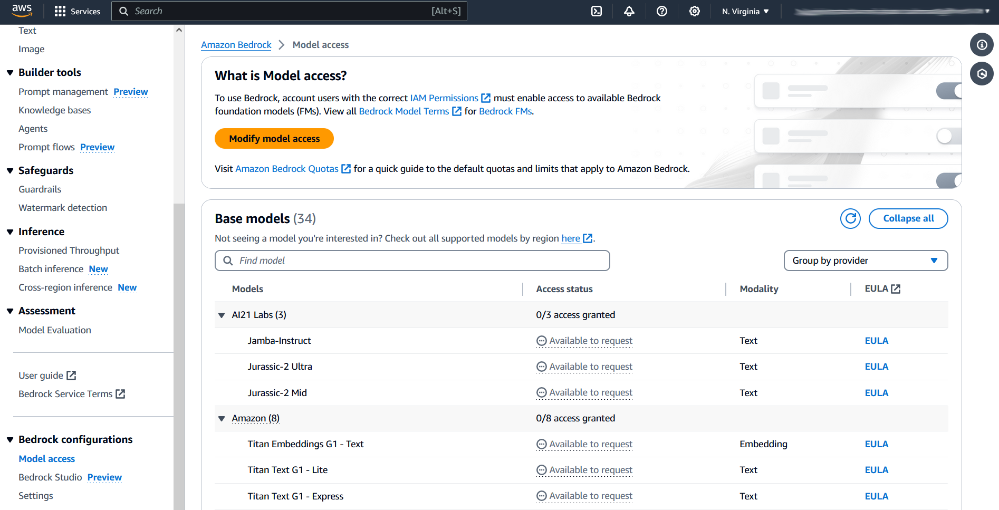

On this page you can request access to various LLM model families and models. Please request access to at least one supported model family in AWS Bedrock (**Nova**, Anthropic Claude, or Llama).

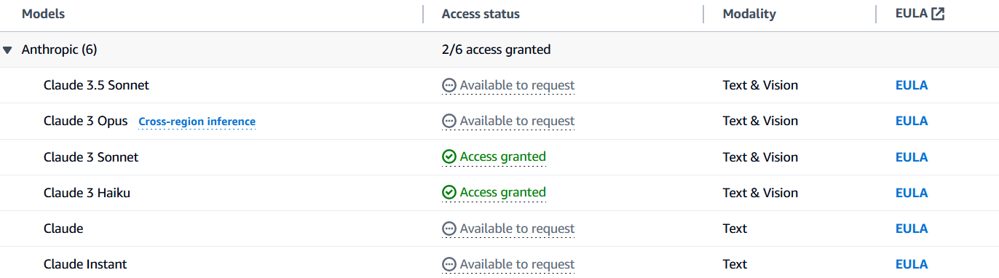

Once you have been granted access to the models, navigate over to the **IAM** AWS Service page, and create a new IAM user called `aws-bedrock-service-user`.

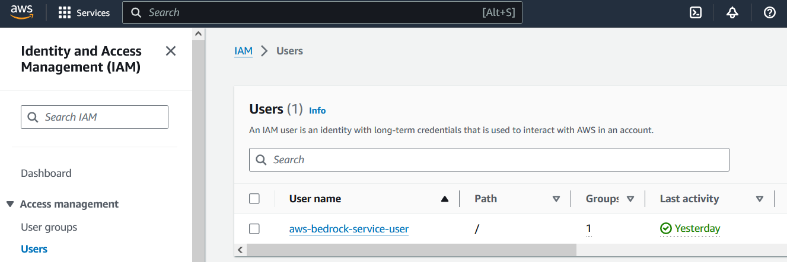

In line with AWS best practices, we will also create an IAM group called `aws-bedrock-service-group`. Make sure to add your new user to this new group.

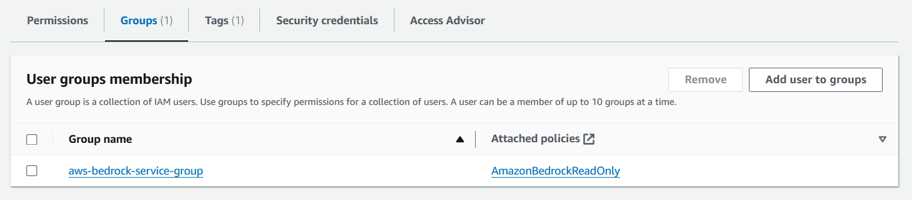

Now that you have the IAM group created, attach the following policies/permissions to the group: 

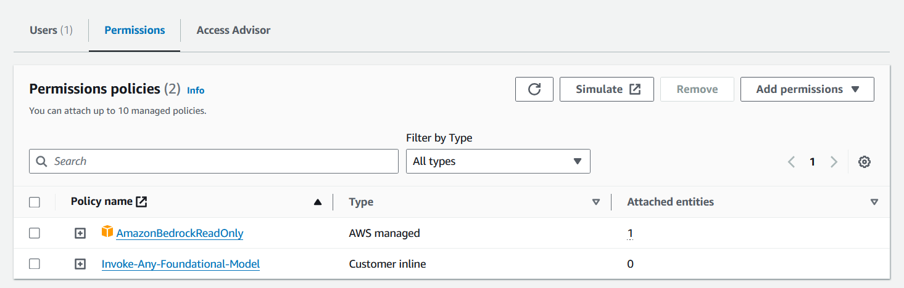

- **AmazonBedrockReadOnly** — this is a built-in AWS managed permission
- **Invoke-Any-Foundational-Model** — this is an inline permission that we need to create.

To create the new Invoke Any Foundational Model permission, use the inline policy editor:

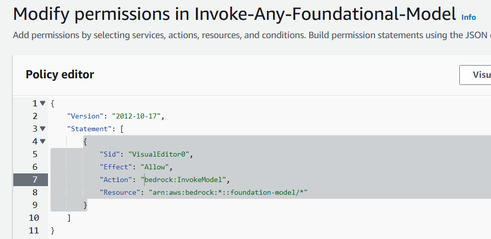

To simplify things, use the following JSON policy:

```json
{
	"Version": "2012-10-17",
	"Statement": [
		{
			"Sid": "VisualEditor0",
			"Effect": "Allow",
			"Action": "bedrock:InvokeModel",
			"Resource": "arn:aws:bedrock:*::foundation-model/*"
		}
	]
}
```

Finally, create an **Access Key** for this user so that it can be called from the SpiraApp. Click on the section **Access Keys**:

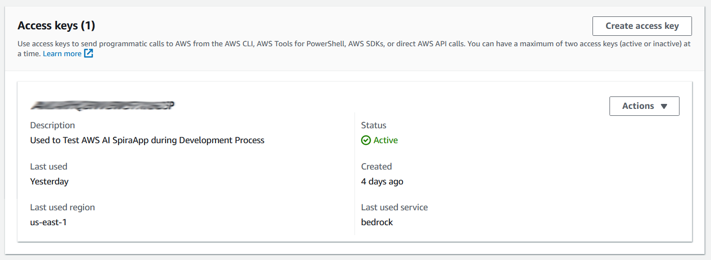

Click the button **Create access key** to start the access key creation wizard. On the first page, choose **Application running outside AWS**.

On the second page, enter a description of what this access key will be used for. For example, `Used to connect Spira AI Connect to Bedrock`:

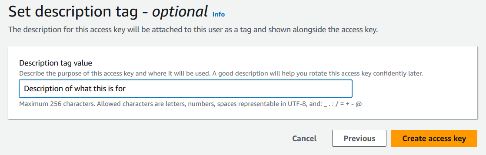

Once the access key has been created, you will be given two pieces of information:

- Access Key
- Secret Access Key

Copy both of these values into your secure credential storage. You will need them in the next section for setting up the SpiraApp.

## SpiraApp Setup

### System Settings

The system settings page has two provider sections. Configure **only one** provider.

#### REST API Settings
- [x] **Enable REST API** — Toggle on to use a REST API provider (cannot use with Bedrock)
- [x] **Base URL** — The full URL of your AI chat completions endpoint
- [x] **API Key** — The API key for authenticating with your AI provider
- [x] **Auth Header Name** — The HTTP header name for authentication (defaults to `Authorization` with Bearer token format; set to `api-key` for Azure OpenAI)

#### AWS Bedrock Settings
- [x] **Enable Bedrock** — Toggle on to use AWS Bedrock (cannot use with REST API)
- [x] **AWS Region** — The AWS region for your instance of AWS Bedrock (default is `us-east-1`)
- [x] **Access Key ID** — The API Access Key for accessing AWS Bedrock
- [x] **Secret Access Key** — The API Secret Key for accessing AWS Bedrock

#### General Settings
- [x] **Model** — The model ID to use for AI generation. Use the exact model ID from your provider (e.g. `gpt-4o`, `anthropic.claude-3-5-sonnet-20241022-v2:0`, `meta.llama3-70b-instruct-v1:0`, `amazon.nova-pro-v1:0`)

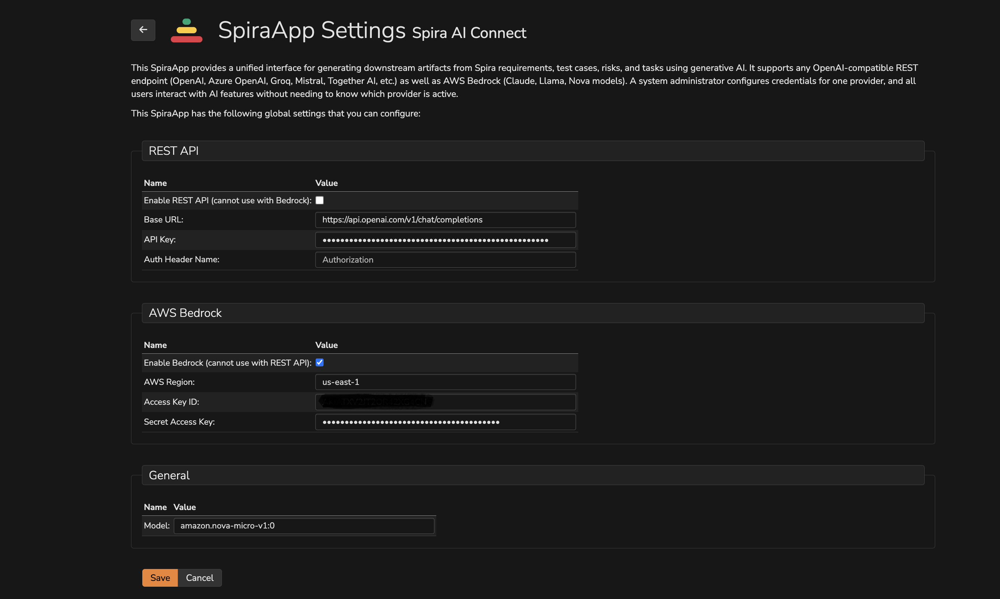

### Product Settings
Once the SpiraApp has been activated system wide and enabled for a product, you can edit its product settings. **All product settings are optional**. You can use the SpiraApp without editing any of the product settings. The settings are here to help you customize the results.

#### General Settings

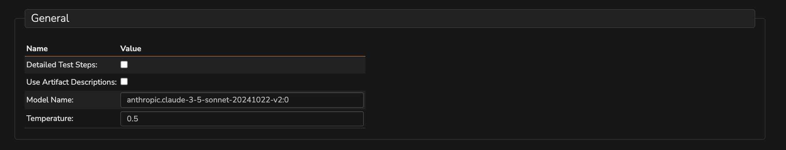

- [x] **Detailed Test Steps:** Should we create detailed test steps for test cases, or just a single step
- [x] **Use Artifact Descriptions:** Should we use the artifact descriptions as well as the names in the prompts
- [x] **Model Name:** Override the system-level model for this product. Leave blank to use the system default.
- [x] **Temperature:** Controls output randomness. Lower values (closer to 0) produce more deterministic responses, higher values (up to 2) produce more creative responses. Default is 0.5.

#### Code Generation
!!! abstract "Compatible with SpiraTeam and SpiraPlan only"

This is where you can customize the list of programming languages available:

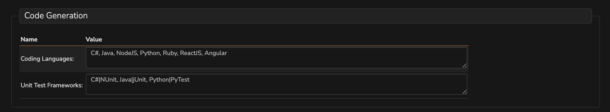

- **Coding Languages**: Provide a comma-separated list of programming languages that the user can pick from. If you don't provide a value, the default list will be used: `C#, Java, NodeJS, Python, Ruby, ReactJS, Angular`
- **Unit Test Frameworks**: Provide a comma-separated list of programming languages and unit test frameworks. The language and framework should be separated by a pipe (`|`) symbol. Default: `C#|NUnit, Java|jUnit, NodeJS|Mocha, Python|PyTest, Ruby|Test::Unit, ReactJS|Cypress, Angular|Cypress`


#### Prompt Customization
This is where you can customize the prompts sent to the AI model. Each setting has a built-in default prompt. If you enter a custom prompt, it will completely override the default. Leave a setting blank to use the built-in prompt.

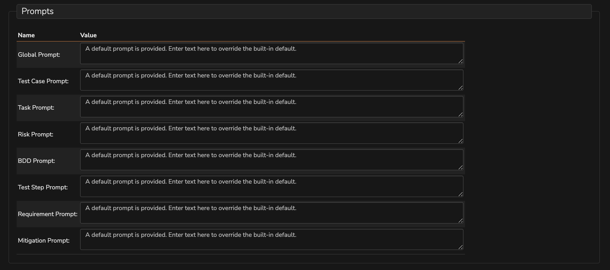

| Setting name            | Default Value                                                                                                                         | Explanation                                                                                                                                                      |
| ----------------------- | ------------------------------------------------------------------------------------------------------------------------------------- | ---------------------------------------------------------------------------------------------------------------------------------------------------------------- |
| Global Prompt        | You are a business analyst that only speaks in JSON. Always send your entire output in properly formatted JSON. | This prompt is used to control the output format of all the responses to be JSON.                                                                                        |
| Test Case Prompt        | Write the test cases for the following software requirement as { "TestCases": [] }. For each test case include the description, input and expected output in the following format { "Description": [...], "Input": [...], "ExpectedOutput": [...] } | This prompt is used to generate the test cases from the requirement                                                                                              |
| Task Prompt             | Write the development tasks for the following software requirement as { "Tasks": [] }. For each task include the name and description in the following format { "Name": [...], "Description": [...] }  | This prompt is used to generate the tasks from the requirement                                                                                                   |
| Risk Prompt             | Identify the possible business and technical risks for the following software requirement as { "Risks": [] }. For each risk include the name and description in the following format { "Name": [...], "Description": [...] } | This prompt is used to generate the risks from the requirement.                                                                                                  |
| BDD Prompt        | Write the BDD scenarios for the following software requirement as { "Scenarios": [] }. For each scenario use the following Gherkin format { "Name": [...], "Given": [...], "When": [...], "Then": [...] }     | This prompt is used to generate the BDD steps for the requirement.                                                                                               |
| Test Step Prompt        | Write at least 10 test steps for the following test case as { "TestSteps": [] }. For each test step include the description, expected result, and sample data in the following format { "Description": [...], "ExpectedResult": [...], "SampleData": [...] }        | This prompt is used to generate the test steps for the test case.                                                                                               |
| Requirement Prompt        | Write the requirements for the following test case as { "Requirements": [] }. For each requirement include the name and description in the following format { "Name": [...], "Description": [...] }          | This prompt is used to generate the requirements for the test case.                                                                                               |
| Mitigation Prompt        | Write the possible mitigations for the following risk as { "Mitigations": [] }. For each mitigation include the description in the following format { "Description": [...] }                    | This prompt is used to generate the mitigations for the risk.                                                                                               |


## Using the SpiraApp

The user can navigate to different pages to use the SpiraApp, each one will have a toolbar with various generation options.

### Requirement Details Page

When a user goes to the requirement details page, they will see an extra button in the toolbar called "Spira AI Connect". To generate relevant data they should follow these steps:

- Click the "Spira AI Connect" button
- Select the artifact to generate from the dropdown:
    - **Generate Test Cases** — creates test cases covering key aspects of the requirement
    - **Generate Tasks** — creates development tasks to implement the requirement
    - **Generate BDD Scenarios** — creates Gherkin syntax BDD scenarios for the requirement
    - **Identify Risks** — identifies key business and technical risks

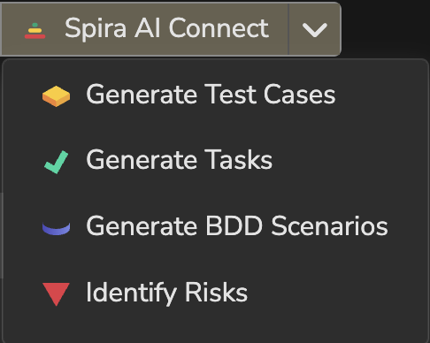

- This will send the requirement name (and optionally the description and any scenarios) to the configured AI provider
- The information coming back is parsed and analyzed by the SpiraApp and then created in Spira

A message will show at the top of the page informing the user when information is sent or if there was a problem.


### Test Case Details Page

When a user goes to the test case details page, they will see an extra button in the toolbar. To generate relevant data they should follow these steps:

- Click the "Spira AI Connect" button
- Select the artifact to generate:
    - **Generate Test Steps** — creates detailed test steps for this test case
    - **Generate Requirements** — creates requirements from this test case

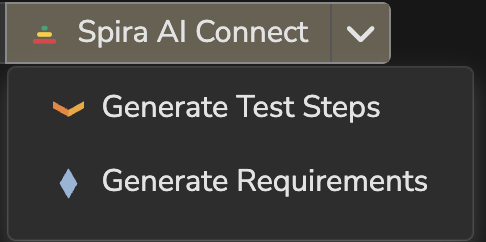

- This will send the test case name (and optionally the description) to the configured AI provider
- The information coming back is parsed and analyzed by the SpiraApp and then created in Spira

A message will show at the top of the page informing the user when information is sent or if there was a problem.

### Task Details Page
!!! abstract "Compatible with SpiraTeam and SpiraPlan only"

When a user goes to the task details page, they will see an extra button in the toolbar. To generate relevant data they should follow these steps:

- Click the "Spira AI Connect" button
- Select the type of code to generate:
    - **Generate Sample Code** — generates source code implementing the task
    - **Generate Sample Code with Tests** — generates source code with matching unit tests

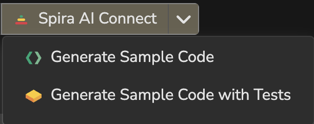

Once you choose the appropriate code generation option, a dialog box will be displayed where you can choose which programming language (and optionally unit test framework) to use:

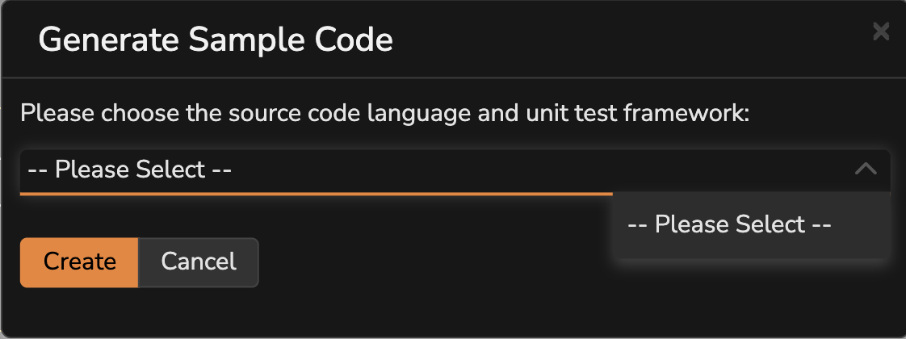

- This will send the task name (and optionally the description) to the configured AI provider
- The information coming back is parsed and analyzed by the SpiraApp and then created in Spira as attached documents

A message will show at the top of the page informing the user when information is sent or if there was a problem.

### Risk Details Page
!!! abstract "Compatible with SpiraTeam and SpiraPlan only"

When a user goes to the risk details page, they will see an extra button in the toolbar. To generate relevant data they should follow these steps:

- Click the "Spira AI Connect" button
- Select the artifact to generate:
    - **Generate Mitigations** — suggests mitigations to reduce exposure of this risk

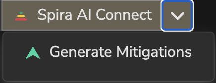

- This will send the risk name (and optionally the description) to the configured AI provider
- The information coming back is parsed and analyzed by the SpiraApp and then created in Spira

A message will show at the top of the page informing the user when information is sent or if there was a problem.

### Extra details to be aware of
- The generated artifacts only have their names and descriptions populated, with the exception of test cases that will have detailed test steps (if enabled).
- To generate artifacts the user must have create permission for that artifact.
- BDD steps can only be generated on requirements of types that support steps.
- For AWS Bedrock, the model family is auto-detected from the model name. Supported prefixes are: `anthropic` (Claude), `meta.` (Llama), and `amazon.nova` (Nova). Cross-region inference profile IDs (e.g. `us.anthropic.claude-3-5-sonnet-20241022-v2:0`) are also supported.
- Results are capped at 50 items per generation to prevent excessive artifact creation.

## Appendix - Default Prompts
If you are interested in customizing the prompts used in the SpiraApp, here are the built-in defaults:

### Global Prompt
`You are a business analyst that only speaks in JSON. Always send your entire output in properly formatted JSON.`

### Requirement Prompts
#### 1. Generate Test Cases

`Write the test cases for the following software requirement as { "TestCases": [] }. For each test case include the description, input and expected output in the following format { "Description": [Description of test case], "Input": [Sample input in plain text], "ExpectedOutput": [Expected output in plain text] }`

#### 2. Generate Tasks

`Write the development tasks for the following software requirement as { "Tasks": [] }. For each task include the name and description in the following format { "Name": [name in plain text], "Description": [description in plain text] }`

#### 3. Generate BDD Scenarios

`Write the BDD scenarios for the following software requirement as { "Scenarios": [] }. For each scenario use the following Gherkin format { "Name": [The name of the scenario], "Given": [single setup in plain text], "When": [single action in plain text], "Then": [single assertion in plain text] }`

#### 4. Generate Risks

`Identify the possible business and technical risks for the following software requirement as { "Risks": [] }. For each risk include the name and description in the following format { "Name": [name in plain text], "Description": [description in plain text] }`

### Risk Prompts

#### 1. Generate Mitigations

`Write the possible mitigations for the following risk as { "Mitigations": [] }. For each mitigation include the description in the following format { "Description": [description in plain text] }`

### Test Case Prompts

#### 1. Generate Test Steps

`Write at least 10 test steps for the following test case as { "TestSteps": [] }. For each test step include the description, expected result, and sample data in the following format { "Description": [Description of test step], "ExpectedResult": [The expected result], "SampleData": [Sample data in a plain text string] }`

#### 2. Generate Requirements

`Write the requirements for the following test case as { "Requirements": [] }. For each requirement include the name and description in the following format { "Name": [name in plain text], "Description": [description in plain text] }`

### Task Prompts

#### 1. Generate Source Code

`You are a programmer working in the [CODE_LANGUAGE] programming language. Write sample code that implements the following feature in the following format { "Filename": [filename for source code], "Code": [source code in plain text as a single escaped string] }`

#### 2. Generate Source Code with Unit Tests

`You are a programmer working in the [CODE_LANGUAGE] programming language. Could you write a sample unit test for the following feature using [CODE_LANGUAGE] and the [TEST_FRAMEWORK] framework in the following format { "Filename": [filename for source code], "Code": [source code in plain text as a single escaped string] }`
