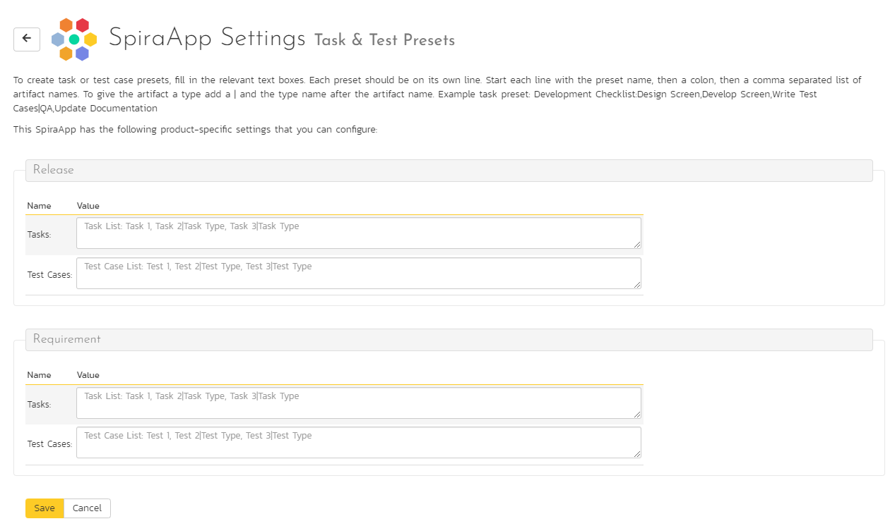
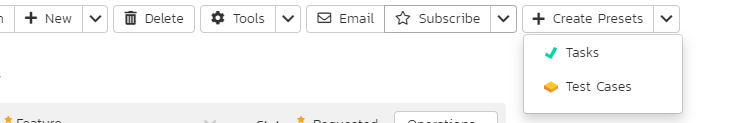
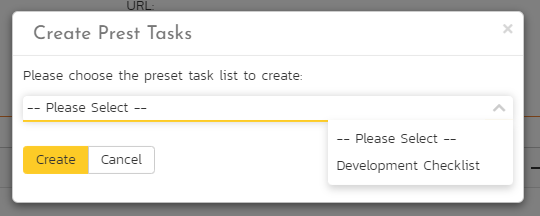
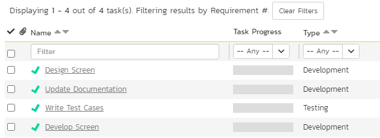

# Task and Test Presets SpiraApp
!!! abstract "Compatible with SpiraTest, SpiraTeam, SpiraPlan"

This SpiraApp lets users quickly create presets for a specific requirement or release:
- Tasks
    {: .edition-spiraplan .edition-spirateam}
- Tests cases

In this way, users can with a single click create, for example, 8 preset development tasks against a requirement, or generate a handful of approval tasks for another requirement. Note that Tasks are not available in SpiraTest.

!!! info "About this SpiraApp"
    - [ ] system settings
    - [x] product settings 
    - [ ] product template setup required
    - [x] toolbar button on requirement details page
    - [x] toolbar button on release details page

## Setup
### Product Settings
Once the SpiraApp has been activated system wide, and enabled for a product you can edit its product settings.

To create task or test case presets, fill in the relevant text boxes (tasks and test cases for requirements, and tasks and test cases for releases). Each preset should be on its own line. 

Start each line with the preset name, then a colon, then a comma separated list of artifact names. To give the artifact a type add a | and the type name after the artifact name. 

!!! info "Example task preset"

    `Development Checklist:Design Screen,Develop Screen,Write Test Cases|Testing,Update Documentation`.

    In this example we are creating a preset:

    - called "Development Checklist"
    - it has 4 tasks in it
    - The "Write Test Cases" tasks should have a specific type of "Testing"
    - The 3 other tasks will get the default task type

## Using the SpiraApp
When a user goes to the requirement or release details page, they will see an extra button in the toolbar. To add a preset group of tasks or test cases they should follow these steps:

- Click the "Create Presets" button
- Select the artifact to add presets of (e.g. Tasks)

- This will display a popup dialog with a dropdown of all available presets for that artifact (e.g. tasks)
- Select the desired preset
- Click "Create"

A message will show at the top of the page stating how many tasks or test cases are being created. This message will disappear after all the artifacts have been created. You can see the new items by going to the relevant tab. Below is an example task tab of a requirement where we have added some preset tasks.

### Extra details to be aware of

- The artifacts in a preset will not be created in the exact order they are listed in a preset. In other words, the order of artifacts names in a preset is not meaningful
- The artifacts are added at the root folder for that artifact
- **Requirement Task Presets**: the tasks get Owner, Priority, and Release information from the requirement
- **Requirement Test Case Presets**: the requirement's release (if set) is added to the test cases' release coverage
- **Release Task Presets**: the tasks release is set to that of the release
- **Release Test Case Presets**: the release is added to the test cases' release coverage
- **Test case steps**: are not added to test cases created using this SpiraApp, even in cases where the testing setting for the product states new test cases should have a default test step added