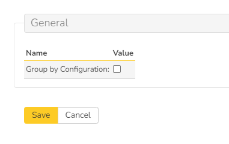
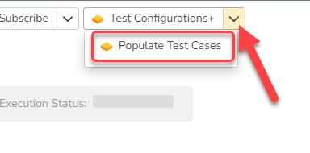

# Test Configuration Plus
This SpiraApp helps you generate static test sets based off of a test set with an attached test configuration. This means you can easily reorder, edit, or remove test cases from the new test set, to fine tune your testing, while maintaining the rich and dynamic parameters provided by test configurations. It takes a Test Set that is linked to a Test Configuration Set and will generate a new test set that contains all of the permutations converted into discrete test set test cases with individual parameters set. Also this SpiraApp lets you choose whether to group by test case or test configuration.

!!! info "About this SpiraApp"
    - [ ] system settings
    - [x] product settings 
    - [ ] product template setup required
    - [x] toolbar button on test set details page

## Setup
### Product Settings
Once the SpiraApp has been activated system wide, and enabled for a product you can edit its product settings.

No setup is required. But there is an optional setting that can be enabled per product, if desired.

| Setting name                                 | Default value | Explanation                                                                                                          |
| -------------------------------------------- | ------------- | -------------------------------------------------------------------------------------------------------------------- |
| Group by Configuration                       | unchecked     | When checked, it is possible specify the ordering of the test case combinations for the current product.             |
|                                              |               | You can either have them grouped by test case, or by configuration.                                                  |

## Using the SpiraApp

To use this SpiraApp, go to a test set that has its [Test Configuration](../Spira-User-Manual/Test-Configuration-Management.md/#test-configuration-management) field filled in, and that has at least 1 test case. Click the "Test Configuration+" button in the toolbar and then click "Populate Test Cases".

This will generate a new test set with all of the permutations of test cases with individual parameters, based on the test configuration of the original test set. For example, if you have a test set with 3 test cases and a test configuration with 3 parameter combinations, the new test set will have a total of 9 test cases. The new test set will:

- Have the same name as the original
- Have the same custom properties as the original
- Have the same standard properties as the original, except for the test configuration, which will be blank

When you set the 'group by configuration' product setting to **No** (the default) then:

- Each test case group is repeated by the number configuration permutations
- Each test case has the same parameter names
- Each test case parameter has values from the configuration set

When you set the 'group by configuration' product setting to **Yes** then:

- For each configuration group each test case is listed once
- Each test case has the same parameter names
- Each test case parameter has values from the configuration set

If a new test set can not be created from the original test set, you will see an error message. This will happen in these cases:

- The test set does not have a test configuration attached
- The test set does not have any test cases in it
- The test set does have a test configuration attached, but it is empty