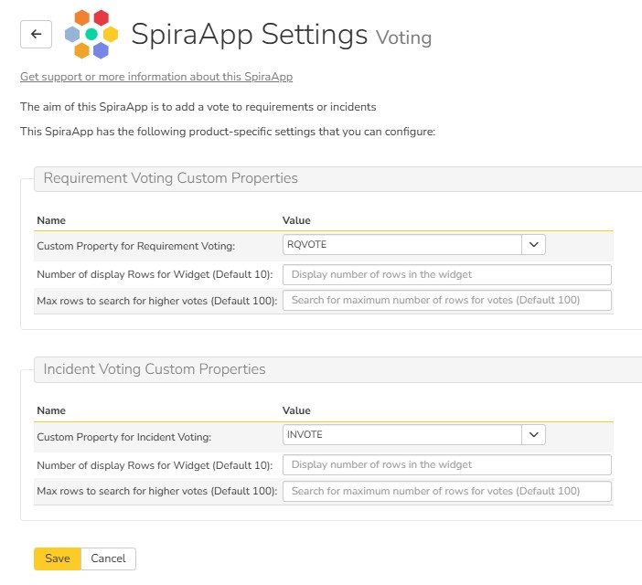
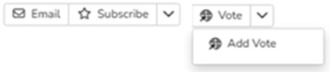
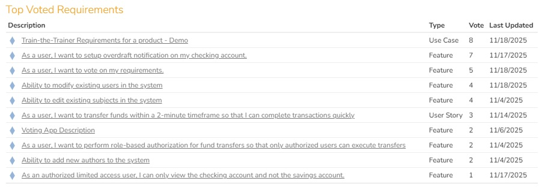
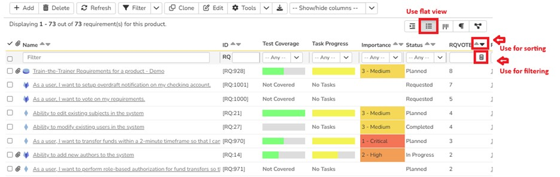

# Voting
!!! abstract "Compatible with SpiraTest, SpiraTeam, SpiraPlan"

!!! warning "This SpiraApp works with Spira v7.5+" 

This SpiraApp helps you vote on either a requirement or incident. This allows simple voting scheme by recording your vote to prioritize which requirement or incident has a higher vote from customers or business. 

!!! info "About this SpiraApp"
    - no set up needed for the system setup
    - product template setup required
    - toolbar button on the requirement details page
    - toolbar button on the incident details page
    - one of the two widgets that can be added to product home pages (note that you can not both widgets at once to the same home page)

## Setup
!!! tip "Good Practice Tip"
    You don't need to set voting for both the requirements and incidents. Sometimes, the customer or business requests may be tracked as incidents (incident type “change request”). Depending upon the customer priority and severity to the business, these incidents are converted to requirements for further backlog refinement and sprint planning. Alternatively, new business features may be directly added as requirements by teams and such teams use incidents only to track bugs. Therefore, depending on your Agile/Scrum practice, you may vote for either the requirements or incidents or both. 

###  Product Template Setup
- [x] Add an “Integer” custom property for Requirements at the product's template
- [x] Add an “Integer” custom property for Incidents at the product's template

These custom properties will store the vote updated by the SpiraApp. It is recommended to call this “Vote” and if you are voting on both the requirements and incidents, it is recommended to differentiate them as “Req Vote” or “Inc Vote” as display names. You can call them whatever you want.

### Product Settings
Once the SpiraApp has been activated system-wide and enabled for a specific product, you can configure the product-level settings. For each artifact, these settings allow you to control: 

- configure the custom property (see above) to record the vote
- set the number of rows to display in the dashboard widget (if not filled in, default is 10)
- set the maximum number of rows to search for votes in that artifact (if not allowed or more than 100 is mentioned, the maximum would be 100)

 
!!! tip "Good Practice Tip"
    Increasing the maximum size of above 100 may delay loading time for the widget. If you want more details, then, use the list view of the artifact to apply filters and sort the vote by descending order.

## Using the SpiraApp
This SpiraApp is accessed from the Requirement or Incident Details page, allowing users to record their vote for that item. To use the SpiraApp:

- click on the specific artifact you want to vote to access the details page
- click on the “Vote” button 
- click on the “Add Vote” option in the dropdown

 
If the SpiraApp has been properly configured and you are allowed to record a vote, then:

- the vote custom property will be incremented by 1
- the history will be updated

!!! tip "Good Practice Tip"
    1. Note that the “Completed” status for requirement and “Closed” status for incident are considered terminal statuses. This means that all known work on these artifacts are done. So, requirements with the completed status and incidents with the closed status are not eligible for voting.
    2. It is recommended that either a comment or tag be added to the artifact indicating the rationale or the benefit to a specific customer. As this SpiraApp uses a Simple Voting scheme, these options are not mandated.

### Scenarios: 
1. If you accidentally cast a vote, then custom property can be automatically updated with a revised vote.  
2. Similarly, if you want to cast a group vote, such as 3 people voting on the same feature, then, one member can directly update the custom property for vote. 

Simple voting scheme does not mandate or disallow these features that Spira natively supports in updating the custom property. 

### Optional Dashboard Widget
This SpiraApp provides two optional widgets. These are “Top Voted Requirements” and “Top Voted Incidents.” These are accessible from the product dashboard by clicking on the “+” icon. 

- Both widgets search for a maximum of 100 records starting from the first available record.
- The data is sorted first by the vote and then by the last updated date. 
- The sorting is in the descending order.
- There is an option to display a set number of records. The default is 10.

 
### Tips and Tricks
- If the product admin has not properly configured the SpiraApp you will get an error.
- Any recorded vote cannot be undeleted. 
- The dashboard widgets are optional. 
- If you use both requirements and incidents, don't add both the widgets to the same product dashboard.

### Alternatives to the Widgets
These are optional widgets. You can use the flat list view to apply filtering and sorting. So, these widgets are a nice-to-have and must-to-have.
 

