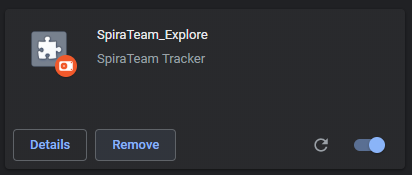

# Getting Started
## Turning on the Extension
If the SpiraCapture icon doesn't appear at the top right of your screen, go to chrome://extensions to make sure the extension is enabled (check that the toggle in the bottom right of the extension card is lit up blue, if not click it to turn on the extension). 

## How to start capturing
To start capturing click the SpiraCapture icon in the toolbar, which should bring the SpiraCapture menu. 

You should see a "Start capturing" button to capture the current tab. **Note: ** *this will only capture the current tab you are on! If you would like to capture other tabs  repeat this step*. **Warning: ** *if you have just enabled the extension, you need to refresh the tab before capturing will work.*

You can tell if SpiraCapture is capturing the current tab, because the SpiraCapture icon in the toolbar will show in color. When it is not capturing a tab, the icon is shown in grayscale.

## What event triggers data to be captured?
A number of events trigger SpiraCapture to capture how the user is interacting with the current browser tab:

* **Clicks**: each click is captured with a screenshot and a description of where you clicked. **Note** *Currently there is no distinction between single and double clicks*
* **KeyStrokes**: collections of keystrokes are captured together (for instance when filling in a form, SpiraCapture will capture a whole username as one string). The string is cut off if: nothing is typed for 3 seconds; the field being typed in changes; or when the enter key is hit. 
* **The Enter key is clicked**: when the enter/return key is hit a log is captured along with a screenshot
* **Url-Changes**: each change in URL is captured.  **Note** *any link or user action that opens a url in a new tab will not be captured (because only changes to the current tab are captured)
* **Network Errors**: Network Errors are captured in the background and are taken from any tab being captured not just the current tab.

Additionally, there are a few ways that data can be captured manually by the tester, by interacting with the SpiraCapture menu. These give users flexibility in organizing the captured data to reflect their test.

* **Steps**: Steps break up the captured data into discrete sections, just like you break up a test case into test steps. This makes navigating the captured data much easier. Steps can be created manually by the user, or otherwise are incremented over time (roughly every 10 minutes). For instance if a step is called "Login", after 10 minutes, a new step will be created called "Login 1", and then "Login 2" after another 10 minutes.
* **Notes**: Notes are used to remind yourself after the session when you go back through the data. They can be very useful to "stick a pin" in something that just happened so that you can review it later, but not have to break your testing flow by analysing it in detail now.
* **Screenshots**: Screenshots can be captured manually, as well as automatically by some of the events listed above.

## SpiraCapture Menu
Clicking the SpiraCapture icon from the browser toolbar will show the SpiraCapture menu. This gives you access to the main functionality of the extension.

* **View data**: This links opens a new tab showing all of the data that SpiraCapture has... captured. **Note:** *You will only see this link in the menu if you have any captured data*.
* **Start capturing**: If you are on a tab that is not yet being capture, as explained above, clicking this links will start capturing this tab only. * **Stop capturing**: If you are on a tab that IS being capturing, click this link to stop capturing. The remainder of the menu is only visible while capturing the current tab.
* **Take ScreenShot**: This captures the full page screenshot of the current tab. This is useful when you need to manually capture the screen.* **Current Step**: This is a label that shows you the name of the current step. **Note** *this label, if the menu is left open for a long time, may not always reflect the most recent step number - as mentioned above this will increment automatically over time.*
* **Step Description**: This field is how you break up your testing session when you are viewing the data.  **Note** *If you choose to not use this feature the application it will automatically break your session up every 10 minutes for your convenience when viewing the data*
* **Create Step field**: enter text in this field and click the button on the left to create a new step using that name.
* **Create Note Field**:  enter text in this field and click the button on the left to create a new note using that name

## View captured data
When you click the "View data" link from the SpiraCapture menu the tab that opens shows all data collected. This page is divided into three parts:

1. The event list on the left hand side, which shows every event captured by SpiraCapture
2. The preview window on the right hand side, which is used for showing more information about a particular event from the data list
3. The action bar at the top of the page is where you can manage your captured data, or send selected events to Spira
4. Additionally, there are popups to connect to Spira, view the events selected, and send select events to Spira as a new incident.

Each of these areas is explained in more detail below. 

### The event list
The event list is shown on the left hand side of the page. Every event is shown in chronological order, broken down into testing steps (which can be manually created by the user and incremented automatically over time).

Each step has a heading which shows the name of the step and the time that particular step started. If the step contains any notes, a pin icon is shown in the step heading. This is designed to help you see which steps have notes in as these are likely the steps that you want to examine more closely. Clicking on the step heading will collapse or expand the events inside the step.

Each event shows certain standard information to make it easy to navigate and browse the data.

* Where relevant, a thumbnail of the screenshot taken with the event
* The time that the event occurred
* An icon showing the type of event
* Where relevant, information recording along with the event (for instance, the url moved to, the keys typed, or the place in the DOM where you clicked)

Each event also has a checkbox on its left. Checking the checkbox will mark that event as selected. Only selected events are sent through to Spira when logging new incidents.

### The preview window
Clicking on an event with a screenshot will display in the large preview window on the right hand side of the page. This is helpful if you want to see a screenshot in more detail.

## The action bar
The action bar has four buttons:

* **Preview selected events**: this is enabled if one or more events has been selected from the event list (see above). Clicking the button will show a popup with a filtered list of just those selected events. To export this data to a document or another application, highlight the preview and copy it to the clipboard
* **Send selected events to Spira**: this is enabled if one or more events has been selected from the event list (see above). Clicking this button will show the Spira popup (discussed in more detail below)
* **Refresh**: Clicking this button updates the event list with any new data
* **Clear all events and stop capturing**: This button closes the current data table page, clears all data in chrome storage, and stops capturing all tabs

## Sending selected events to Spira
You can send all selected events to Spira as a single new incident. Once connected to Spira, as explained below, you choose a product and then create your incident. The selected events, including their screenshots, will be saved into the description field of the new incident. 

### Connect to Spira
First, make sure you have enabled API access to Spira. You do this from your Profile Page from within the Spira application. Make sure you **enable rss** and generate an **RSS Token**. This RSS token is the same token you use for API access, which is what SpiraCaptures uses.

**Note** *This can be disabled be you or your administrator make sure you have it enabled if you would like to use this feature see warnings section below*

Clicking the **Send selected events to Spira** button will show a popup. The first time you see this popup you will need to enter your connection credentials:

* **Url**: this is the root address of your Spira application
* **Username**: this is the username you use to log in to Spira
* **API key/RSS Token**: as described above. Make sure to include it in full - including the { }. TIP: you can click on the RSS Token from your profile page in Spira to save it to the clipboard 

### Create the incident
Once you are logged in to your Spira (and have your events selected) the popup will require 3 fields to be selected/filled in.

* **Selecting a product**: choose a product from the list of all the ones you have access to in Spira
* **Select an Incident type**: pick the most relevant type available for the product you select
* **Incident Name**: Type in the name to be given to the incident

Once these have been filled in, click the "Send data to Spira" button to connect to your Spira application and upload the incident. Once the incident has been created you will see a link next to the send button that will open the incident in Spira for you.

## Potential Gotchas 
* SpiraCapture will capture keystrokes on any native HTML element that you can enter text into. This means form elements, and also elements that have contentEditable set to true
* SpiraCapture will **not** interact with iframes.  You must manually take screenshots if you want information from them.
* When capturing multiple tabs at once the data across the tabs will shown on the data page 100% chronologically
* If a link opens in a new tab or window it will not be recorded. You will need to click the capture button on that new tab to start capturing data
* On newly installing or reinstalling the extension refresh any pages you would like to capture before starting to capture
* To create incidents in Spira you must have version 6.1+
* You may not be able to create an incident in Spira if your product is set up where a custom field cannot be left blank (as specified in the custom property definition)