# SpiraPlan Quick Start Guide

## Logging In and Selecting a Product

Once you have installed a self-hosted trial or signed up for a hosted trial of SpiraPlan, you should see the following login screen in your web browser:

Enter the following default details to start using the system:

-   Login: administrator

-   Password: PleaseChange

Once logged-in, you are shown your "My Page". The very first time you log in you will be able to take a quick orientation tour of the application (as shown in the screenshot below).

The My Page looks pretty empty right now. This is normal.

For this tutorial we want to start with an empty product that has no data in it, so click the hyperlink under 'My Products' for 'Sample Empty Product 2' / 'Sample Program'. That will select the empty product. Now to see the homepage for the product you just selected, click on the hexagon in the top left:

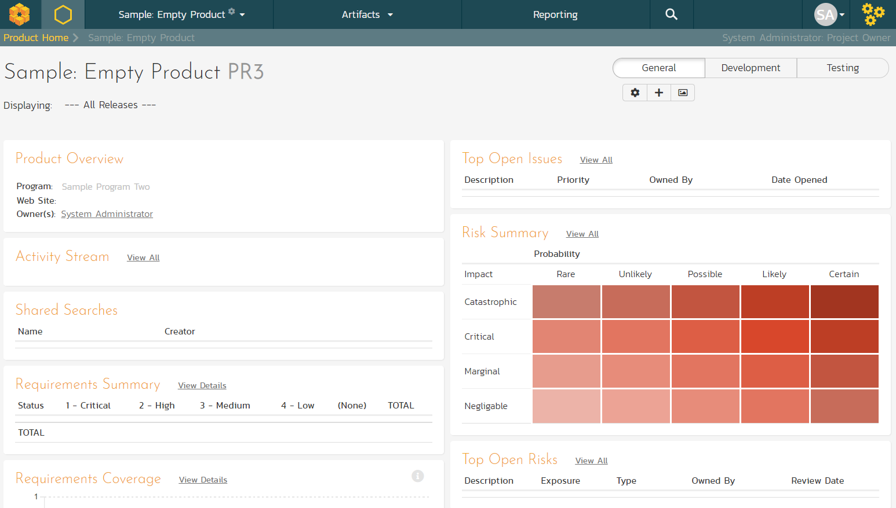

The product home page shows various widgets containing key product metrics. These are empty now, because the product has no data in it. In the rest of this guide we are going to fix that.

***

## Define the Requirements

On the main Navigation bar, click Artifacts \> Requirements to display the product's requirements list page:

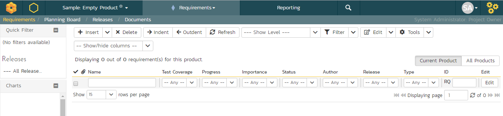

The terminology in SpiraPlan is designed to be methodology agnostic. The table below shows how the terms used in SpiraPlan relate to some common methodologies:

| **SpiraPlan**        | **Extreme Programming**  | **Scrum**    |  **AgileUP / DSDM** |
| ---------- | ---------- | -------- | ---------- |
| Summary Requirement  | Epic                     | Epic         |  Feature Group |
| Requirement          | User Story               | Backlog Item |  Requirement |
| Task                 | Task                     | Task         |  Task |
| Release              | Release                  | Release      |  Release |
| Sprint               | Iteration                | Sprint       |  Iteration |

At first, the requirements list will be empty. Click the 'Insert' button in the toolbar to create your first requirement. Hit 'Save and New'
(shown as buttons on the right of the new requirement in the list table) to add each new requirement after that except for the last requirement. After entering the last requirement, hit "Save" button. Below is the list of requirement names to add:

1.  Functional Requirements

2.  Module 1

3.  System must allow entry of users

4.  System must allow the modification of users

5.  System must allow the deletion of users

6.  Module 2

7.  System should allow administrators to setup notifications

You should now have a simple, flat requirements list, like the one below:

Next, we are going to indent the requirements. This will give us a hierarchy, with some requirements being children of others.

1.  To indent, select the checkboxes of all the requirements below
'Functional Requirements' and click 'Indent'. This makes 'Functional Requirements' the parent and all the other requirements its children.

2.  Now, select the three requirements immediately below 'Module 1' and click 'Indent' again. This makes these three requirements children of 'Module 1' (and grandchildren of 'Functional Requirements').

3.  Repeat for the requirement below 'Module 2' by right-clicking on this last requirement and choosing 'Indent' from the popup context menu.

You should now have a list that looks like:

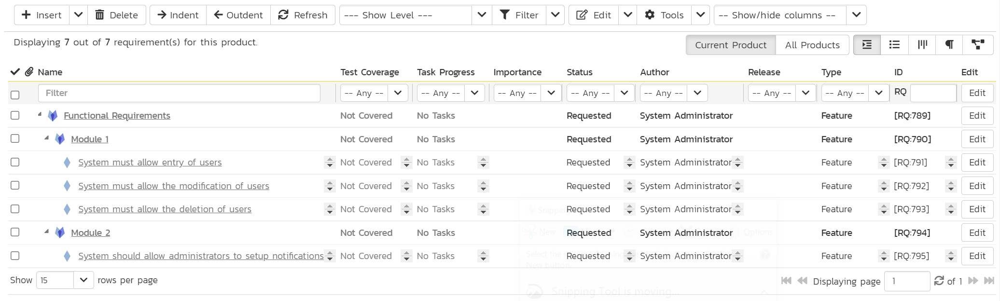

We now have a nicely grouped set of requirements. Let's enter more information about them, starting with setting their types and priorities.

1.  Click the ''select all' checkbox at the top of the list (the checkbox just above the checkbox for 'Functional Requirements')
2.  Click on the top 'Edit' button in the right-hand column of that same row. That will make all the requirement rows editable:

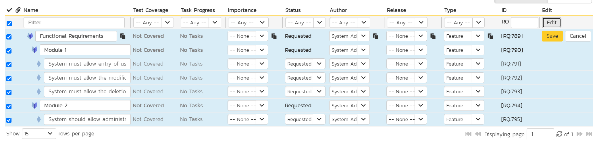

3.  Change the 'Type' to 'User Story' for some of the requirements - in the example screenshot all requirements that are children (have a single diamond icon and a non bold name) are now user stories.
4.  Choose whatever values you like for the 'Importance' field for each of the requirements.
5.  Click the `Save` button.

You now have a prioritized list of user story requirements:

The next thing we can do is assign estimates to each requirement. This is something that the developers or business analysts may do based on the complexity and scope of each. The 'Estimates' column is not visible yet, so first we need to show it. To do that, click on the 'Show/Hide Columns' dropdown list and select 'Show Estimate (points)':

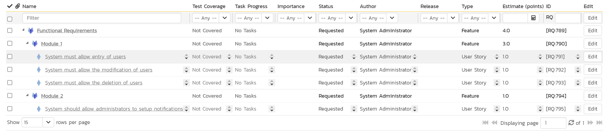

By default, all the requirements will have been assigned a default estimate of 1.0 point. A point is not a defined number of hours, but an indication of the size of the requirement. The estimates should reflect how big each of the requirements are relative to each other.

To change the estimates:

1.  Click the "select all" checkbox at the top of the list

2.  Click on the top 'Edit' button in the right-hand column. The requirements should be in editable mode again.

3.  Enter the following estimates for the requirements

4.  Click `Save`

| **Requirement**                                           |   **Estimate** |
| ------------ | --------- |
| System must allow entry of users                          |   1.5 points |
| System must allow the modification of users               |   2.0 points |
| System must allow the deletion of users                   |   1.0 points |
| System should allow administrators to setup notifications |   2.0 points |

Your requirements should now look like this (with each parent's estimates automatically summing up the estimates of their children):

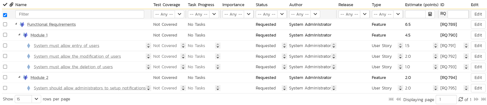

We have created a list of prioritized, estimated requirements, which is a great way to start our product. In the next section we are going to enter releases and sprints.

***

## Create the Release and Iteration Plan

On the main navigation bar, click out of 'Requirements' and select
'Releases' menu option to display the product's release list page:

The release list will be empty. Click the 'Insert' button in the toolbar to create your first release. Hit 'Save and New' (shown as buttons on the right of the new release in the list table) to add each new release after that. Below is the list of release names to add:

- Release 1.0
    - Version Number: 1.0.0.0
    - Start Date: Today's Date
    - End Date: Today's Date + 2 months

- Release 1.1
    - Version Number: 1.1.0.0
    - Start Date: Today's Date + 2 months
    - End Date: Today's Date + 4 months

You should have a list of releases like this:

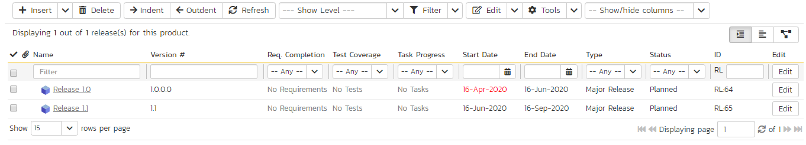

We need to add one additional level of detail to each release -- the list of sprints that will take place in each release.

Let's add some sample sprints for the first release:

1.  Select the checkbox for Release 1.0 and, from the toolbar, click `Insert` > `Child Release`
2.  Choose a name for the new sprint
3.  Make sure its 'Type' is set to 'sprint'
4.  Specify its date range. We recommend making each sprint last 2 weeks and have each one scheduled in series
5.  Click `Save And New`
6.  Repeat steps 2-5 above, then steps 2-4 and then finally click `Save` on the final sprint's row. 

You should have three sprints added to the list, all children of Release 1.0.

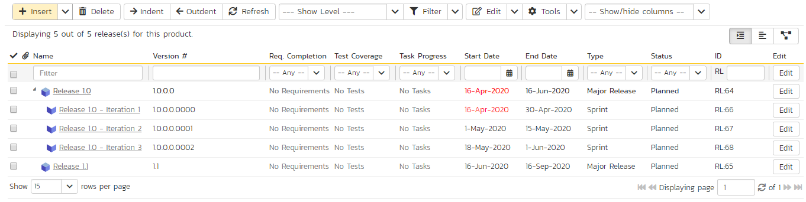

Finally, let's specify the number of resources assigned to each sprint and release.

1.  Click on the 'Show/Hide Columns' dropdown list and select 'Show # Resources' column
2.  Select the three checkboxes for the sprints of "Release 1.0"
3.  Click the `Edit` button on the toolbar
4.  Adjust the # Resources for the sprints to 2
5.  Click `Save`

***

## Adding Requirement Tasks

We have defined the high-level schedule for Release 1.0. The next stage is to have the developers take each of the requirements defined so far and define the various tasks needed to deliver them. Each task will have its own estimate associated with it. In addition, you can optionally specify date ranges and priorities to each of the individual tasks.

To start adding tasks, go to the main navigation bar and click out of Releases and hit Requirements to display the requirements list. Click on the hyperlink for the first requirement ("System must allow entry of users") and the requirement's details page will be displayed:

*Notice that under 'Dates and Times' column on the right, the system displays an initial resource estimate of 1.5 points and 12 hours. This is based on an initial product setting of 8 hours per story point. Once you start adding tasks and getting metrics based on the actual team velocity (how many story points they can accomplish in a given time frame), the system can update that conversion metric.*

Click on the 'Tasks' tab to display the list of tasks defined for this requirement. The list is empty, so let's change that:

1.  Because we want to enter the estimated effort for each task, before entering the tasks, first click on the 'Show/Hide Columns' dropdown list and hit the 'Show Est. Effort' column
2.  Click the `New Task` button (this adds a new task and associates it with this requirement)

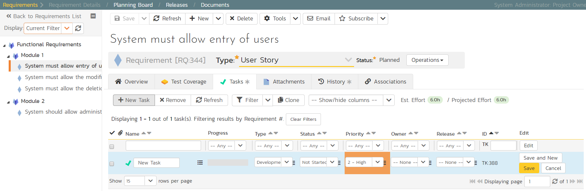

1.  Set the task's name to "Create user data tables"
2.  Choose a 'Priority' level
3.  Set the 'Est. effort' to 10.0h.
4.  Click `Save`.

The new task has now been added:

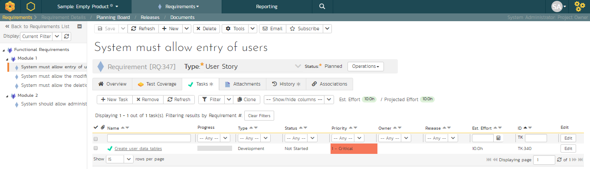

We have more tasks to add. The table below shows 12 tasks in total to add to 4 different requirements. This includes the one we just created for completeness.

| **Requirement / Task**            | **Est. Estimate**                 |
|-----------------------------------|-----------------------------------|
| **System must allow entry of users**                                  |
| Create user data tables         | 10.0h                               |
| Develop user business object    | 10.0h                               |
| Build user creation screens     | 20.0h                               |
| **System must allow the modification of users**                       |
| Extend user business object to handle updates | 5.0h                  |
| Add user list page              | 15.0h                               |
| Add user details page           | 20.0h                               |
| Add user permissions page       | 15.0h                               |
| **System must allow the deletion of users**                           |
| Extend user business object to handle deletes | 5.0h                  |
| Update user list page to add delete functionality   | 10.0h           |
| **System should allow administrators to setup notifications**         |
| Create user administration home  | 15.0h                              |
| Add user settings for notifications to database  | 10.0h              |
| Create user notifications administration page    | 20.0h              |

On the main Navigation bar, click again on 'Requirements'. You should now have the following requirements list page. In this screenshot we have hidden the 'Author' field and shown the 'Task Effort' field to show the detailed task effort aggregated up to the requirements.

The total number of hours for these tasks divided by the total number of story points gives a number a lot more than the 8 hours that the system assumes. We can update the system to better estimate the number of hours to deliver each story point.

To update the metric, go to the three cogs dropdown menu on the rightmost corner of the main Navigation Bar, locate Planning and click Planning Options:

As you can see, the system lists 8.0 hours as the current number of hours required to deliver a single story point of functionality. Now that we have some actual tasks in the product, click on the 'Suggest
'button to have the system provide its suggestion of the new metric:

Click the 'Apply' button to update the planning metric, and then click the main `Save` button at the very bottom of the page to confirm the change.

***

## Adding the Test Cases

Click on the Artifacts > Test Cases menu option to display the product's test case list page:

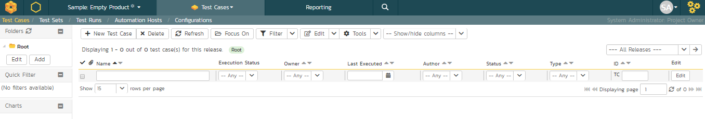

The test case list is empty and the only folder visible in the 'Folders'
tree on the left-hand side is 'Root'.

1.  Click on the `Add` button underneath the folder tree
2.  Enter the new folder name 'Functional Tests'
3.  Click `Add`

You now have a new folder in the 'Folders' tree view. To show it, click 'Refresh'.

1.  Click on this folder from the 'Folders' tree on the left
2.  Click 'New Test Case' from the toolbar
7.  Enter "Test ability to add new users" for the name of this new test case
8.  Click `Save And New`

Repeat the above steps to create 3 more test cases:

1.  "Test ability to edit existing users"
2.  "Test ability to delete existing users"
3.  "Test ability to edit notifications"

You should now have the following test case list:

Next, we need to enter detailed test steps to each test case, and link each test to the appropriate requirements.

1.  Click on the hyperlink for the first test case 'Test ability to add new users'. This will bring up the test case details page:

2.  In the 'Description' box under 'Detailed Information' section, enter a brief overview of the test case (something like "this test case verifies that you can add new users to the system and that all of the fields get saved correctly.").

3.  Scrolling down to the 'Test Steps' section, you will see a single test step has been automatically created for you with some suggested text:

This test case needs 3 test steps.

1.  Click 'Edit' on 'Step 1' and enter the first set of parameters below.

2.  Click `Save` and then 'Insert Step' to add the second test step and enter its information from below

3.  Click 'Save and New' to make the third step

4.  Once you've entered its information click `Save`

| **Test Step Description**      |                               **Expected Result**      |   **Sample Data** |
| ----------- | -------------------- | ------------------ |
Click on the link to add new user      |                       New user screen displayed   | |
Enter the name, email address and password of the new user. |  Data accepted    |           Fred Bloggs <fredblogs@example.com> |
Click the 'Submit' button to create the user.     |            The user is created     |   | 

You should now have the following test steps in the test case:

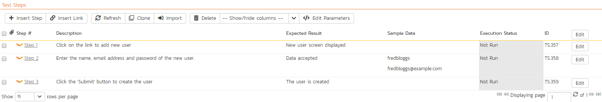

Next, we need to link this test case to the requirement(s) that it validates.

1.  Click the 'Req. Coverage' tab above:

2.  Click the '+ Add' button to display the association adding panel:

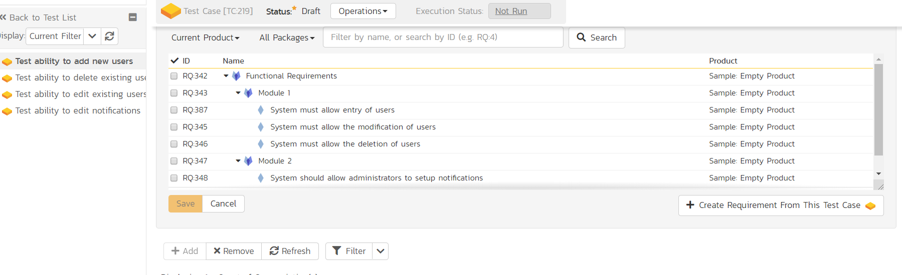

3.  Choose the 'System must allow the entry of users' requirement

4.  Click the `Save` button beneath the list of requirements to add the test case to this requirement

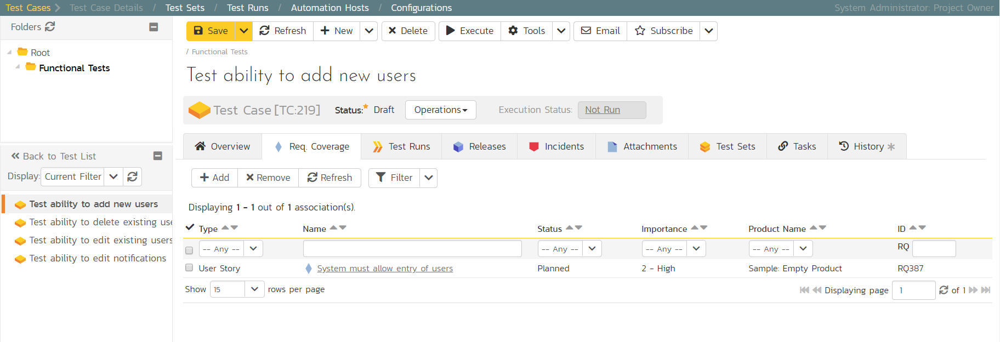

Let's repeat the process for the other test cases, adding a couple of test steps to each. Then link the test cases to the requirements according to this table just like you did above:

| **Test Case**                         |   **Requirement** |
| ------------- | ----------- |
| Test ability to add new users         |   System must allow entry of users |
| Test ability to edit existing users   |   System must allow the modification of users |
| Test ability to delete existing users |   System must allow the deletion of users |
| Test ability to edit notifications    |   System should allow administrators to setup notifications |

We have created test cases and set up their test coverage. Next, we need to specify which releases and sprints they can be tested in.

1.  First navigate to the product's test case list page again by clicking on 'Test Cases' on the main navigation bar

2.  Select the checkbox of each test case in the 'Functional Tests'
folder.

3.  Click on 'Tools' drop-down menu on the toolbar

4.  Click 'Add to Release'

5.  Select 'Release 1.0

6.  Click `Add`.

You have added all the tests to the overarching Release. Finally, we want to add the tests to the different sprints, based off the data in the table below.

1.  Select the checkbox of each relevant test case in the 'Functional Tests' folder.

2.  Click on 'Tools' drop-down menu on the toolbar

3.  Click 'Add to Release'

4.  Select the appropriate sprint

5.  Click `Add`

| **Test Case**             |              **Sprint(s)** |
| -------------- | ------------------ |
| Test ability to add new users      |     Release 1.0 - Iteration 1   Release 1.0 - Iteration 2   Release 1.0 - Iteration 3 |
| Test ability to edit existing users  |   Release 1.0 - Iteration 1   Release 1.0 - Iteration 2   Release 1.0 - Iteration 3 |
| Test ability to delete existing users  | Release 1.0 - Iteration 2   Release 1.0 - Iteration 3 |
| Test ability to edit notifications   |   Release 1.0 - Iteration 3 |

You typically want to include previous functionality in each of the successive iterations to ensure regression coverage. That is what we have done here. This means that each sprint includes new test cases for the new requirements, as well as existing test cases for pre-existing functionality.

***

## Planning the Sprint

We have requirements that have tasks, and tests connected to them. What we haven't done yet is scope out which requirements go in which sprint.

1.  From the artifact dropdown in the global navigation bar, click "Planning Board" to display the product backlog planning board
2.  On the planning board page set the 'Group By' dropdown on the left to "By Priority"
3.  To show all requirements check that in the left-most column all the priority levels are shown in an expanded view (downward facing triangle signs)

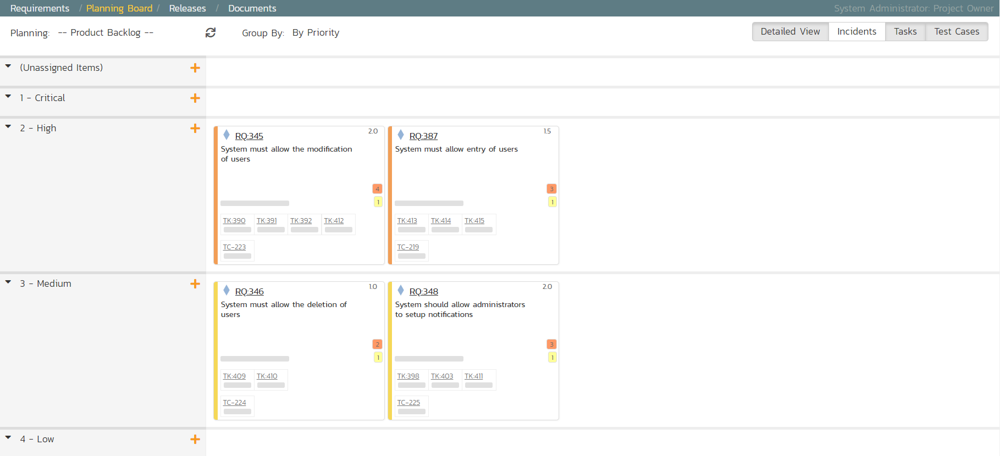

4.  To view the iteration plan for a specific release, select 'Release 1.0' on the 'Planning:' drop down menu on the top left.
5.  Choose 'By Sprint' from the drop-down 'Group By' menu. That will display the sprint plan for the selected release (currently empty)

6.  Expand the '(Unassigned Items)' entry to display the requirements that are in the product backlog

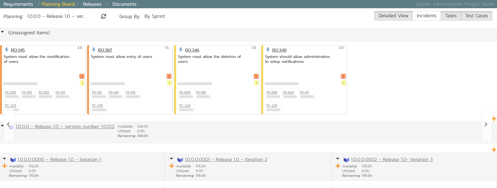

Each backlog item (requirement or incident) is represented by a virtual "story card" in the iteration. The left-hand side of each item displays the priority color. The progress bar near the bottom of each item depicts the progress of the item. You can flip through each iteration to see the work planned by clicking the left/right arrow buttons at the sides of the screen.

Now drag the two highest priority requirements (the ones with Importance = 1 - Critical) to the first iteration:

In the screenshots above the cards are showing more information then you may see by default. Extra information can be shown by toggling the buttons at the top right of the planning board

-   To see more information about each requirement, enable the 'Detailed View' option

-   To see the individual tasks associated with each requirement, select the 'Tasks' option

-   To see the individual tests associated with each requirement, select the 'Test Cases' option

You can determine how much time has been scheduled in the first sprint and how much time is remaining. Although we have spare time available in Iteration 1, we will leave room left for fixing incidents, so next, drag and drop the remaining two requirements to Iteration 2:

***

## Assigning the Requirements & Tasks

Now that we have planned which requirements (user stories) and tasks are planned for each sprint, we can assign tasks to the appropriate developer(s). The process you follow will depend on your methodology (e.g. in Scrum the developers pick the tasks, but in Extreme Programming the product manager usually assigns tasks).

To assign the tasks, go to the main Navigation Bar and click on Artifact
\> Tasks to display the main tasks list page:

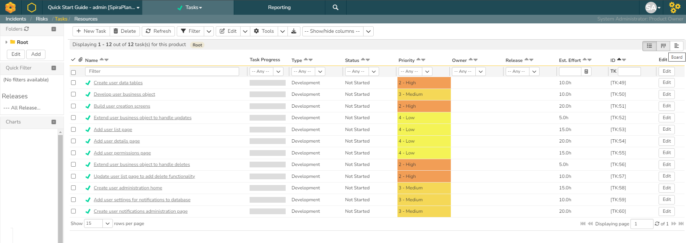

Click on the 'Board' option on the top-right of the screen to change to the Kanban board view:

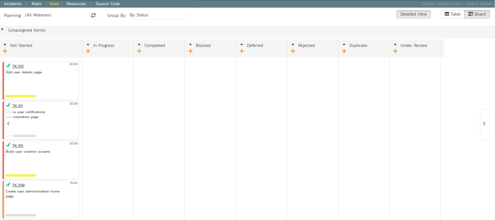

You can see at a glance which tasks are in each status (in this case, they are all marked as 'Not Started'). To see the distribution of tasks by person for a specific sprint, change the release selection to
'Release 1.0 Iteration 1', and the 'Group By' dropdown to 'By Person':

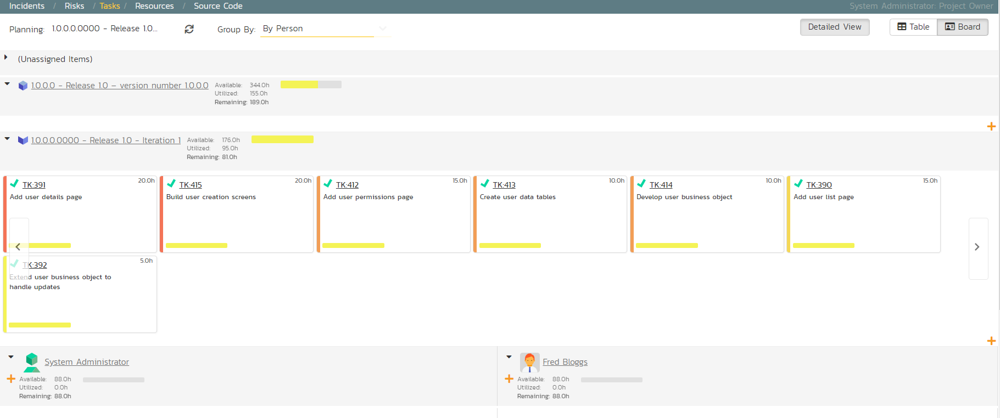

For our sample product, we have two product members listed (included ourselves). As an example, select the first four tasks (which are all priority = 1 - Critical) and drag them to your user's section:

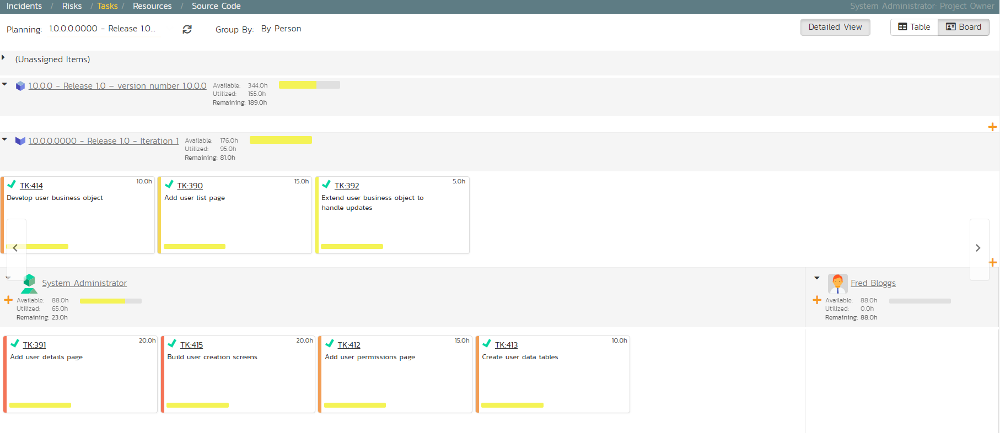

Now you can clearly see the four tasks that have been assigned to your user. To simulate how this would appear to a developer, click on the main SpiraPlan icon (in the top-left) to display your user's "My Page" dashboard:

This page lists all the development tasks that have been assigned to your user. Click on the task "Create user data tables" to display the task details page:

This task has been estimated at 10.0 hours and is currently not started. The next step is to start working on the assigned task and report back progress. As an example:

* Click the workflow `Operations` button and choose 'Start Task'

* Then under 'Dates and Times' enter an 'Actual Effort' of 3.0 hours, and a 'Remaining Effort' of 5.0 hours
* In the 'Comments' section below, add a comment: "Added initial set of data tables"
* Click `Save` at the top of the page

The progress indicator will reflect the changes and the new comment will have been added.

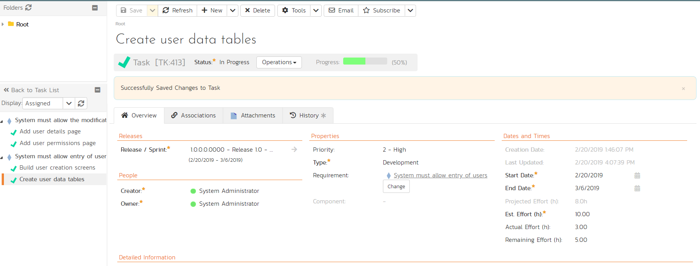

Now click on the other three assigned tasks, start them, and specify the following:

| **Requirement / Task**            |  **Est. Estimate** |  **Actual Effort** |  **Remaining Effort** |
| ---------- | ---------- | --------- | ---------- |
| Create user data tables                       |  10.0h             |  3.0h              |  5.0h |
| Develop user business object                  |  10.0h             |  2.0h              |  7.5h |
| Build user creation screens                   |  20.0h             |  3.0h              |  18.0h |
| Extend user business object to handle updates |  5.0h              |  0.5h              |  4.0h |

After updating the assigned tasks, the 'My Page' dashboard will show all these changes:

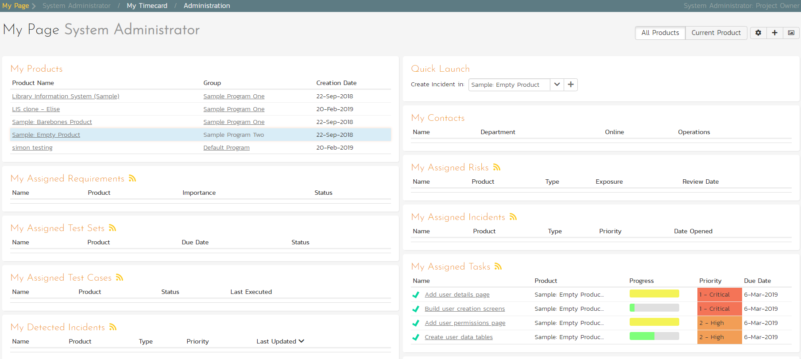

Similarly, for the product manager, click on Requirements from the artifact dropdown in the global Navigation Bar to display the requirements list. This will show the task progress as it impacts the various requirements:

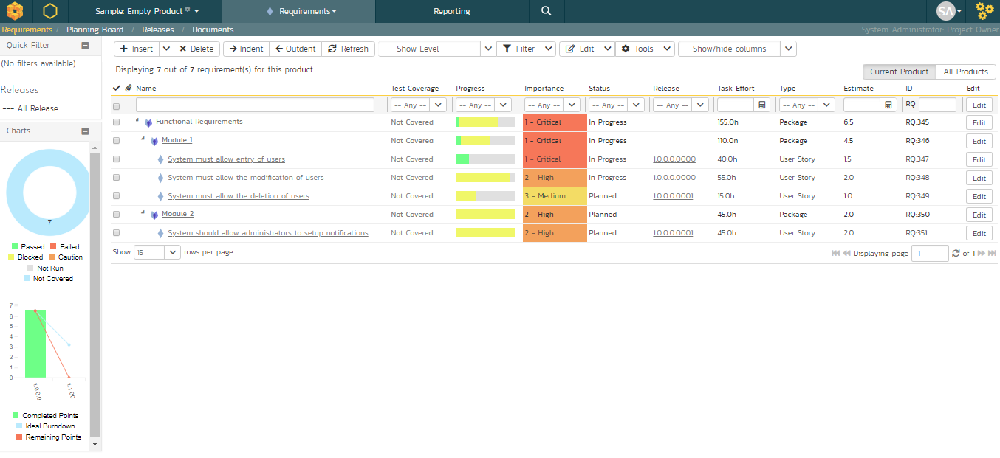

***

## Scheduling the Testing Activities

Now that we have created our test plan for each release and sprint, we need to schedule the test cases for execution by our testers. As an example, we'll create a single test set (also known as a test suite) that contains a list of test cases to be executed by a specific tester.

On the main Navigation Bar, click on Artifacts \>Test Sets menu option to display the product's test set list page:

At first, the test set list will be empty and the 'Folders' tree on the left will only show 'Root'.

1.  Click the `Add` button beneath the folder tree
2.  Enter the new folder name 'Test Cycle \#1'
3.  Click the `Add` button.

1.  Click on the folder you just made
2.  Click 'New Test Set' from the toolbar
3.  Enter the name of the new test set 'Testing new functionality'
4.  Click `Save`

You should now have the following test set list:

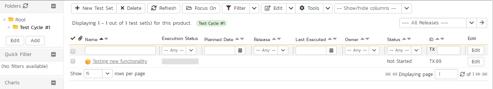

Click on the hyperlink for the test set to bring up the test set details page:

Let's add the appropriate test cases to this set. Click the `Add` button in the 'Test Cases' section halfway down the page to bring up the following panel:

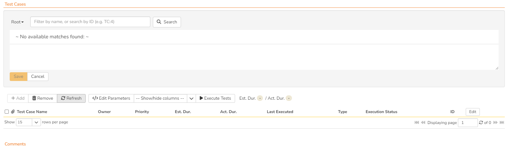

1.  Locate 'Root' drop down menu under 'Test Cases' section
2.  Choose the 'Functional Tests' folder and the test cases in that folder will be displayed:

Select the following test cases and click the `Save` button:

1.  Test ability to add new users
2.  Test ability to edit existing users

You should now have the following displayed:

Next, let's assign this test set to a specific release and to a particular tester. To do that, choose the following values for the following fields and click `Save`:

-   Owner = System Administrator (your user)
-   Scheduled = Release 1.0 - Iteration 1
-   Planned Date = (Today's Date)

You have now scheduled this test set to be executed by your user by the end of today against the first iteration of release 1.0:

***

## Running Tests and Logging Incidents

Now that you have scheduled the test set, if you go to the 'My Page' by clicking on the SpiraPlan logo in the top-left, you'll see your newly assigned test set down on the left:

Click the 'Execute' button (with the play icon) to the right of this new test set. That will start the test execution wizard:

On the first screen, the release dropdown list will have been automatically pre-selected to the release specified in the test set. Click 'Next' to move to the first test step in the first test case:

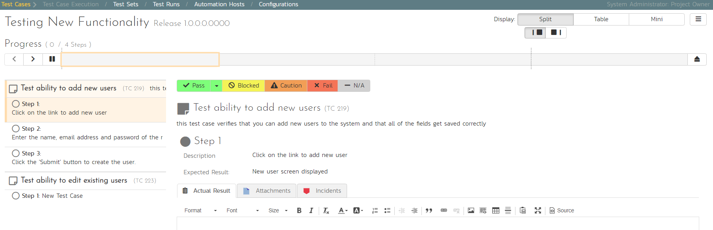

*Note that when you first visit this page, you will be shown a quick guided tour of how the page works.*

As a tester, you can progress through each of the test steps in each test case in the test set in turn. For each test step you can enter
**Pass**, **Fail**, **Blocked,** **Caution, or Not Applicable**. If you enter any status other than Pass you need to enter a value for the
'Actual Result'. For a pass status, the Actual Result is optional.

Click the 'Pass' button to pass the first test step. As soon as you do, the test will automatically progress to the second test step:

Now for the second test step, enter in the actual result field "Unable to enter the sample data as the fields were disabled". Before clicking the Fail button, we also want to enter in the following fields in the Incident form (accessed by clicking the "Incidents" tab):

-   Name: Error displaying user fields

-   Type: Bug

-   Priority: 2 - High

Now click the 'Fail' button and you will have recorded a test failure and a new incident/defect:

Now that we have logged the test failure and the new incident/defect, click on a hexagon on the main navigation bar on the left of "Sample Empty Product 2" option.

You'll be taken to the product homepage with the requirements and test case metrics now visible in individual widgets (like the Test Execution Status widget shown below):

If you go to the Artifacts \> Test Sets page, you also see the status of our test set:

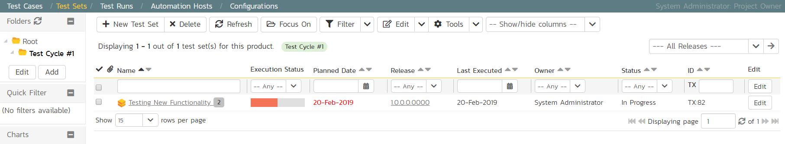

If you go to the Artifacts \> Requirements page, you'll see the different requirements' test coverage and the status of the tests associated with each requirement:

The next step in the process is to triage the logged defect and assign it to a developer to be fixed.

***

## Triaging Issues and Defects

Now that a new incident has been logged, the next step in the process is to review the incident and assign it to a developer to be fixed. First, click on the Artifacts > Incidents menu item. This will display the incident list page for the product. You can also view the same list of incidents in a Kanban board view.

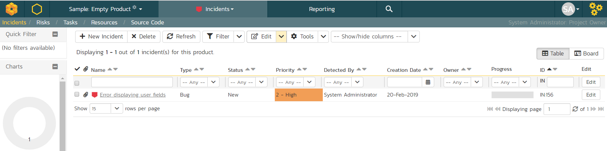

In either view, click on the hyperlink for the new incident "Error displaying user fields". This will display the incident details page:

1.  In the 'Operations' dropdown menu underneath the incident name on the top of the page, select 'Assign Incident' option. This will switch the status of the incident from New > Assigned
2.  Locate the 'People' section and set the 'Owner' field to System Administrator (your user)
3.  Add a new comment in the 'Comments' section at the bottom of the page. Type "Assigning this to you to fix. Issue was found during testing."
4.  Click the `Save` button in the top toolbar.

The incident will be assigned to your user for fixing.

To see what a developer would see in real life, go back to the "My Page" by clicking on the orange SpiraPlan icon in the top-left of the main Navigation Bar on the top of the screen:

You can see that you've been assigned an incident under the "My Assigned Incidents" widget (on the right-hand side). Now click on the hyperlink for the incident to bring up the incident details page:

The status is 'Assigned' and the comment from the product manager is clearly visible. To help you reproduce the issue, you can click on the "Associations" tab to display the test run and requirements associated with this incident:

If you click on the test run hyperlink "Test ability to add new users", you will see the detailed information about the test execution that resulted in the bug being logged:

This allows the developer to retrace the steps taken by the tester and attempt to reproduce the issue. We are going to assume we can reproduce and fix the issue so we can go right ahead and resolve the incident.

1.  Make your way back to the incident details screen: Artifacts > Incidents > Error displaying user fields' link.
2.  Click on the workflow `Operations` drop-down menu and select 'Resolve Incident'.

Fill in the following fields:

1.  Planned Release: "Release 1.0 - Iteration 2"
2.  In 'Comments' section enter a new comment: "Fixed the incident."

Click `Save` on the main toolbar.

The incident will now change from Assigned > Resolved and an email will be sent to the tester letting them know that they need to retest the test case and close the incident.

***

## Reviewing Your Product

You can check on the overall status of the product by clicking the hexagon on the main navigation bar. This will take you to the product home page. Below is what this home page looks like for a more complete product than we have been working through in this quick start guide.

Note how you can change between several views (the buttons on the right) to show different information based on your role or current needs, or only show data for a particular release (see the dropdown beneath the product name on the left).

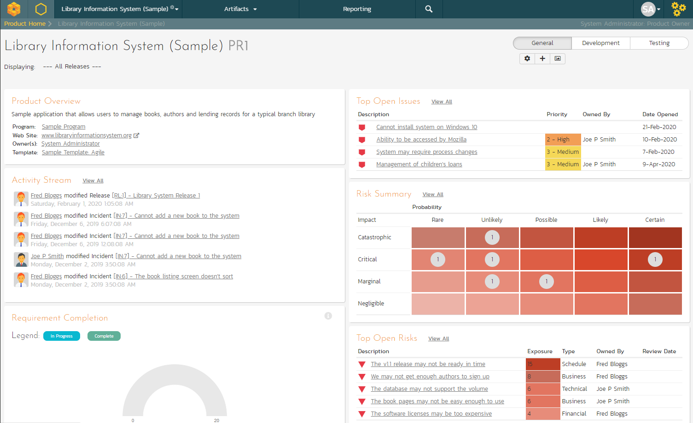

***

## Reviewing a Program

In addition to having dashboards that let you monitor the performance of your product, SpiraPlan has several views available at the program level. These let you group products together into a common program and report on them as a whole.

To see this in action, click on the "Sample Program One" link in the main navigation bar.

You can click on the Artifacts > Planning Board tab to display the Program Planning Board (which is similar to the one we used previously for products, except that it is works across multiple products):

There are additional program views that let you see the **Releases** and **Incidents** at a program level. Click Artifacts > Releases:

!!! success "Congratulations"
    Congratulations! You have now completed the software development and testing lifecycle using SpiraPlan. For more information about any of the features, please refer to the SpiraPlan User Manual.
